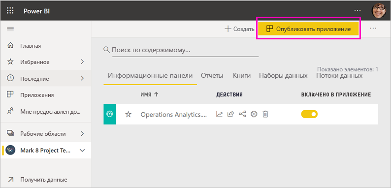

# Способы совместной работы и предоставления общего доступа в Power BI

Вы создали панели мониторинга и отчеты. Возможно, вы захотите использовать их совместно с коллегами. Или, возможно, вы готовы к более широкому их распространению. Каков лучший способ совместной работы и организации совместного доступа? В этой статье мы сравниваем различные варианты.

*Приложения в службе Power BI*

**Совместная работа**

- Совместная работа с коллегами в *рабочих областях*для создания полноценных отчетов и панелей мониторинга.
- Совместная работа в *Microsoft Teams*.

**Предоставление общего доступа к панелям мониторинга и отчетам**

- Предоставление *доступа к панелям мониторинга или отчетам* другим пользователям из рабочей области My Workspace или из другой области.
- Добавление заметок и предоставление общего доступа из *мобильных приложений* Power BI.
- Объединение панелей мониторинга и отчетов из рабочих областей в *приложениях* и предоставление их большей группе пользователей или всей организации.
- Внедрение отчетов на *защищенных порталах* или *общедоступных веб-сайтах*.
- Печать отчетов.
- Создание *приложения-шаблона*, которое можно распространять среди внешних пользователей Power BI с помощью Microsoft AppSource.
 
**Предоставление общего доступа к данным**

- Создание *общих наборов данных*, которые ваши коллеги могут использовать в качестве основы для собственных отчетов в своих рабочих областях.
- Создание *потоков данных* в качестве способа предоставления общего доступа к общему источнику.

Какой бы из вариантов вы ни выбрали, для совместного использования содержимого нужна [лицензия Power BI Pro](../fundamentals/service-features-license-type.md), либо содержимое должно находиться в [емкости Premium](../admin/service-premium-what-is.md). В зависимости от выбранного варианта требования к лицензии могут быть разными для коллег, просматривающих ваше содержимое. В следующих разделах представлен подробный обзор возможностей. 

## Совместная работа в рабочей области

Если команды работают вместе, им нужен доступ к одним и тем же документам для удобного взаимодействия. В рабочих областях Power BI команды совместно управляют своими панелями мониторинга, отчетами, наборами данных и книгами. Иногда пользователи Power BI упорядочивают рабочие области в зависимости от структуры организации, а иногда создают их для конкретных проектов. Иногда в организациях используется несколько рабочих областей для хранения разных версий отчетов и панелей мониторинга. 

Рабочие области предоставляют роли, которые определяют, какие разрешения есть у ваших коллег. С помощью этих ролей можно определить, кто может управлять всей рабочей областью, редактировать или распространять содержимое, а у кого есть только возможность просмотра. Узнайте больше о [ролях в новых рабочих областях](service-new-workspaces.md#roles-in-the-new-workspaces).

Рабочие области лучше подходят для совместной работы, чем раздел "Моя рабочая область", так как у их содержимого может быть несколько владельцев. Все члены вашей команды могут вносить изменения и предоставлять доступ другим. Раздел "Моя рабочая область" подходит для размещения одноразового или личного содержимого отдельными пользователями.

Предположим, у вас есть готовая панель мониторинга и необходимо предоставить коллегам общий доступ к ней. Как лучше всего предоставить доступ к панели мониторинга? Ответ зависит от ряда факторов. 

- Если коллегам требуется поддерживать панель мониторинга в актуальном состоянии или нужен доступ ко всему содержимому рабочей области, добавьте их в рабочую область в качестве членов или участников. 
- Если коллегам нужно лишь просматривать содержимое рабочей области, добавьте их в качестве зрителей.
- Если вашим коллегам нужна только эта панель мониторинга, а не все содержимое рабочей области, вы можете напрямую предоставить им доступ к данной панели.
- Но если панель мониторинга является частью большего набора панелей и отчетов, доступ к которому нужен многим коллегам, лучше всего опубликовать *приложение*.

Узнайте, как [создавать новые рабочие области](service-create-the-new-workspaces.md). 

## Совместная работа в Microsoft Teams

Внедрение отчетов Power BI и отчетов Power BI с разбивкой на страницы в Microsoft Teams повышает эффективность совместной работы на основе данных в организации. В службе Power BI для отчетов доступна кнопка **Share in Teams** (Предоставить общий доступ Teams). Можно добавить отдельные вкладки Power BI для каждого отдельного отчета и присвоить каждой вкладке имя отчета или любое другое имя. 

При добавлении вкладки отчета Power BI в Microsoft Teams в этой службе автоматически создается беседа для обсуждения отчета. Каждый в этом канале Microsoft Teams может просматривать и обсуждать отчет в беседе. 

:::image type="content" source="media/service-how-to-collaborate-distribute-dashboards-reports/power-bi-teams-conversation-tab.png" alt-text="Вкладка беседы Microsoft Teams":::

Узнайте больше о [совместной работе в Microsoft Teams с Power BI](service-embed-report-microsoft-teams.md).

## Совместное использование информационных панелей и отчетов

Предположим, вы завершили создание отчета в Power BI Desktop и хотите предоставить другим пользователям доступ к нему. Один из способов — *предоставить общий доступ* к нему в службе Power BI. Вы публикуете его в разделе "Моя рабочая область" или в другой рабочей области. Возможно, вы создали панель мониторинга и готовы к работе с ней.

Для предоставления общего доступа к вашему содержимому потребуется лицензия Power BI Pro. Такая лицензия потребуется и тем, кому вы предоставляете общий доступ, или же содержимое должно находиться в рабочей области в [емкости Premium](../admin/service-premium-what-is.md). При совместном использовании панели мониторинга или отчета получатели могут просматривать их и взаимодействовать с ними. Если вы предоставляете такое разрешение, получатели смогут редактировать их, создавать их копии и предоставлять к ним доступ своим сотрудникам. Они могут видеть те же самые данные, что и вы, на панелях мониторинга и в отчетах. Они имеют доступ ко всем данным в базовом наборе данных, если не применяется [безопасность на уровне строки (RLS)](../admin/service-admin-rls.md).

Вы можете также предоставлять общий доступ пользователям за пределами своей организации. Они тоже могут просматривать панель мониторинга и отчет и взаимодействовать с ними, но не могут предоставлять к ним общий доступ. 

Ознакомьтесь со сведениями о [предоставлении общего доступа к панелям мониторинга и отчетам](service-share-dashboards.md) из службы Power BI. Кроме того, вы можете добавить фильтр в ссылку и [предоставить общий доступ к отфильтрованному представлению вашего отчета](service-share-reports.md).

## Добавление заметок и предоставление общего доступа из мобильных приложений Power BI

В мобильных приложениях Power BI для устройств iOS и Android вы можете добавлять заметки к плиткам, отчетам или визуальным элементам, а затем предоставлять к ним доступ другим пользователям по электронной почте.

Вы предоставили общий доступ к моментальному снимку плитки, отчета или визуального элемента. Получатели увидят этот элемент в том же самом виде, в каком он был в момент отправки вашего электронного письма. Сообщение также содержит ссылку на панель мониторинга или отчет. Если у получателей есть лицензия Power BI Pro либо же содержимое находится в [емкости Premium](../admin/service-premium-what-is.md), а вы уже предоставили им общий доступ к содержимому, они смогут его открыть. Моментальные снимки плиток можно отправлять кому угодно, а не только сотрудникам в том же домене электронной почты.

С дополнительными сведениями можно ознакомиться на странице [Добавление заметок и совместный доступ к плиткам, отчетам или визуальным элементам](../consumer/mobile/mobile-annotate-and-share-a-tile-from-the-mobile-apps.md) из iOS или мобильных приложений Android.

Вы также можете [предоставить общий доступ к моментальному снимку плитки](../consumer/mobile/mobile-windows-10-phone-app-get-started.md) из приложения Power BI для устройств Windows 10, но без возможности добавления заметок.

## Распространение аналитических сведений в приложении

Предположим, что вам нужно распространить свою панель мониторинга для широкой аудитории в вашей организации. Вы и ваши коллеги создали *рабочую область*, а затем создали и настроили в ней информационные панели, отчеты и наборы данных. Теперь выберите нужные панели мониторинга и отчеты и опубликуйте их как *приложение* для группы или для всей организации.

Служба Power BI ([https://app.powerbi.com](https://app.powerbi.com)) позволяет легко находить и устанавливать приложения. Вы можете отправить бизнес-пользователям прямую ссылку на приложение, или они могут найти его в AppSource. С разрешения администратора Power BI его можно установить автоматически в учетных записях Power BI ваших коллег. Ознакомьтесь со сведениями о [публикации приложений](service-create-distribute-apps.md).

После установки приложения они смогут просматривать его в браузере или с помощью мобильного устройства.

Для просмотра приложения пользователям также требуется лицензия Power BI Pro, либо приложение должно быть сохранено в емкости Power BI Premium. Дополнительные сведения см. в статье [Что такое Power BI Premium?](../admin/service-premium-what-is.md)

Вы также можете публиковать приложения для пользователей за пределами организации. Они могут просматривать панель мониторинга и взаимодействовать с содержимым приложения, но не могут предоставлять к ней общий доступ. Теперь вы можете создать *шаблонные приложения* и развернуть их в любом клиенте Power BI.

## Внедрение отчетов на защищенных порталах или общедоступных веб-сайтах

### Внедрение на безопасных порталах

Вы можете внедрять отчеты Power BI на порталах и веб-сайтах, где они нужны вашим пользователям.  
Функции **Внедрить в SharePoint Online** и **Внедрить** в службе Power BI позволяют безопасно внедрять отчеты для внутренних пользователей. Любой из этих вариантов гарантирует соблюдение службой Power BI всех разрешений и мер по защите данных, прежде чем содержимое предоставляется пользователю. Человек, просматривающий отчет, должен иметь соответствующую лицензию.  

- Функция **Внедрить в SharePoint Online** работает с веб-частью Power BI для SharePoint Online. Она предоставляет интерфейс единого входа со средствами управления внедрением отчета. Узнайте больше о [внедрении в SharePoint Online](service-embed-report-spo.md).
- Функция **Внедрить** работает на любом портале или веб-сайте, которые поддерживают внедрение содержимого с помощью URL-адреса или iFrame. Узнайте больше о функции [Внедрить](service-embed-secure.md).

### Публикация на общедоступных веб-сайтах

Функция **Опубликовать в Интернете** позволяет вам публиковать отчеты Power BI для всего Интернета, внедряя визуализации в записях блога, на веб-сайтах, в социальных сетях и других средствах онлайн-коммуникации. Любой пользователь в Интернете может просматривать ваши отчеты; вы не можете выбирать, кто может просматривать уже опубликованный отчет. Пользователям не нужна лицензия Power BI. Функция публикации в Интернете доступна только для отчетов с возможностью редактирования. Отчеты, к которым вам предоставили доступ или которые находятся в приложении, публиковать нельзя. Ознакомьтесь со сведениями о [публикации в Интернете](service-publish-to-web.md).

>[!Warning]
>Используйте функцию [Публикации в Интернете](service-publish-to-web.md) только для того, чтобы сделать содержимое общедоступным, а не для предоставления общего доступа внутри организации.

## Печать или сохранение в формате PDF или в другом формате статических файлов

В службе Power BI можно распечатать, сохранить в формате PDF или другом формате статического файла следующие элементы:

- всю панель мониторинга;
- плитку на панели мониторинга;
- страницу отчета;
- отчет с разбивкой на страницы;
- визуализацию из службы Power BI. 

Распечатать отчеты Power BI можно только по одной странице за раз. Нельзя напечатать весь отчет сразу. Ознакомьтесь со сведениями о [печати, сохранении отчета или панели мониторинга в виде статического файла](../consumer/end-user-print.md).

Отчеты с разбивкой на страницы создаются специально для печати. Ознакомьтесь с дополнительными сведениями в разделе [Сравнение отчетов Power BI и отчетов с разбивкой на страницы](../paginated-reports/paginated-reports-report-builder-power-bi.md#compare-power-bi-reports-and-paginated-reports). 

## Создание и развертывание приложений-шаблонов

*Приложения-шаблоны* предназначены для публичного распространения, часто в Microsoft AppSource. Вы создаете приложение и можете развернуть его для любого клиента Power BI с минимальным количеством кода или вообще без него. Ваши клиенты подключаются к своим данным и создают экземпляры собственных учетных записей. Дополнительные сведения о [приложениях-шаблонах Power BI](../connect-data/service-template-apps-overview.md).

## Общий доступ к набору данных

Нужно понимать, что некоторые люди лучше умеют создавать высококачественные и продуманные модели данных в своих отчетах. Возможно, вы являетесь именно таким человеком. Вся ваша организация может извлечь пользу из использования таких продуманных моделей данных. *Общие наборы данных* подходят на эту роль. При создании отчета с моделью данных, который должны использовать все пользователи, можно сохранить этот отчет в службе Power BI и предоставить подходящим людям право на его использование. Затем они могут создать собственные отчеты на основе вашего набора данных. Таким образом, все базируют отчеты на одних данных и видят схожую картину мира.

Дополнительные сведения о [создании и использовании общих наборов данных](../connect-data/service-datasets-across-workspaces.md).

## Создание потоков данных

*Потоки данных* — это способ самостоятельного объединения данных из разнородных источников и подготовки их к моделированию. Аналитики создают потоки данных для приема, преобразования, интеграции и обогащения больших данных. Они создают потоки данных и управляют ими в рабочих областях в службе Power BI. Ознакомьтесь со сведениями о [самостоятельной подготовке данных с помощью потоков данных](../transform-model/service-dataflows-overview.md).

## Рекомендации и ограничения

- Нельзя предоставлять общий доступ к отчетам из Сервера отчетов Power BI. Вместо этого можно создавать [подписки для себя или для других пользователей](/sql/reporting-services/working-with-subscriptions-web-portal).

## Дальнейшие действия

- [Предоставление общего доступа к информационным панелям коллегам и другим пользователям](service-share-dashboards.md)
- [Создание и публикация приложений с информационными панелями и отчетами в Power BI](service-create-distribute-apps.md)
- [Внедрение отчета на защищенный портал или веб-сайт](service-embed-secure.md)

Хотите поделиться мнением? Поделитесь своими предложениями на [веб-сайте сообщества Power BI](https://community.powerbi.com/).

Остались вопросы? [Ответы на них см. в сообществе Power BI.](https://community.powerbi.com/)
