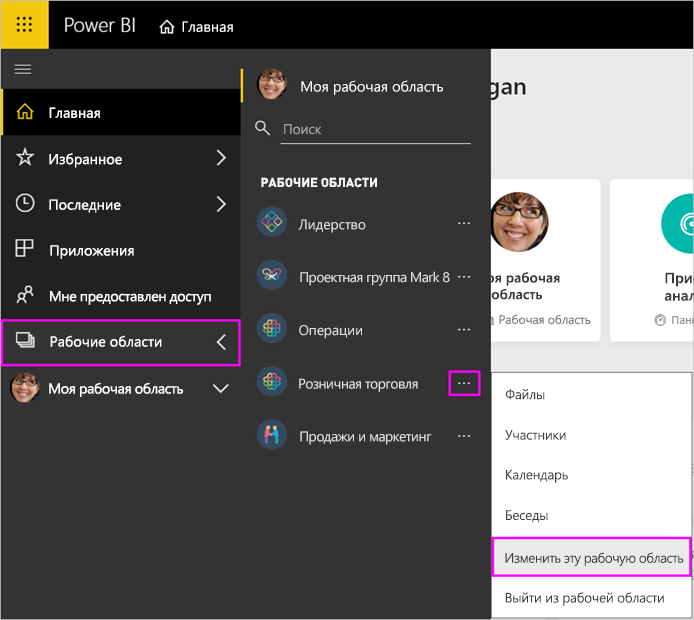
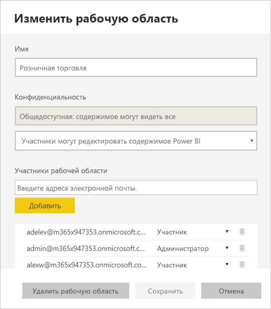
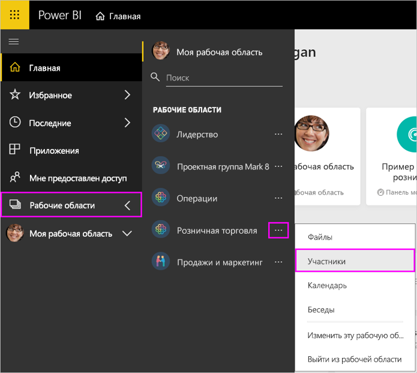
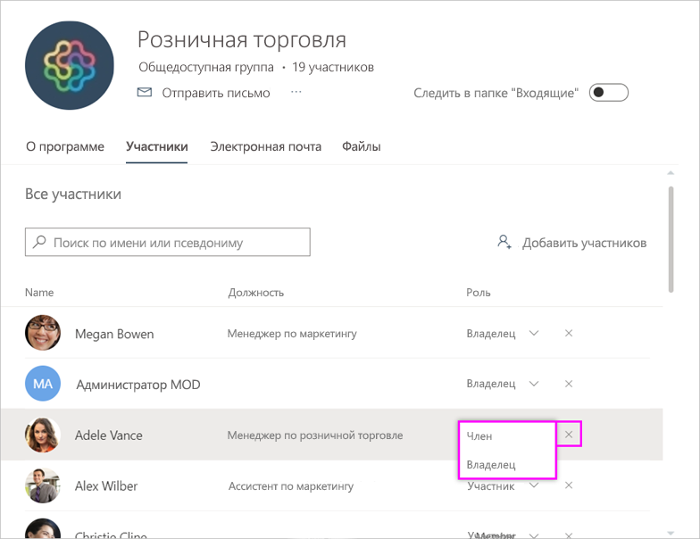
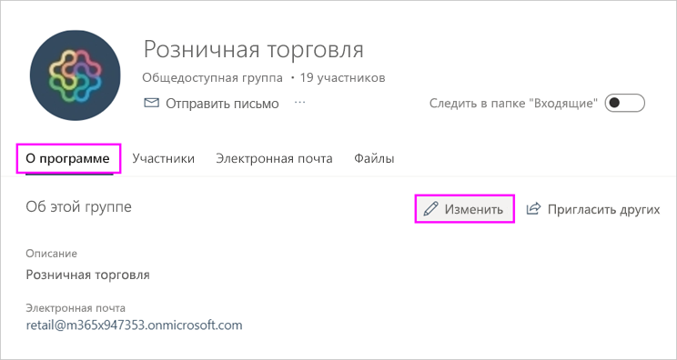
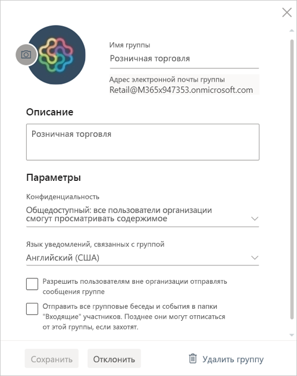

# Управление рабочей областью в Power BI и Microsoft 365

Автор или администратор [рабочей области в Power BI](service-create-distribute-apps.md) или в Microsoft 365 может управлять некоторыми аспектами рабочей области в Power BI. Управление другими аспектами осуществляется в Microsoft 365.

> [!NOTE]
> В новом интерфейсе рабочей области изменятся отношения между рабочими областями Power BI и группами Microsoft 365. Группа Microsoft 365 не будет создаваться автоматически каждый раз, когда вы создаете новую рабочую область. Узнайте о [создании новых рабочих областей](service-create-the-new-workspaces.md).

В **Power BI** можно выполнять следующие задачи:

* Добавлять или удалять участников рабочей области, включая присвоение участнику рабочей области прав администратора.
* Изменить имя рабочей области.
* Удалить рабочую область (в результате также удалится группа Microsoft 365).

В **Microsoft 365** можно:

* добавлять или удалять участников рабочей области, включая присвоение участнику прав владельца;
* менять название группы, ее изображение, описание и другие параметры;
* просматривать адрес электронной почты группы;
* удалять группу.

Лицензия [Power BI Pro](../fundamentals/service-features-license-type.md) необходима для администратора или участника рабочей области. Вашим пользователям приложения также требуется лицензия Power BI Pro, если только рабочая область не хранится емкости Power BI Premium. Дополнительные сведения см. в статье [Что такое Power BI Premium?](../admin/service-premium-what-is.md)

## Изменение рабочей области в Power BI

1. В службе Power BI щелкните стрелку рядом с элементом **Рабочие области**, выберите **Дополнительные параметры** (…) рядом с именем рабочей области, а затем — **Изменение этой рабочей области**.

   

   > [!NOTE]
   > Элемент **Изменение этой рабочей области** отображается только для администраторов рабочих областей.

1. Здесь можно переименовать или удалить рабочую область, а также добавить или удалить членов.

   

1. Выберите **Сохранить** или **Отменить**.

## Изменение свойств рабочей области Power BI в Microsoft 365

Вы также можете изменять различные аспекты рабочей области непосредственно в Outlook для Microsoft 365.

### Изменение членов группы рабочей области

1. В службе Power BI щелкните стрелку рядом с элементом **Рабочие области** и выберите **Дополнительные параметры** (…) рядом с именем рабочей области, а затем — **Члены**.

   

   Откроется представление Outlook для группы Microsoft 365 для рабочей области. Возможно, вам потребуется войти в свою корпоративную учетную запись.

1. Чтобы сделать пользователя **членом** или **владельцем**, выберите роль рядом с его именем. Выберите **X**, чтобы удалить пользователя из группы.

   

### Добавление изображения и задание других свойств рабочей области

При распространении приложения из рабочей области изображение, которое вы добавляете, является изображением вашего приложения. Ознакомьтесь с разделом [Добавление изображения в рабочую область Microsoft 365](service-create-workspaces.md#add-an-image-to-your-microsoft-365-workspace-optional) статьи **Создание рабочих областей**.

1. В представлении Outlook для Microsoft 365 своей рабочей области откройте вкладку **О программе** и выберите **Изменить**.

    
1. Вы можете изменить имя, описание и язык для уведомлений, связанных с группой. Кроме того, здесь можно добавить изображение и задать другие свойства.

   

1. Выберите **Сохранить** или **Отменить**.

## Дальнейшие действия

* [Публикация приложения в Power BI](service-create-distribute-apps.md)

* Появились дополнительные вопросы? [Ответы на них см. в сообществе Power BI.](https://community.powerbi.com/)
