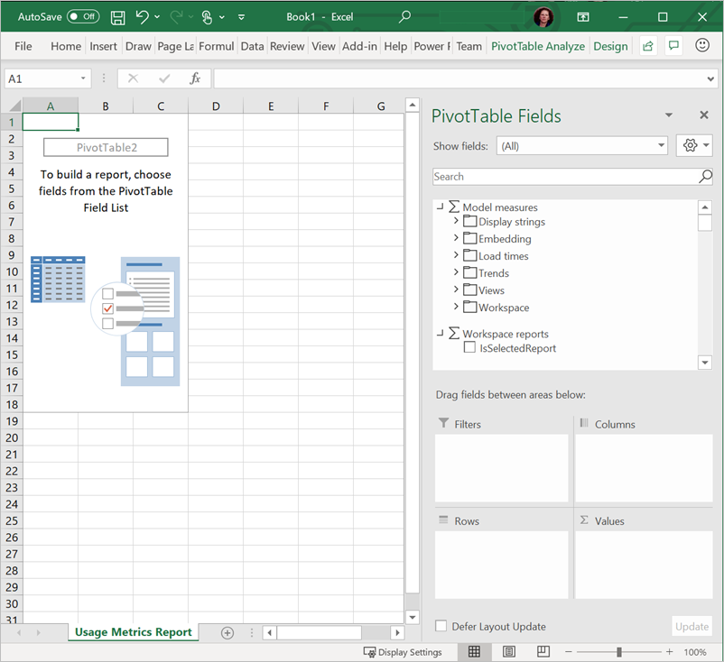
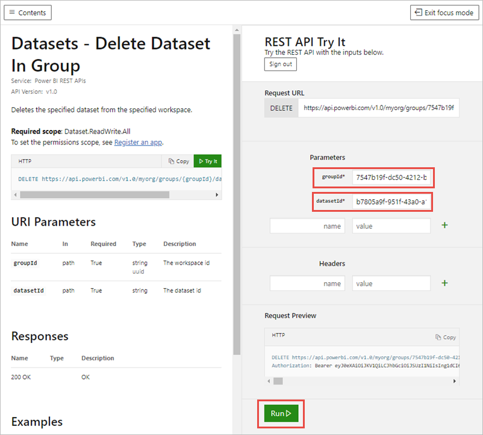

# Мониторинг метрик использования в интерфейсе новой рабочей области

Сведения об использовании содержимого помогут вам оценить закономерности его использования и расставить приоритеты. Показатели использования могут указывать на то, что один из ваших отчетов ежедневно используется большим числом сотрудников, а созданная панель мониторинга вообще не просматривается. Сведения подобного рода являются неоценимыми при перераспределении ресурсов.

При создании отчетов в современных рабочих областях у вас есть доступ к усовершенствованным отчетам по метрикам использования, которые позволяют узнать, как эти отчеты используются в организации, а также кто их использует. Кроме этого, можно определить проблемы с выявлением производительности. Улучшенные отчеты об использовании в современном интерфейсе Рабочей области заменяют существующие отчеты о метриках использования, задокументированные в разделе [Мониторинг метрик использования для панелей мониторинга и отчетов Power BI](service-usage-metrics.md).

> [!NOTE]
> Отчеты по метрикам использования можно запускать только в службе Power BI. Однако если вы сохраните такой отчет или закрепите его на панели мониторинга, вы сможете открывать отчет и работать с ним на мобильных устройствах.

## Предварительные требования

- Для запуска отчетов по метрикам использования и просмотра данных требуется лицензия Power BI Pro. Но метрики использования поддерживают запись сведений об использовании для всех пользователей независимо от назначенной им лицензии.
- Чтобы получить доступ к улучшенным метрикам использования для отчета, последний должен находиться в современной рабочей области и у вас должен быть доступ на редактирование этого отчета.
- Администратор Power BI должен включить использование метрик для создателей содержимого. Также администратор Power BI может включить сбор данных о пользователях в метриках использования. Узнайте, [как включить эти возможности на портале администрирования](../admin/service-admin-portal.md#control-usage-metrics).

## Создание и просмотр улучшенного отчета о метриках использования

Просматривать улучшенный отчет по метрикам использования могут только пользователи с правами администратора, члена или участника. Разрешения зрителя не являются достаточными. Если в современной рабочей области, в которой находится отчет, у вас есть роль как минимум участника, для просмотра улучшенных метрик использования можно использовать следующую процедуру:

1. Откройте рабочую область, содержащую отчет, для которого необходимо проанализировать метрики использования.
2. В списке содержимого рабочей области откройте контекстное меню отчета и выберите **Просмотр метрик использования отчета**. Или откройте отчет, а затем контекстное меню на панели команд, и выберите **Метрики использования**.

    

1. Когда вы делаете это впервые, служба Power BI создает отчет на основе метрик использования и сообщает, когда отчет готов.

    

1. Чтобы увидеть эти результаты, выберите **Просмотр метрик использования**.
2. Если это делается впервые, Power BI может открыть старый отчет о метриках использования. Чтобы отобразить улучшенный отчет о метриках использования, в правом верхнем углу установите переключатель "Новый отчет об использовании" в положение **Включить**.

    

    > [!NOTE]
    > Переключатель "Новый отчет об использовании" можно увидеть, только если ваш отчет находится в современной рабочей области. Устаревшие рабочие области не предоставляют улучшенных отчетов на основе метрик использования.

## Сведения об улучшенном отчете на основе метрик использования

При отображении улучшенного отчета на основе метрик использования, следуя указанной выше процедуре, Power BI создает предварительно построенный отчет с метриками использования для этого содержимого за последние 30 дней. Этот отчет похож на отчеты Power BI, с которыми вы уже знакомы. Вы можете выполнить срез по таким параметрам, как метод получения доступа пользователями, входы через веб-приложение или мобильное приложение и т. д. С улучшением отчетов улучшается и отчет на основе метрик использования, в котором данные обновляются каждый день.

> [!NOTE]
> Отчеты на основе метрик использования не отображаются в списках содержимого, таких как "Недавние", "Рабочие области", "Избранное". Их невозможно добавить в приложение. Если закрепить на панели мониторинга плитку из отчета на основе метрик использования, вы не сможете добавить эту панель мониторинга в приложение.

### Набор данных для отчета на основе метрик использования

Улучшенный отчет на основе метрик использования основывается на наборе данных из Отчета на основе метрик использования, который Power BI создает автоматически при первом запуске улучшенного отчета на основе метрик использования. Затем Power BI ежедневно обновляет этот набор данных. Хотя вы не можете изменить расписание обновления, вы можете обновить учетные данные, которые Power BI использует для обновления данных метрик использования. Это может потребоваться для возобновления запланированного обновления, если истек срок действия учетных данных или был удален пользователь, который первым запустил отчет на основе метрик использования из рабочей области, в которой находится набор данных.

### Страницы отчета на основе метрик использования

Улучшенный отчет на основе метрик использования включает приведенные ниже страницы отчета.

- **Отчеты об использовании** Предоставляет информацию о просмотре отчетов и посетителях, например о том, сколько пользователей просмотрело отчет в определенную дату.
- **Производительность отчета** Показывает типичное время открытия отчета с разбивкой по способам потребления и типам браузеров.
- **Вопросы и ответы** Предоставляет ответы на часто задаваемые вопросы, например, что такое "Средство просмотра" и что такое "Представление"?

### Какие метрики регистрируются?

| **Страница** | **Метрика** | **Описание** |
| --- | --- | --- |
| Отчеты об использовании | Представления отчета | Представление отчета записывается каждый раз, когда пользователь открывает отчет. Обратите внимание, что определение представления отличается от предыдущих отчетов на основе метрик использования. Изменение страниц отчета больше не считается дополнительным представлением. |
| Отчеты об использовании | Уникальные посетители | Посетитель — это тот, кто открыл отчет хотя бы один раз за период времени (на основе учетной записи пользователя AAD). |
| Отчеты об использовании | Тенденции представления | Тенденции представления отображает изменения количества просмотров с течением времени. Он сравнивает первую половину выбранного периода времени со второй половиной. |
| Отчеты об использовании | Срез дат | Период времени можно изменить на странице "Отчеты об использовании", например, чтобы вычислять тенденции за неделю или две недели. В левом нижнем углу страницы "Отчеты об использовании" можно определить самую раннюю и последнюю дату, для которой доступны данные об использовании для выбранного отчета. |
| Отчеты об использовании | Рейтинг | Рейтинг показывает популярность того или иного отчета по сравнению со всеми остальными отчетами в организации на основе подсчета просмотров. Рейтинг 1 означает, что данный отчет имеет больше всего просмотров в организации.   |
| Отчеты об использовании | Отчет о просмотрах за день | Общее количество просмотров в день. |
| Отчеты об использовании | Отчет о посетителях за день | Общее количество разных пользователей, которые просматривали отчет (на основании учетной записи пользователя AAD). |
| Отчеты об использовании | Метод распределения | Сведения о получении пользователями доступа к отчету, например, будучи членами рабочей области, имея общий доступ к отчету, или установив приложение. |
| Отчеты об использовании | Срез платформы | Сведения о типе доступа пользователей к отчету: из службы Power BI (powerbi.com), Power BI Embedded или с мобильного устройства. |
| Отчеты об использовании | Пользователи с представлениями отчетов | Отображение списка пользователей, открывших отчет, отсортированный по количеству представлений. |
| Отчеты об использовании | Страницы | Если отчет содержит более одной страницы, можно разделить отчет по страницам, которые были просмотрены. Если вы видите в списке элемент Blank (Пусто), значит, страница отчета добавлена недавно (фактическое имя новой страницы появится в списке среза в течение 24 часов) или страницы отчета удалены. Параметр Blank (Пусто) охватывает ситуации такого типа. |
| Производительность отчета | Типичное время открытия | Типичное время открытия отчета соответствует 50-му процентилю времени, которое требуется для открытия отчета. Другими словами, это время, меньше которого завершаются 50 % действий по открытию отчета. Страница "Производительность отчета" также разбивает типичное время открытия отчета по способу потребления и типу браузера.   |
| Производительность отчета | Тенденция времени открытия | Тенденция времени открытия отражает изменения производительности открытого отчета с течением времени. Она сравнивает время открытия отчета за первую половину выбранного периода времени с временем открытия для второй половины. |
| Производительность отчета | Срез дат | Период времени можно изменить на странице "Производительность отчета", например, чтобы вычислять тенденции за неделю или две недели. В левом нижнем углу страницы "Производительность отчета" можно определить самую раннюю и последнюю дату, для которой доступны данные об использовании для выбранного отчета. |
| Производительность отчета | Ежедневная производительность | Производительность для 10 %, 50 % и 90 % действий по открытию отчета, рассчитанных на каждый день. |
| Производительность отчета | 7-дневная производительность | Производительность для 10 %, 50 % и 90 % действий по открытию отчета, рассчитанная за последние 7 дней для каждой даты. |
| Производительность отчета | Метод потребления | Способ открытия отчета пользователями: с помощью службы Power BI (powerbi.com), Power BI Embedded или мобильного устройства. |
| Производительность отчета | Браузеры | Какие браузеры использовали пользователи для входа, например, Firefox, Microsoft Edge и Chrome. |

## Обновление учетных данных отчета на основе метрик использования

Следующая процедура используется для получения набора данных Отчета на основе метрик использования и обновления учетных данных.

1. Откройте рабочую область, содержащую отчет, для которого необходимо обновить набор данных Отчета на основе метрик использования.
2. На черной строке заголовка вверху щелкните значок **Параметры**, а затем выберите **Настройки**.

    

3. Перейдите на вкладку **Наборы данных**.

1. Выберите набор данных для Отчета на основе метрик использования. 

    
    
    Если вы не являетесь владельцем текущего набора данных, вам понадобится получить право собственности, прежде чем вы сможете обновлять учетные данные источника данных. 
    
5. Нажмите кнопку **Получить контроль**, затем в диалоговом окне **Получение контроля над параметрами набора данных** снова выберите **Получить контроль**.

1. Выберите **Изменить учетные данные** в разделе **Учетные данные источника данных**

    

2. Нажмите **Войти** в диалоговом окне **Настройка отчета на основе метрик использования**.

    

1. Завершите последовательность входа и обратите внимание на уведомление об успешном обновлении источника данных.

    > [!NOTE]
    > Набор данных Отчета на основе метрик использования содержит данные об использовании за последние 30 дней. Импорт новых данных об использовании может занять до 24 часов. Ручная активация обновления с помощью пользовательского интерфейса Power BI недоступна.

## Отключение отчета на основе метрик использования

Отчеты на основе метрик использования — это функция, которую администратор Power BI или глобальный администратор могут включать или выключать. Администраторы могут управлять доступом отдельных пользователей к метрикам использования. По умолчанию эти сведения доступны для всех корпоративных пользователей. Подробнее см. раздел [Управление метриками использования](../admin/service-admin-portal.md#control-usage-metrics) в статье о портале администратора.

> [!NOTE]
> Только администраторы клиента Power BI могут открывать портал администрирования и изменять параметры.

## Исключение сведений о пользователе из отчетов на основе метрик использования

По умолчанию данные пользователей включены для метрик использования, а сведения об учетной записи потребителя содержимого включаются в отчет на основе метрик. Если администраторы не хотят предоставлять эти сведения для некоторых или всех пользователей, они могут исключить сведения о пользователе из отчета об использовании, отключив данные для каждого пользователя в метриках использования для создателей содержимого в параметрах клиента на портале администрирования Power BI для указанных групп безопасности или для всей организации.

1. На вкладке **Параметры клиента** на портале администрирования в разделе **Параметры аудита и использования** разверните **Данные отдельных пользователей в метриках для создателей содержимого** и выберите **Отключено**.

2. Решите, следует ли **Удалить все существующие данные отдельных пользователей в текущем содержимом метрик использования**, и выберите **Применить**.

    

Если сведения о пользователе исключены, отчет об использовании ссылается на пользователей как "Безымянный".

Блокируя доступ к метрикам использования для всей организации, администраторы могут удалять все существующее содержимое метрик использования. Сюда входят все существующие плитки отчетов и панелей мониторинга, созданные с помощью отчетов на основе метрик использования. Этот параметр блокирует доступ к данным метрик использования для всех корпоративных пользователей, которые уже могли работать с ними. Удаление существующего содержимого метрик использования является необратимым.

> [!NOTE]
> Просматривать портал администратора и настраивать данные для каждого пользователя в метриках использования для параметров создателей содержимого могут только администраторы клиента Power BI.

## Настройка отчета на основе метрик использования

Чтобы получить дополнительные данные отчета или создать собственные отчеты для базовых наборов данных, можно выбрать один из нескольких следующих методов:

- **[Создайте копию отчета в службе](#create-a-copy-of-the-usage-report) Power BI.**   Используйте **Сохранить копию**, чтобы создать отдельный экземпляр отчета на основе метрик использования, который можно настроить в соответствии с определенными потребностями.
- **[Подключитесь к набору данных](#create-a-new-usage-report-in-power-bi-desktop) с помощью нового отчета.**   Для каждой рабочей области набор данных имеет название "Отчет на основе метрик использования", как описано выше в разделе [Набор данных отчета на основе метрик использования](#usage-metrics-report-dataset). Power BI Desktop можно использовать для создания настраиваемых отчетов на основе метрик использования, основываясь на базовом наборе данных.
- **[Использование функции "Анализ в Excel"](#analyze-usage-data-in-excel)**   Для анализа данных об использовании Power BI можно воспользоваться преимуществами функций сводных таблиц, диаграмм и срезов в Microsoft Excel 2010 с пакетом обновления 1 (SP1) или более поздней версии. Дополнительные сведения о функции [Анализ в Excel](service-analyze-in-excel.md).

### Создание копии отчета об использовании

Если вы создадите копию предварительно подготовленного отчета об использовании, доступного только для чтения, Power BI создает редактируемый экземпляр этого отчета. На первый взгляд он точно такой же. Но теперь вы сможете открыть отчет в режиме правки, добавить новые визуализации, фильтры и страницы, изменить или удалить имеющиеся визуализации и многое другое. Power BI сохраняет новый отчет в текущей рабочей области.

1. В новом отчете на основе метрик использования выберите меню (...) **Дополнительные параметры**, а затем **Сохранить копию**.

    

2. Введите имя в диалоговом окне **Сохранить отчет**, а затем выберите **Сохранить**.

    Power BI сохраняет в текущей рабочей области новый отчет Power BI c возможностью редактирования и открывает копию отчета. 

3. Выберите меню (...) **Дополнительные параметры**, а затем **Изменить**, чтобы переключится в режим "Правка". 

    Вы можете, например, изменить фильтры, добавить новые страницы и создать новые визуализации, форматировать шрифты и цвета и т. д.

1. Новый отчет сохраняется на вкладке "Отчеты" в текущей рабочей области, а также добавляется в список содержимого "Последние".

    

### Создание нового отчета об использовании в Power BI Desktop

На основе набора данных Отчета, на основе метрик использования, можно создать новый отчет об использовании в Power BI Desktop. Чтобы установить соединение с набором данных Отчета на основе метрик использования и создать собственный отчет, необходимо войти в службу Power BI в Power BI Desktop. 

1. Откройте Power BI Desktop.

2. Если вы не вошли в службу Power BI, выберите **Войти** в меню **Файл**.

1. Чтобы подключиться к набору данных Отчета на основе метрик использования, выберите **Получение данных** на ленте **Главная**.

4. В левой панели выберите **Power Platform**, а затем **Наборы данных Power BI** > **Подключение**.

    

1. Перейдите к требуемому набору данных или типу *Отчет на основе метрик использования* в поле поиска. 

6. Убедитесь, что в столбце "Рабочая область" выбран правильный набор данных, а затем нажмите **Создать**. 

    

7. Проверьте список полей в Power BI Desktop, который предоставляет доступ к таблицам, столбцам и показателям в выбранном наборе данных.

    

1. Теперь вы можете создавать и совместно использовать настраиваемые отчеты об использовании из одного и того же набора данных Отчета на основе метрик использования.

### Анализ данных об использовании в Excel

При подключении к данным об использовании в Excel можно создавать сводные таблицы, использующие предварительно определенные показатели. Обратите внимание, что при соединении к набору данных Power BI, сводные таблицы Excel не поддерживают агрегирование числовых полей перетаскиванием.

1. Во-первых, если вы этого еще не сделали, [создайте копию отчета на основе метрик использования](#create-a-copy-of-the-usage-report). 

2. Откройте новый отчет на основе метрик использования и выберите меню (...) **Дополнительные параметры**, затем выберите **Анализ в Excel**.

    

1. Если появляется диалоговое окно **Для начала нужно обновить Excel** выберите **Загрузить** и установите последние обновления для подключения Power BI или выберите **Эти обновления уже установлены**.

    

    > [!NOTE]
    > В некоторых организациях могут действовать правила групповой политики, которые запрещают устанавливать в Excel необходимые для функции "Анализ в Excel" обновления. Если вам не удается установить обновления, обратитесь к своему администратору.

1. В диалоговом окне браузера, с вопросом о том, что нужно сделать с файлом report.odc на основе метрик использования, выберите **Открыть**.

    

1. Power BI запускает Excel. Проверьте имя файла и путь к ODC-файлу, а затем выберите **Включить**.

    

1. Теперь, когда Excel открыт и есть пустая сводная таблица, можно перетаскивать поля в области "Строки" "Столбцы", "Фильтры" и "Значения" и создавать пользовательские представления в данных об использовании.

    

## Метрики использования в национальных облаках

Power BI доступен в отдельных национальных облаках. Эти облака обеспечивают те же уровни безопасности, конфиденциальности, соответствия требованиям и прозрачности, что и глобальная версия Power BI. При этом они используют уникальную модель регулирования предоставления услуг, размещения данных, а также доступа к ним и управления ими, основанную на местных нормативных требованиях. Из-за этой уникальной модели для местных нормативов метрики использования недоступны в национальных облаках. Дополнительные сведения см. на странице [национальных облаков](https://powerbi.microsoft.com/clouds/).

## Рекомендации и ограничения

Важно учитывать возможные отличия при сравнении улучшенного отчета на основе метрик использования с его предшественником. В частности, отчеты на основе метрик использования теперь основаны на данных об активности, собранных из службы Power BI. Предыдущие версии отчета на основе метрик использования основывались на телеметрии клиента, которая не всегда совпадала с метриками использования, собранными из службы. Кроме того, в улучшенном отчете на основе метрик использования для пункта «Представление» используется другое определение. Представление — это событие открытия отчета, которое регистрируется в службе каждый раз, когда кто-либо открывает отчет. Изменение страниц отчета больше не считается дополнительным представлением.

> [!NOTE]
> Так как улучшенный отчет на основе метрик использования основан на данных об активности, собранных из службы Power BI, то метрики использования теперь соответствуют совокупному количеству операций в журналах аудита и журналах действий. Недостаточное и избыточное количество операций из-за несогласованности сетевых подключений, блокировки рекламы или других проблем на стороне клиента больше не искажают средство просмотра и количество просмотров.

В дополнение к вышеуказанным различиям между предыдущими и улучшенными отчетами на основе метрик использования, обратите внимание на приведенные ниже ограничения для предварительного выпуска.

- Метрики использования панели мониторинга по-прежнему основываются на предыдущей версии отчетов на основе метрик использования.
- Улучшенные отчеты на основе метрик использования доступны только для отчетов в современных рабочих областях. Отчеты в устаревших рабочих областях поддерживают только предыдущую версию отчетов по метрикам использования.
- Отчет на основе метрик производительности основывается на телеметрии клиента. Определенные типы представлений не включаются в измерения производительности. Например, когда пользователь выбирает ссылку на отчет в сообщении электронной почты, представление учитывается в отчетах об использовании, но в метриках производительности не создается событие.
- Отчет на основе метрик производительности недоступный для отчетов с разбивкой на страницы. На вкладке "Страницы" на странице "Отчеты об использовании" и диаграммах на странице "Рекомендации по производительности" не отображаются данные для отчетов такого типа.
- При использовании вложенных групп пользовательская маскировка не работает должным образом. Если ваша организация отключила данные для каждого пользователя по метрикам использования для создателей содержимого в параметрах клиента портала администрирования Power BI, маскируются только члены верхнего уровня. Члены подгрупп все еще видны.
- Инициализация набора данных Отчета на основе метрик использования может занять несколько минут, в результате чего будет отображен пустой отчет на основе метрик использования, поскольку пользовательский интерфейс Power BI не ждет завершения обновления. Проверьте журнал обновления в параметрах набора данных Отчета на основе метрик использования, чтобы убедиться, что операция обновления прошла успешно.
- Инициализация набора данных Отчета на основе метрик использования может завершиться ошибкой из-за истечения времени ожидания во время обновления. Для решения этой проблемы выполните такие действия по устранению неполадок.
- Общий доступ для отчета о метриках использования отключен. Чтобы предоставить пользователям доступ к отчету для чтения, сначала необходимо предоставить им доступ к рабочей области.
- В некоторых сценариях можно заметить, что отсутствуют данные о производительности. Это может произойти, если пользователь открывает отчет и взаимодействует с ним до завершения загрузки или если во время загрузки отчета возникает ошибка.
- Данные о производительности основаны на отправке клиентом или устройством данных в Power BI. В зависимости от задержки сети, блокирования рекламы, брандмауэров и сетевых правил, заданных вашей организацией, данные о производительности могут не достигать Power BI. Таким образом, данные о производительности всегда могут представлять собой лишь пример и не могут включать или показывать всех пользователей. 

## Часто задаваемые вопросы

В дополнение к вышеперечисленным соображениям и ограничениям, для пользователей и администраторов могут быть полезны следующие вопросы и ответы о метриках использования:

**Вопрос.** Мне не удается запустить метрики использования для отчета.

**Ответ.** Вы можете просматривать метрики использования, только если являетесь их владельцем или имеете право на их изменение.

**Вопрос.** Почему на переключателе в верхнем правом углу существующего отчета на основе метрик использования не отображается новый отчет об использовании?

**Ответ.** Улучшенные отчеты на основе метрик использования доступны только для отчетов в современных рабочих областях.

**Вопрос.** Какой период времени охватывает отчет?

**Ответ.** Отчет об использовании основан на данных о действиях за последние 30 дней, за исключением действий текущего дня. Период времени можно сузить, используя срез дат на странице "Отчеты об использовании", например, для анализа данных только за последнюю неделю.

**Вопрос.** Когда я увижу последние данные о действиях?

**Ответ.** Отчет об использовании включает данные о действиях вплоть до последнего полного дня, основанного на часовом поясе UTC. Данные, отображаемые в отчете, также зависят от времени обновления для набора данных. Power BI обновляет набор данных один раз в день.

**Вопрос.** Похоже, данные не обновляются.

**Ответ.** Обратите внимание, что появление новых данных о действиях в отчете об использовании может занять до 24 часов.

**Вопрос.** Что является источником данных для данных об использовании?

**Ответ.** Набор данных Отчета на основе метрик использования импортирует данные из внутреннего хранилища метрик использования Power BI с помощью пользовательского соединителя данных метрик использования. Учетные данные для соединителя данных метрик использования можно обновить на странице параметров набора данных Отчета на основе метрик использования.

**Вопрос.** Как установить соединение с данными? Или изменить отчет по умолчанию?

**Ответ.** Вы можете создать копию предварительно созданного отчета об использовании только для чтения. Копия отчета подключается к тому же набору данных Отчета на основе метрик использования и позволяет изменять данные отчета.

**Вопрос.** Что такое "Посетитель" и "Представление"?

**Ответ.** Посетитель — это пользователь, открывший отчет хотя бы один раз за период времени. Представление — это событие по открытию отчета. Представление отчета записывается каждый раз, когда пользователь открывает отчет.

Обратите внимание, что определение представления отличается от предыдущих отчетов на основе метрик использования. Изменение страниц отчета больше не считается дополнительным представлением.

**Вопрос.** Как вычисляется "Тенденция представления"?

**Ответ.** Тенденции представления отображает изменения количества просмотров с течением времени. Он сравнивает первую половину выбранного периода времени со второй половиной. Период времени можно изменить, используя Срез дат, на странице "Отчеты об использовании", например, для вычисления тенденций за неделю или две недели.

**Вопрос.** Что означают "Распространение" и "Платформа"?

**Ответ.** Распространение показывает, как посетители получили доступ к отчету: напрямую, через доступ к рабочей области или через приложение.

Платформа обозначает технологию, используемую посетителем для открытия отчета: с помощью PowerBI.com, Mobile или Embedded.

**Вопрос.** Как работает ранжирование отчетов?

**Ответ.** Рейтинг показывает популярность того или иного отчета по сравнению со всеми остальными отчетами в организации на основе подсчета просмотров. Рейтинг 1 означает, что данный отчет имеет больше всего просмотров в организации.

**Вопрос.** Что такое "Безымянные пользователи"?

**Ответ.** Организация может принять решение об исключении информации о пользователе из отчета об использовании. Отчет об использовании ссылается на пользователей как "Безымянный", если исключены.

**Вопрос.** Что такое "Типичное время открытия отчетов"?

**Ответ.** Типичное время открытия отчета соответствует 50-му процентилю времени, которое требуется для открытия отчета. Другими словами, это время, меньше которого завершаются 50 % действий по открытию отчета. Страница производительности отчета также разбивает типичное время открытия отчета по способу потребления и типу браузера.

**Вопрос.** Как вычисляется "Тенденция времени открытия"?

**Ответ.** Тенденция времени открытия отражает изменения производительности открытого отчета с течением времени. Она сравнивает время открытия отчета за первую половину выбранного периода времени с временем открытия для второй половины. Период времени можно изменить, используя Срез дат, на странице "Производительность отчетов", например, для вычисления тенденций за неделю или две недели.

**Вопрос.**  В предыдущей версии отчета на основе метрик использования было четыре отчета, но в улучшенной версии отображаются только три.

**Ответ.**  Улучшенный отчет на основе метрик использования включает только отчеты, которые были открыты за последние 30 дней, тогда как предыдущая версия охватывает последние 90 дней. Если отчет не включен в улучшенный отчет на основе метрик использования, он, скорее всего, не использовался более 30 дней.

## Устранение неполадок: Удаление набора данных

Если имеются подозрения на счет проблем с целостностью данных или обновлением, возможно, имеет смысл удалить существующий набор данных Отчета на основе метрик использования. Затем вы можете запустить Просмотр метрик использования еще раз, чтобы создать новый набор данных с соответствующими улучшенными отчетами на основе метрик использования. Выполните следующие действия.

### Удаление набора данных

1. Откройте рабочую область, содержащую отчет, для которого необходимо сбросить набор данных Отчета на основе метрик использования.

2. На черной строке заголовка вверху щелкните значок **Параметры**, а затем выберите **Настройки**.

    

3. Перейдите на вкладку **Наборы данных** и выберите набор данных Отчета на основе метрик использования. 

    

5. Скопируйте идентификаторы рабочей области и набора данных из URL-адреса, отображаемого в адресной строке браузера.

    

1. В браузере перейдите к [https://docs.microsoft.com/rest/api/power-bi/datasets/deletedatasetingroup](https://docs.microsoft.com/rest/api/power-bi/datasets/deletedatasetingroup)и нажмите кнопку **Тестирование**.

    

1. Войдите в Power BI, вставьте идентификатор рабочей области в текстовое поле **groupId** и идентификатор набора данных в текстовое поле **datasetId**, а затем выберите **Выполнить**. 

    

1. Убедитесь, что под кнопкой **Выполнить**, служба возвращает код отклика **200**. Этот код указывает, что набор данных и связанные с ним отчеты на основе метрик использования успешно удалены.

    

### Создание обновленного отчета на основе метрик использования

1. Вернувшись в службу Power BI, вы увидите, что набор данных отсутствует.

    

2. Обновите браузер, если отчет на основе метрик использования по-прежнему отображается в списке отчетов.

3. [Создание и просмотр улучшенного отчета о метриках использования](#create--view-an-improved-usage-metrics-report).

## Дальнейшие действия

[Администрирование Power BI на портале администрирования](../admin/service-admin-portal.md)

Появились дополнительные вопросы? [Ответы на них см. в сообществе Power BI.](https://community.powerbi.com/)
