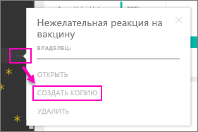

# Пакеты содержимого организации: копирование, обновление и получение доступа

После публикации пакета содержимого организации все получатели видят одну и ту же панель мониторинга, одни и те же отчеты, книги Excel и наборы данных (если источником данных не являются службы SQL Server Analysis Services (SSAS).  [Только автор пакета содержимого может изменять и повторно публиковать](service-organizational-content-pack-manage-update-delete.md) его.  Тем не менее все получатели могут сохранить копию пакета содержимого, которая может сосуществовать с исходным вариантом.

Создание пакетов содержимого отличается от предоставления общего доступа к информационным панелям и от совместной работы над ними в группе. Чтобы выбрать оптимальный вариант для вашей ситуации, см. статью [Как предоставить общий доступ к панелям мониторинга, отчетам и плиткам?](service-how-to-collaborate-distribute-dashboards-reports.md)

> [!NOTE]
> Нельзя создавать или устанавливать пакеты содержимого организации в новом интерфейсе рабочей области. Сейчас самое время обновить пакеты содержимого для приложений, если вы еще этого не сделали. Узнайте [больше о новом интерфейсе рабочей области](service-create-the-new-workspaces.md).
>

## Создание копии пакета содержимого организации
Создайте собственную копию пакета содержимого, не отображающуюся для других пользователей.

1. Нажмите **Дополнительные параметры** (...) возле панели мониторинга и выберите команду "Создать копию".

    
2. Щелкните **Сохранить**.  

Теперь у вас есть копия, которую можно изменять. Никто другой не увидит ваши изменения.

> [!NOTE]
> Ранее при каждой установке пакета содержимого или создании его копии в списке содержимого рабочей области появлялся новый набор данных. Недавнее обновление упростило эту процедуру, теперь отображается всего один элемент и используется новый значок упоминаемого набора данных:
>
> 
>

## Помогите!  Мне больше не доступен пакет контента
Это может произойти по следующим причинам.

* **Изменение членства**: пакеты содержимого публикуются в группах рассылки электронной почты, группах безопасности и [группах Power BI, основанных на Office 365](https://support.office.com/article/Create-a-group-in-Office-365-7124dc4c-1de9-40d4-b096-e8add19209e9).  Если вы были удалены из группы, вы потеряете доступ к пакету содержимого.
* **Изменения сферы распространения**: автор пакета содержимого меняет сферу распространения. Например, если пакет содержимого первоначально был опубликован для всей организации, но автор повторно опубликовал его для меньшей аудитории, вы можете потерять право на использование пакета.
* **Изменения параметров безопасности**: если информационная панель и отчеты подключаются к локальным источникам данных SSAS и в параметры безопасности внесены изменения, ваши разрешения на этом сервере могут быть отозваны.

## Как обновляются пакеты контента организации?
Когда пакет контента создается, параметры обновления наследуются от набора данных.  Когда вы создаете копию пакета содержимого, новая версия сохраняет ссылку на исходный набор данных и соответствующее расписание обновления.

См. статью [Управление пакетами содержимого организации, их обновление и удаление](service-organizational-content-pack-manage-update-delete.md).

## Дальнейшие действия
* [Знакомство с пакетами контента организации](service-organizational-content-pack-introduction.md)
* [Создание группы в Power BI](service-create-distribute-apps.md)
* У вас имеются и другие вопросы? [Ответы на них см. в сообществе Power BI.](https://community.powerbi.com/)
