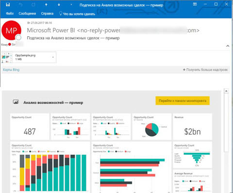
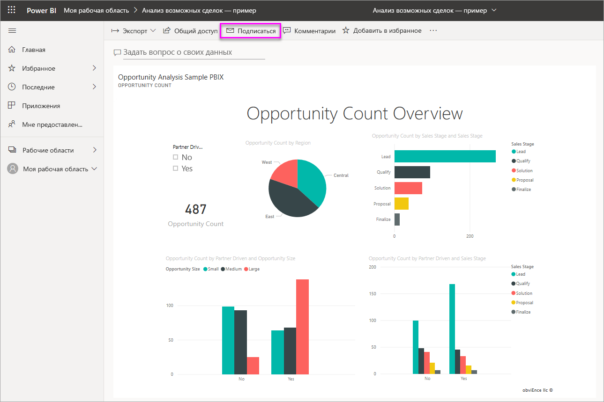
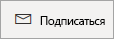
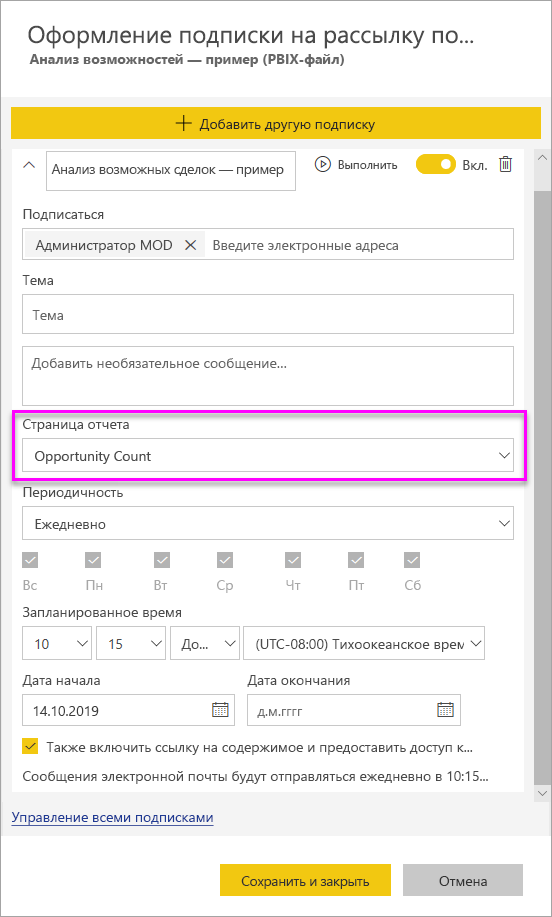
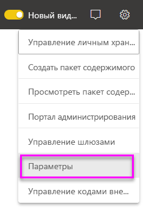
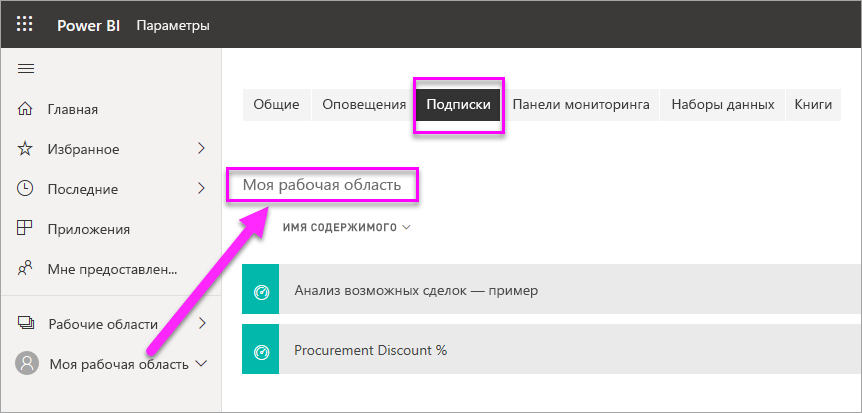

# Создание подписки на отчеты и панели мониторинга в службе Power BI для себя и других пользователей

Вы можете оформить подписку для себя и своих коллег на страницы отчета, панели мониторинга и отчеты с разбивкой на страницы. Подписки по электронной почте Power BI позволяют следующее.

- Указать, с какой частотой вы хотите получать сообщения: ежедневно, еженедельно, ежечасно, ежемесячно или после первоначального обновления данных (раз в день).
- Выбрать время получения сообщения электронной почты, если выбраны варианты ежедневно, еженедельно, ежечасно или ежемесячно.
- Настроить 24 разных подписки на отчет или панель мониторинга Power BI.  Количество подписок, которые можно настроить для отчетов с разбивкой на страницы, не ограничено.
- Получать сообщения электронной почты с изображением отчета и ссылкой на отчет в службе.  На мобильных устройствах с приложениями Power BI при выборе этой ссылки запустится приложение Power BI (в отличие от сайта Power BI, где открывается отчет или панель мониторинга).
- Включать вложение в полный отчет при подписке на отчет с разбивкой на страницы.
- Отправлять сообщения электронной почты пользователям за пределами вашего клиента, если содержимое Power BI размещается в емкости Premium.  Администраторы могут настраивать, кто может отправлять подписки по электронной почте внешним пользователям, используя существующие параметры управления внешним доступом в центре администрирования Power BI.

 

## Требования

**Создать** подписку могут такие пользователи:

- пользователи с лицензией Power BI Pro; 
- пользователи, которые просматривают содержимое в рабочей области "Премиум" или приложении, могут также подписаться на содержимое из этого расположения даже без лицензии Power BI Pro. 

Для создания подписки для себя не требуются разрешения на изменение содержимого (панели мониторинга или отчета), однако у вас должны быть такие разрешения, если вы создаете подписку для другого пользователя.

## Подписка на панель мониторинга, страницу отчета или отчет с разбивкой на страницы

Процедуры подписки на панель мониторинга, отчет или отчет с разбивкой на страницы похожи. Одна кнопка позволяет оформить подписки на панели мониторинга и отчеты службы Power BI.

Подписка на отчет с разбивкой на страницы немного отличается. Дополнительные сведения см. в разделе [Создание подписки на отчет с разбивкой на страницы в службе Power BI для себя и других пользователей](../consumer/paginated-reports-subscriptions.md).
 
.

1. Откройте панель мониторинга или отчет.
2. В верхней строке меню выберите **Подписаться** или нажмите значок конверта .
   
    

1. Для включения и отключения подписки используйте ползунок желтого цвета. Установив ползунок в положение **Выкл.** , вы не удалите подписку. Для удаления подписки выберите значок корзины.

2. Ваш адрес электронной почты уже указан в поле **Подписаться**. В подписку также можно добавить другие адреса электронной почты, но только из того же домена. Если отчет или панель мониторинга размещается в [емкости Premium](https://docs.microsoft.com/power-bi/service-premium-what-is), вы сможете подписывать других пользователей по отдельным адресам электронной почты и групповым псевдонимам, даже если они не находятся в вашем домене. Если отчет или панель мониторинга размещается в емкости Premium, вы можете подписывать других пользователей, но у них также должны быть лицензии Power BI Pro. Дополнительные сведения см. в разделе [Рекомендации и устранение неполадок](#considerations-and-troubleshooting) ниже.

3. Введите нужные сведения в полях **Тема** и **Сообщение**.

4. Выберите **частоту** для подписки:  **Ежедневно**, **Ежечасно**, **Еженедельно**, **Ежемесячно** и **После обновления данных (ежедневно)** . Чтобы получать сообщения только в определенные дни, выберите вариант **Ежечасно** или **Еженедельно**, а затем — нужные дни. Например, если вы хотите получать рассылку по электронной почте только в рабочие дни, выберите **Еженедельно** и снимите флажки для **субботы** и **воскресенья**. Если выбрано **Ежемесячно**, введите дни месяца, в которые вы хотите получать рассылку.

5. При выборе варианта **Ежедневно**, **Ежечасно**, **Ежемесячно** или **Еженедельно** вы также можете указать **запланированное время** рассылки. Можно выполнять рассылку раз в час или через 15, 30 или 45 минут. Выберите время с утра (AM) или после полудня (PM). Можно также указать часовой пояс. Если вы выбираете **Ежечасно**, выберите **запланированное время** начала подписки, и она будет повторяться каждый час после этого.

6. По умолчанию датой начала подписки является дата ее создания. Вы можете выбрать дату окончания. Если не задать дату окончания, срок действия подписки автоматически истекает через год. Вы можете указать любую дату в будущем (до 9999 года) в любое время до истечения срока действия подписки. Когда будет достигнута дата окончания подписки, ее действие прекращается до повторного включения. Перед запланированной датой окончания подписки вы получите уведомление с запросом на продление.

    На снимке экрана ниже обратите внимание, что при подписке на отчет вы фактически подписываетесь на _страницу_ отчета. Чтобы подписаться в отчете на несколько страниц, нажмите **Добавить другую подписку** и выберите другую страницу.
     
      

1. (Необязательно.) Укажите, следует ли включать ссылку на содержимое в Power BI и следует ли предоставлять пользователям доступ к содержимому, на которое вы их подписываете.  Если вы решили включить ссылку, убедитесь, что все пользователи имеют доступ к отчету.
2. Щелкните **Сохранить и закрыть**. Подписчики получают сообщение электронной почты и моментальные снимки страницы отчета или панели мониторинга с выбранной частотой и в указанное вами время. В общем можно создать до 24 подписок на отчет или панель мониторинга и указать уникальных получателей, значения времени и частоты для каждой подписки. Все подписки, для которых для отчета или панели мониторинга задана частота **После обновления данных**, будут отправлять сообщение только после первого запланированного обновления.

    > [!NOTE]
    > Если вы измените подписку после того, как она будет сохранена и закрыта, возможность предоставления пользователям доступа к содержимому, на которое вы подписываетесь, будет предоставлена независимо от того, какие параметры были выбраны ранее.
    >

    > [!TIP]
    > Хотите отправлять электронное письмо из подписки немедленно или по требованию в любое время? Выберите **Выполнить** для подписок в панели мониторинга или отчете, которые будут отправлять сообщение. Появится уведомление, информирующее об отправке электронного письма всем пользователям конкретной подписки. Выполнение этого действия не учитывается как один из 24 максимально допустимых запланированных запусков подписки в день на каждый отчет или панель мониторинга. Это не приводит к обновлению базового набора данных.
    >

## Управление подписками

Управлять подпиской может только тот, кто ее создал. Открыть экран для управления подписками можно двумя способами. Первый способ: в диалоговом окне **Оформление подписки на рассылку по электронной почте** можно выбрать параметр **Управление всеми подписками** (см. шаг 4 выше). Второй способ: в верхней строке меню щелкните значок шестеренки  Power BI и выберите **Параметры**.

Перечень отображаемых подписок зависит от того, какая рабочая область сейчас активна. Чтобы отобразить сразу все подписки для всех рабочих областей, активируйте параметр **Моя рабочая область**. Чтобы разобраться в том, что такое рабочие области, см. сведения о [рабочих областях в Power BI](service-create-workspaces.md).

Подписка завершается в любом из следующих случаев.

- Срок действия профессиональной лицензии истекает.
- Владелец удаляет панель мониторинга или отчет.
- Учетная запись пользователя, используемая для создания подписки, удалена.

Администраторы Power BI могут использовать журналы аудита Power BI для просмотра сведений о подписках. Они могут включать:

- Created By (Кем создана)
- Дата создания
- Содержимое, на которое оформлена подписка
- Recipients
- Периодичность
- Кем изменено
- Дата изменения

## Рекомендации и устранение неполадок

### Общие

- Как и в случае с другими продуктами бизнес-аналитики, время, заданное для подписки, — это момент начала обработки подписки.  После завершения обработки отчета подписка помещается в очередь и отправляется получателям по электронной почте.  Мы стараемся обрабатывать и доставлять все подписки максимально оперативно. Однако иногда при пиковой загрузке может наблюдаться более длительная задержка из-за количества подписок, которые служба Power BI может отправлять одновременно. В большинстве случаев задержка для обработки и отправки отчетов не должна превышать 15 минут. В определенные моменты времени и для определенных клиентов, имеющих значительный объем использования, задержка может составлять до 30 минут.  Мы не планируем, что задержка доставки будет превышать 60 минут с момента планирования подписки.  Если время задержки слишком велико, сначала убедитесь, что адрес `no-reply-powerbi@microsoft.com` добавлен поставщиком услуг электронной почты в список разрешенных адресов.  В этом случае обращайтесь за помощью в службу поддержки Power BI.
- В настоящее время вы не можете оформлять другим пользователям подписку по электронной почте на отчеты и панели мониторинга, где используются наборы данных с динамическим подключением, за исключением отчетов с разбивкой на страницы. Вы можете подписывать других на отчеты с разбивкой на страницы с помощью контекста безопасности. Узнайте больше о [подписке на отчеты с разбивкой на страницы](../consumer/paginated-reports-subscriptions.md).
- Power BI автоматически приостанавливает обновление наборов данных, связанных с панелями мониторинга и отчетами, которые не просматривались более двух месяцев. Однако если добавить подписку на панель мониторинга или отчет, она не приостанавливается даже при отсутствии посещений.
- Если вы не получаете рассылку по подписке, убедитесь, что ваше имя участника-пользователя (UPN) поддерживает получение сообщений электронной почты.
- Если панель мониторинга или отчет находится в емкости Premium, вы можете не подписывать коллег по отдельным адресам, а использовать групповые псевдонимы электронной почты. Псевдонимы зависят от текущей службы каталогов Active Directory.
- Если содержимое не находится в емкости уровня Premium, получить подписки по электронной почте могут только пользователи Power BI Pro. 
- В настоящее время подписки не поддерживают закладки.
- При редактировании действующей подписки параметр предоставления доступа к отчету или панели мониторинга всегда отображается как активный.  Если снять этот флажок и сохранить подписку, это состояние сохранится. Однако в случае следующего изменения отчета он по умолчанию будет снят.

### Панели мониторинга

- Панели мониторинга с более чем 25 закрепленными плитками или 4 закрепленными страницами динамического отчета могут отображаться не полностью в рассылках, отправляемых пользователям. Подписки на панели мониторинга, где плиток больше, не блокируются. Однако при возникновении проблем они считаются неподдерживаемыми. Рекомендуется изменить их соответствующим образом, чтобы они удовлетворяли поддерживаемому диапазону.
- В редких случаях доставка подписок получателям по электронной почте может занять больше пятнадцати минут. В подобной ситуации мы рекомендуем выполнять обновление данных и подписку по электронной почте в разное время, чтобы обеспечить своевременную доставку. Если проблема повторится, обратитесь в службу поддержки Power BI.
- В подписках по электронной почте на панели мониторинга плитки, для которых действует безопасность на уровне строк (RLS), не отображаются.
- Для подписок на панели мониторинга некоторые типы плиток пока не поддерживаются. К ним относятся плитки потоковой передачи, видео и пользовательского веб-содержимого.
- При совместном использовании панели мониторинга с коллегами не из вашего клиента вы также не можете создать для них подписку *, за исключением ситуации*, когда панель мониторинга находится в рабочей области или приложении уровня Премиум. Например, если вы `aaron@contoso.com`, вы можете предоставить общий доступ `anyone@fabrikam.com`, но не сможете подписать `anyone@fabrikam.com`, и этот пользователь не может подписаться на предоставляемое содержимое.

### Отчеты

- Что касается подписок по электронной почте на отчеты, если для набора данных действует безопасность на уровне строк (RLS), вы можете создать подписку для себя. Вы не можете подписать других пользователей на отчет, к которому применяется безопасность на уровне строк (RLS), за исключением отчетов с разбивкой на страницы. Вы можете подписывать других на отчеты с разбивкой на страницы с помощью контекста безопасности. Узнайте больше о [подписке на отчеты с разбивкой на страницы](../consumer/paginated-reports-subscriptions.md).
- Подписки на страницу отчета привязаны к ее имени. Если вы подпишетесь на страницу отчета и переименуете ее, потребуется создать подписку повторно.
- В Azure Active Directory вы можете настроить некоторые параметры, которые ограничивают возможность использования в Power BI подписок, оформляемых по электронной почте. Эти ограничения включают в том числе применение многофакторной проверки подлинности и ограничение диапазона IP-адресов для доступа к ресурсам.
- Подписки на рассылку по электронной почте не поддерживают большинство [пользовательских визуальных элементов](../developer/power-bi-custom-visuals.md). Единственным исключением являются [сертифицированные](../developer/power-bi-custom-visuals-certified.md) пользовательские элементы.
- Рассылка по электронной почте сейчас не поддерживает настраиваемые визуальные элементы на базе языка R.
- Подписки на рассылку по электронной почте обрабатываются с учетом состояний среза и стандартного фильтра отчета. Любые изменения стандартных значений, внесенные после оформления подписки, в письмах не отображаются. Отчеты с разбивкой на страницы поддерживают эту возможность и позволяют задавать значения конкретных параметров для каждой подписки.

## Дальнейшие действия

- [Создание подписки на отчет с разбивкой на страницы в службе Power BI для себя и других пользователей](../consumer/paginated-reports-subscriptions.md)
- Появились дополнительные вопросы? [Попробуйте задать вопрос в сообществе Power BI.](https://community.powerbi.com/)    
- [Ознакомьтесь с этой записью блога.](https://powerbi.microsoft.com/blog/introducing-dashboard-email-subscriptions-a-360-degree-view-of-your-business-in-your-inbox-every-day/)
