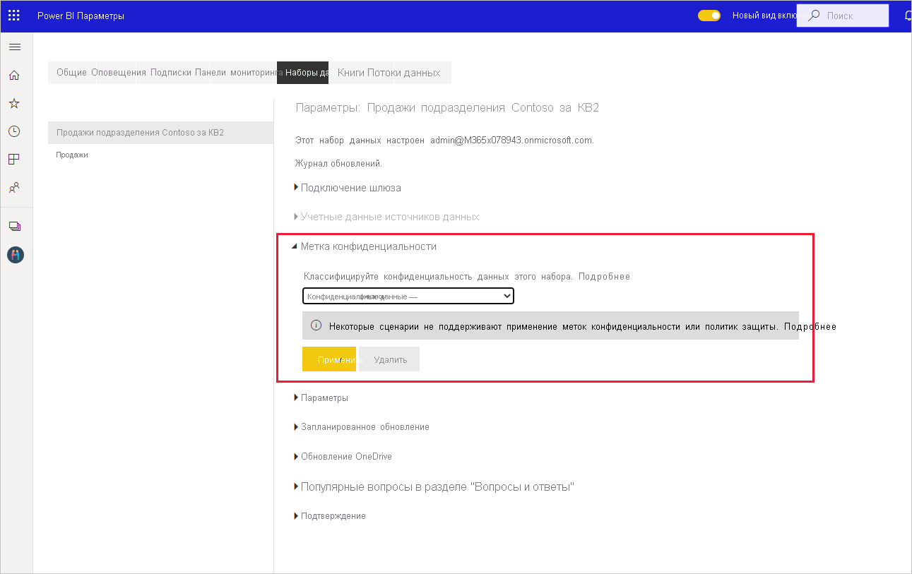

# Применение меток конфиденциальности данных в Power BI

Метки конфиденциальности Microsoft Information Protection в отчетах, на панелях инструментов, в наборах данных и в потоках данных могут защитить ваше конфиденциальное содержимое от несанкционированного доступа к данным и их утечки. Используя соответствующие метки конфиденциальности, вы гарантируете, что доступ к данным будут получать только лица с соответствующими разрешениями. В этой статье рассказывается, как применять метки конфиденциальности к содержимому.

Для применения меток конфиденциальности в Power BI
* У вас должны быть лицензия Power BI Pro и разрешения на редактирование содержимого, к которым требуется добавлять метки.
* Вы должны входить в группу безопасности, которой назначены разрешения на применение меток конфиденциальности данных, как описывается в статье [Активация меток конфиденциальности данных в Power BI](../admin/service-security-enable-data-sensitivity-labels.md#enable-data-sensitivity-labels).
* Все [предварительные требования](../admin/service-security-data-protection-overview.md#requirements-for-using-sensitivity-labels-in-power-bi) и [требования к лицензированию](../admin/service-security-data-protection-overview.md#licensing) должны быть выполнены.

Дополнительные сведения о метках конфиденциальности данных в Power BI см. в статье [Общие сведения о защите данных в Power BI](../admin/service-security-data-protection-overview.md).

## Применение меток конфиденциальности

Если в вашем клиенте включена защита данных, метки конфиденциальности отображаются в столбце "Конфиденциальность" в представлении списка для панелей мониторинга, отчетов, наборов и потоков данных.

**Применение метки конфиденциальности к отчету или панели мониторинга или изменение этой метки**
1. Нажмите кнопку **Дополнительные параметры (...)** .
1. Выберите **Параметры**.
1. На боковой панели параметров выберите соответствующую метку конфиденциальности.
1. Сохраните параметры.

На следующем изображении эти действия показаны в отчете

**Применение метки конфиденциальности к набору или потоку данных или изменение этой метки**

1. Нажмите кнопку **Дополнительные параметры (...)** .
1. Выберите **Параметры**.
1. На боковой панели параметров выберите соответствующую метку конфиденциальности.
1. Примените параметры.

Следующие два изображения демонстрируют эти действия в наборе данных.

Выберите **Дополнительные параметры (...)** , а затем **Параметры**.

На странице параметров откройте раздел "Метка конфиденциальности", выберите нужную метку и нажмите кнопку **Применить**.

## Удаление меток конфиденциальности
Чтобы удалить метку конфиденциальности из отчета, панели мониторинга, набора данных или потока данных, выполните [процедуру, используемую для применения меток](#applying-sensitivity-labels), но выберите **(Нет)** при появлении запроса на классификацию конфиденциальности данных. 

## Защита данных в экспортируемых файлах

Защита данных, связанная с метками конфиденциальности, применяется к данным только при экспорте файлов Excel, PowerPoint и PDF. Она не работает с функцией "Анализ в Excel", экспортом в CSV-файл, скачиванием наборов данных в формате PBIX, динамическим подключением к службе Power BI и любым другим форматом экспорта. Параметрами экспорта данных управляют [параметры экспорта](../service-admin-portal.md#export-and-sharing-settings) администратора клиента Power BI.

Если вы [экспортируете данные из отчета](https://docs.microsoft.com/power-bi/consumer/end-user-export) с меткой конфиденциальности в файл Excel, PowerPoint или PDF, этот файл унаследует метку конфиденциальности. Метка конфиденциальности будет отображаться в файле. Доступ к такому файлу смогут получать только пользователи с достаточными разрешениями.

## Рекомендации и ограничения

Ниже описываются ограничения, связанные с применением меток конфиденциальности в Power BI:

**Общие**
* Метки конфиденциальности можно применять только к панелям мониторинга, отчетам, наборам и потокам данных. На данный момент недоступны метки конфиденциальности для [отчетов с разбиением на страницы](../paginated-reports/report-builder-power-bi.md) и рабочих книг.
* Метки конфиденциальности ресурсов Power BI отображаются в представлениях списка рабочей области, происхождения, избранного, недавнего и приложений. На данный момент метки не видны в представлении "Мне предоставлен доступ". Тем не менее, следует помнить, что примененная к ресурсу Power BI метка, даже если она не отображается, всегда сохраняется вместе с данными, экспортируемыми в файлы формата Excel, PowerPoint и PDF.
* Метки конфиденциальности поддерживаются только для клиентов в глобальном (общедоступном) облаке. Метки конфиденциальности не поддерживаются для клиентов в облаках других видов.
* Метки конфиденциальности данных не поддерживаются для приложений-шаблонов. Метки конфиденциальности, заданные создателем приложения-шаблона, удаляются при извлечении и установке приложения, а метки конфиденциальности, добавленные к артефактам в установленном приложении-шаблоне пользователем приложения, утрачиваются (сбрасываются в nothing) при обновлении приложения.
* Power BI не поддерживает метки конфиденциальности с типами защиты [Не пересылать](https://docs.microsoft.com/microsoft-365/compliance/encryption-sensitivity-labels?view=o365-worldwide#let-users-assign-permissions), [Определяемая пользователем](https://docs.microsoft.com/microsoft-365/compliance/encryption-sensitivity-labels?view=o365-worldwide#let-users-assign-permissions) и [Специальная](https://docs.microsoft.com/azure/information-protection/configure-adrms-restrictions). Типы защиты "Не пересылать" и "Определяемая пользователем" применяются к меткам, определенным в [Центре безопасности Microsoft 365](https://security.microsoft.com/) или [Центре соответствия требованиям Microsoft 365](https://compliance.microsoft.com/).

**Экспорт**
* При экспорте метки и элементы управления защитой поддерживаются только для файлов в формате Excel, PowerPoint и PDF. Метки и элементы управления защитой не применяются при экспорте данных в CSV- или PBIX-файлы, в "Анализ в Excel" или в любом другом пути экспорта.
* При применении метки конфиденциальности и защиты к экспортированному файлу содержимое файла не маркируется. Однако если метка настроена для применения маркировки содержимого, клиент Azure Information Protection с поддержкой унифицированных меток автоматически применяет маркировку при открытии файла в классических приложениях Office. Метки содержимого не применяются автоматически при использовании встроенных меток для классических, мобильных и веб-приложений. Дополнительные сведения см. в разделе [Когда приложения Office применяют маркировку и шифрование содержимого](https://docs.microsoft.com/microsoft-365/compliance/sensitivity-labels-office-apps?view=o365-worldwide#when-office-apps-apply-content-marking-and-encryption).
* Пользователь, экспортирующий файл из Power BI, должен иметь разрешения на доступ к соответствующему файлу и его редактирование в соответствии с параметрами метки конфиденциальности. Пользователь, экспортирующий данные, не получает разрешения владельца файла.
* Если метка не может быть применена при экспорте данных в файл, экспорт завершится ошибкой. Чтобы проверить, является невозможность применения метки причиной сбоя экспорта, щелкните имя отчета или панели мониторинга в центре строки заголовка и посмотрите, отображается ли в открывшемся раскрывающемся списке сообщение о невозможности загрузить метку конфиденциальности. Это может произойти, если примененная метка была не опубликована или удалена администратором безопасности, либо причиной может быть временная проблема системы.

## Дальнейшие действия

В этой статье приводятся сведения о применении меток конфиденциальности данных в Power BI. В следующих статьях вы найдете дополнительные сведения о защите данных в Power BI. 

* [Общие сведения о защите данных в Power BI](../admin/service-security-data-protection-overview.md)
* [Активация меток конфиденциальности данных в Power BI](../admin/service-security-enable-data-sensitivity-labels.md)
* [Использование элементов управления Microsoft Cloud App Security в Power BI](../admin/service-security-using-microsoft-cloud-app-security-controls.md)