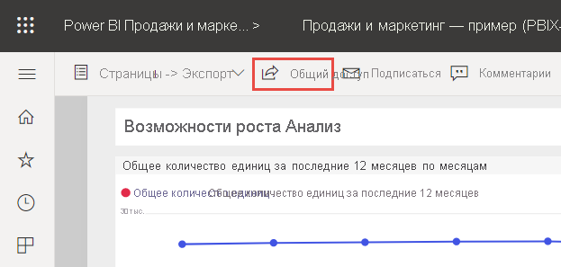
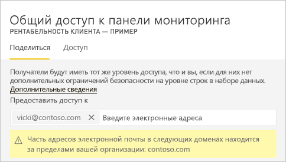
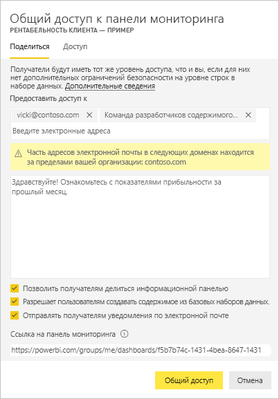
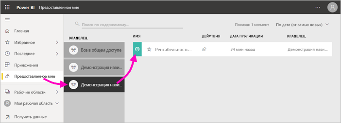
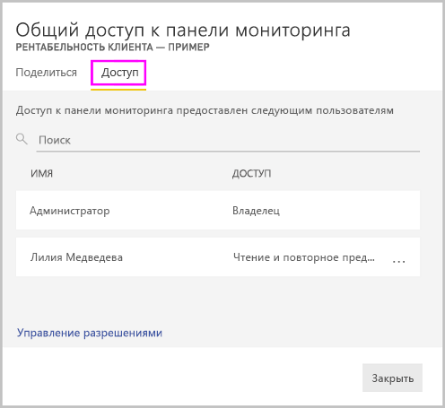
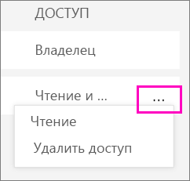
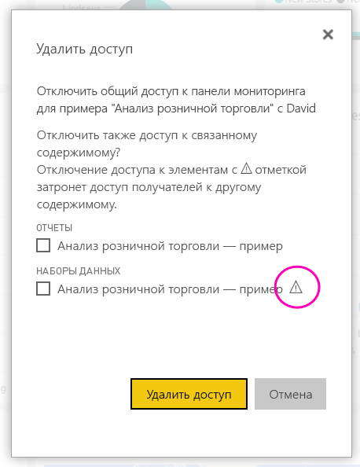

# Предоставление общего доступа коллегам и другим пользователям к панелям мониторинга и отчетам Power BI
*Общий доступ* — это самый простой способ представления пользователям доступа к панелям мониторинга и отчетам в службе Power BI. Вы можете предоставлять общий доступ пользователям в своей организации или за ее пределами.

Когда вы предоставляете другим пользователям общий доступ к панели мониторинга или отчету, они могут просматривать эти панели мониторинга и отчеты и взаимодействовать с ними, но не изменять их. Они видят на панелях мониторинга и в отчетах те же данные, что и вы, и получают доступ ко всему базовому набору данных при условии, что к нему не применяется защита на уровне строк (RLS).  Коллеги, которым вы предоставляете общий доступ, также могут, с вашего разрешения, предоставлять общий доступ своим коллегам. Пользователи извне вашей организации могут просматривать отчет или панель мониторинга и взаимодействовать с ними, но не могут предоставлять к ним доступ. 

Вы можете предоставлять общий доступ к панелям мониторинга и отчетам из множества расположений в службе Power BI — "Избранное", "Недавние", "Моя рабочая область". Вы также можете предоставлять доступ из других рабочих областей, в которых у вас есть [роль "Администратор", "Член" или "Участник"](service-new-workspaces.md#roles-in-the-new-workspaces). Вы также можете также настроить отображение панелей мониторинга и отчетов в панели "Мне предоставлен доступ", если это разрешено владельцем. 

В службе Power BI доступны и другие способы для совместной работы и обмена данными из панелей мониторинга и отчетов. Чтобы определить оптимальный для вас способ, см. статью [Способы совместной работы и обмена данными в Power BI](service-how-to-collaborate-distribute-dashboards-reports.md). 

Независимо от того, где вы предоставляете общий доступ к своему содержимому, внутри или за пределами вашей организации, вам требуется [лицензия Power BI Pro](../fundamentals/service-features-license-type.md). Получателям содержимого также требуются лицензии Power BI Pro, если только содержимое не находится в [емкости Premium](../admin/service-premium-what-is.md). 

Вы не можете *предоставлять общий доступ* непосредственно из Power BI Desktop. [Отчеты из Power BI Desktop публикуются](../create-reports/desktop-upload-desktop-files.md) в службу Power BI. Однако вы можете [предоставлять общий доступ к панели мониторинга из мобильных приложений Power BI](../consumer/mobile/mobile-share-dashboard-from-the-mobile-apps.md).  

## Предоставление общего доступа к панели мониторинга или отчету

1. В списке панелей мониторинга или отчетов либо на открытой панели мониторинга или в отчете выберите **Поделиться** :::image type="icon" source="../media/power-bi-share-icon.png" border="false":::.

2. В поле сверху введите адреса электронной почты сотрудников, групп рассылки или групп безопасности. Доступ для динамических списков рассылки предоставить нельзя. 
   
   Предоставлять доступ можно и пользователям из сторонних организаций, но при этом отобразится предупреждение. См. дополнительные сведения о [предоставлении совместного доступа за пределами организации](#share-a-dashboard-or-report-outside-your-organization) в этой статье.
   
    
 
   >[!NOTE]
   >Поле ввода поддерживает не более 100 отдельных пользователей или групп. Если вам требуется больше пользователей, см. раздел [Предоставление общего доступа более чем 100 отдельным пользователям](#share-with-more-than-100-separate-users) в этой статье.

3. При необходимости добавьте сообщение. Это необязательно.
4. Чтобы разрешить сотрудникам также предоставлять общий доступ к вашему содержимому, установите флажок **Позволить получателям делиться информационной панелью/Разрешить получателям делиться отчетом**.
   
   Предоставление другим пользователям разрешения на предоставление общего доступа называется *повторным общим доступом*. Если вы предоставите такую возможность своим сотрудникам, они повторно предоставят общий доступ из службы Power BI и мобильных приложений или отправят приглашение другим пользователям в организации. Срок действия приглашения истекает через один месяц. Пользователи за пределами организации не могут осуществлять повторное предоставление для общего доступа. Как владелец содержимого, вы можете отключить повторный общий доступ или отдельно отозвать права доступа. См. раздел [Отключение или изменение общего доступа](#stop-or-change-sharing) в этой статье.

5. Если выбрать **Разрешить пользователям создавать новое содержимое с помощью базовых наборов данных**, они смогут создавать собственные отчеты в других рабочих областях на основе набора данных для этой панели мониторинга. См. дополнительные сведения о [создании отчетов на основе наборов данных из разных рабочих областей](../connect-data/service-datasets-discover-across-workspaces.md).

1. Выберите **Общий доступ**.
   
     
   
   Power BI отправляет приглашение по электронной почте со ссылкой на общее содержимое отдельным пользователям, а не группам. После отправки вы увидите уведомление об **успешном завершении операции**. 
   
   Когда получатели в организации переходят по ссылке, Power BI добавляет панель мониторинга или отчет на страницу списка **Мне предоставлен доступ**. Выбрав ваше имя, получатели могут просмотреть все содержимое, которым вы поделились с ними. 
   
   
   
   Если получатели за пределами организации щелкнут ссылку, они увидят панель мониторинга или отчет, но не на обычном портале Power BI. См. дополнительные сведения о [совместном использовании с пользователями за пределами вашей организации](#share-a-dashboard-or-report-outside-your-organization) в этой статье.

## Просмотр пользователей с доступом к панели мониторинга или отчету
Иногда необходимо просмотреть список пользователей, которым вы предоставили общий доступ, и узнать, кому они предоставили общий доступ к этому содержимому.

1. В списке панелей мониторинга и отчетов либо на конкретной панели мониторинга или в отчете выберите **Поделиться** :::image type="icon" source="../media/power-bi-share-icon.png" border="false":::. 
2. В диалоговом окне **Общий доступ к панели мониторинга** или **Общий доступ к отчету** выберите **Доступ**.
   
    

    Пользователь за пределами организации обозначается как **Гость**.

    В этом представлении можно [отключить или изменить разрешения общего доступа](#stop-or-change-sharing). 

## Совместное использование панели мониторинга или отчета с пользователями за пределами вашей организации
Когда вы предоставляете общий доступ пользователям не из вашей организации, они получают сообщение электронной почты со ссылкой на общую панель мониторинга или отчет. Чтобы увидеть предоставленный вами элемент, они должны войти в Power BI. Если у них нет лицензии Power BI Pro, они могут зарегистрироваться для ее получения, перейдя по ссылке.

После входа пользователи увидят общую панель мониторинга или отчет в отдельном окне браузера, а не на портале Power BI, как обычно. Для будущего доступа к этой панели мониторинга или отчету они должны добавить ссылку в закладки.

Пользователи не могут изменять какое-либо содержимое этой информационной панели или отчета. Они могут взаимодействовать с диаграммами, изменять фильтры или срезы, но не могут сохранять изменения. 

Просматривать общую панель мониторинга или отчет могут только непосредственные получатели. Например, если вы отправили сообщение электронной почты по адресу Vicki@contoso.com, панель мониторинга будет отображаться только для пользователя Vicki. Никто другой не сможет просмотреть эту панель мониторинга, даже если пользователь Vicki перенаправит им ссылку. Для доступа к панели мониторинга пользователю Vicki нужно будет использовать тот же самый адрес электронной почты. Доступ с какого-либо другого адреса не предоставляется.

Пользователи за пределами организации не смогут просматривать никакие данные, если для локальных табличных моделей Analysis Services реализована безопасность на уровне ролей или строк.

Чтобы предоставить доступ группе, в которой есть пользователи с внешними адресами электронной почты, используйте группу безопасности, а не группу рассылки. Пользователи с внешними адресами в группе рассылки не видят содержимое, к которому вы предоставили общий доступ, если только они не являются пользователями-гостями Azure Active Directory (Azure AD) B2B. Дополнительные сведения о [пользователях-гостях Azure AD B2B](../admin/service-admin-azure-ad-b2b.md).

Если отправить ссылку из мобильного приложения Power BI пользователям за пределами организации, при переходе по ссылке панель мониторинга открывается в браузере, а не в мобильном приложении Power BI.

### Разрешение изменять содержимое внешним пользователям

Администратор Power BI может разрешить внешним гостевым пользователям изменять и контролировать содержимое в вашей организации. В этом случае доступ для внешних пользователей не будет ограничен только использованием данных. Они смогут изменять содержимое в организации и управлять им. См. дополнительные сведения о [предоставлении содержимого Power BI внешним гостевым пользователям с помощью Azure AD B2B](../admin/service-admin-azure-ad-b2b.md).

## Предоставление общего доступа более чем 100 отдельным пользователям

Действие предоставления общего доступа выполняется не более чем для 100 пользователей или групп за раз. При этом к одному элементу можно предоставить доступ более чем 500 пользователям. Примеры, как это сделать:

- Предоставьте общий доступ несколько раз, указывая пользователей по отдельности.
- Предоставьте общий доступ группе, которая включает всех нужных пользователей. 
- Создайте отчет или панель мониторинга в рабочей области, а затем создайте из нее приложение. Вы можете предоставить общий доступ к приложению многим другим пользователям. См. дополнительные сведения о [публикации приложений в Power BI](service-create-distribute-apps.md).

## Отключение или изменение общего доступа
Только владелец панели мониторинга или отчета может включить и выключить повторный общий доступ.

### Если вы еще не отправили приглашение на совместное использование
* Снимите флажок **Позволить получателям делиться информационной панелью/Разрешить получателям делиться отчетом** в нижней части приглашения, до того как отправите его.

### Если вы уже предоставили общий доступ к панели мониторинга или отчету
1. В списке панелей мониторинга и отчетов либо на конкретной панели мониторинга или в отчете выберите **Поделиться** :::image type="icon" source="../media/power-bi-share-icon.png" border="false":::. 
2. В диалоговом окне **Общий доступ к панели мониторинга** или **Общий доступ к отчету** выберите **Доступ**.
   
    
3. Нажмите кнопку с многоточием ( **...** ) рядом с элементом **Чтение и повторное предоставление общего доступа** и выберите один из следующих вариантов:
   
   
   
   * Выберите **Чтение**, чтобы запретить этому пользователю предоставлять общий доступ другим сотрудникам.
   * **Удалите доступ**, чтобы запретить этому пользователю просматривать общее содержимое.

4. В диалоговом окне **Удаление доступа** укажите, хотите ли вы также удалить доступ к связанному содержимому, например к отчетам и наборам данных. Если вы удаляете элементы со значком предупреждения , рекомендуем также удалить связанное содержимое. В противном случае оно будет отображаться некорректно.

    

## Ограничения и рекомендации
Ниже приведены важные замечания о совместном доступе к панелям мониторинга и отчетам.

* При совместном использовании панели мониторинга вместе с коллегами вы используете совместно и базовый набор данных. Ваши коллеги получают доступ ко всему набору данных, если только их доступ не ограничивает [защита на уровне строк (RLS)](../admin/service-admin-rls.md). Авторы отчетов могут использовать возможности настройки пользовательского интерфейса при просмотре отчетов или взаимодействии с ними, например скрывать столбцы, ограничивать действия с визуальными элементами и т. д. Эти настраиваемые возможности не ограничивают данные, которые могут быть доступны пользователям. Используйте [безопасность на уровне строк (RLS)](../admin/service-admin-rls.md) в наборе данных, чтобы учетные данные каждого пользователя могли определять, к каким данным они имеют доступ.
* Все пользователи, которым предоставлен общий доступ, могут просматривать панель мониторинга и взаимодействовать со связанными отчетами в [режиме чтения](../consumer/end-user-reading-view.md#reading-view). В общем случае они не могут создавать отчеты или сохранять изменения в существующих отчетах. Однако если выбрать **Разрешать пользователям создавать содержимое из базовых наборов данных**, они смогут создавать в других рабочих областях собственные отчеты на основе набора данных, используемого в текущем отчете или панели мониторинга.
* Они не смогут просматривать или скачивать этот набор данных, но смогут получить прямой доступ к нему с помощью функции "Анализ в Excel". Администратор может ограничить возможность использовать функцию "Анализ в Excel" для всех пользователей в группе. Тем не менее это ограничение будет действовать для всех членов группы и для всех рабочих областей, к которым принадлежит группа.
* Любой пользователь может [обновить данные](../connect-data/refresh-data.md) вручную.
* При использовании Microsoft 365 для работы с электронной почтой общий доступ можно предоставить членам группы рассылки, введя адрес электронной почты, связанный с группой рассылки.
* Сотрудники с тем же доменом электронной почты, что и у вас, и сотрудники, домен которых отличается, но зарегистрирован в том же клиенте, могут предоставлять общий доступ к панели мониторинга. Например, предположим, что домены contoso.com и contoso2.com зарегистрированы в одном клиенте, а ваш адрес электронной почты — konrads@contoso.com. И ravali@contoso.com, и gustav@contoso2.com могут предоставлять общий доступ к вашей панели мониторинга при условии, что вы дали им на это разрешение.
* Если у сотрудников уже есть доступ к определенной панели мониторинга или отчету, вы можете отправить им прямую ссылку, скопировав URL-адрес на панели мониторинга или в отчете. Например: `https://powerbi.com/dashboards/g12466b5-a452-4e55-8634-xxxxxxxxxxxx`.
* Аналогично, если ваши коллеги уже имеют доступ к определенной панели мониторинга, вы можете [отправить им прямую ссылку на базовый отчет](service-share-reports.md). 

## Дальнейшие действия

- [Как предоставить общий доступ к панелям мониторинга, отчетам и плиткам?](service-how-to-collaborate-distribute-dashboards-reports.md)
- [Устранение неполадок общего доступа к панелям мониторинга и отчетам](service-troubleshoot-sharing.md)
- [Запрос или предоставление доступа к общим панелям мониторинга и отчетам](service-request-access.md)
- [Совместное использование отфильтрованного отчета Power BI](service-share-reports.md)
- Вопросы? [Попробуйте задать их в сообществе Power BI](https://community.powerbi.com/)
