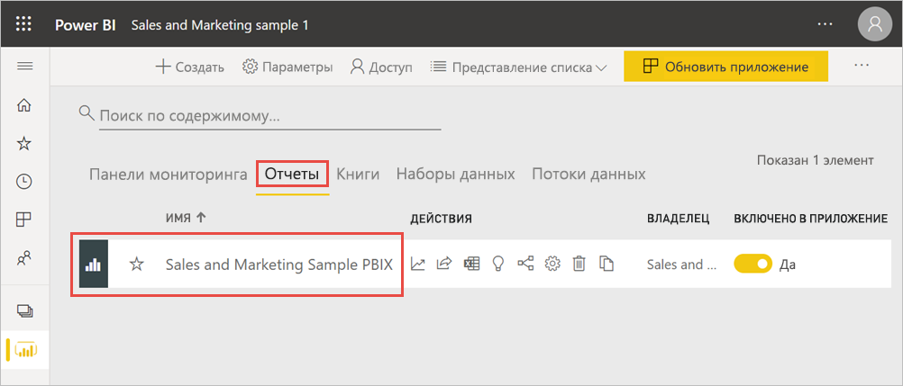
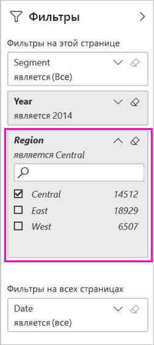
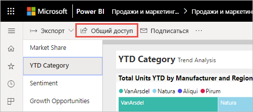
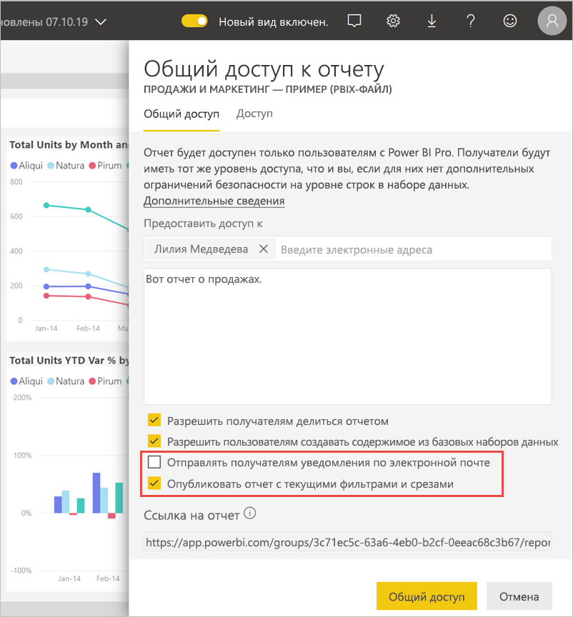
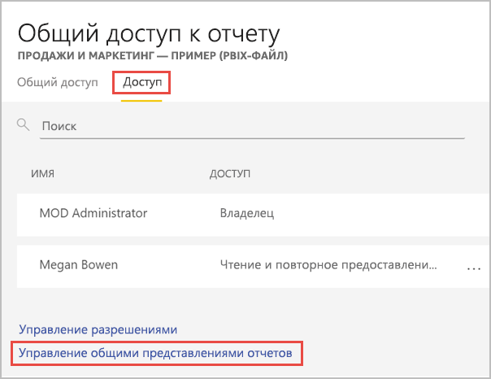
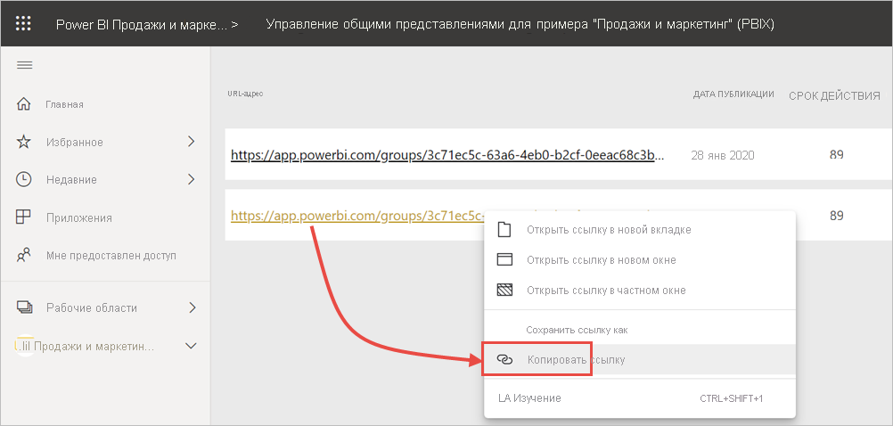

# Фильтрация и совместное использование отчета Power BI
Используя *Общий доступ*, вы можете предоставить нескольким пользователям доступ к информационным панелям и отчетам. Что делать, если необходимо совместно использовать отфильтрованную версию отчета? Возможно, вы хотите, чтобы в отчете отображались данные только для определенного города, определенного продавца или за определенный год. В этой статье объясняется, как выполнить фильтрацию отчета и совместно использовать отфильтрованную версию отчета. Другим способом совместного использования отфильтрованного отчета является [добавление параметров запроса в URL-адрес отчета](service-url-filters.md). В обоих случаях фильтр применяется к отчету во время первого открытия отчета получателями. Они могут отключить фильтр в отчете.

В Power BI также доступны [другие способы совместной работы с отчетами и их распространения](service-how-to-collaborate-distribute-dashboards-reports.md). Чтобы предоставить общий доступ, вам и получателям содержимого требуется [лицензия Power BI Pro](../fundamentals/service-features-license-type.md) либо же содержимое должно находиться в [емкости Premium](../admin/service-premium-what-is.md). 

## Повторение с демонстрационными данными

В этой статье используется пример шаблонного приложения "Маркетинг и продажи". Итак, приступим. 

1. Установите [пример шаблонного приложения "Маркетинг и продажи"](https://appsource.microsoft.com/product/power-bi/microsoft-retail-analysis-sample.salesandmarketingsample?tab=Overview).
2. Выберите приложение и нажмите кнопку **Исследовать приложение**.

   

3. Щелкните значок с изображением карандаша, чтобы открыть рабочую область, установленную вместе с приложением.

    

4. В списке содержимого рабочей области выберите **Отчеты**, а затем выберите отчет **Sales and Marketing Sample PBIX** (Продажи и маркетинг — пример (PBIX-файл)).

    

    Теперь можно приступить к работе.

## Установка фильтра в отчете

Откройте отчет в [режиме правки](../consumer/end-user-reading-view.md) и примените фильтр.

В этом примере мы применим фильтр к странице данных за истекший год из примера шаблона приложения "Маркетинг и продажи", чтобы отобразить только те значения, у которых параметру **Region** соответствует значение **Central**. 
 

Сохраните отчет.

## Предоставление общего доступа к отфильтрованному отчету

1. Выберите **Общий доступ**.

   

2. Снимите флажок **Отправлять получателям уведомления по электронной почте**, чтобы можно было отправить отфильтрованную ссылку, выберите **Публикация отчета с текущими фильтрами и срезами**, а затем нажмите кнопку **Поделиться**.

    

4. Выберите **Общий доступ** еще раз.

   

5. Перейдите на вкладку **Доступ**, а затем выберите **Управление общими представлениями отчетов**.

    

6. Щелкните правой кнопкой мыши нужный URL-адрес и выберите команду **Копировать ссылку**.

    

7. При совместном использовании этой ссылки получатели увидят отфильтрованный отчет. 

## Рекомендации и ограничения
Ниже приведены важные замечания о совместном доступе к отчетам.

* Предоставляя кому-то доступ к набору данных путем управления разрешениями, совместного использования отчетов или панелей мониторинга либо публикации приложения, вы предоставляете доступ ко всему набору данных, если только доступ к этому набору данных не ограничивает [безопасность на уровне строк (RLS)](../admin/service-admin-rls.md). Авторы отчетов могут использовать возможности настройки пользовательского интерфейса при просмотре отчетов или взаимодействии с ними, например скрывать столбцы, ограничивать действия с визуальными элементами и т. д. Эти настраиваемые возможности не ограничивают данные, которые могут быть доступны пользователям. Используйте [безопасность на уровне строк (RLS)](../admin/service-admin-rls.md) в наборе данных, чтобы учетные данные каждого пользователя могли определять, к каким данным они имеют доступ.

## Дальнейшие действия
* [Способы совместного использования работы в Power BI](service-how-to-collaborate-distribute-dashboards-reports.md)
* [предоставление общего доступа к панелям мониторинга](service-share-dashboards.md).
* Появились дополнительные вопросы? [Ответы на них см. в сообществе Power BI](https://community.powerbi.com/).
* Хотите оставить отзыв? Поделитесь своими предложениями на [веб-сайте сообщества Power BI](https://community.powerbi.com/).
