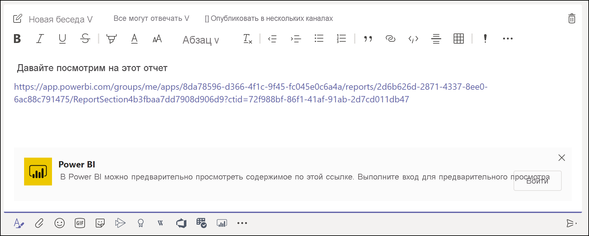
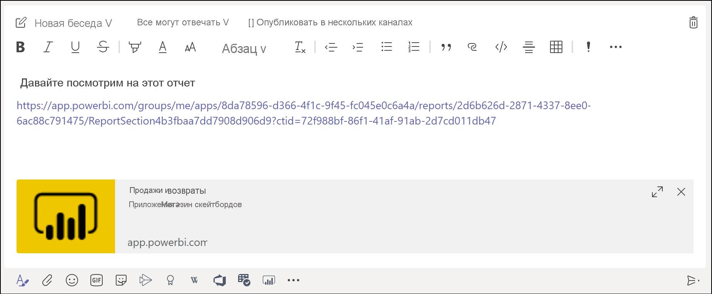
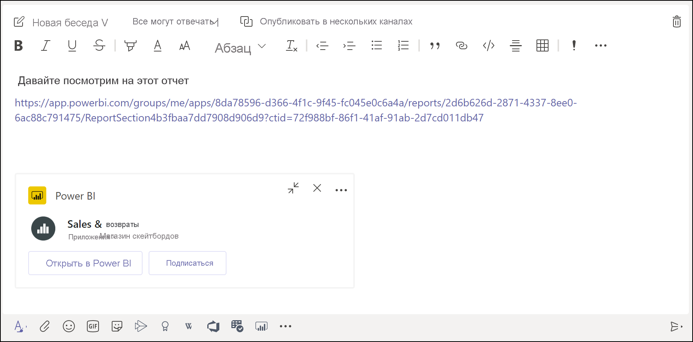

# Получение предварительного просмотра ссылок Power BI в Microsoft Teams

При вставке ссылок на отчеты, панели мониторинга и приложения в поле сообщения Microsoft Teams отображаются краткие сведения об этих ссылках. Предварительный просмотр ссылок доступен в Power BI для следующих элементов:

- Отчеты
- Панели мониторинга
- Приложения

Пользователи должны выполнить вход в службу предварительного просмотра ссылок. Чтобы выйти из нее, щелкните значок **Power BI** в нижней части поля сообщения. Затем выберите **Выход**.

Ознакомьтесь со статьей [Совместная работа в Microsoft Teams с использованием Power BI](service-collaborate-microsoft-teams.md), чтобы получить базовое понимание того, как Power BI и Teams работают вместе, включая требования, которые необходимо выполнить.

## Предварительный просмотр ссылки

Чтобы обеспечить предварительный просмотр содержимого, на которое ведет ссылка, в службе Power BI, выполните указанные ниже действия.

1. Скопируйте ссылку на отчет, панель мониторинга или приложение в службе Power BI. Например, скопируйте ссылку из адресной строки браузера.

1. Вставьте ссылку в поле сообщения Microsoft Teams. Если будет предложено, войдите в службу предварительного просмотра ссылок. Загрузка содержимого для предварительного просмотра может занять несколько секунд.

    

1. После успешного входа отображается базовое содержимое для предварительного просмотра ссылки.

    

1. Чтобы открыть карточку расширенного предварительного просмотра, щелкните значок **Развернуть**.

    

1. На карточке расширенного предварительного просмотра отображаются ссылка и кнопки действий.

    

1. Отправьте сообщение.

## Известные проблемы и ограничения

- Единый вход не поддерживается для службы предварительного просмотра ссылок.
- Предварительный просмотр ссылок не работает в чате собрания и в частных каналах.
- Другие проблемы см. в разделе [Известные проблемы и ограничения](service-collaborate-microsoft-teams.md#known-issues-and-limitations) статьи "Совместная работа в Microsoft Teams".

## Дальнейшие действия

- [Совместная работа в Microsoft Teams с использованием Power BI](service-collaborate-microsoft-teams.md)

Остались вопросы? [Попробуйте задать вопрос в Сообществе Power BI](https://community.powerbi.com/).
