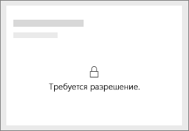
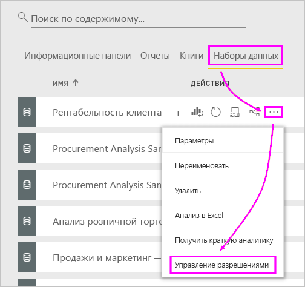
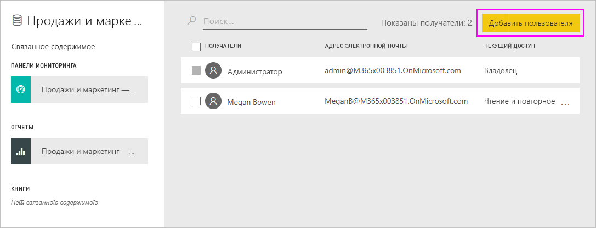
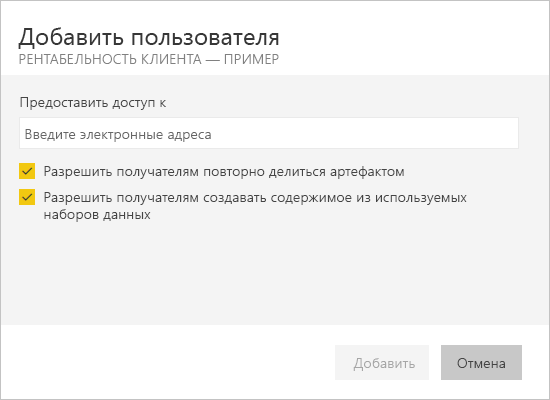
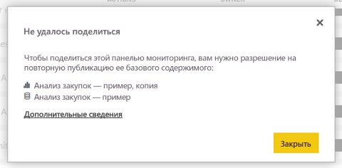

# Устранение неполадок общего доступа к панелям мониторинга и отчетам

В этой статье описаны некоторые распространенные проблемы, которые могут возникнуть при предоставлении или получении доступа к панели мониторинга или отчету. 

## Получатели панели мониторинга видят значок на плитке

Пользователи, которым вы предоставляете доступ, при попытке просмотра отчета могут увидеть плитку блокировки на панели мониторинга или сообщение "Требуется разрешение".

В таком случае, чтобы обеспечить пользовательский доступ к набору данных, вам нужно предоставить соответствующее разрешение.

1. Откройте вкладку **Наборы данных** в списке содержимого.

1. Щелкните многоточие ( **…** ) рядом с набором данных и выберите пункт **Управление разрешениями**.

    

1. Выберите **Добавить пользователя**.

    

1. Введите адреса электронной почты сотрудников, групп рассылки или групп безопасности. Доступ для динамических списков рассылки предоставить нельзя.

    

1. Выберите **Добавить**.

## Не удается предоставить общий доступ к панели мониторинга или отчету

Чтобы предоставить общий доступ к панели мониторинга или отчету, требуется разрешение на повторное предоставление доступа к базовому содержимому, то есть ко всем связанным отчетам и наборам данных. Если появится сообщение о том, что вы не можете предоставить общий доступ, обратитесь к автору отчета, чтобы он разрешил вам повторно предоставлять доступ к этим отчетам и наборам данных.

## У меня нет доступа к панели мониторинга или отчету

Если вы видите сообщение Request access (Запрос доступа) при выборе ссылки на отчет или панель мониторинга, у вас нет разрешений на просмотр. Вам нужно [запросить разрешение на доступ](service-request-access.md).

## Дальнейшие действия

- [Предоставление общего доступа коллегам и другим пользователям к панелям мониторинга и отчетам Power BI](service-share-dashboards.md)
- [Как предоставить общий доступ к панелям мониторинга, отчетам и плиткам?](service-how-to-collaborate-distribute-dashboards-reports.md)
-  [Совместное использование отфильтрованного отчета Power BI](service-share-reports.md)
- Вопросы? [Попробуйте задать их в сообществе Power BI](https://community.powerbi.com/)
