# Обновление классических рабочих областей до новых рабочих областей в Power BI

В этой статье объясняется, как обновить классическую рабочую область или *перенести* ее в новый интерфейс рабочей области. Обновить можно любую классическую рабочую область. Новые рабочие области предусматривают более детализированные роли, что позволяет лучше управлять доступом к содержимому. Вы также можете более гибко управлять обновленными рабочими областями, так как они значительно слабее связаны с исходной группой Office 365. Узнайте больше [о новом интерфейсе рабочей области](service-new-workspaces.md). 

>[!NOTE]
>Обновление рабочей области доступно в виде общедоступной предварительной версии. 

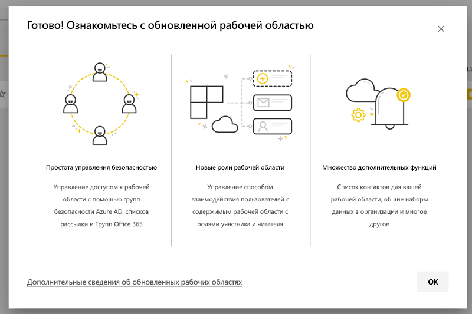

Однако в рабочей области могут возникнуть изменения, о которых нужно знать и к которым нужно подготовиться. Например, пакеты содержимого не поддерживаются в новой рабочей области. Дополнительные сведения см. в разделе [Рекомендации и ограничения обновления](#upgrade-considerations-and-limitations) далее в этой статье.

## Действия, выполняемые после обновления

*После обновления* необходимо выполнить несколько действий. Их лучше спланировать *перед обновлением*.
- Ознакомьтесь со списком доступа и [разрешениями, которые будут действовать после обновления](#permissions-after-upgrade).
- Проверьте [список контактов](#modify-the-contact-list) и убедитесь, что он настроен должным образом.
- Если вы еще не сделали этого, узнайте о [новом интерфейсе рабочей области](service-new-workspaces.md).

## Обновление классической рабочей области

Обновить рабочую область может администратор рабочих областей. В случае классических рабочих областей администратор должен быть владельцем базовой группы Office 365. Чтобы обновить рабочую область, сделайте следующее:

1. В списке содержимого рабочей области выберите **Больше параметров** ( **...** ) > **Изменение этой рабочей области**.

    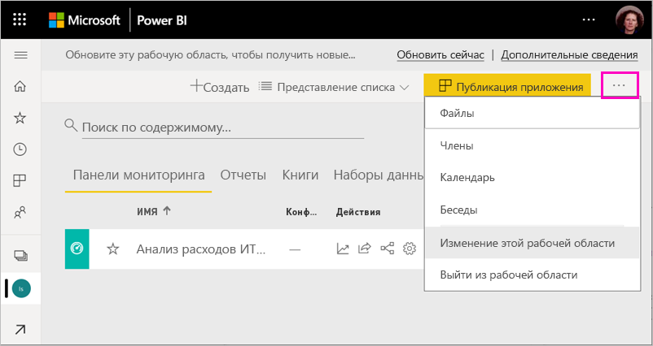

1. Разверните вкладку **Дополнительно** и нажмите кнопку **Обновить сейчас**.

    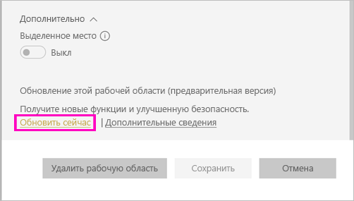

1. Просмотрите сведения в диалоговом окне. Если вы опубликовали или установили пакеты содержимого в рабочей области, вы увидите предупреждения. Когда будете готовы, установите флажок **Все готово к обновлению этой рабочей области**, а затем нажмите кнопку **Обновить**.

    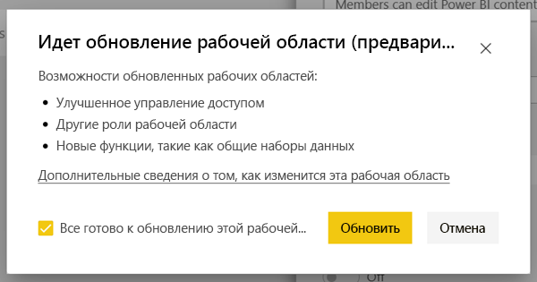

2. Во время обновления отобразится сообщение **Обновление**. Обновление рабочей области обычно занимает меньше минуты.

1. После завершения обновления появится диалоговое окно **Успешное завершение**. Дополнительные сведения см. в статье [Organize work in the new workspaces in Power BI](service-new-workspaces.md) (Организация работы в новых рабочих областях в Power BI).

### Влияние на других пользователей рабочей области

Мы рекомендуем обновлять систему в нерабочее время, когда несколько пользователей активно просматривают или редактируют элементы в рабочей области.

Пользователям, активно использующим рабочую область, предлагается обновить браузер. Пользователям, которые редактируют отчет, предоставляется возможность сохранить его перед обновлением.

## Рекомендации и ограничения обновления

- URL-адреса и идентификаторы рабочей области, ее содержимое и приложение, опубликованное из рабочей области, не меняются. Содержимое из пакетов содержимого, установленных в рабочей области, обрабатывается отдельно. Дополнительные сведения см. в разделе [Пакеты содержимого в ходе обновления](#content-packs-during-upgrade) далее в этой статье.
- Пакеты содержимого не поддерживаются в новой рабочей области. Ознакомьтесь с разделами об [опубликованных](#published-content-packs) и [установленных пакетах содержимого](#installed-content-packs), чтобы узнать о том, как они обрабатываются в ходе обновления. Перед обновлением рекомендуется удалить пакеты содержимого, установленные или опубликованные в рабочей области.
- Обновление рабочей области в Power BI не влияет на группу Office 365 классической рабочей области. Все сайты Teams, SharePoint, почтовые ящики и другие ресурсы, управляемые Office 365, не меняются. После обновления рабочей области Power BI они остаются без изменений. Группа Office 365 продолжает существовать, как и прежде.
- Существуют изменения в обеспечении защиты рабочей области после ее обновления. Дополнительные сведения см. в разделе о [разрешениях рабочей области, действующих после обновления](#permissions-after-upgrade).
- При необходимости можно **вернуться к классической рабочей области**. Но некоторые аспекты рабочей области не восстанавливаются полностью до исходного состояния. Если вы начнете использовать функции, работающие только в новой рабочей области, вы не сможете откатить изменения. Вы можете вернуться к прежней рабочей области в течение 30 дней после обновления.

## Разрешения, действующие после обновления

Щелкните пункт **Доступ** в строке меню в верхней части списка содержимого рабочей области, чтобы просмотреть разрешения после обновления.

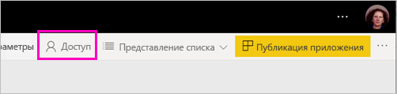

Каждый владелец группы Office 365 добавляется по отдельности к роли администратора обновленной рабочей области. Сама группа Office 365 добавляется в роль рабочей области. Роль, в которую она добавляется, зависит от того, в каком режиме доступна классическая рабочая область: *только для чтения* или *чтения и записи*.

- Если для рабочей области выбран параметр **Участники могут редактировать содержимое Power BI**, после обновления группа Office 365 добавляется в список доступа к рабочей области с ролью **Участник**.
- Если для рабочей области выбран параметр **Members can only read Power BI content** (Участники могут только читать содержимое Power BI), после обновления группа Office 365 добавляется в список доступа к рабочей области с ролью **Читатель**.

Так как группе Office 365 назначается роль в рабочей области, любой пользователь, добавленный в эту группу после обновления, получит эту роль в рабочей области. Но в случае добавления новых владельцев в группу Office 365 после обновления у них не будет роли администратора рабочей области.

### Различия в ролях до и после обновления

Роли рабочей области отличаются в классической и новой рабочих областях. В новой рабочей области можно предоставлять роли для групп Office 365, групп безопасности и списков рассылки.

- **Участники** могут совместно использовать отдельные элементы и предоставлять доступ ко всей рабочей области через роли участника, автора или читателя.
- **Читатели** могут просматривать только содержимое и не могут экспортировать базовые данные или анализировать в Excel наборы данных рабочей области, если только у них нет разрешения на сборку.

Все пользователи, у которых есть доступ к элементам рабочей области через общий доступ или разрешение приложения, по-прежнему будут иметь доступ к этим элементам. Любой пользователь с доступом к рабочей области также получает доступ к приложению, опубликованному из рабочей области. Эти пользователи не перечислены в списке доступа к приложению.

Рекомендуется оценить, следует ли использовать новую роль участника. После обновления в области "Доступ" можно изменить роль группы Office 365 на "Автор".

После обновления вы можете создать группу безопасности, группу Office 365 или список рассылки для администраторов рабочей области, а не управлять доступом путем назначения ролей отдельным пользователям.

Узнайте больше о [ролях в новых рабочих областях](service-new-workspaces.md#roles-in-the-new-workspaces).

## Лицензирование после обновления

Для доступа к рабочей области пользователям в ролях рабочей области "Администратор", "Участник" или "Автор" требуется лицензия Power BI Pro.

Если рабочая область находится в общей емкости, для доступа к этой области пользователям в роли "Читатель" также требуется лицензия Power BI Pro. Но если рабочая область находится в емкости Premium, пользователям с ролью "Читатель" не требуется лицензия Pro для доступа.

## Другие возможности новой рабочей области

Интерфейс новой рабочей области содержит функции, которые отсутствуют в классических рабочих областях. Отличие заключается в том, что можно задать список контактов с другими пользователями, а не только с администраторами или владельцами рабочей области. Схожесть заключается в том, что рабочая область все еще подключена к библиотеке документов SharePoint группы Office 365. 

### Изменение списка контактов

1. Щелкните раздел **Параметры** в строке меню в верхней части списка содержимого рабочей области, чтобы получить доступ к параметрам рабочей области.

    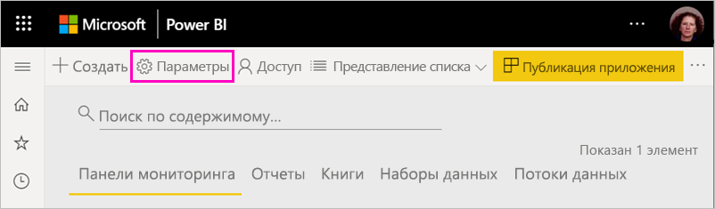

2. В разделе **Дополнительно** **список контактов** рабочей области можно настроить в качестве группы Office 365, из которой была обновлена рабочая область. Вы можете добавить в список контактов дополнительных пользователей или группы или переключиться на администраторов рабочей области.

    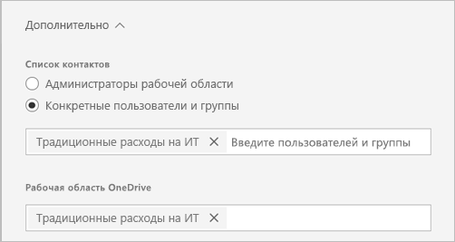

### OneDrive для рабочей области 

После обновления **OneDrive** рабочей области подключается к библиотеке документов SharePoint группы Office 365. Эта библиотека документов отображается как параметр **OneDrive** в разделе **Получить данные > Файлы**. Имейте в виду, что пользователи рабочей области, которые не входят в группу Office 365, могут не иметь разрешения на доступ к этой библиотеке документов.

## Пакеты содержимого в ходе обновления

Новый интерфейс рабочей области не поддерживает пакеты содержимого. Вместо этого используйте приложения и общие наборы данных для распространения содержимого в рабочей области. Рекомендуется удалить опубликованные или установленные пакеты содержимого из рабочей области перед обновлением. Но если при обновлении есть опубликованные или установленные пакеты содержимого, процесс обновления пытается сохранить содержимое, как описано ниже.  После обновления невозможно восстановить пакет содержимого или связь содержимого с пакетом содержимого.

### Опубликованные пакеты содержимого

Пакеты содержимого, опубликованные из рабочей области, удаляются во время обновления. Вы не сможете опубликовать или обновить их после обновления, даже если вернетесь к классической рабочей области. Если другие пользователи установили пакет содержимого в своих рабочих областях, после обновления они увидят в этих областях копию пакета. Дополнительные сведения см. в разделе об **установленных пакетах содержимого**.

### Установленные пакеты содержимого

При обновлении рабочей области или рабочей области, из которой публикуется пакет содержимого, происходят важные изменения в установленных пакетах содержимого. После обновления рабочая область содержит копию пакета содержимого. Он связан с исходным набором данных в исходной рабочей области.

Но есть и важные изменения:

- Содержимое больше не обновляется, если обновляется пакет содержимого.
- URL-адреса и идентификаторы элементов изменяются, и требуется обновление всех закладок или ссылок, которыми вы поделились с другими пользователями.
- Все пользовательские настройки для исходного пакета содержимого рабочей области теряются. Настройки включают в себя подписки, оповещения, личные закладки, постоянные фильтры и список избранного.
- У новых пользователей может не быть доступа к наборам данных, которые были в пакете содержимого. Необходимо обратиться к владельцу набора данных, чтобы обеспечить пользователям рабочей области доступ к данным.

## Возврат к классической рабочей области

У вас есть возможность вернуться к классической рабочей области в течение 30 дней после обновления. Эта возможность восстанавливает сопоставление содержимого рабочей области с исходной группой Office 365. Она доступна в случае, если при использовании нового интерфейса рабочей области ваша организация сталкивается с существенными проблемами. Однако существуют определенные ограничения. Ознакомьтесь с [рекомендациями по возврату к классическим рабочим областям](#considerations-for-switching-back-to-classic) в этой статье.

Чтобы выполнить откат, необходимо быть владельцем группы Office 365, с которой была связана рабочая область, прежде чем она была обновлена. Выполните следующие действия.

1. В списке содержимого рабочей области выберите **Больше параметров** ( **...** ) > **Параметры рабочей области**.

    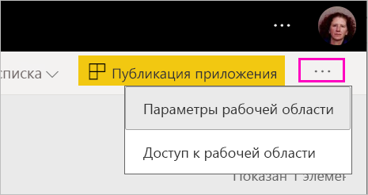

1. Разверните вкладку **Дополнительно** и выберите параметр **Назад к классическому виду**. Если этот параметр недоступен, перейдите к разделу [рекомендаций по переключению к классическому виду](#considerations-for-switching-back-to-classic) в этой статье.

    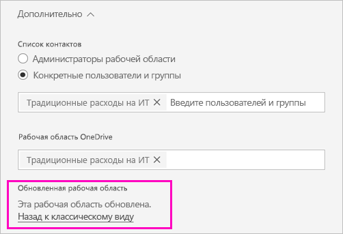

1. Когда вы будете готовы, установите флажок **Я готов вернуться к классическому виду** и выберите параметр **Классический вид**. В этом диалоговом окне могут отображаться предупреждения или блокировки. Если вы столкнулись с этими проблемами, прочитайте [рекомендации по переключению к классическому виду](#considerations-for-switching-back-to-classic) в этой статье.

    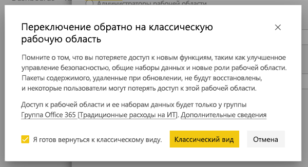

1. После завершения переключения появится диалоговое окно подтверждения.

    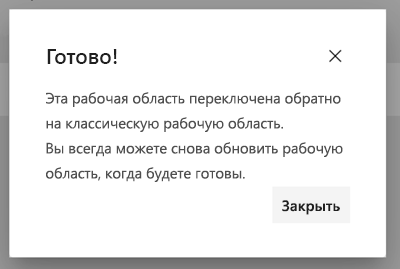

### Рекомендации по переключению к классическому виду

Вы не сможете переключиться обратно в следующих случаях:

- Группа Office 365 была удалена.
- С момента обновления прошло более 30 дней.
- Наборы данных в рабочей области используются отчетами или панелями мониторинга в других рабочих областях. Как это произошло? Допустим, вы опубликовали пакет содержимого из рабочей области перед обновлением и кто-то установил его в другой рабочей области. Сразу после обновления наборы данных используются отчетами и панелями мониторинга в этом пакете содержимого.
- Рабочая область является частью конвейера управления жизненным циклом приложений.
- Рабочая область используется для шаблонов приложений.
- Рабочая область использует возможности больших моделей.
- В рабочей области используется новая функция метрик потребления.

При переключении обратно в классическую рабочую область восстановление точной копии исходной рабочей области не выполняется. Происходят следующие изменения:

- Разрешения для рабочей области задаются группой Office 365, к которой изначально была подключена обновленная рабочая область.
  - Все администраторы группы Office 365 становятся администраторами классической рабочей области.
  - Все участники группы Office 365 становятся участниками классической рабочей области. Если для рабочей области выбран параметр **Members can only read Power BI content** (Участники могут только читать содержимое Power BI), этот параметр будет восстановлен.
  - Все пользователи или группы пользователей, добавленные в рабочую область после завершения обновления (вне группы Office 365), теряют доступ к рабочей области. Добавьте их в группу Office 365, чтобы предоставить им доступ. Обратите внимание, что группы Office 365 не допускают вложение групп безопасности или рассылки в членство.
  - У пользователей, получивших доступ к приложению рабочей области, по-прежнему будет доступ к приложению.
  - У пользователей, получивших доступ к элементам рабочей области через общий доступ, по-прежнему будет доступ к ним.
- Пакеты содержимого, опубликованные из классической рабочей области перед обновлением, не восстанавливаются.
- Пакеты содержимого, установленные в классической рабочей области перед обновлением, также не восстанавливаются.
- Подписки, созданные пользователями рабочей области после обновления, удаляются. Подписки, существовавшие до обновления, продолжат работать должным образом.
- Предупреждения об изменении данных не сохраняются. Они будут удалены.
- Если вы переименовали рабочую область после обновления, имя рабочей области будет восстановлено в соответствии с именем группы Office 365.
- Обновление рабочей области не влияет на выполняемые операции, такие как обновление.

## Управление переходом на новые рабочие области для клиента 

Некоторым организациям требуется переместить большое количество или все рабочие области в новый интерфейс. Средства обновления рабочей области позволяют администраторам рабочей области выполнять обновление. Организации, желающие управлять подобным процессом, могут выполнить следующие действия.

1. Список рабочих областей на портале администрирования Power BI и соответствующий API предоставляют список всех рабочих областей в Power BI. Классические рабочие области отображаются в списке с типом "Группа".
2. Для обновления рабочих областей необходимо работать с отдельными владельцами групп Office 365 или с администратором Office 365. Если вы хотите обновить рабочую область, необходимо стать владельцем группы.

Функция обновления рабочей области не предоставляет средства для массового или программного обновления. Кроме того, новые группы Office 365, созданные в вашей организации, будут по-прежнему отображаться в Power BI. 
   
   
## Известные проблемы

Существует несколько известных проблем, с которыми вы можете столкнуться.
- После обновления пользователи могут увидеть диалоговое окно предупреждения "Сбой загрузки модели". Это сообщение отображается ошибочно, и его можно игнорировать. 
- После обновления некоторые имена рабочих областей отличаются от имен до обновления. В этом случае имя рабочей области либо возвращается к предыдущему имени для соответствующей рабочей области, либо становится пустым. Чтобы устранить эту проблему, переименуйте рабочую область должным образом.
- После обновления рабочей области с установленным пакетом содержимого в ней могут отображаться дополнительные панели мониторинга, которые отсутствовали до обновления. Это происходит в некоторых случаях, когда пакет содержимого не был недавно обновлен. Эти панели мониторинга можно просто удалить.

## Дальнейшие действия

* [Организация работы в новом интерфейсе рабочих областей](service-new-workspaces.md)
* [Создание новых рабочих областей](service-create-the-new-workspaces.md)
* [Create classic workspaces in Power BI](service-create-workspaces.md) (Создание классических рабочих областей в Power BI)
* У вас появились вопросы? [Попробуйте задать вопрос в сообществе Power BI.](https://community.powerbi.com/)
