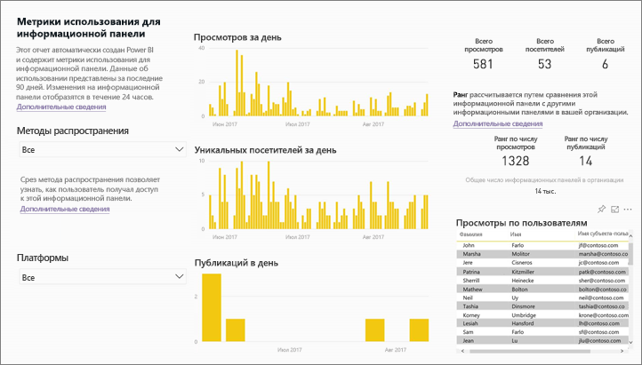
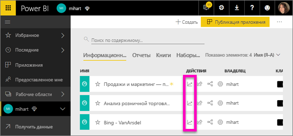
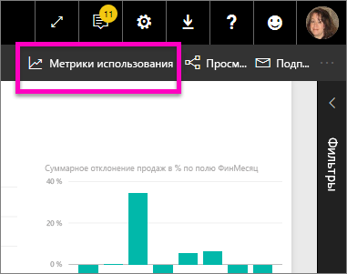
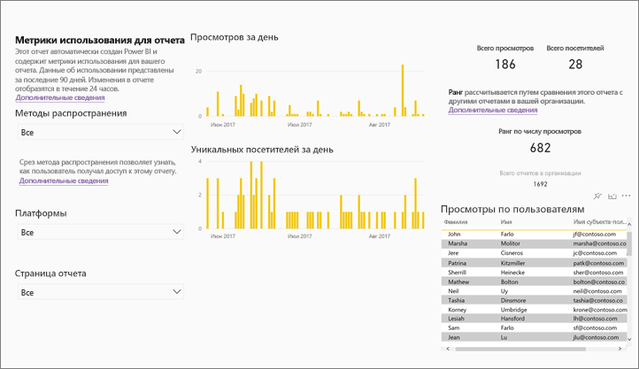
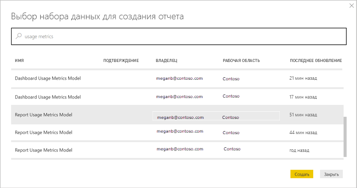
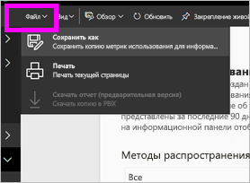
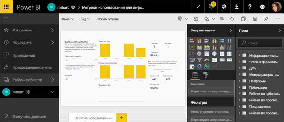
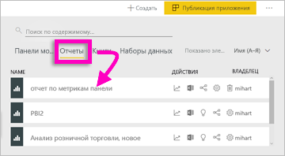
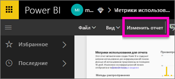
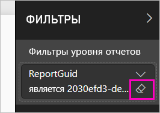

# Мониторинг метрик использования для панелей мониторинга и отчетов Power BI

Когда вы создаете панели мониторинга и отчеты, метрики помогают проанализировать особенности использования этих компонентов. Запустив метрики использования для отчета или панели мониторинга, вы узнаете, как эти панели мониторинга и отчеты используются в организации, а также что, кем и для какой цели используется.  

Отчеты на основе метрик использования доступны только для чтения. Но вы можете скопировать отчет на основе этих метрик. Будет создан стандартный отчет Power BI, который вы сможете изменить. Вы можете также создавать в Power BI Desktop собственные отчеты на основе базового набора данных с метриками использования для всех панелей мониторинга или всех отчетов в рабочей области. Скопированный отчет сначала отображает метрики только для выбранной панели мониторинга или отчета. Вы можете удалить фильтр по умолчанию и получить доступ к базовому набору данных с полным комплектом метрик для выбранной рабочей области. Вы даже сможете просматривать имена отдельных пользователей, если администратор разрешил это.

> [!NOTE]
> Метрики отслеживают использование отчетов, внедренных в SharePoint Online. Но они не отслеживают панели мониторинга и отчеты, внедренные через потоки "учетные данные принадлежат пользователю" и "учетные данные принадлежат приложению". В метриках использования также не отслеживаются отчеты, внедренные через [публикацию в Интернете](service-publish-to-web.md).

## Важность метрик использования

Сведения об использовании содержимого помогут вам оценить закономерности его использования и расставить приоритеты. Показатели использования могут указывать на то, что один из ваших отчетов ежедневно используется большим числом сотрудников, а созданная панель мониторинга вообще не просматривается. Сведения подобного рода являются неоценимыми при перераспределении ресурсов.

Отчеты по метрикам использования можно запускать только в службе Power BI. Однако если вы сохраните такой отчет или закрепите его на панели мониторинга, вы сможете открывать отчет и работать с ним на мобильных устройствах.

## Предварительные требования

- Для запуска отчетов по метрикам использования и просмотра данных требуется лицензия Power BI Pro. Но метрики использования поддерживают запись сведений об использовании для всех пользователей независимо от назначенной им лицензии.
- Чтобы получить метрики использования для конкретной панели мониторинга или отчета, вам нужен доступ на изменение этой панели мониторинга или отчета.
- Администратор Power BI должен включить использование метрик для создателей содержимого. Также администратор Power BI может включить сбор данных о пользователях в метриках использования. Узнайте, [как включить эти возможности на портале администрирования](../admin/service-admin-portal.md#control-usage-metrics). 

## Просмотр отчета о метриках использования

1. Запустите рабочую область, которая содержит панель мониторинга или отчет.
2. В списке содержимого рабочей области, на панели мониторинга или в самом отчете выберите значок для **метрик использования** .

    

    
3. Когда вы делаете это впервые, служба Power BI создает отчет на основе метрик использования и сообщает, когда отчет готов.

    
4. Чтобы увидеть эти результаты, выберите **Просмотр метрик использования**.

    Метрики использования очень полезны при развертывании и поддержке панелей мониторинга и отчетов Power BI. Интересно, какие страницы отчета наиболее полезны и какие из них следует исключить? Выполните срез **по страницам отчета**, чтобы узнать это. Интересно, необходимо ли создавать макет панели мониторинга для мобильного устройства? Срез **по платформам** позволит узнать, сколько пользователей получают доступ к содержимому через мобильные приложения и веб-браузер.

5. Вы также можете навести указатель мыши на визуализацию и выбрать значок булавки, чтобы добавить визуализацию на панель мониторинга. Или выберите **Закрепить активную страницу** в верхней строке меню, чтобы добавить на панель мониторинга всю страницу. С помощью панели мониторинга вам будет удобнее отслеживать показатели использования или делиться ими с коллегами.

    > [!NOTE]
    > Если закрепить на панели мониторинга плитку из отчета на основе метрик использования, вы не сможете добавить эту панель мониторинга в приложение.

### Отчет на основе метрик использования для панели мониторинга

### Отчет на основе метрик использования для отчета

## Отчет на основе метрик использования

Когда вы выбираете **Метрики использования** или соответствующий значок  рядом с панелью мониторинга или отчетом, Power BI создает предварительно подготовленный отчет с метриками использования для этого содержимого за последние 90 дней.  Этот отчет похож на отчеты Power BI, с которыми вы уже знакомы. Вы можете выполнить срез по таким параметрам, как метод получения доступа пользователями, входы через веб-приложение или мобильное приложение и т. д. С улучшением панелей мониторинга и отчетов улучшается и отчет на основе метрик использования, в котором данные обновляются каждый день.  

Отчеты на основе метрик использования не отображаются в списках содержимого, таких как **Недавние**, **Рабочие области**, **Избранное**. Их невозможно добавить в приложение. Если закрепить на панели мониторинга плитку из отчета на основе метрик использования, вы не сможете добавить эту панель мониторинга в приложение.

Чтобы получить дополнительные данные отчета или создать собственные отчеты для базовых наборов данных, вы можете выбрать один из следующих двух методов: 

- Создайте копию отчета в службе Power BI. Подробности см. в разделе [Сохранение копии отчета по метрикам использования](#save-a-copy-of-the-usage-metrics-report) далее в этой статье.
- Подключитесь к набору данных из Power BI Desktop. Для каждой рабочей области набор данных имеет имя "Report Usage Metrics Model" (Модель метрик использования для отчета). Подробнее см. в разделе [Установление динамического подключения в службе Power BI к опубликованному набору данных](../connect-data/desktop-report-lifecycle-datasets.md#establish-a-power-bi-service-live-connection-to-the-published-dataset).

    

## Какие метрики регистрируются?

| Metric | Панель мониторинга | Отчет | Описание |
| --- | --- | --- | --- |
| Срез метода распространения |да |да |Как пользователи получают доступ к содержимому? Доступ к панели мониторинга или отчету можно получить тремя способами: пользователи являются участниками [рабочей области](../consumer/end-user-experience.md), им [предоставлен общий доступ](service-share-dashboards.md) к содержимому или они установили пакет либо приложение содержимого.  Обратите внимание, что представления приложения считаются как "пакет содержимого". |
| Срез платформ |да |да |Пользователи получили доступ к панели мониторинга или отчету из службы Power BI (powerbi.com) или с мобильного устройства? Мобильные устройства включают все наши приложения iOS, Android и Windows. |
| Срез страницы отчета |нет |да |Если отчет содержит более одной страницы, можно разделить отчет по страницам, которые были просмотрены. Если вы видите в списке элемент Blank (Пусто), значит, страница отчета добавлена недавно (фактическое имя новой страницы появится в списке среза в течение 24 часов) или страницы отчета удалены. Параметр Blank (Пусто) охватывает ситуации такого типа. |
| Просмотров за день |да |да |Общее число просмотров за день — просмотром считается загрузка пользователем страницы отчета или панели мониторинга. |
| Уникальных просмотров за день |да |да |Количество *разных* пользователей, которые просматривали панель мониторинга или отчет (на основании учетной записи пользователя AAD). |
| Просмотры по пользователям |да |да |Число просмотров за последние 90 дней по отдельным пользователям. |
| Публикаций в день |да |нет |Сколько раз общий доступ к панели мониторинга предоставлялся другому пользователю или группе. |
| Всего просмотров |да |да |Количество просмотров за последние 90 дней. |
| Всего посетителей |да |да |Количество уникальных посетителей за последние 90 дней. |
| Всего публикаций |да |нет |Сколько раз за последние 90 дней предоставлялся общий доступ к панели мониторинга или отчету. |
| Общее количество в организации |да |да |Количество всех панелей мониторинга и отчетов в организации, которые просматривались по крайней мере один раз за последние 90 дней.  Используется для вычисления ранга. |
| Рейтинг. Всего просмотров |да |да |Общее количество просмотров за последние 90 дней всех панелей мониторинга и отчетов в организации, где ранжируется эта панель мониторинга или отчет. |
| Рейтинг. Всего публикаций |да |нет |Общее количество публикаций за последние 90 дней для всех панелей мониторинга в организации, где ранжируется эта панель мониторинга или отчет. |

## Сохранение копии отчета на основе метрик использования

Используйте действие **Сохранить как**, чтобы преобразовать отчет на основе метрик использования в обычный отчет Power BI, который можно настраивать для конкретных задач. Вы также можете с помощью Power BI Desktop создать настраиваемые отчеты по метрикам использования на основе базового набора данных. Подробнее см. в разделе [Установление динамического подключения в службе Power BI к опубликованному набору данных](../connect-data/desktop-report-lifecycle-datasets.md#establish-a-power-bi-service-live-connection-to-the-published-dataset).

Более того, базовый набор данных включает сведения об использовании для всех панелей мониторинга и отчетов в рабочей области. Это открывает дополнительные возможности. Например, вы можете создать отчет, который сравнивает все панели мониторинга в рабочей области на основе сведений об использовании. Или вы можете создать панель мониторинга на основе метрик использования для приложения Power BI, объединив данные об использовании всего содержимого, опубликованного в этом приложении.  Сведения об удалении фильтра и [просмотре всех метрик использования для рабочей области](#see-all-workspace-usage-metrics) см. ниже в этой статье.

### Создание копии отчета об использовании

Если вы создадите копию предварительно подготовленного отчета об использовании, доступного только для чтения, Power BI создает редактируемую копию этого отчета. На первый взгляд он точно такой же. Но теперь вы сможете открыть отчет в режиме правки, добавить новые визуализации, фильтры и страницы, изменить или удалить имеющиеся визуализации и многое другое. Power BI сохраняет новый отчет в текущей рабочей области.

1. В готовом отчете на основе метрик использования выберите **Файл > Сохранить как**. Power BI сохраняет в текущей рабочей области новый отчет Power BI с возможностью редактирования.

    
2. Откройте отчет в режиме правки и [работайте с ним, как с любым другим отчетом Power BI](../create-reports/service-interact-with-a-report-in-editing-view.md). Например, добавляйте новые страницы и создавайте новые визуализации, добавляйте фильтры, форматируйте шрифты и цвета и т. д.

    
3. Новый отчет сохраняется на вкладке **Отчеты** в текущей рабочей области, а также добавляется в список содержимого **Последние**.

    

## Просмотр *всех* метрик использования в рабочей области

Чтобы просмотреть метрики для всех панелей мониторинга или отчетов в рабочей области, вам нужно удалить фильтр. По умолчанию отчет фильтруется так, чтобы отображать метрики только для панели мониторинга или отчета, на основе которых вы его создали.

1. Щелкните **Изменить отчет**, чтобы открыть доступный для изменения отчет в режиме редактирования.

    
2. На панели "Фильтры" найдите контейнер **Фильтры уровня отчетов** и удалите фильтр, щелкнув значок удаления рядом с **сеткой отчета**.

    

    Теперь ваш отчет отображает метрики для всей рабочей области.

## Элементы администратора Power BI для управления метриками использования

Отчеты на основе метрик использования — это функция, которую глобальный администратор или администратор Power BI может включать или выключать. Администраторы могут управлять доступом отдельных пользователей к метрикам использования. По умолчанию эти сведения **включены** для всех пользователей в организации.

> [!NOTE]
> Только администраторы клиента Power BI могут открывать портал администрирования и изменять параметры. 

По умолчанию данные пользователей включены для метрик использования, а сведения об учетной записи потребителя содержимого включаются в отчет на основе метрик. Если администраторы не хотят включать эту информацию для некоторых или всех пользователей, они могут отключить эту функцию для выбранных групп безопасности или всей организации. В таком случае данные учетных записей будут отображаться в отчете с отметкой *Без имени*.

Блокируя доступ к метрикам использования для всей организации, администраторы могут **удалять все существующее содержимое метрик использования**. Сюда входят все существующие плитки отчетов и панелей мониторинга, созданные с помощью отчетов на основе метрик использования. Этот параметр блокирует доступ к данным метрик использования для всех корпоративных пользователей, которые уже могли работать с ними. Удаление существующего содержимого метрик использования является необратимым.

Подробнее см. раздел [Управление метриками использования](../admin/service-admin-portal.md#control-usage-metrics) в статье о портале администратора. 

## Метрики использования в национальных облаках

Power BI доступен в отдельных национальных облаках. Эти облака обеспечивают те же уровни безопасности, конфиденциальности, соответствия требованиям и прозрачности, что и глобальная версия Power BI. При этом они используют уникальную модель регулирования предоставления услуг, размещения данных, а также доступа к ним и управления ими, основанную на местных нормативных требованиях. Из-за этой уникальной модели для местных нормативов метрики использования недоступны в национальных облаках. Дополнительные сведения см. на странице [национальных облаков](https://powerbi.microsoft.com/clouds/).

## Рекомендации и ограничения

### Несоответствия между журналами аудита и метриками использования

Важно учитывать возможные отличия при сравнении метрик использования и журналов аудита, а также понимать причину их возникновения. *Журналы аудита* собираются с помощью данных из службы Power BI, а *метрики использования* — на стороне клиента. Агрегированное количество действий в журналах аудита может не всегда соответствовать метрикам использования по следующим причинам:

* Метрики использования иногда могут занижать количество действий из-за несогласованности сетевых подключений, блокировщиков рекламы или других проблем, которые могут препятствовать отправке событий от клиента.
* Определенные типы представлений не включены в метрики использования, как описано ранее в этой статье.
* Метрики использования иногда могут завышать количество действий в ситуациях, когда клиент обновляется без необходимости отправлять запрос обратно в службу Power BI.

### Другие рекомендации

Вам следует просмотреть содержимое рабочей области из самой области как минимум один раз. В противном случае данные из представлений приложения не будут учтены в представлениях приложений в отчете о метриках использования. Чтобы разблокировать обработку данных для этого отчета, просто просмотрите содержимое рабочей области по крайней мере один раз.

## Часто задаваемые вопросы

Кроме сведений о возможных различиях между метриками использования и журналами аудита, для пользователей и администраторов могут оказаться полезными следующие вопросы и ответы о метриках использования.

**Вопрос.**    Мне не удается запустить метрики использования для панели мониторинга или отчета.

**Ответ.**    Вы можете просматривать метрики использования, только если являетесь их владельцем или имеете право на их изменение.

**Вопрос.**    Учитывают ли метрики использования представления внедренных панелей мониторинга и отчетов?

**Ответ.**    Сейчас метрики использования не поддерживают запись данных об использовании внедренных панелей мониторинга и отчетов, а также [публикацию в Интернете](service-publish-to-web.md). Для отслеживания использования портала или хост-приложения мы рекомендуем применять существующие платформы для веб-аналитики.

**Вопрос.**    Я не могу запустить метрики использования для содержимого.

**Ответ 1.**    Администраторы могут отключать эту возможность у сотрудников организации.  Обратитесь к администратору, чтобы узнать, так ли это.

**Ответ 2.**    Метрики использования — это компонент Power BI Pro.

**Вопрос.**    Похоже, данные не обновляются. Например, методы распределения не отображаются, страницы отчетов отсутствует и т. д.

**Ответ.**    Обновление данных может занимать до 24 часов.

**Вопрос.**    В рабочей области четыре отчета, но отчет метрик использования отображает только три.

**Ответ.**    Отчет на основе метрик использования включает только отчеты (или панели мониторинга), к которым получали доступ за последние 90 дней.  Если отчет (или панель мониторинга) не отображается, скорее всего, он не использовался более 90 дней.

## Дальнейшие действия

[Администрирование Power BI на портале администрирования](../admin/service-admin-portal.md)

Появились дополнительные вопросы? [Ответы на них см. в сообществе Power BI.](https://community.powerbi.com/)
