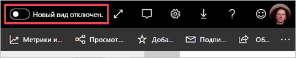
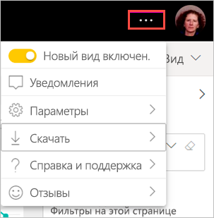

# Согласие на новый интерфейс рабочих областей (предварительная версия)

Рабочие области имеют новый интерфейс, который согласуется с [новым интерфейсом](../consumer/service-new-look.md) службы Power BI. Согласиться на его использование может любой пользователь, работающий со службой Power BI (app.powerbi.com). При включении **нового интерфейса** в черной строке заголовка вы соглашаетесь на использование нового интерфейса для отчетов и рабочих областей. Новый интерфейс может применяться ко всем рабочим областям, как классическим, так и новым.

Ищете сведения о новом интерфейсе в **Power BI Desktop**? См. статью [Использование обновленной ленты в Power BI Desktop](../create-reports/desktop-ribbon.md).

## Возможности нового интерфейса

:::image type="content" source="media/service-workspaces-new-look/power-bi-workspace-new-look-numbered.png" alt-text="Новый интерфейс рабочих областей с номерами выносок для пояснения":::

|число;  |Принципы работы |
|---------|---------|
|    | **Получение данных**. Добавлять содержимое в рабочую область стало проще. Нажмите кнопку **+ Создать**, чтобы подключиться к данным, открыть файл, создать отчет или панель мониторинга либо выполнить иное действие.  |
|   | **Переключатель представлений**. Для просмотра связей между потоками данных, наборами данных, отчетами и панелями мониторинга, а также их связей с другими источниками данных переключайтесь между представлениями **списка** и **происхождения данных**. |
|  | **Поиск в рабочей области**. Ищите любое содержимое в рабочей области в новом поле поиска.  |
|   | **Список и вкладки**. Все содержимое рабочей области представлено в виде плоского списка панелей мониторинга, отчетов, наборов данных и т. д., как в SharePoint. Теперь при открытии рабочей области вы больше не увидите пустую вкладку **Панели мониторинга** и вам не придется гадать, где находится ваше содержимое. Вот новая очередность вкладок.  **Все**: представлено все содержимое (панели мониторинга, отчеты, книги, отчеты с разбивкой на страницы, наборы и потоки данных) рабочей области.  **Содержимое**: здесь собрано все содержимое, созданное для использования (панели мониторинга, отчеты, книги и отчеты с разбивкой на страницы) в рабочей области.  **Наборы данных + потоки данных**: здесь собраны все наборы и потоки данных в рабочей области для упрощения управления данными. |
|  | **Фильтры**. В рабочих областях с сотнями артефактов можно фильтровать содержимое в области "Фильтры". Примененный фильтр отображается вверху списка содержимого. |

**Быстрые действия**. При наведении указателя мыши на содержимое в списке отображаются наиболее часто выполняемые действия для данного элемента. Дополнительные действия доступны в меню **Дополнительные параметры** (...).

:::image type="content" source="media/service-workspaces-new-look/power-bi-workspace-new-look-quick-actions.png" alt-text="Быстрые действия в новой рабочей области":::

## Согласие на новый внешний вид

Любой пользователь службы Power BI может согласиться на использование нового внешнего вида. Просто переключите параметр с **Новый вид отключен** на **Новый вид включен**.

Если вам нужно вернуться к старому виду, просто переведите переключатель  в положение **отключен**. Если вы не видите переключатель, выберите меню с многоточием в правом верхнем углу.

## Дальнейшие действия

- [Использование обновленной ленты в Power BI Desktop](../create-reports/desktop-ribbon.md)
- ["Новый внешний вид" службы Power BI](../consumer/service-new-look.md)
- У вас появились вопросы? [Ответы на них см. в сообществе Power BI.](https://community.powerbi.com/)
