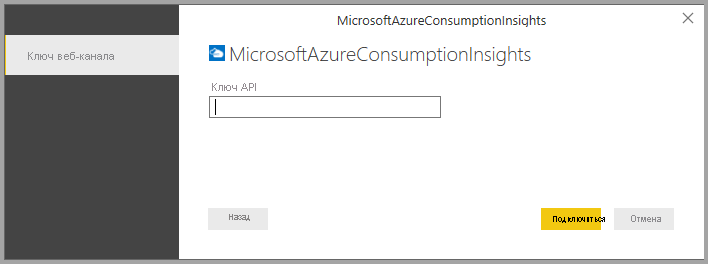
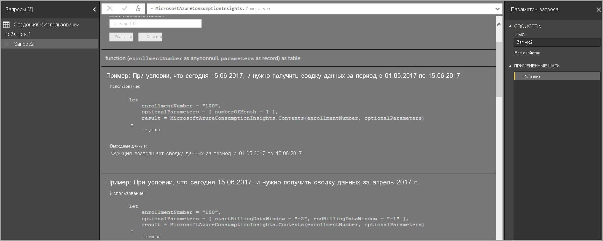

# Подключение к данным Azure Consumption Insights в Power BI Desktop

С помощью приложения Power BI Desktop можно подключаться к Azure и получать подробные данные по использованию службы Azure в вашей организации. На основе этих данных можно создавать пользовательские отчеты и меры, чтобы лучше понимать и анализировать затраты в Azure.

> [!NOTE]
> Microsoft Azure Consumption Insights (бета-версия) предоставляется в режиме ограниченной поддержки. Для работы с новыми функциями используйте [соединитель "Управление затратами Azure" в Power BI](desktop-connect-azure-cost-management.md).

## Подключение с помощью Azure Consumption Insights

Azure Consumption Insights позволяет подключиться к учетным записям выставления счетов для Соглашения Azure Enterprise.

В этом разделе вы узнаете, как получить необходимые данные для миграции с помощью соединителя Azure Enterprise. В нем также приводится сопоставление *столбцов со сведениями об использовании* в API **ACI** (Azure Consumption Insights).

Чтобы успешно использовать соединитель **Azure Consumption Insights**, нужен доступ к функциям Enterprise на портале Azure.

Чтобы использовать соединитель **Azure Consumption Insights** в **Power BI Desktop**, выполните указанные ниже действия. 

1. Н вкладке **Главная** ленты нажмите кнопку **Получить данные**.

1. Слева выберите категорию **Веб-службы**.  

1. Выберите **Microsoft Azure Consumption Insights (бета-версия)** . 

1. Нажмите кнопку **Подключиться**.

   

   В открывшемся диалоговом окне введите свой **номер регистрации в Azure**.

   

   * Номер регистрации можно найти на портале [Azure Enterprise Portal](https://ea.azure.com) в расположении, которое показано на следующем рисунке:

  

   Эта версия соединителя поддерживает только корпоративные регистрации с https://ea.azure.com. Регистрации из Китая в настоящее время не поддерживаются.

   Теперь введите свой *ключ доступа* для подключения.

   

   * Ключ доступа для регистрации можно найти на портале [Azure Enterprise Portal](https://ea.azure.com).

  

Когда вы введете *ключ доступа* и нажмете кнопку **Подключиться**, откроется окно **навигатора** с девятью доступными таблицами.

| Таблица        | Описание |
|------------- | -------------------------------------------------------------|
| **Бюджеты** | Сведения о бюджете для просмотра фактических расходов или данных по использованию относительно существующих целевых показателей бюджета. |
| **MarketPlace** | Сведения о плате за использование Azure Marketplace. |
| **PriceSheets** | Применимые тарифы для каждой регистрации. |
| **RICharges** | Сведения о плате за зарезервированные экземпляры за последние 24 месяца. |
| **RIRecommendations_Single** | Рекомендации по покупкам зарезервированных экземпляров на основе тенденций использования для одной подписки за последние 7, 30 или 60 дней. |
| **RIRecommendations_Shared** | Рекомендации по покупкам зарезервированных экземпляров на основе тенденций использования для всех подписок за последние 7, 30 или 60 дней. |
| **RIUsage** | Сведения об использовании существующих зарезервированных экземпляров за последний месяц. |
| **Summaries** | Ежемесячная сводка по балансам, новым покупкам, расходам на службу Azure Marketplace, корректировкам и плате за превышение использования. |
| **UsageDetails** | Статистика израсходованных объемов и предполагаемых расходов для регистрации. |

Чтобы просмотреть сведения, установите флажок возле соответствующей таблицы. Чтобы выбрать одну или несколько таблиц, установите флажок рядом с именем таблицы, а затем нажмите кнопку **Загрузить**.

> [!NOTE]
> Таблицы *Сводка* и *Прайс-лист* доступны только для уровня регистрации ключа API. По умолчанию таблицы *Использование* и *Прайс-лист* содержат данные за текущий месяц. Данные в таблицах *Сводка* и *MarketPlace* не ограничены текущим месяцем.
>
>

После нажатия кнопки **Загрузить** данные загружаются в **Power BI Desktop**.

Когда выбранные данные будут загружены, соответствующие таблицы и поля отобразятся в области **Поля**.

## Использование Azure Consumption Insights
Чтобы использовать соединитель **Azure Consumption Insights**, нужно получить доступ к функциям Enterprise на портале Azure.

После успешной загрузки данных с помощью соединителя **Azure Consumption Insights** вы можете создать собственные пользовательские меры и столбцы с помощью **редактора запросов**. Вы также можете создать визуальные элементы, отчеты и панели мониторинга для общего доступа в **службе Power BI**.

С помощью пустого запроса можно извлечь пример коллекции пользовательских запросов Azure. Это можно сделать двумя способами. 

В **Power BI Desktop**: 

1. Выберите вкладку **Главная** ленты. 
2. Выберите **Получить данные** > **Пустой запрос**. 

В **редакторе запросов**: 

1. Щелкните правой кнопкой мыши в левой области **Запросы**. 
2. В появившемся меню выберите пункты **Новый запрос > Пустой запрос**.

В **строке формул** введите следующее:

    = MicrosoftAzureConsumptionInsights.Contents

На рисунке ниже показана открывающаяся коллекция примеров.

При работе с отчетами и создании запросов можно использовать указанные ниже параметры.

* Чтобы определить число месяцев начиная с текущей даты, используйте параметр *numberOfMonth*.
  * Используйте значение от 1 до 36. Оно представляет число месяцев с текущей даты, данные за которые требуется импортировать. Рекомендуем выбирать не более 12 месяцев данных. Это позволит не превысить пороговые значения ограничений импорта и допустимого объема данных для запросов в Power BI.
* Чтобы определить число месяцев в окне времени журнала, используйте параметры *startBillingDataWindow* и *endBillingDataWindow*.
* Не используйте параметр *numberOfMonth* вместе с параметрами *startBillingDataWindow* и *endBillingDataWindow*.

## Миграция из соединителя Azure Enterprise

Некоторые пользователи создавали визуальные элементы с помощью *соединителя Azure Enterprise (бета-версия)* . Рано или поздно он будет заменен соединителем **Azure Consumption Insights**. Этот новый соединитель содержит следующие функции и усовершенствования:

* Дополнительные источники данных для таблиц *Сводка баланса* и *Покупки Marketplace*.
* Новые и расширенные параметры, такие как *startBillingDataWindow* и *endBillingDataWindow*.
* Улучшенные производительность и скорость реагирования.

Ниже приводятся инструкции по переходу на соединитель **Azure Consumption Insights**. При их выполнении созданные вами настраиваемые панели мониторинга и отчеты сохраняются.

### Шаг 1. Подключение к Azure с помощью нового соединителя
Сначала нужно использовать соединитель **Azure Consumption Insights**, который был подробно описан ранее в этой статье. В **Power BI Desktop** на ленте **Главная** последовательно выберите элементы **Получение данных > Пустой запрос**.

### Шаг 2. Создание запроса в Расширенном редакторе
В **редакторе запросов** на вкладке **Главная** ленты в разделе **Запрос** выберите **Расширенный редактор**. В открывшемся окне **Расширенный редактор** введите следующий запрос:

    let    
        enrollmentNumber = "100",
        optionalParameters = [ numberOfMonth = 6, dataType="DetailCharges" ],
        data = MicrosoftAzureConsumptionInsights.Contents(enrollmentNumber, optionalParameters)   
    in     
        data

Значение *enrollmentNumber* нужно заменить на собственный номер регистрации. Его можно найти на [портале Azure Enterprise](https://ea.azure.com). Параметр *numberOfMonth* — это число месяцев начиная с текущей даты, данные за которые вы хотите просмотреть. Чтобы просмотреть данные за текущий месяц, укажите ноль (0).

Когда вы нажмете кнопку **Готово** в окне **Расширенный редактор**, предварительный просмотр обновится и появятся данные за месяцы, которые вы указали в таблице. Выберите **Закрыть и применить**.

### Шаг 3. Перемещение мер и настраиваемых столбцов в новый отчет
Теперь необходимо переместить все созданные пользовательские столбцы и меры в новую таблицу со сведениями. Это делается следующим образом.

1. Откройте Блокнот (или другой текстовый редактор).
2. Выберите меру, которую нужно переместить, скопируйте текст из поля *Формула* и вставьте его в Блокнот.

   
3. Замените имя *Query1* исходным именем таблицы со сведениями.
4. Чтобы создать меры и пользовательские столбцы в таблице, щелкните правой кнопкой мыши таблицу и выберите пункт **Новая мера**. Затем вырежьте и вставьте все сохраненные меры и столбцы.

### Шаг 4. Восстановление ссылок между связанными таблицами
На многих панелях мониторинга есть дополнительные таблицы, которые используются для поиска или фильтрации, например таблицы дат или таблицы, используемые для пользовательских проектов. Восстановление связей между таблицами решает большинство задач. Вот как это сделать.

- В **Power BI Desktop** на вкладке **Моделирование** выберите элемент **Управление связями**, чтобы открыть окно управления связями в модели. При необходимости восстановите связи между таблицами.

    

### Шаг 5. Проверка визуальных элементов и изменение форматирования полей при необходимости
На этом этапе большая часть исходных визуальных элементов, таблиц и детализаций должна работать правильно. Однако может потребоваться внести небольшие изменения, чтобы настроить внешний вид. Просмотрите все свои панели мониторинга и визуальные элементы, чтобы убедиться в том, что они выглядят, как вы хотите.

## Использование API Azure Consumption Insights (ACI) для получения данных потребления
В Azure также доступен [**API Azure Consumption Insights (ACI)** ](https://azure.microsoft.com/blog/announcing-general-availability-of-consumption-and-charge-apis-for-enterprise-azure-customers/). Вы можете создавать собственные пользовательские решения для сбора, создания отчетов и визуализации сведений об использовании служб Azure с помощью ACI.

### Сопоставление имен и сведений об использовании между порталом, соединителем и API
Столбцы и имена сведений на портале Azure похожи на столбцы и имена в API и соединителе, но не всегда совпадают. Чтобы вы могли увидеть разницу, см. сопоставление в следующей таблице. Также в таблице указано, является ли столбец устаревшим. Дополнительные сведения и определения терминов см. в статье [Словарь данных по выставлению счетов в Azure](https://docs.microsoft.com/azure/billing/billing-enterprise-api-usage-detail).

| Соединитель ACI/Имя столбца пакета содержимого | Имя столбца API ACI | Имя столбца EA | Устаревший/представлен для обеспечения обратной совместимости |
| --- | --- | --- | --- |
| AccountName |accountName |Имя учетной записи |Нет |
| AccountId |accountId | |Да |
| AccountOwnerId |accountOwnerEmail |AccountOwnerId |Нет |
| AdditionalInfo |additionalInfo |AdditionalInfo |Нет |
| AdditionalInfold | | |Да |
| Consumed Quantity |consumedQuantity |Consumed Quantity |Нет |
| Consumed Service |consumedService |Consumed Service |Нет |
| ConsumedServiceId |consumedServiceId | |Да |
| Затраты |cost |Расширенные затраты |Нет |
| Cost Center |costCenter |Cost Center |Нет |
| Дата |дата |Дата |Нет |
| День | |День |Нет |
| DepartmentName |departmentName |Название отдела |Нет |
| DepartmentID |departmentId | |Да |
| Instance ID | | |Да |
| InstanceId |instanceId |Instance ID |Нет |
| Расположение | | |Да |
| Meter Category |meterCategory |Meter Category |Нет |
| Meter ID | | |Да |
| Название индикатора |meterName |Название индикатора |Нет |
| Meter Region |meterRegion |Meter Region |Нет |
| Meter Sub-Category |meterSubCategory |Meter Sub-Category |Нет |
| MeterId |meterId |Meter ID |Нет |
| Месяц | |Месяц |Нет |
| Продукт |product |Продукт |Нет |
| ProductId |productId | |Да |
| Группа ресурсов |resourceGroup |Группа ресурсов |Нет |
| Resource Location |resourceLocation |Resource Location |Нет |
| ResourceGroupId | | |Да |
| ResourceLocationId |resourceLocationId | |Да |
| ResourceRate |resourceRate |ResourceRate |Нет |
| ServiceAdministratorId |serviceAdministratorId |ServiceAdministratorId |Нет |
| ServiceInfo1 |serviceInfo1 |ServiceInfo1 |Нет |
| ServiceInfo1Id | | |Да |
| ServiceInfo2 |serviceInfo2 |ServiceInfo2 |Нет |
| ServiceInfo2Id | | |Да |
| Store Service Identifier |storeServiceIdentifier |Store Service Identifier |Нет |
| StoreServiceIdentifierId | | |Да |
| Название подписки |subscriptionName |Название подписки |Нет |
| Теги |теги |Теги |Нет |
| TagsId | | |Да |
| Unit Of Measure |unitOfMeasure |Unit Of Measure |Нет |
| Год | |Год |Нет |
| SubscriptionId |subscriptionId |SubscriptionId |Да |
| SubscriptionGuid |subscriptionGuid |SubscriptionGuid |Нет |

## Дальнейшие действия

С помощью Power BI Desktop можно подключаться к источникам данных самых разных видов. Дополнительные сведения см. в следующих статьях:

* [Подключение к данным службы "Управление затратами Azure" в Power BI Desktop](desktop-connect-azure-cost-management.md)
* [Что такое Power BI Desktop?](../fundamentals/desktop-what-is-desktop.md)
* [Источники данных в Power BI Desktop](desktop-data-sources.md)
* [Формирование и объединение данных в Power BI Desktop](desktop-shape-and-combine-data.md)
* [Подключение к данным Excel в Power BI Desktop](desktop-connect-excel.md)   
* [Ввод данных непосредственно в Power BI Desktop](desktop-enter-data-directly-into-desktop.md)   
