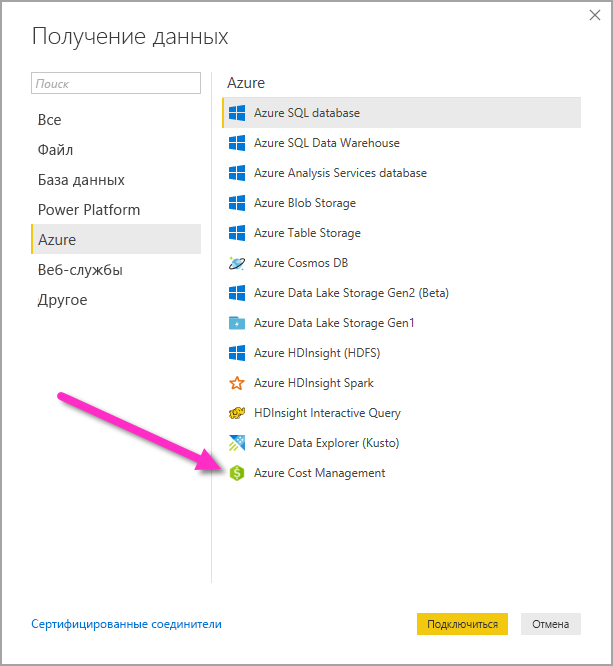
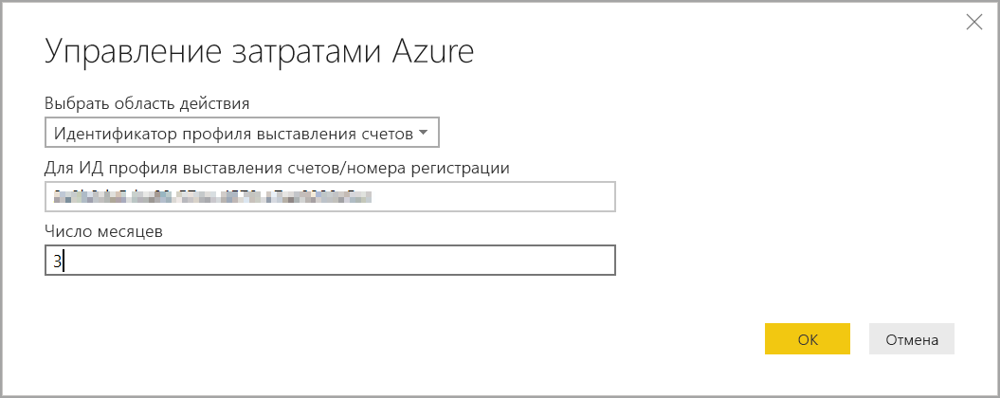
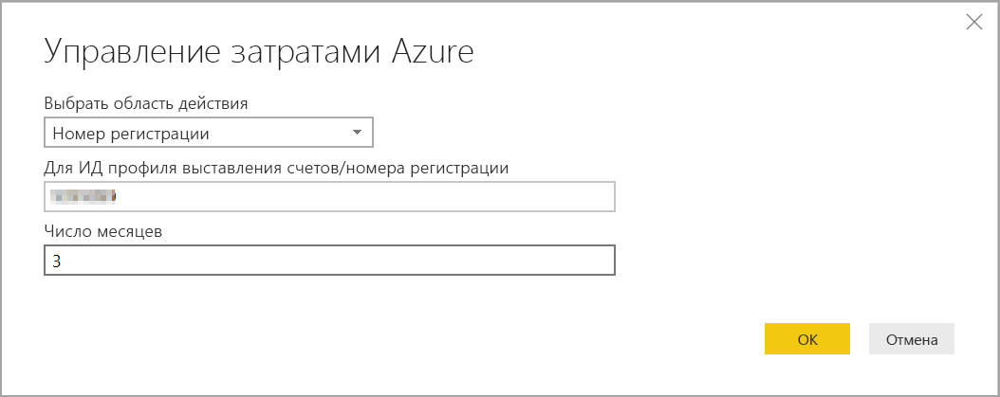
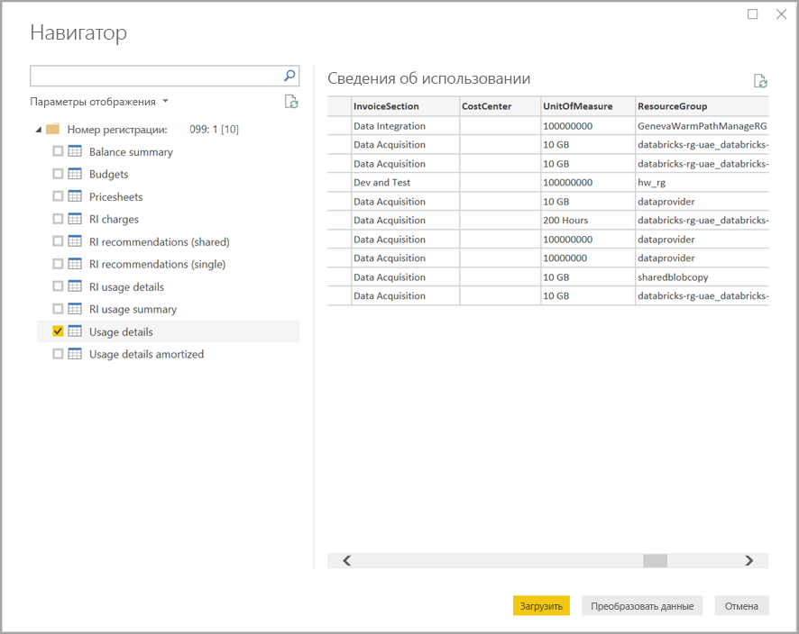

# Создание визуальных элементов и отчетов с помощью соединителя "Управление затратами Azure" в Power BI Desktop

С помощью соединителя службы "Управление затратами Azure" для Power BI Desktop можно создавать эффективные настраиваемые визуализации и отчеты, которые помогут лучше понимать затраты на Azure. В настоящее время соединитель службы "Управление затратами Azure" поддерживает клиентов с [Клиентским соглашением Майкрософт](https://azure.microsoft.com/pricing/purchase-options/microsoft-customer-agreement/) или [Соглашением Enterprise (EA)](https://azure.microsoft.com/pricing/enterprise-agreement/).  

Соединитель службы "Управление затратами Azure" использует OAuth 2.0 для проверки подлинности в Azure и определяет пользователей, которые будут использовать этот соединитель. Токены, созданные во время этого процесса, действительны в течение определенного периода. Power BI сохраняет токен для следующего входа в систему. OAuth 2.0 — это стандарт для внутреннего процесса, который обеспечивает безопасную обработку этих разрешений. Для подключения необходимо использовать учетную запись [корпоративного администратора](/azure/billing/billing-understand-ea-roles) для Соглашений Enterprise или [владельца учетной записи выставления счетов](/azure/billing/billing-understand-mca-roles) для Клиентских соглашений Майкрософт. 

> [!NOTE]
> Этот соединитель заменяет ранее доступные соединители [Azure Consumption Insights и Управление затратами Azure (бета-версия)](desktop-connect-azure-consumption-insights.md). Все отчеты, созданные с помощью предыдущего соединителя, необходимо создать повторно с использованием этого соединителя.

> [!NOTE]
> Соединитель службы "Управление затратами Azure" для Power BI Desktop не поддерживает подключение к облакам для государственных организаций. 

## Подключение с помощью службы "Управление затратами Azure"

Чтобы использовать **соединитель службы "Управление затратами Azure"** в Power BI Desktop, сделайте следующее:

1.  На вкладке ленты **Главная** выберите **Получить данные**.
2.  Выберите **Azure** из списка категорий данных.
3.  Выберите **Управление затратами Azure**.

    

4. В появившемся диалоговом окне введите **идентификатор профиля выставления счетов** для **Клиентских соглашений Майкрософт** или **номер регистрации** для **Соглашений Enterprise (EA)**. 

## Подключение к учетной записи Клиентского соглашения Майкрософт 

Чтобы подключиться к учетной записи **Клиентского соглашения Майкрософт**, можно получить свой **идентификатор профиля выставления счетов** на портале Azure:

1.  На [портале Azure](https://portal.azure.com/) перейдите на страницу **Управление затратами и выставление счетов**.
2.  Выберите свой профиль выставления счетов. 
3.  В разделе **Параметры** в меню выберите **Свойства** на боковой панели.
4.  В разделе **Профиль выставления счетов** скопируйте **идентификатор**. 
5.  Для параметра **Выбрать область действия** выберите **Идентификатор профиля выставления счетов** и вставьте идентификатор профиля выставления счетов, полученный на предыдущем шаге. 
6.  Введите число месяцев и нажмите кнопку **ОК**.

    

7.  При появлении запроса войдите в систему с помощью учетной записи пользователя Azure и пароля. 

## Подключение к учетной записи Соглашения Enterprise

Чтобы подключиться к учетной записи Соглашения Enterprise (EA), вы можете получить свой идентификатор регистрации на портале Azure:

1.  На [портале Azure](https://portal.azure.com/) перейдите на страницу **Управление затратами и выставление счетов**.
2.  Выберите свою учетную запись выставления счетов.
3.  В меню **Обзор** скопируйте **идентификатор учетной записи выставления счетов**.
4.  Для параметра **Выбрать область действия** выберите **Номер соглашения о регистрации** и вставьте идентификатор учетной записи выставления счетов, полученный на предыдущем шаге. 
5.  Введите число месяцев, а затем нажмите кнопку **ОК**.

    

6.  При появлении запроса войдите в систему с помощью учетной записи пользователя Azure и пароля. 

## Данные, доступные через соединитель

После успешного прохождения проверки подлинности появится окно **Навигатор** со следующими таблицами данных:

| **Таблица** | **Описание** |
| --- | --- |
| **Сводная информация о балансе** | Сводка баланса для Соглашений Enterprise (EA). |
| **События выставления счетов** | Журнал событий для новых счетов-фактур, внесения денег на счет и многого другого. Только Клиентское соглашение Майкрософт. |
| **Бюджеты** | Сведения о бюджете для просмотра фактических расходов или данных по использованию относительно существующих целевых показателей бюджета. |
| **Платежи** | Месячная сводка по использованию Azure, платежам Marketplace и платежам, счета по которым выставляются отдельно. Только Клиентское соглашение Майкрософт. |
| **Лоты денег на счете** | Сведения о покупке лотов денег на счете в Azure для указанного профиля выставления счетов. Только Клиентское соглашение Майкрософт. |
| **Прейскуранты** | Применимые ставки за единицы измерения для указанного профиля выставления счетов или регистрации EA. |
| **Расходы на зарезервированные экземпляры** | Сведения о плате за зарезервированные экземпляры за последние 24 месяца. |
| **Рекомендации по резервированию экземпляров (общие)** | Рекомендации по покупкам зарезервированных экземпляров на основе тенденций использования для всех подписок за последние 7, 30 или 60 дней. |
| **Рекомендации по резервированию экземпляров (отдельные)** | Рекомендации по покупкам зарезервированных экземпляров на основе тенденций использования для одной подписки за последние 7, 30 или 60 дней. |
| **Данные об использовании зарезервированных экземпляров** | Сведения об использовании существующих зарезервированных экземпляров за последний месяц. |
| **Сводка по использованию зарезервированных экземпляров** | Данные о ежедневном использовании резервирования Azure в процентах. |
| **Сведения об использовании** | Статистика израсходованных объемов и предполагаемых расходов для указанного профиля выставления счетов для регистрации EA. |
| **Сведения о погашении** | Статистика израсходованных объемов и предполагаемых амортизированных расходов для указанного профиля выставления счетов для регистрации EA. |

Вы можете выбрать таблицу, чтобы увидеть диалоговое окно предварительного просмотра. Чтобы выбрать одну или несколько таблиц, установите флажок рядом с именем таблицы, а затем нажмите кнопку **Загрузить**.

После нажатия кнопки **Загрузить** данные загружаются в Power BI Desktop. 

Когда выбранные данные будут загружены, соответствующие таблицы и поля отобразятся в области **Поля**.

## Дальнейшие действия

С помощью Power BI Desktop можно подключаться к источникам данных самых разных видов. Дополнительные сведения см. в следующих статьях:

* [Что такое Power BI Desktop?](../fundamentals/desktop-what-is-desktop.md)
* [Источники данных в Power BI Desktop](desktop-data-sources.md)
* [Формирование и объединение данных в Power BI Desktop](desktop-shape-and-combine-data.md)
* [Подключение к данным Excel в Power BI Desktop](desktop-connect-excel.md)   
* [Ввод данных непосредственно в Power BI Desktop](desktop-enter-data-directly-into-desktop.md)