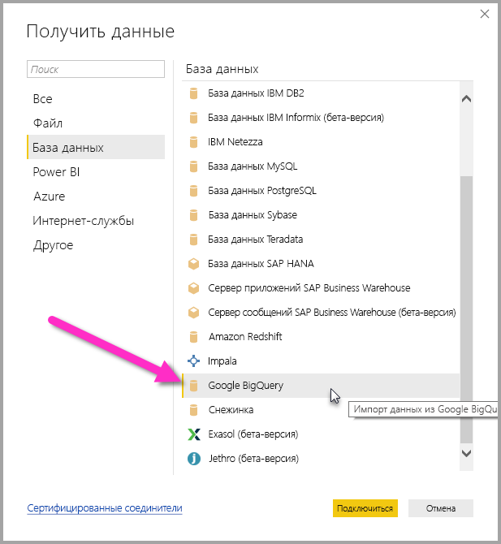
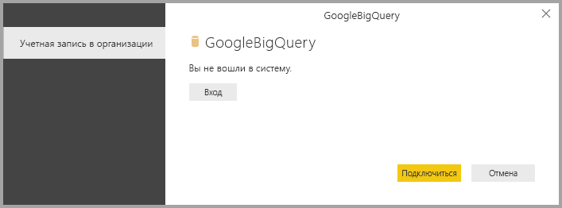
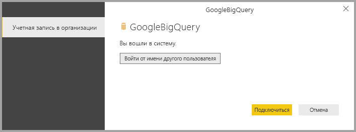
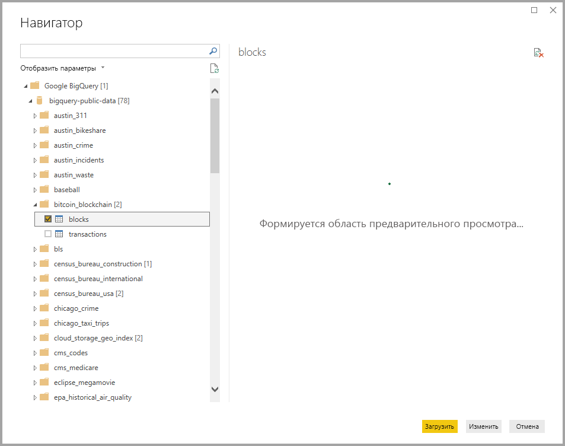

# <a name="connect-to-a-google-bigquery-database-in-power-bi-desktop"></a>Подключение к базе данных Google BigQuery в Power BI Desktop
В Power BI Desktop вы можете подключиться к базе данных **Google BigQuery** и использовать ее так же, как и любой другой источник данных в Power BI Desktop.

## <a name="connect-to-google-bigquery"></a>Подключение к Google BigQuery
Для подключения к базе данных Google **BigQuery** на вкладке **Главная** на ленте в Power BI Desktop выберите **Получение данных** . В области слева выберите категорию **База данных** . Отобразится пункт **Google BigQuery** .



В появившемся окне **Google BigQuery** войдите в свою учетную запись Google BigQuery и выберите команду **Подключиться** .



После входа вы увидите следующее окно, означающее, что вход выполнен успешно. 



После успешного подключения откроется окно **Навигатор** , содержащее данные, доступные на сервере. Из них вы можете выбрать один или несколько элементов для импорта и использования в **Power BI Desktop** .



## <a name="considerations-and-limitations"></a>Рекомендации и ограничения
Существуют определенные ограничения и рекомендации, которые следует учитывать в соединителе Google **BigQuery** .

* Соединитель Google BigQuery доступен в Power BI Desktop и в службе Power BI. В службе Power BI доступ к соединителю может осуществляться с помощью подключения типа "облако к облаку" из Power BI в Google BigQuery.

* Power BI можно использовать совместно с **Проектом выставления счетов** Google BigQuery. По умолчанию Power BI использует первый проект из списка, возвращаемого пользователю. 

  Чтобы настроить поведение проекта выставления счетов при использовании Power BI, укажите следующий параметр в разделе M на этапе Source, который можно настроить с помощью редактора **Power Query Editor** в Power BI Desktop:

  ```
  Source = GoogleBigQuery.Database([BillingProject="Include-Billing-Project-Id-Here"])
  ```

  Начиная с выпуска за сентябрь 2020 года мы включили поддержку [API хранения данных Google BigQuery](https://cloud.google.com/bigquery/docs/reference/storage). Некоторые клиенты могут столкнуться с проблемами с этой функцией, если они используют детализированные разрешения. В этом случае может появиться следующее сообщение об ошибке:

  `ERROR [HY000] [Microsoft][BigQuery] (131) Unable to authenticate with Google BigQuery Storage API. Check your account permissions`

  Эту проблему можно устранить, настроив разрешения пользователя для API хранения данных. Назначьте следующие разрешения API хранения данных:

  - `bigquery.readsessions.create` — создает новый сеанс чтения через API хранения данных BigQuery.
  - `bigquery.readsessions.getData` — считывает данные из сеанса чтения через API хранения данных BigQuery.
  - `bigquery.readsessions.update` — обновляет сеанс чтения через API хранения данных BigQuery.

  Эти разрешения обычно предоставляются в роли BigQuery.User. Дополнительные сведения см. в разделе [Стандартные роли и разрешения Google BigQuery](https://cloud.google.com/bigquery/docs/access-control).


## <a name="next-steps"></a>Дальнейшие действия
В Power BI Desktop можно подключаться к данным самых разных видов. Дополнительные сведения об источниках данных см. в перечисленных ниже статьях.

* [Что такое Power BI Desktop?](../fundamentals/desktop-what-is-desktop.md)
* [Источники данных в Power BI Desktop](desktop-data-sources.md)
* [Формирование и объединение данных в Power BI Desktop](desktop-shape-and-combine-data.md)
* [Подключение к данным Excel в Power BI Desktop](desktop-connect-excel.md)   
* [Ввод данных непосредственно в Power BI Desktop](desktop-enter-data-directly-into-desktop.md)   
