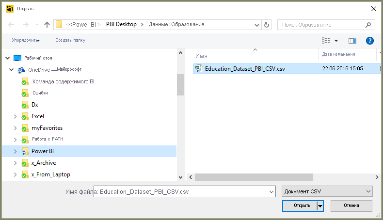
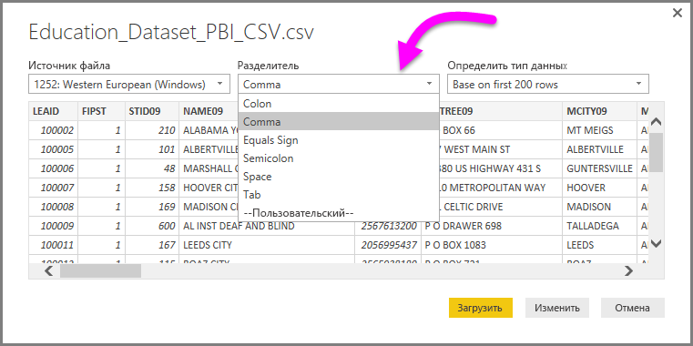
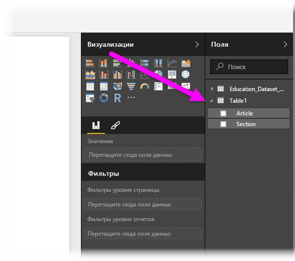

# Подключение к CSV-файлам в Power BI Desktop
Файлы с разделителями-запятыми (формат *CSV*) подключаются в Power BI Desktop почти так же, как и книги Excel. Обе процедуры довольно просты, и в этой статье объясняется, как подключиться к любому CSV-файлу, к которому у вас есть доступ.

Для начала в Power BI Desktop выберите **Получение данных > CSV** на ленте **Главная**.

Выберите CSV-файл в диалоговом окне **Открыть**.

Когда вы нажмете кнопку **Открыть**, Power BI Desktop откроет файл и проанализирует некоторые его атрибуты, такие как источник, тип разделителя и количество строк, необходимых для определения типов данных в файле.

Эти атрибуты и доступные варианты отобразятся в раскрывающихся списках в верхней части диалогового окна **Импорт из формата CSV**, как показано на изображении ниже. Вы можете вручную изменить определенные автоматически параметры, выбрав нужный вариант из соответствующего раскрывающегося списка.

Задав атрибуты, нажмите кнопку **Загрузить**, чтобы импортировать файл в приложение Power BI Desktop, или кнопку **Изменить**, чтобы открыть **редактор запросов** и отформатировать или преобразовать данные перед импортом.

После загрузки данных в Power BI Desktop таблица и ее столбцы (в Power BI Desktop они считаются полями) появятся в области **Поля** справа от представления отчета в Power BI Desktop.

На этом импорт завершен: теперь данные из CSV-файла загружены в Power BI Desktop.

Теперь вы можете работать с ними в приложении Power BI Desktop: создавать визуальные элементы и отчеты, а также подключать и импортировать прочие сведения, например книги Excel, базы и любые другие источники данных.

> [!IMPORTANT]
> При импорте CSV-файла Power BI Desktop создает *columns=x* (где *x* — число столбцов в CSV-файле во время начального импорта) в качестве шага в редакторе Power Query. Если вы добавляете дополнительные столбцы и для источника данных задано обновление, то столбцы, число которых превышает начальное (*x*), не обновляются. 

## Дальнейшие действия
В Power BI Desktop можно подключаться к данным самых разных видов. Дополнительные сведения об источниках данных см. в перечисленных ниже статьях.

* [Что такое Power BI Desktop?](../fundamentals/desktop-what-is-desktop.md)
* [Источники данных в Power BI Desktop](desktop-data-sources.md)
* [Формирование и объединение данных в Power BI Desktop](desktop-shape-and-combine-data.md)
* [Подключение к данным Excel в Power BI Desktop](desktop-connect-excel.md)   
* [Ввод данных непосредственно в Power BI Desktop](desktop-enter-data-directly-into-desktop.md)   
