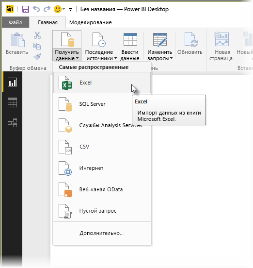
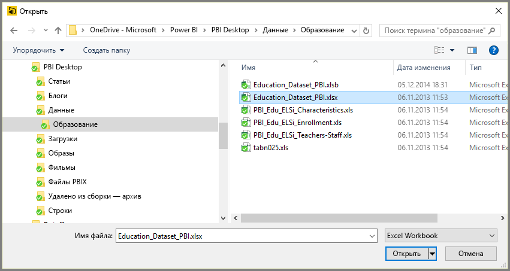
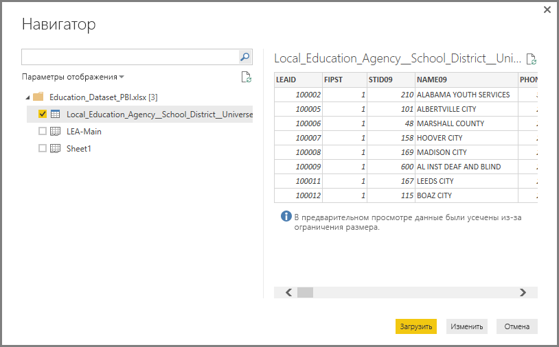
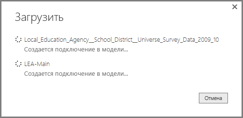
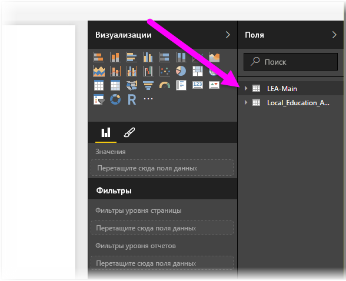

# Подключение к книгам Excel в Power BI Desktop
Процедура подключения к книгам Excel из приложения Power BI Desktop довольно проста и подробно описана в этой статье.

В Power BI Desktop выберите **Получение данных > Excel** на ленте **Главная**.

Выберите книгу в диалоговом окне **Открыть**.

Power BI Desktop отобразит таблицы и другие элементы данных из книги в окне **Навигатор**. При выборе таблицы в левой области окна в его правой части появляются соответствующие данные в режиме предварительного просмотра.

Вы можете импортировать данные, нажав кнопку "Загрузить", или отредактировать их перед загрузкой в приложение Power BI Desktop с помощью **редактора запросов**, нажав кнопку **Изменить**.

При загрузке данных Power BI Desktop открывает окно **Загрузка**, в котором отображаются сведения о ходе загрузки данных.  

После завершения этого процесса Power BI Desktop отображает импортированные из книги Excel таблицы и поля в области **Поля** в правой части окна.

Вот и все!

Теперь вы можете работать с импортированной из книги Excel информацией в приложении Power BI Desktop: создавать визуальные элементы и отчеты, а также подключать и импортировать прочие сведения, например другие книги Excel, базы и любые другие источники данных.

## Дальнейшие действия
В Power BI Desktop можно подключаться к данным самых разных видов. Дополнительные сведения об источниках данных см. в перечисленных ниже статьях.

* [Что такое Power BI Desktop?](../fundamentals/desktop-what-is-desktop.md)
* [Источники данных в Power BI Desktop](desktop-data-sources.md)
* [Формирование и объединение данных в Power BI Desktop](desktop-shape-and-combine-data.md)
* [Подключение к CSV-файлам в Power BI Desktop](desktop-connect-csv.md)   
* [Ввод данных непосредственно в Power BI Desktop](desktop-enter-data-directly-into-desktop.md)   
