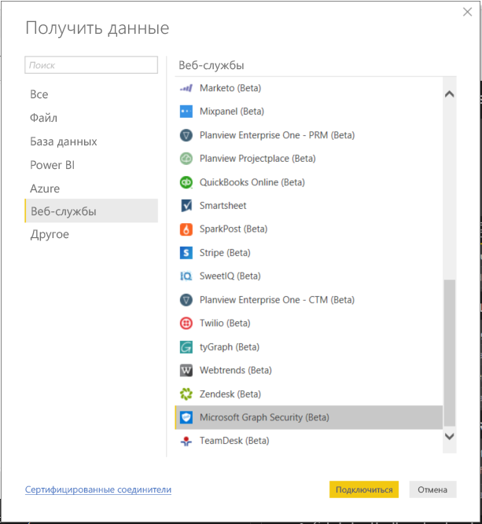
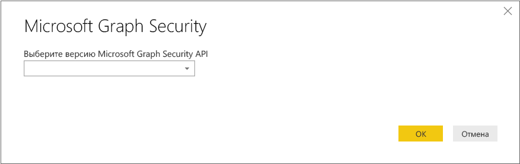
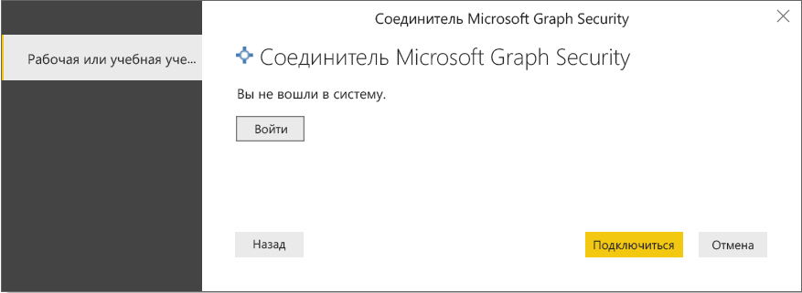
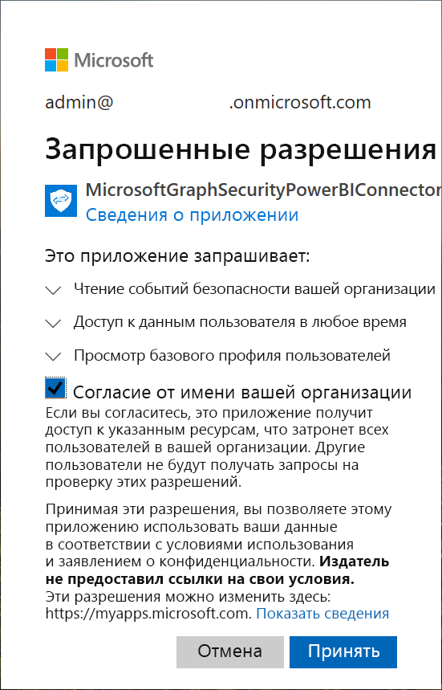
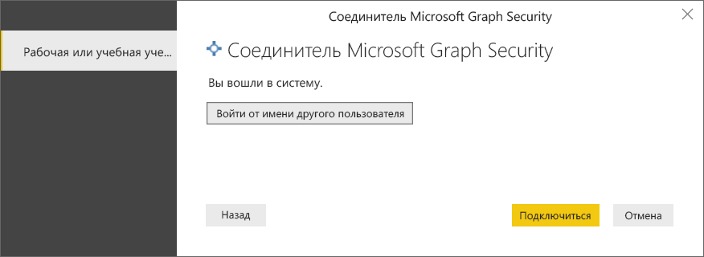
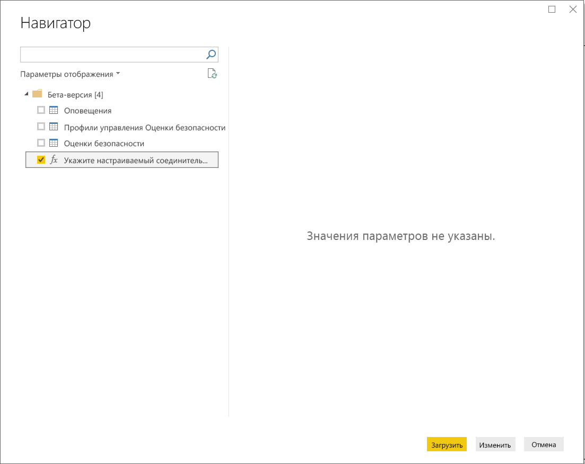
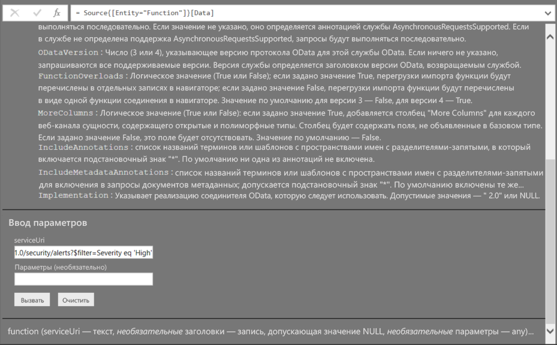
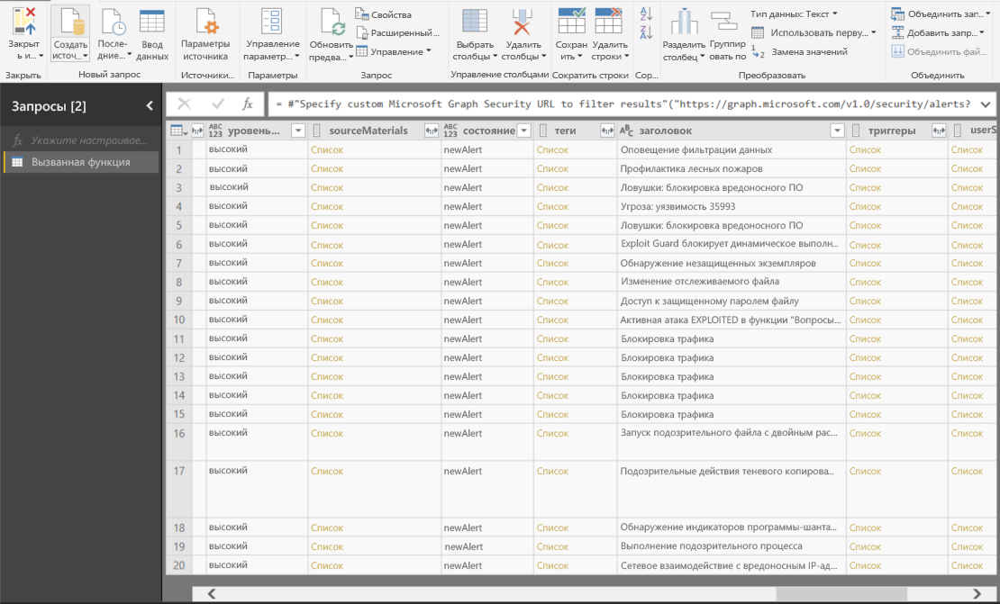

# Подключайтесь к API Microsoft Graph Security в Power BI Desktop

Используйте соединитель Microsoft Graph Security в Power BI Desktop для подключения к API [Microsoft Graph Security](/graph/security-concept-overview). Это позволит создавать панели мониторинга и отчеты, с помощью которых можно получить аналитическую информацию, связанную с [оповещениями](/graph/api/resources/alert?view=graph-rest-1.0) безопасности и [оценками безопасности](/graph/api/resources/securescores?view=graph-rest-beta).

API Microsoft Graph Security объединяет [несколько решений по безопасности](/graph/api/resources/security-api-overview#alerts) от корпорации Майкрософт и ее партнеров, что позволяет упростить связывание оповещений. Это сочетание обеспечивает доступ к ценной контекстной информации и упрощает автоматизацию. Оно позволяет организациям быстро получать аналитические сведения и принимать решения для нескольких продуктов безопасности, а также сократить затраты и уменьшить сложность.

## Предварительные требования для использования соединителя Microsoft Graph Security

Чтобы использовать соединитель Microsoft Graph Security, необходимо *явным образом* получить согласие от администратора клиента Azure Active Directory (Azure AD). Дополнительные сведения см. в разделе [Требования к проверке подлинности Microsoft Graph Security](/graph/security-authorization).
При получении согласия необходимо указать идентификатор и имя приложения соединителя, которые указаны здесь и доступны на [портале Azure](https://portal.azure.com):

| Свойство | Значение |
|----------|-------|
| **Имя приложения** | `MicrosoftGraphSecurityPowerBIConnector` |
| **Идентификатор приложения** | `cab163b7-247d-4cb9-be32-39b6056d4189` |
| **URI перенаправления** | `https://oauth.powerbi.com/views/oauthredirect.html` |
|||

Чтобы дать согласие для соединителя, администратор клиента Azure AD может воспользоваться любым из этих методов:

* [Предоставление согласия для приложений Azure AD](/azure/active-directory/develop/v2-permissions-and-consent)

* Ответ на запрос, который приложение логики отправляет во время первого запуска с помощью [интерфейса согласия приложения](/azure/active-directory/develop/application-consent-experience)
   
Учетной записи пользователя, используемой для входа при подключении с помощью соединителя Microsoft Graph Security, нужно назначить роль читателя сведений о безопасности Azure AD, **если** этому пользователю не назначена роль *администратора безопасности*. Дополнительные сведения см. в разделе [Назначение ролей Azure AD пользователям](/graph/security-authorization#assign-azure-ad-roles-to-users).

## Использование соединителя Microsoft Graph Security

Чтобы использовать соединитель, выполните следующие действия:

1. В Power BI Desktop на вкладке ленты **Главная** выберите **Получить данные** > **Дополнительно**.
2. В списке категорий в левой части окна выберите **Веб-службы**.
3. Выберите **Microsoft Graph Security (бета-версия)** .

    
    
4. В появившемся окне **Microsoft Graph Security** выберите версию API Microsoft Graph для запроса: **1.0** или **бета-версия**.

    
    
5. Войдите в свою учетную запись Azure Active Directory при появлении запроса. Эта учетная запись должна иметь роль *Читатель сведений о безопасности* или *Администратор безопасности*, как упоминалось в предыдущем разделе.

     
    
6. Если вы являетесь администратором клиента *и* еще не предоставили согласие для соединителя (приложения) Microsoft Graph Security для Power BI, то вы увидите следующее диалоговое окно. Выберите **Согласие от имени вашей организации**.

    
    
7. После входа вы увидите следующее окно. Это означает, что вход выполнен успешно. Нажмите кнопку **Подключиться**.

    
    
8. После подключения в окне **Навигатор** отображаются оповещения, оценки безопасности и другие сущности, которые доступны в версии [API Microsoft Graph Security](/graph/security-concept-overview), выбранной на шаге 4. Выберите одну или несколько сущностей, чтобы импортировать и использовать их в Power BI Desktop. Затем выберите **Загрузить**, чтобы просмотреть представление результатов, которое показано после шага 9.

    
    
9. Если вы хотите выполнить расширенный запрос к API Microsoft Graph Security, выберите **Указать пользовательский URL-адрес Microsoft Graph Security для фильтрации результатов**. Используйте эту функцию, чтобы выполнить запрос [OData.Feed](./desktop-connect-odata.md) к API Microsoft Graph Security с необходимыми разрешениями.

   В следующем примере используется `https://graph.microsoft.com/v1.0/security/alerts?$filter=Severity eq 'High'` *serviceUri*. Чтобы узнать, как создавать запросы для фильтрации, сортировки или получения последних результатов, обратитесь к разделу [Параметры системных запросов OData](/graph/query-parameters).

   
    
   Если вы выберете **Вызвать**, функция **OData.Feed** выполнит вызов к API, и откроется редактор запросов. Вы сможете отфильтровать и уточнить набор данных, который хотите использовать. Затем загрузите эти данные в Power BI Desktop.

Ниже приведено окно результатов для сущностей Microsoft Graph Security, к которым мы выполняли запросы:

   
    

Теперь вы можете использовать импортированные данные из соединителя Microsoft Graph Security в Power BI Desktop. Вы можете создавать графики и отчеты. Вы также можете взаимодействовать с другими данными, импортированными из книг Excel, баз данных или других источников данных.

## Дальнейшие действия
* Ознакомьтесь с примерами и шаблонами Power BI, в которых используется этот соединитель, в разделе [Примеры по Microsoft Graph Security для Power BI в GitHub](https://aka.ms/graphsecuritypowerbiconnectorsamples).

* Пользовательские сценарии и дополнительные сведения см. в [записи блога о соединителе Microsoft Graph Security для Power BI](https://aka.ms/graphsecuritypowerbiconnectorblogpost).

* В Power BI Desktop можно подключаться к данным различных типов. Дополнительные сведения см. на следующих страницах.

    * [Что такое Power BI Desktop?](../fundamentals/desktop-what-is-desktop.md)
    * [Источники данных в Power BI Desktop](desktop-data-sources.md)
    * [Формирование и объединение данных в Power BI Desktop](desktop-shape-and-combine-data.md)
    * [Подключение к данным Excel в Power BI Desktop](desktop-connect-excel.md)
    * [Ввод данных непосредственно в Power BI Desktop](desktop-enter-data-directly-into-desktop.md)