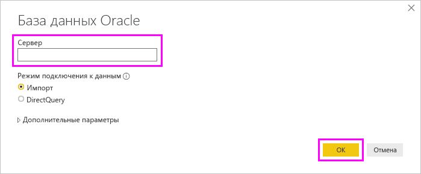

# Подключение к базе данных Oracle с помощью Power BI Desktop
Для подключения к базе данных Oracle с помощью Power BI Desktop необходимо установить правильное программное обеспечение клиента Oracle на компьютере, где выполняется Power BI Desktop. Используемое клиентское программное обеспечение Oracle зависит от того, какую версию Power BI Desktop вы установили: 32-разрядную или 64-разрядную. Это также зависит от версии сервера Oracle.

Поддерживаемые версии Oracle: 
- Oracle Server 9 и более поздних версий
- Клиент доступа к данным Oracle (ODAC) — программное обеспечение версии 11.2 и более поздней

> [!NOTE]
> Если вы настраиваете базу данных Oracle для сервера отчетов Power BI Desktop, локальный шлюз данных или сервер отчетов Power BI, см. статью [Тип соединения Oracle (построитель отчетов и сервер отчетов Power BI)](/sql/reporting-services/report-data/oracle-connection-type-ssrs?view=sql-server-ver15). 

## Определение установленной версии Power BI Desktop
Чтобы определить, какая версия Power BI Desktop установлена, выберите **Файл** > **Справка** > **О программе** и проверьте строку **Версия**. На следующем рисунке показано, что установлена 64-разрядная версия Power BI Desktop:

## Установка клиента Oracle
- Для 32-разрядной версии Power BI Desktop [скачайте и установите 32-разрядный клиент Oracle](https://www.oracle.com/technetwork/topics/dotnet/utilsoft-086879.html).

- Для 64-разрядной версии Power BI Desktop [скачайте и установите 64-разрядный клиент Oracle](https://www.oracle.com/database/technologies/odac-downloads.html).

> [!NOTE]
> Выберите версию клиента доступа к данным Oracle (ODAC), совместимую с сервером Oracle. Например, ODAC 12.x не всегда поддерживает Oracle Server версии 9.
> Выберите установщик Windows для клиента Oracle.
> Во время установки клиента Oracle обязательно включите *Настройка поставщиков ODP.NET и Oracle для ASP.NET на уровне компьютера*, установив соответствующий флажок во время работы мастера установки. Некоторые версии мастера клиента Oracle по умолчанию выбирают флажок, а другие — нет. Убедитесь, что установлен флажок, чтобы Power BI мог подключаться к базе данных Oracle.

## Подключение к базе данных Oracle
После установки соответствующего драйвера клиента Oracle можно подключиться к базе данных Oracle. Чтобы установить соединение, сделайте следующее:

1. На вкладке **Главная** выберите пункт **Получить данные**. 

2. В открывшемся окне **Получить данные** при необходимости выберите **Дополнительно** и затем выберите **База данных** > **База данных Oracle**, после чего нажмите кнопку **Подключиться**.
   
   
3. В появившемся диалоговом окне **База данных Oracle** укажите имя в поле **Сервер** и нажмите кнопку **ОК**. Если требуется идентификатор безопасности (SID), можно указать его в следующем формате: *имя_сервера/SID*, где *SID* — это уникальное имя базы данных. Если формат *имя_сервера/SID* не подходит, попробуйте использовать формат *имя_сервера/имя_службы*, где *имя_службы* — это псевдоним, используемый при подключении.

   

   > [!NOTE]
   > Если вы используете локальную базу данных или автономные подключения к базе данных, вам может потребоваться поместить имя сервера в кавычки, чтобы избежать ошибок подключения. 
      
4. Если вы хотите импортировать данные с помощью собственного запроса к базе данных, запрос можно поместить в поле **Инструкция SQL**, которое появляется при развертывании раздела **Дополнительные параметры** диалогового окна **База данных Oracle**.
   
   

5. После ввода сведений о базе данных Oracle в диалоговом окне **База данных Oracle** (включая любую дополнительную информацию, например идентификатор безопасности или собственный запрос к базе данных) нажмите кнопку **ОК** для подключения.
5. Если базе данных Oracle требуются учетные данные пользователя базы данных, введите эти учетные данные в диалоговом окне при появлении запроса.

## Устранение неполадок

В Oracle может возникнуть любая из нескольких ошибок, если синтаксис именования содержит ошибку или неправильно настроен:

* ORA-12154: TNS: не удалось разрешить указанный идентификатор подключения.
* ORA-12514: прослушивателю TNS неизвестна служба, запрошенная в дескрипторе подключения.
* ORA-12541: TNS: нет прослушивателя.
* ORA-12170: TNS: время ожидания подключения истекло.
* ORA-12504: TNS: прослушиватель не получил имя SERVICE_NAME в параметре CONNECT_DATA.

Эти ошибки могут произойти, если клиент Oracle не установлен или неправильно настроен. Если он установлен, нужно проверить, правильно ли настроен файл tnsnames.ora и используется ли нужное имя net_service_name. Кроме того, нужно задать одно и то же имя net_service_name на компьютере, на котором выполняется Power BI Desktop, и компьютере, на котором запущен шлюз. Дополнительные сведения см. в статье [Установка клиента Oracle](#install-the-oracle-client).

Ошибка может также возникать из-за несовместимости между версиями сервера и клиента ODAC. Как правило, необходимо, чтобы эти версии совпадали, так как некоторые сочетания несовместимы. Например, ODAC 12.x не поддерживает Oracle Server версии 9.

Если вы скачали Power BI Desktop из Microsoft Store, может возникнуть проблема с подключением к базам данных Oracle из-за проблемы с драйвером Oracle. Если вы столкнетесь с этой проблемой, появится следующее сообщение об ошибке: *Ссылка на объект не задана*. Чтобы устранить эту проблему, выполните одно из следующих действий:

* Скачайте Power BI Desktop из [Центра загрузки](https://www.microsoft.com/download/details.aspx?id=58494) вместо магазина Microsoft Store.

* Если вы хотите использовать версию из Microsoft Store: на локальном компьютере скопируйте файл oraons.dll из папки _12.X.X\client_X_ в папку _12.X.X\client_X\bin_, где _X_ представляет номера версии и каталога.

Если при подключении к базе данных Oracle в Power BI Gateway отображается сообщение об ошибке *Ссылка на объект не задана*, выполните инструкции в разделе [Управление своим источником данных — Oracle](service-gateway-onprem-manage-oracle.md).

Если вы используете Сервер отчетов Power BI, см. сведения о [типе соединения Oracle](/sql/reporting-services/report-data/oracle-connection-type-ssrs?view=sql-server-ver15).