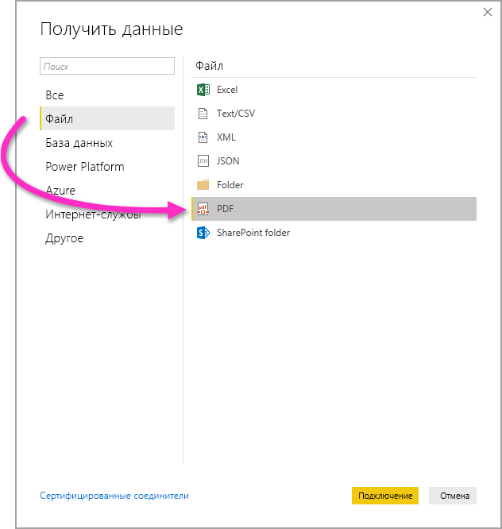

# Подключение к PDF-файлам в Power BI Desktop
С помощью Power BI Desktop вы можете подключиться к **PDF-файлу** и использовать данные из него аналогично любому другому источнику данных в Power BI Desktop.

В следующих разделах рассматривается процесс подключения к **PDF-файлу**, выбора данных и переноса этих данных в **Power BI Desktop**.

Мы всегда рекомендуем выполнять обновление до последней версии **Power BI Desktop**. Это можно сделать с помощью ссылки [Получить Power BI Desktop](../fundamentals/desktop-get-the-desktop.md). 

## Подключение к PDF-файлу
Для подключения к **PDF-файлу** в ленте **Главная** в Power BI Desktop выберите **Получить данные**. В области категорий слева выберите **Файл**. Отобразится пункт **PDF**.

Вам будет предложено указать расположение файла PDF-файла, который вы хотите использовать. После предоставления информации о расположении файла и его загрузки откроется окно **Навигатор**, содержащее данные из файла. В этом окне вы можете выбрать один или несколько элементов для импорта и использования в **Power BI Desktop**.

После установки флажка напротив обнаруженных в PDF-файле элементов они будут показаны в области справа. Когда вы будете готовы их импортировать, выберите кнопку **Загрузить**, чтобы перенести данные в **Power BI Desktop**.

Начиная с ноября 2018 г., выпуск **Power BI Desktop** поддерживает **первую страницу** и **последнюю страницу** в качестве необязательных параметров для подключения к PDF-файлам. Эти параметры можно также указать формулу на языке M, используя следующий формат:

`Pdf.Tables(File.Contents("c:\sample.pdf"), [StartPage=10, EndPage=11])`

## Дальнейшие действия
В Power BI Desktop можно подключаться к данным самых разных видов. Дополнительные сведения об источниках данных см. в перечисленных ниже статьях.

* [Что такое Power BI Desktop?](../fundamentals/desktop-what-is-desktop.md)
* [Источники данных в Power BI Desktop](desktop-data-sources.md)
* [Формирование и объединение данных с Power BI Desktop](desktop-shape-and-combine-data.md)
* [Подключение к данным Excel в Power BI Desktop](desktop-connect-excel.md)   
* [Ввод данных непосредственно в Power BI Desktop](desktop-enter-data-directly-into-desktop.md)   
