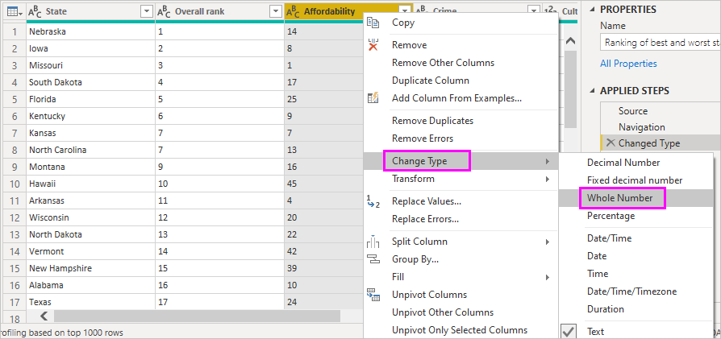
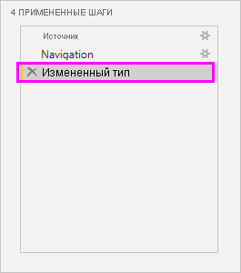
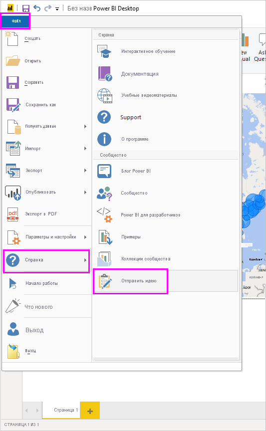

# Подключение к источникам данных в Power BI Desktop

Power BI Desktop позволяет легко подключаться к постоянно растущему миру данных. Если у вас нет Power BI Desktop, его можно загрузить и установить [отсюда](https://go.microsoft.com/fwlink/?LinkID=521662).

В Power BI Desktop доступны *все виды* источников данных. На следующем рисунке показано, как подключиться к данным, щелкнув **Получить данные** > **Другое** > **Интернет**.

## Пример подключения к данным

В этом примере мы будем подключаться к источнику данных **в Интернете**.

Представьте, что вы уходите на пенсию. Вы хотите жить там, где много солнца, мягкие налоги и хорошее здравоохранение. или Возможно, вы аналитик данных и хотите получить сведения для помощи клиентам, например помочь своему клиенту, производящему дождевики, организовать целевые продажи в местах, где *часто* идут дожди.

В любом случае интересующие вас данные в этих и многих других областях имеются на следующем веб-ресурсе:

[https://www.bankrate.com/finance/retirement/best-places-retire-how-state-ranks.aspx](https://www.bankrate.com/finance/retirement/best-places-retire-how-state-ranks.aspx)

Выберите **Получить данные** > **Другое** > **Интернет**. В разделе **Из Интернета** введите адрес.

Когда вы нажмете кнопку **ОК**, начнет работу функциональность *Запрос* Power BI Desktop. Power BI Desktop обращается к веб-ресурсу, и в окне **навигатора** отображается то, что он найдет на этой веб-странице. В данном случае найдена таблица и общий документ. Нас интересует эта таблица, поэтому мы выбираем ее из списка. В окне **навигатора** отображается предварительный просмотр.

На этом этапе мы можем изменить запрос перед загрузкой таблицы, выбрав **Преобразовать данные** в нижней части окна, или просто загрузить эту таблицу.

Выберите **Преобразовать данные**, чтобы загрузить таблицу и запустить редактор Power Query. Откроется область **Параметры запроса**. Выберите **Представление** на ленте, а затем **Параметры запроса**, чтобы открыть область **Параметры запроса**. Вот как это выглядит.

Все эти рейтинги представлены текстом, а не числами, а нам они нужны в виде чисел. Это не проблема. Для этого щелкните правой кнопкой мыши заголовок столбца и выберите **Изменить тип** > **Целое число**. Чтобы выбрать несколько столбцов, сначала выделите столбец, нажмите и удерживайте клавишу SHIFT, одновременно выделите смежные столбцы, а затем щелкните правой кнопкой мыши заголовок столбца, чтобы изменить все выделенные столбцы. Чтобы выбрать столбцы, которые не являются смежными, используйте клавишу CTRL.

В области **Параметры запроса** в разделе **ПРИМЕНЕННЫЕ ШАГИ** будут отражаться все сделанные изменения. По мере внесения в данные дополнительных изменений редактор Power Query будет записывать эти изменения в раздел **ПРИМЕНЕННЫЕ ШАГИ**, где вы можете настраивать действия, повторно переходить в действия, изменять их порядок или удалять их при необходимости.

После загрузки таблицы все еще можно вносить дополнительные изменения, но сейчас мы будем создавать отчеты. Закончив, выберем пункт **Закрыть и применить** на ленте **Главная**, и Power BI Desktop применит все изменения и закроет редактор Power Query.

Загрузив модель данных, в представлении **Отчет** в Power BI Desktop можно создать визуализацию, перетащив поля на холст.

Конечно, это простая модель с единственным подключением к данным. Большинство отчетов Power BI Desktop будет иметь подключения к различным источникам данных, сформированным для удовлетворения ваших потребностей, со связями, которые образуют сложную модель данных.

## Дальнейшие действия
Power BI Desktop предоставляет широкие возможности. Дополнительные сведения об этих возможностях см. в следующих ресурсах.

* [Что такое Power BI Desktop?](../fundamentals/desktop-what-is-desktop.md)
* [Об использовании редактора запросов в Power BI Desktop](../transform-model/desktop-query-overview.md)
* [Источники данных в Power BI Desktop](desktop-data-sources.md)
* [Формирование и объединение данных в Power BI Desktop](desktop-shape-and-combine-data.md)
* [Выполнение общих задач с запросами в Power BI Desktop](../transform-model/desktop-common-query-tasks.md)   

Хотите оставить отзыв? Отлично! Используйте пункт меню **Отправить идею** в Power BI Desktop или посетите раздел [Отзывы сообщества](https://community.powerbi.com/t5/Community-Feedback/bd-p/community-feedback). Мы будем рады вашим отзывам.

