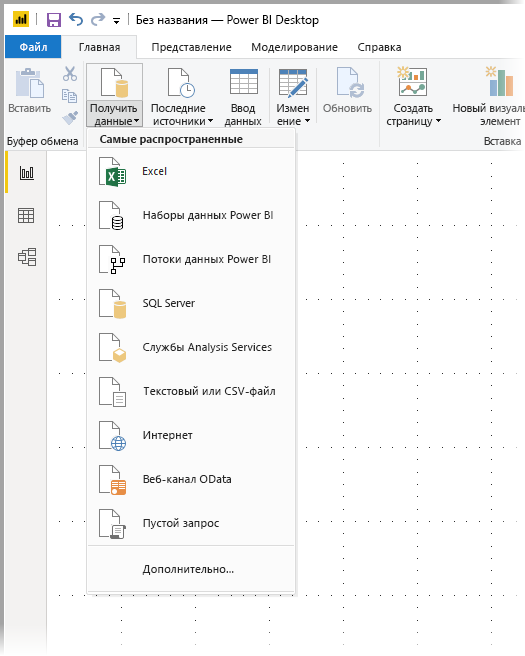
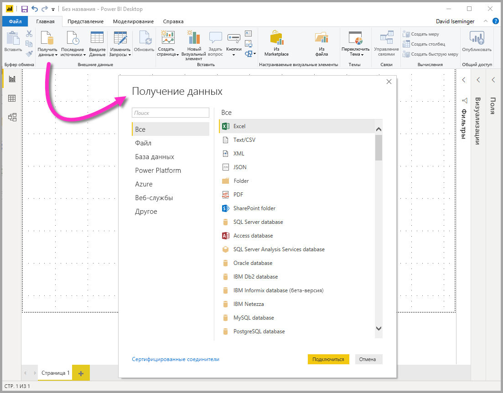
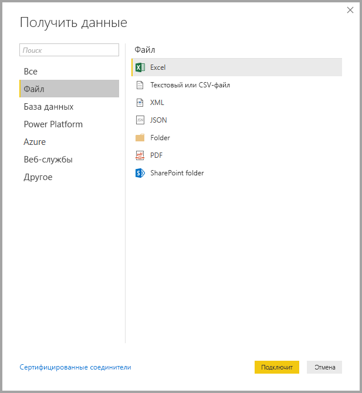
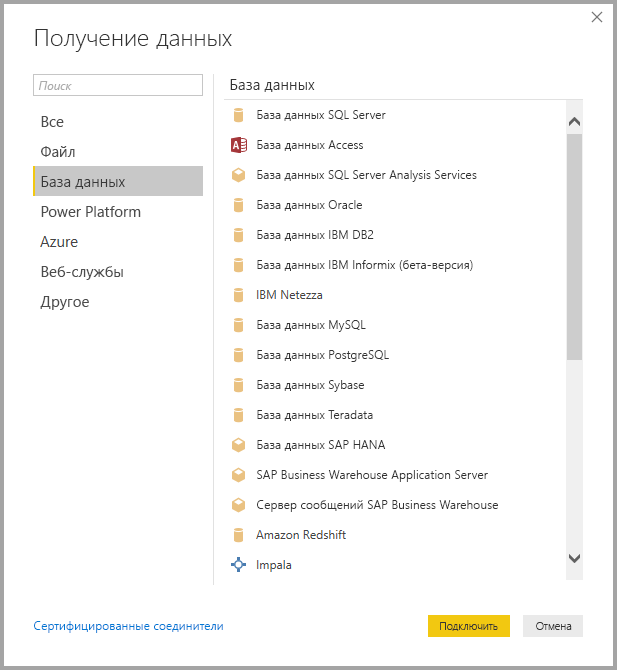
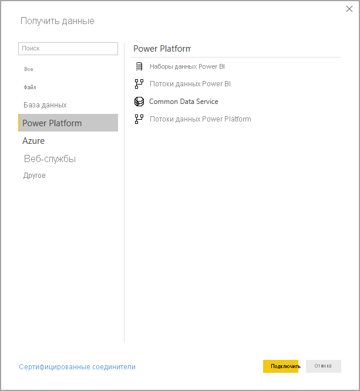
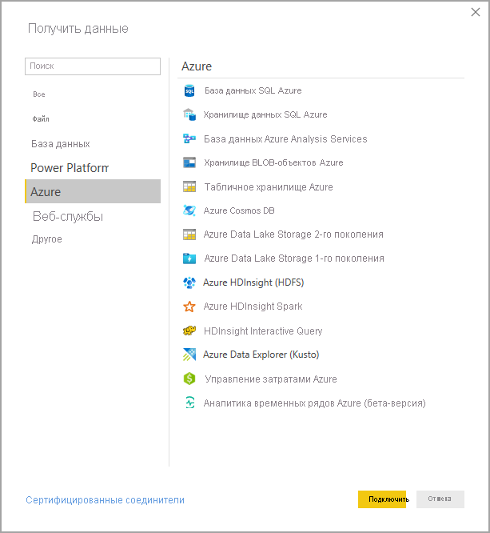
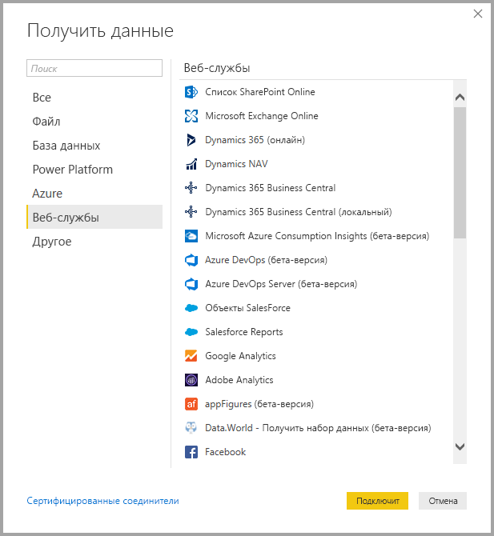
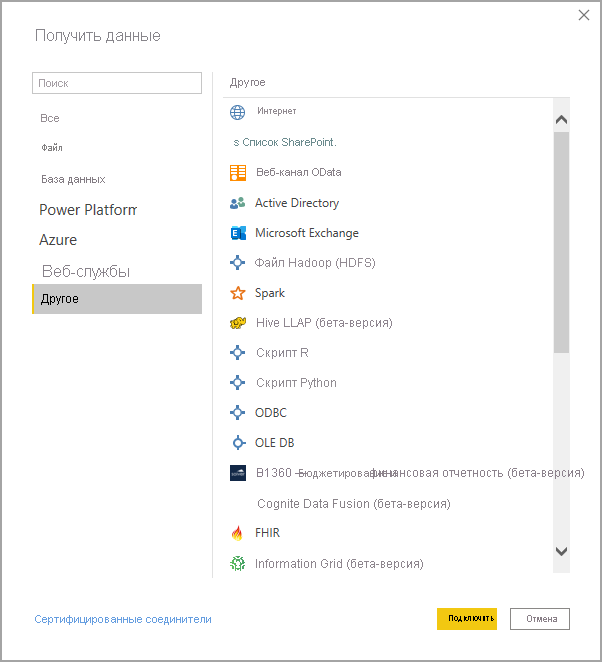
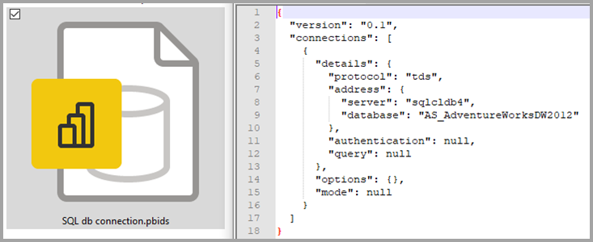

# <a name="data-sources-in-power-bi-desktop"></a>Источники данных в Power BI Desktop

Power BI Desktop позволяет подключаться к данным из многих разных источников. Полный список доступных источников данных см. в статье [Источники данных Power BI](power-bi-data-sources.md).

Подключение к данным осуществляется с помощью ленты **Главная** . Чтобы отобразить меню типов данных **Самые распространенные** , нажмите кнопку **Получить данные** или стрелку вниз.



Чтобы перейти к диалоговому окну **Получение данных** , откройте меню типов данных **Самые распространенные** и выберите **Дополнительно** . Вы также можете открыть диалоговое окно **Получение данных** (и обойти меню **Самые распространенные** ), напрямую нажав на значок **Получить данные** .



> [!NOTE]
> Команда разработчиков Power BI постоянно расширяет список источников данных, доступных для приложения Power BI Desktop и службы Power BI. Поэтому вы часто будете видеть ранние версии источников данных в процессе разработки с пометкой **Бета-версия** или **Предварительная версия** . Все источники данных с пометкой **Бета-версия** или **Предварительная версия** имеют ограниченную поддержку и функциональные возможности и не должны использоваться в рабочих средах. Кроме того, любой источник данных, помеченный как **Бета-версия** или **Предварительная версия** для Power BI Desktop, может быть недоступен для использования в службе Power BI или других службах Майкрософт, пока не станет общедоступным (GA).

> [!NOTE]
> Существует много соединителей данных для Power BI Desktop, для проверки подлинности которых требуется Internet Explorer 10 (или более поздняя версия). 


## <a name="data-sources"></a>Источники данных

Диалоговое окно **Получение данных** организует типы данных в следующих категориях:

* Все
* Файл
* База данных
* Power Platform
* Azure
* Веб-службы
* Другие

Категория **Все** включает все типы подключений данных из всех категорий.

### <a name="file-data-sources"></a>Файловые источники данных

Категория **Файл** предоставляет следующие подключения к данным:

* Excel
* Text/CSV.
* XML
* JSON
* Папка
* PDF
* Папка SharePoint

На следующем рисунке показано окно **Получить данные** для категории **Файл** .



### <a name="database-data-sources"></a>Источники данных базы данных

Категория **База данных** предоставляет следующие подключения к данным:

* База данных SQL Server
* База данных Access
* База данных SQL Server Analysis Services
* База данных Oracle
* База данных IBM DB2
* База данных IBM Informix (бета-версия)
* IBM Netezza
* База данных MySQL
* База данных PostgreSQL
* База данных Sybase
* База данных Teradata
* База данных SAP HANA
* Сервер приложений SAP Business Warehouse
* Сервер сообщений SAP Business Warehouse
* Amazon Redshift
* Impala
* Google BigQuery
* Vertica
* Снежинка
* Essbase
* Кубы AtScale
* Соединитель BI 
* Data Virtuality LDW (бета-версия)
* Denodo
* Dremio
* Exasol
* Indexima
* InterSystems IRIS (бета-версия)
* Jethro (бета-версия)
* Kyligence
* Linkar PICK Style/многозначные базы данных (бета-версия)
* MarkLogic
* MariaDB (бета-версия)

> [!NOTE]
> Некоторые соединители базы данных необходимо включить: выберите **Файл > Параметры и настройки > Параметры** , затем щелкните **Предварительная версия функций** и включите соединитель. Если некоторые из указанных выше соединителей не отображаются, а вы хотите их использовать, проверьте настройки параметра **Предварительная версия функций** . Также обратите внимание, что все источники данных с пометкой *Бета-версия* или *Предварительная версия* имеют ограниченную поддержку и функциональные возможности и не должны использоваться в рабочих средах.

На следующем рисунке показано окно **Получить данные** для категории **База данных** .



### <a name="power-platform-data-sources"></a>Источники данных Power Platform

Категория **Power Platform** предоставляет следующие подключения к данным:

* Наборы данных Power BI
* Потоки данных Power BI
* Common Data Service
* Потоки данных Power Platform (бета-версия)

На следующем рисунке показано окно **Получение данных** для **Power Platform** .



### <a name="azure-data-sources"></a>Источники данных Azure

Категория **Azure** предоставляет следующие подключения к данным:

* База данных SQL Azure
* Azure Synapse Analytics (хранилище данных SQL)
* База данных Azure Analysis Services
* База данных Azure для PostgreSQL
* Хранилище BLOB-объектов Azure
* Хранилище таблиц Azure
* Azure Cosmos DB
* Azure Data Explorer (Kusto)
* Azure Data Lake Storage 2-го поколения
* Azure Data Lake Storage 1-го поколения
* Azure HDInsight (HDFS)
* Azure HDInsight Spark
* HDInsight Interactive Query
* Управление затратами Azure
* Аналитика временных рядов Azure (бета-версия)
* Azure Databricks


На следующем рисунке показано окно **Получить данные** для категории **Azure** .



### <a name="online-services-data-sources"></a>Источники данных Интернет-служб

Категория **Интернет-службы** предоставляет следующие подключения к данным:

* Список SharePoint Online
* Microsoft Exchange Online
* Dynamics 365 (в сети)
* Dynamics NAV
* Dynamics 365 Business Central
* Dynamics 365 Business Central (локальный)
* Microsoft Azure Consumption Insights (бета-версия)
* Azure DevOps (только Boards)
* Azure DevOps Server (только Boards)
* Объекты SalesForce
* Отчеты SalesForce
* Google Analytics
* Adobe Analytics
* appFigures (бета-версия)
* Data.World — получение набора данных (бета-версия)
* GitHub (бета-версия)
* LinkedIn Sales Navigator (бета-версия)
* Merketo (бета-версия)
* Mixpanel (бета-версия)
* Planview Enterprise One — PRM (бета-версия)
* QuickBooks Online (бета-версия)
* Smartsheet (бета-версия)
* SparkPost (бета-версия)
* SweetIQ (бета-версия)
* Planview Enterprise One — CTM (бета-версия)
* Twilio (бета-версия)
* ZenDesk (бета-версия)
* Asana (бета-версия)
* Dynamics 365 Customer Insights (бета-версия)
* Источник данных Emigo
* Entersoft Business Suite (бета-версия)
* FactSet Analytics
* Интеллектуальный API Hexagon PPM
* Хранилище данных Intune (бета-версия)
* Microsoft Graph Security (бета-версия)
* Product Insights (бета-версия)
* Quick Base
* TeamDesk (бета-версия)
* Webtrends Analytics (бета-версия)
* Witivio (бета-версия)
* Рабочая Аналитика (бета-версия)
* Zoho Creator (бета-версия)
* Palantir Foundry
* Industrial App Store
* Projectplace для Power BI
* eWay-CRM (бета-версия)
* Spigit (бета-версия)


На следующем рисунке показано окно **Получение данных** для категории **Интернет-службы** .



### <a name="other-data-sources"></a>Другие источники данных

Категория **Другие** предоставляет следующие подключения к данным:

* Интернет
* Список SharePoint
* Веб-канал OData
* Active Directory
* Microsoft Exchange
* Файл Hadoop (HDFS)
* Spark
* Hive LLAP (бета-версия)
* Скрипт R
* Скрипт Python
* ODBC
* OLE DB
* Acterys: автоматизация и планирование моделей (бета-версия)
* Automation Anywhere (бета-версия)
* Solver
* Cherwell (бета-версия)
* Cognite Data Fusion (бета-версия)
* FHIR
* Information Grid (бета-версия)
* Jamf Pro (бета-версия)
* MicroStrategy for Power BI
* Paxata
* QubolePresto (бета-версия)
* Roamler (бета-версия)
* Сочетания клавиш для бизнес-аналитики (бета-версия)
* Siteimprove
* SurveyMonkey (бета-версия)
* Tenforce (Smart)List
* TIBCO(R) Data Virtualization (бета-версия)
* Vena (бета-версия)
* Vessel Insight (бета-версия)
* Zucchetti HR Infinity (бета-версия)
* Пустой запрос


На следующем рисунке показано окно **Получение данных** для категории **Другие** .



> [!NOTE]
> Подключение к пользовательским источникам данных, полученным с помощью Azure Active Directory, сейчас не работает.

### <a name="template-apps"></a>Приложения-шаблоны

Чтобы найти приложения-шаблоны для своей организации, выберите ссылку **Приложения-шаблоны** в нижней части окна **Получение данных** . 


Доступные приложения-шаблоны могут отличаться в зависимости от вашей организации.

## <a name="connecting-to-a-data-source"></a>Подключение к источнику данных

Чтобы подключиться к источнику данных, выберите его в окне **Получение данных** и нажмите кнопку **Подключить** . На следующем рисунке выбран источник **Интернет** из категории подключения к данным **Другие** .


Отображается окно подключения, зависящее от типа подключения к данным. Если необходимы учетные данные, вам будет предложено ввести их. На следующем рисунке показан ввод URL-адреса для подключения к интернет-источнику данных.


Введите URL-адрес или сведения о подключении к ресурсу, а затем выберите **ОК** . Power BI Desktop устанавливает подключение к источнику данных и представляет доступные источники данных в области **Навигатор** .


Чтобы загрузить данные, внизу области **Навигатор** нажмите кнопку **Загрузить** . Чтобы преобразовать или изменить запрос в редакторе Power Query перед загрузкой данных, нажмите кнопку **Преобразовать данные** .

Это вся информация о подключении к источникам данных в Power BI Desktop. Попробуйте подключиться к данным из нашего растущего списка источников данных и следите за новостями — список постоянно пополняется.

## <a name="using-pbids-files-to-get-data"></a>Использование файлов PBIDS для получения данных

Файлы PBIDS — это файлы Power BI Desktop с определенной структурой и расширением PBIDS, позволяющим определить их как файлы источника данных Power BI.

Вы можете создать PBIDS-файл, чтобы упростить **получение данных** для новичков или начинающих создателей отчетов в вашей организации. Если создать PBIDS-файл из существующих отчетов, начинающим авторам будет проще создавать новые отчеты на основе тех же данных.

Когда автор открывает PBIDS-файл, Power BI Desktop открывает и запрашивает у пользователя учетные данные для проверки подлинности и подключения к источнику данных, указанному в файле. После этого откроется диалоговое окно **Навигация** , где пользователь должен выбрать таблицы из этого источника данных для загрузки в модель. Пользователям также может потребоваться выбрать базы данных и режим подключения, если они не были указаны в PBIDS-файле.

С этого момента пользователь может начать создавать визуализации или выбирать **Недавние источники** , чтобы загрузить новый набор таблиц в модель.

В настоящее время PBIDS-файлы поддерживают только один источник данных в одном файле. При указании нескольких источников данных возникает ошибка.


### <a name="how-to-create-a-pbids-connection-file"></a>Создание набора PBIDS-файла подключений

Если у вас есть файлы Power BI Desktop (PBIX), которые уже связаны с интересующими вас источникам данных, можно просто экспортировать такие файлы подключений из Power BI Desktop. Это рекомендуемый метод, так как в версии Desktop PBIDS-файл можно создать автоматически. Кроме того, вы по-прежнему можете изменить или вручную создать файл в текстовом редакторе. 

Чтобы создать PBIDS-файл, выберите **Файл > Параметры и настройки > Параметры источника данных** .


В открывшемся диалоговом окне выберите источник данных, который необходимо экспортировать в качестве PBIDS, а затем выберите **Export PBIDS** (Экспорт PBIDS).


При нажатии кнопки **Export PBIDS** (Экспорт PBIDS) Power BI Desktop создает PBIDS-файл, который можно переименовать, сохранить в своем каталоге и предоставить другим пользователям. Можно также открыть файл в текстовом редакторе и дополнительно его изменить. В частности, можно указать в самом файле режим подключения, как показано на следующем рисунке. 



Если вы предпочитаете создавать PBIDS-файлы вручную в текстовом редакторе, вам необходимо указать обязательные входные данные для одного подключения и сохранить файл с расширением PBIDS. При желании вы также можете указать режим подключения (DirectQuery или "Импорт"). Если в файле отсутствует **режим** или он имеет значение null, то пользователю, открывающему файл в Power BI Desktop, предлагается выбрать **DirectQuery** или **Импорт** .


### <a name="pbids-file-examples"></a>Примеры PBIDS-файлов

В этом разделе приводится несколько примеров из часто используемых источников данных. Тип PBIDS-файла поддерживает только подключения к данным, которые также поддерживаются в Power BI Desktop, со следующими исключениями: URL-адреса Wiki, Live Connect и пустой запрос.

PBIDS-файл *не* содержит информацию об аутентификации, таблицах и схемах.  

В следующих фрагментах кода показаны несколько распространенных примеров для файлов PBIDS, но они не являются полными или исчерпывающими. Информацию о протоколе и адресе для других источников данных см. в [разделе о формате ссылки на источник данных (DSR)](/azure/data-catalog/data-catalog-dsr#data-source-reference-specification).

Если вы изменяете или создаете файлы подключения вручную, обратите внимание, что эти примеры предназначены только для удобства. Они не являются исчерпывающими и не включают все поддерживаемые соединители в формате DSR.

#### <a name="azure-as"></a>Azure AS

```json
{ 
    "version": "0.1", 
    "connections": [ 
    { 
        "details": { 
        "protocol": "analysis-services", 
        "address": { 
            "server": "server-here" 
        }, 
        } 
    } 
    ] 
}
```

#### <a name="folder"></a>Папка

```json
{ 
  "version": "0.1", 
  "connections": [ 
    { 
      "details": { 
        "protocol": "folder", 
        "address": { 
            "path": "folder-path-here" 
        } 
      } 
    } 
  ] 
} 
```

#### <a name="odata"></a>OData

```json
{ 
  "version": "0.1", 
  "connections": [ 
    { 
      "details": { 
        "protocol": "odata", 
        "address": { 
            "url": "URL-here" 
        } 
      } 
    } 
  ] 
} 
```

#### <a name="sap-bw"></a>SAP BW

```json
{ 
  "version": "0.1", 
  "connections": [ 
    { 
      "details": { 
        "protocol": "sap-bw-olap", 
        "address": { 
          "server": "server-name-here", 
          "systemNumber": "system-number-here", 
          "clientId": "client-id-here" 
        }, 
      } 
    } 
  ] 
} 
```

#### <a name="sap-hana"></a>SAP Hana

```json
{ 
  "version": "0.1", 
  "connections": [ 
    { 
      "details": { 
        "protocol": "sap-hana-sql", 
        "address": { 
          "server": "server-name-here:port-here" 
        }, 
      } 
    } 
  ] 
} 
```

#### <a name="sharepoint-list"></a>Список SharePoint

URL-адрес должен указывать на сам сайт SharePoint, а не на список на сайте. Пользователи получают навигатор, позволяющий выбрать с этого сайта один или несколько списков, каждый из которых станет таблицей в модели.

```json
{ 
  "version": "0.1", 
  "connections": [ 
    { 
      "details": { 
        "protocol": "sharepoint-list", 
        "address": { 
          "url": "URL-here" 
        }, 
       } 
    } 
  ] 
} 
```

#### <a name="sql-server"></a>SQL Server

```json
{ 
  "version": "0.1", 
  "connections": [ 
    { 
      "details": { 
        "protocol": "tds", 
        "address": { 
          "server": "server-name-here", 
          "database": "db-name-here (optional) "
        } 
      }, 
      "options": {}, 
      "mode": "DirectQuery" 
    } 
  ] 
} 
```

#### <a name="text-file"></a>текстовый файл

```json
{ 
  "version": "0.1", 
  "connections": [ 
    { 
      "details": { 
        "protocol": "file", 
        "address": { 
            "path": "path-here" 
        } 
      } 
    } 
  ] 
} 
```

#### <a name="web"></a>Интернет

```json
{ 
  "version": "0.1", 
  "connections": [ 
    { 
      "details": { 
        "protocol": "http", 
        "address": { 
            "url": "URL-here" 
        } 
      } 
    } 
  ] 
} 
```

#### <a name="dataflow"></a>Поток данных

```json
{
  "version": "0.1",
  "connections": [
    {
      "details": {
        "protocol": "powerbi-dataflows",
        "address": {
          "workspace":"workspace id (Guid)",
          "dataflow":"optional dataflow id (Guid)",
          "entity":"optional entity name"
        }
       }
    }
  ]
}
```

## <a name="next-steps"></a>Дальнейшие действия

Power BI Desktop предоставляет широкие возможности. Дополнительные сведения об этих возможностях см. в следующих ресурсах.

* [Что такое Power BI Desktop?](../fundamentals/desktop-what-is-desktop.md)
* [Об использовании Редактора запросов в Power BI Desktop](../transform-model/desktop-query-overview.md)
* [Типы данных в Power BI Desktop](desktop-data-types.md)
* [Формирование и объединение данных в Power BI Desktop](desktop-shape-and-combine-data.md)
* [Общие задачи с запросами в Power BI Desktop](../transform-model/desktop-common-query-tasks.md)