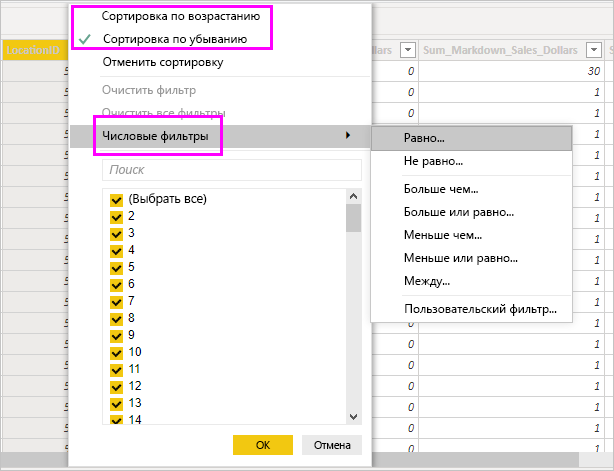

# Работа с представлением данных в Power BI Desktop

*Представление данных* позволяет проверять, изучать и анализировать данные в модели *Power BI Desktop*. Оно отличается от просмотра таблиц, столбцов и данных в *редакторе Power Query*. В представлении данных вы видите данные уже *после* их загрузки в модель.

> [!NOTE]
> Так как представление данных отображает данные после их загрузки в модель, значок представления данных не отображается, если все источники данных основаны на DirectQuery. 

При моделировании данных иногда требуется просмотреть фактическое содержимое столбца или таблицы без создания визуального элемента на холсте отчета. Возможно, вы захотите перейти к уровню строки. Это особенно полезно в тех случаях, когда вы создаете меры и вычисляемые столбцы или хотите определить тип данных или категорию данных.

Давайте рассмотрим некоторые элементы представления данных подробнее.

1. **Значок представления данных**. Щелкните этот значок для перехода в представление данных.

2. **Сетка данных**. Эта область показывает выбранную таблицу, а также все ее столбцы и строки. Столбцы, скрытые в представлении *Отчет*, выделены серым цветом. Вы можете щелкнуть столбец правой кнопкой мыши для отображения параметров.

3. **Лента моделирования**. Здесь вы можете управлять связями, создавать вычисления, изменять тип, формат или категорию данных для столбца.

4. **Строка формул**. Введите формулы DAX для мер и вычисляемых столбцов.

5. **Поиск**. Поиск таблицы или столбца в модели.

6. **Список полей**. Выберите таблицу или столбец для просмотра в сетке данных.

## Фильтрация в представлении данных

В представлении данных можно также фильтровать и сортировать данные. В каждом столбце есть значок, который указывает направление сортировки, если она применена.

Можно отфильтровывать отдельные значения или использовать расширенную фильтрацию на основе данных в столбце.

> [!NOTE]
> Если вы создаете модель Power BI с языком и региональными параметрами, отличными от текущего пользовательского интерфейса, поле поиска будет отображаться в пользовательском интерфейсе представления данных только для текстовых полей. Например, это относится к модели, созданной на английском языке [США], которую вы просматриваете на испанском языке.

## Дальнейшие действия

Power BI Desktop предоставляет широкие возможности. Дополнительные сведения об этих возможностях см. в следующих ресурсах.

* [Что такое Power BI Desktop?](../fundamentals/desktop-what-is-desktop.md)
* [Об использовании Редактора запросов в Power BI Desktop](../transform-model/desktop-query-overview.md)
* [Типы данных в Power BI Desktop](desktop-data-types.md)
* [Формирование и объединение данных в Power BI Desktop](desktop-shape-and-combine-data.md)
* [Общие задачи с запросами в Power BI Desktop](../transform-model/desktop-common-query-tasks.md)
