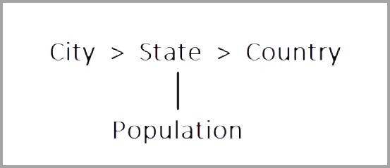
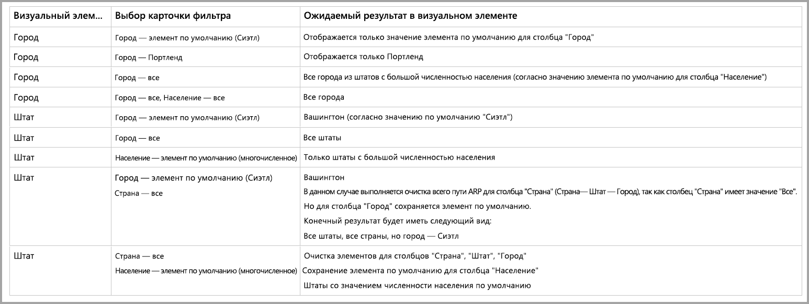

# Работа с многомерными моделями в Power BI

Power BI позволяет подключаться к многомерным моделям и создавать отчеты для визуализации всех видов данных в модели. При работе с многомерными моделями в Power BI применяются правила обработки данных с учетом того, какой столбец определен как *элемент по умолчанию*. 

Также Power BI обрабатывает данные из модели с учетом того, где используется столбец, который содержит атрибут **DefaultMember**. Атрибут *DefaultMember* настаивается с помощью CSDL для определенного столбца в многомерной модели. Дополнительные сведения об элементе по умолчанию см. в описании [свойств атрибута](https://docs.microsoft.com/sql/analysis-services/multidimensional-models/attribute-properties-define-a-default-member?view=sql-server-2017). При выполнении запроса DAX указанный в модели элемент по умолчанию применяется автоматически.

В статье описаны особенности использования Power BI при работе с многомерными моделями с учетом того, где находится *элемент по умолчанию*. 

## Работа с карточками фильтра

При создании карточки фильтра в поле с элементом по умолчанию значение этого поля выбирается автоматически в карточке фильтра. В результате все модели визуальных элементов, которые связаны с карточкой фильтра, сохраняются по умолчанию в базе данных. Значения в таких карточках фильтра соответствуют этому элементу по умолчанию.

Если элемент по умолчанию удаляется с отменой выбора значений, он очищается для всех визуальных элементов, к которым применяется карточка фильтра, после чего отображаемые значения не соответствуют элементу по умолчанию.

Предположим, у вас есть столбец *Currency* (Валюта) с элементом по умолчанию *USD* (Долл. США).

* В этом случае, если у вас есть карточка со значением *Total Sales* (Общий объем продаж), к нему применяется элемент по умолчанию, который отображает продажи в долларах США.
* Если перетащить столбец *Currency* (Валюта) на панель карточки фильтра, значение *USD* (Долл. США) будет отображаться в качестве значения по умолчанию. Значение *Total Sales* (Общий объем продаж) остается таким же, так как применен выбранный элемент по умолчанию.
* Но если отменить выделение значения *USD* (Долл. США) на карточке фильтра, элемент по умолчанию для столбца *Currency*(Валюта) очищается, и значение *Total Sales* (Общий объем продаж) отображается в разных валютах.
* Следовательно, если в карточке фильтра выбрать другое значение (например, *EURO* (Евро)) вместе с элементом по умолчанию, значение *Total Sales* (Общий объем продаж) будет отображать фильтр *Currency IN {USD, EURO}* (Валюта в {долл. США, евро}).

## Поведение группирования

В Power BI при каждом группировании визуальных элементов с *элементом по умолчанию* Power BI очищает *элемент по умолчанию* для выбранного столбца и пути связи атрибутов. Это гарантирует, что визуальный элемент отображает все значения, а не только значения по умолчанию.

## Пути связи атрибутов (ARP)

Хотя пути связи атрибутов (ARP) расширяют возможности *элементов по умолчанию*, они также усложняют работу с ними. При обнаружении ARP Power BI переходит по указанному пути для очистки дополнительных элементов по умолчанию в других столбцах. Это обеспечивает последовательную и точную обработку данных для визуальных элементов.

Давайте рассмотрим пример, иллюстрирующий это поведение. Мы будем использовать следующую конфигурацию ARP.

Теперь давайте зададим следующие *элементы по умолчанию* для столбцов:

* City > Seattle (Город > Сиэтл)
* State > WA (Штат > Вашингтон)
* Country > US (Страна или регион > США)
* Population > Large (Население > многочисленное)

Теперь давайте посмотрим, что происходит, когда каждый столбец используется в Power BI. Ниже приведены результаты для группы визуальных элементов по следующим столбцам:

* **City** (Город) — Power BI отображает все города, очистив **элементы по умолчанию** для столбцов *City* (Город), *State* (Штат), *Country* (Страна), но сохраняет **элемент по умолчанию** для столбца *Population* (Население). Кроме того, Power BI полностью очищает ARP для столбца *City* (Город).
    > [!NOTE]
    > Столбца *Population* (Население) нет в ARP столбца *City* (Город) — этот столбец связан только со столбцом *State* (Штат), и поэтому Power BI не очищает его.
* **State** (Штат) — Power BI отображает все значение, определенные для столбца *State* (Штат), очистив **элементы по умолчанию** для столбцов *City* (Город), *State* (Штат), *Country* (Страна) и *Population* (Население).
* **Country** (Страна или регион) — Power BI отображает все страны и регионы, очистив все **элементы по умолчанию** для столбцов *City* (Город), *State* (Штат) и *Country* (Страна или регион), и сохраняет **элемент по умолчанию** для столбца *Population* (Население).
* **City, State** (Город, Штат) — Power BI очищает все **элементы по умолчанию** для всех столбцов.

Группы, отображаемые в визуальном элементе, имеют очищенный ARP. 

Если группа не отображается в визуальном элементе, но при этом является частью ARP другого сгруппированного столбца, применяется следующая логика:

* Не все ветви ARP очищаются автоматически.
* Группа по-прежнему фильтруется этим неочищенным **элементом по умолчанию**.

### Срезы и карточки фильтра

При работе со срезами или карточками фильтра, применяется следующее поведение:

* При загрузке среза или карточки фильтра с данными Power BI группирует столбец в визуальном элементе так, чтобы поведение при отображении соответствовало описанному выше.

Так как срезы и карточки фильтра часто используются для взаимодействия с другими визуальными элементами, логика очистки **элементов по умолчанию** для задействованных визуальных элементов применяется в соответствии с таблицей ниже. 

В этой таблице используются данные из примера выше:

Чтобы определить поведение Power BI в этих условиях, применяются следующие правила.

Power BI очищает **элемент по умолчанию** для выбранного столбца, если:

* Power BI группирует данные по этому столбцу;
* Power BI группирует данные по столбцу, связанному с этим столбцом (в любом расположении в пределах ARP, выше или ниже);
* Power BI применяет фильтр к столбцу, который включен в ARP (выше или ниже);
* столбец имеет карточку фильтра с состоянием *ALL* (Все);
* столбец имеет карточку фильтра с любым выбранным значением (Power BI получает фильтр для столбца).

Power BI не очищает **элемент по умолчанию** для выбранного столбца, если:

* столбец имеет карточку фильтра с состоянием по умолчанию, и Power BI группирует данные по столбцу в соответствующем ARP;
* столбец расположен над другим столбцом в ARP, а в Power BI для другого столбца есть карточка фильтра в стандартном состоянии.

## Дальнейшие действия

В этой статье описано поведение Power BI при использовании элементов по умолчанию в многомерных моделях. Рекомендуем также ознакомиться со следующими материалами: 

* [Показать элементы без данных в Power BI](../create-reports/desktop-show-items-no-data.md)
* [Источники данных в Power BI Desktop](desktop-data-sources.md)
