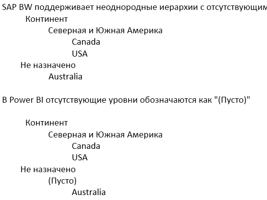

# Подключение к SAP Business Warehouse с помощью DirectQuery в Power BI
Вы можете подключиться к источникам данных **SAP Business Warehouse (BW)** напрямую с помощью **DirectQuery**. Учитывая OLAP и многомерный характер SAP BW, существует множество важных различий между использованием DirectQuery с SAP BW и реляционными источниками, например SQL Server. Эти различия можно обобщить следующим образом:

* При использовании **DirectQuery** с реляционными источниками есть набор запросов (как определено в диалоговых окнах **Получение данных** или **Редактор запросов**), которые логически определяют данные, доступные в списке полей. *Однако* при подключении к источнику OLAP, такому как SAP BW, все обстоит иначе. Вместо этого при подключении к серверу SAP с помощью окна **Получение данных** выбирается только запрос Infocube или BEx. После этого в списке полей станут доступны все ключевые показатели и измерения выбранного запроса Infocube или BEx.   
* Аналогично при подключении к SAP BW нет **редактора запросов**. Параметры источника данных (например, имя сервера) можно изменить, выбрав **Изменить запросы > Параметры источника данных**. Настройки всех параметров можно изменить, выбрав **Изменить запросы > Управление параметрами**.
* Учитывая уникальность источников OLAP, в дополнение к обычным ограничениям, установленным для DirectQuery, применяются дополнительные ограничения (как для моделирования, так и для визуализации). Эти ограничения описаны далее в этой статье.

Кроме того, *крайне важно* понимать, что существует множество возможностей SAP BW, которые не поддерживаются в Power B. Из-за особенностей общедоступного интерфейса SAP BW в некоторых важных случаях результаты, отображаемые в Power BI, будут не соответствовать тем, которые отображаются при использовании инструмента SAP. Эти ограничения описаны далее в этой статье. Эти ограничения и различия в работе следует тщательно проанализировать, чтобы правильно интерпретировать увиденные в Power BI результаты, возвращенные общедоступным интерфейсом SAP.  

> [!NOTE]
> DirectQuery на базе SAP BW можно было использовать в предварительной версии, до обновления Power BI Desktop в марте 2018 г. Отзывы и предложения, полученные на этапе предварительной версии, позволили внести изменения, которые затрагивают отчеты, созданные с помощью этой предварительной версии. Теперь, когда выпущена общедоступная версия DirectQuery на базе SAP BW, вам *нужно* удалить все имеющиеся (созданные в предварительной версии) отчеты, использующие DirectQuery на базе SAP BW. В отчетах, созданных с помощью предварительной версии DirectQuery на базе SAP BW, возникнут ошибки при вызове Refresh в результате попытки обновить метаданные с помощью изменений из базового куба SAP BW. Повторно создайте эти отчеты из пустого отчета, используя общедоступную версию DirectQuery на базе SAP BW. 

## Дополнительные ограничения моделирования
Ниже перечислены основные дополнительные ограничения моделирования при подключении к SAP BW с помощью DirectQuery в Power BI:

* **Вычисляемые столбцы не поддерживаются.** Возможность создания вычисляемых столбцов отключена. Это также означает, что группирование и кластеризация, которые создают вычисляемые столбцы, недоступны.
* **Дополнительные ограничения для мер.** На выражения DAX, которые могут использоваться в мерах, накладываются дополнительные ограничения, чтобы отразить уровень поддержки, предоставляемый SAP BW.
* **Определение связей не поддерживается.** Связи наследуются от внешнего источника SAP. Дополнительные связи в модели определить нельзя.
* **Нет представления данных.** **Представление данных** обычно отображает детальные данные в таблицах. Учитывая характер источников OLAP, таких как SAP BW, это представление недоступно для SAP BW.
* **Сведения о столбцах и мерах фиксированы.** Список столбцов и мер, которые видны в списке полей, фиксируется базовым источником, и его нельзя изменить. Например, нельзя удалить столбец или изменить его тип данных (однако его можно переименовать).
* **Дополнительные ограничения в DAX.** Для функций DAX, которые могут использоваться в определениях мер, накладываются дополнительные ограничения в соответствии с ограничениями в источнике. Например, невозможно использовать агрегатную функцию для таблицы.

## Дополнительные ограничения визуализации
Ниже перечислены основные дополнительные ограничения визуализации при подключении к SAP BW с помощью DirectQuery в Power BI:

* **Агрегирование столбцов не поддерживается.** Невозможно изменить параметры агрегирования для столбца в визуализации. Всегда указано значение *Не суммировать*.
* **Фильтрация мер отключена.** Фильтрация мер отключена в соответствии с поддержкой, предлагаемой SAP BW.
* **Множественный выбор, включение и исключение.** Возможность выбора нескольких точек данных для визуализации отключена, если точки представляют значения из нескольких столбцов. Например, в линейчатой диаграмме, показывающей выручку от продаж по странам с категориями в условных обозначениях, было бы невозможно выбрать точку для "США, велосипеды" и "Франция, одежда". Точно так же невозможно было бы выбрать точку для "США, велосипеды" и исключить ее из визуализации. Оба ограничения накладываются для отражения поддержки, предлагаемой SAP BW.

## Поддержка функций SAP BW
В следующей таблице перечислены все функции SAP BW, которые поддерживаются не полностью или работают иначе при использовании Power BI.   

| Избранное | Описание |
| --- | --- |
| Локальные вычисления |Локальные вычисления, определяемые в запросе BEx, изменяют числа, отображаемые с помощью таких инструментов, как BEx Analyzer. Однако они не отражаются в числах, возвращенных из SAP через общедоступный интерфейс многомерных выражений.     **Таким образом, числа, видимые в визуализации Power BI, не обязательно будут совпадать с числами для соответствующей визуализации в средстве SAP.**     Например, при подключении к кубу запроса из запроса BEx, который задает суммирующуюся агрегацию (например, текущую сумму), Power BI вернет базовые числа, игнорируя этот параметр.  Аналитик может затем применить расчет текущей суммы локально в Power BI, но должен будет проявлять осторожность в отношении интерпретации чисел. |
| Агрегации |В некоторых случаях (особенно при работе с несколькими валютами) числа агрегации, возвращенные общедоступным интерфейсом SAP, не соответствуют приведенным в средствах SAP.     **Таким образом, числа, видимые в визуализации Power BI, не обязательно будут совпадать с числами для соответствующей визуализации в средстве SAP.**     Например, итоги по разным валютам будут отображаться как "*" в BEx Analyzer, но общий итог будет возвращен общедоступным интерфейсом SAP без какой-либо информации, что сделает такое общее число бессмысленным. Поэтому число (агрегируя, скажем, доллар, евро и австралийский доллар) будет отображено в Power BI. |
| Форматирование денежных единиц |Ни одно форматирование валюты (например, $2,300 или 4000 AUD) не отражается в Power BI. |
| Единицы измерения |Единицы измерения (например, 230 кг) не отражаются в Power BI. |
| Ключ и текст (короткий, средний, длинный) |Для характеристики SAP BW, например центр затрат, в списке полей будет показан один столбец центра затрат.  При использовании этого столбца отобразится текст по умолчанию.  Показывая скрытые поля, также можно увидеть столбец уникальных имен (который возвращает уникальное имя, назначенное SAP BW, и является основой уникальности).     Ключ и другие текстовые поля недоступны. |
| Несколько иерархий характеристик |В **SAP** характеристика может иметь несколько иерархий. Затем в таких средствах, как BEx Analyzer, когда характеристика включена в запрос, пользователь может выбрать иерархию для использования.     В **Power BI** различные иерархии можно увидеть в списке полей как разные иерархии в одном измерении.  Однако выбор нескольких уровней из двух разных иерархий в одном измерении приведет к тому, что SAP вернет пустые данные. |
| Работа с неоднородными иерархиями | |
| Коэффициент масштабирования и изменения знака |В SAP ключевая цифра может иметь коэффициент масштабирования (например, 1000), определяемый как параметр форматирования, то есть весь вывод будет масштабирован в соответствии с этим коэффициентом.     Он также может иметь заданное свойство, которое меняет знак. Использование такой ключевой цифры в Power BI (в визуализации или в рамках вычисления) приведет к использованию немасштабированного числа (и знак не изменится). Базовый коэффициент масштабирования недоступен. В визуализациях Power BI единицами масштабирования, которые показаны на оси (K, M, B), можно управлять как частью форматирования визуализаций. |
| Иерархии с динамически возникающими и исчезающими уровнями |Изначально при подключении к SAP BW информация об уровнях иерархии будет извлечена, в результате чего в списке полей возникнет набор полей. Он кэшируется, и если набор уровней изменяется, то набор полей не изменяется до тех пор, пока не будет вызвано обновление.     Это возможно только в **Power BI Desktop**. Такое обновление для отображения изменений уровней не может быть вызвано в службе Power BI после публикации. |
| Фильтр по умолчанию |Запрос BEx может включать фильтры по умолчанию, которые будут автоматически применяться средством SAP BEx Analyzer. Они не отображаются, и следовательно, такое же использование в Power B не будет применять те же фильтры по умолчанию. |
| Скрытые ключевые показатели |Запрос BEx может управлять видимостью ключевых показателей, и те, которые скрыты, не появятся в SAP BEx Analyzer. Это не отображается в общедоступном API, поэтому такие скрытые показатели все равно будут отображаться в списке полей. Тем не менее они затем могут быть скрыты в Power BI. |
| Форматирование чисел |Любое форматирование чисел (число десятичных знаков, десятичная запятая и т. д.) не будет автоматически отражаться в Power BI. Тем не менее можно управлять таким форматированием в Power BI. |
| Управление версиями иерархии |SAP BW позволяет поддерживать различные версии иерархии, например иерархию центра затрат 2007 года и 2008 года. В Power BI доступна только последняя версия, так как информация о версиях не предоставляется общедоступным API. |
| Зависимые от времени иерархии |При использовании Power BI иерархии, зависящие от времени, вычисляются на текущую дату. |
| Преобразование валюты |SAP BW поддерживает конвертацию валют, основанную на курсах, хранящихся в кубе. Такие возможности не предоставляются общедоступным API и поэтому недоступны в Power BI. |
| Порядок сортировки |В SAP для характеристики может быть определен порядок сортировки (по тексту или по значению). Этот порядок сортировки не отражен в Power BI. Например, месяцы будут отображаться как "Апрель", "Авг" и т. д.     В Power BI невозможно изменить порядок сортировки. |
| Технические имена |В окне **Получение данных** могут быть видны имена (описания) характеристик или мер, а также технические имена. Список полей будет содержать только имена (описания) характеристик или мер. |
| Атрибуты |В Power BI невозможно получить доступ к атрибутам характеристики. |
| Параметр языка конечного пользователя |Языковой стандарт, используемый для подключения к SAP BW, устанавливается как часть сведений о подключении и не отображает языковой стандарт конечного пользователя отчета. |
| Текстовые переменные |SAP BW позволяет именам полей содержать заполнители для переменных (например, "фактические данные на $YEAR$"), которые затем будут заменены выбранным значением. Например, это поле отобразится как "фактические данные на 2016" в средствах BEx, если выбрать 2016 год как значение переменной.     Имя столбца в Power BI не изменится в зависимости от значения переменной и будет выглядеть как "фактические данные на $YEAR$".  Однако имя столбца можно изменить в Power BI. |
| Переменные выхода пользователя | Переменные выхода пользователя не предоставляются общедоступным API и не поддерживаются в Power BI. |
| Структуры характеристик | Использование структур характеристик в базовом источнике SAP BW приведет к стремительному росту мер, предоставляемых в Power BI. Например, при использовании двух мер Sales и Costs и структуры характеристик, содержащей Budget и Actual, будут предоставлены четыре меры: Sales.Budget, Sales.Actual, Costs.Budget, Costs.Actual. |

## Дальнейшие действия
Дополнительные сведения о DirectQuery см. в следующих статьях:

* [Power BI и DirectQuery](desktop-directquery-about.md)
* [Источники данных, поддерживаемые DirectQuery](power-bi-data-sources.md)
* [DirectQuery и SAP HANA](desktop-directquery-sap-hana.md)
