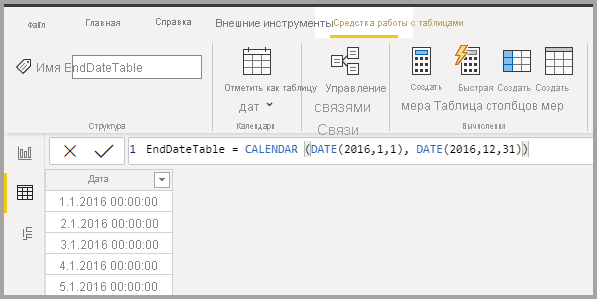
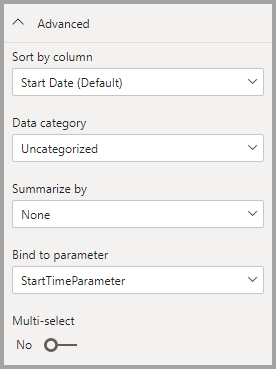

# <a name="dynamic-m-query-parameters-in-power-bi-desktop-preview"></a>Динамические параметры запроса M в Power BI Desktop (предварительная версия)

Используя **динамические параметры запроса M** , авторы моделей могут предоставить **читателям отчетов** возможность использовать фильтры или срезы для указания значений [параметра запроса M](/power-query/power-query-query-parameters), что может быть особенно полезно для оптимизации производительности запросов. Благодаря динамическим параметрам запроса M у авторов моделей есть дополнительный контроль над включением выбранных фильтров в запросы к источнику DirectQuery. 

Когда авторы модели понимают предполагаемую семантику своих фильтров, становится очевидно, как писать эффективные запросы к источнику данных. Таким образом можно гарантировать, что выбранные фильтры будут включены в исходные запросы в нужной точке, чтобы получить предполагаемые результаты с высокой производительностью.

## <a name="enabling-dynamic-m-query-parameters"></a>Включение динамических параметров запроса M

**Динамические параметры запроса M** сейчас предоставляются в предварительной версии и должны быть активированы для использования. Последовательно выберите элементы **Файл > Параметры и настройки > Параметры** , а затем на панели слева выберите **Функции на этапе предварительного просмотра** . После этого убедитесь, что установлен флажок **Dynamic M Query Parameters** (Динамические параметры запроса M). Чтобы изменения вступили в силу, необходимо перезапустить Power BI Desktop.


В качестве необходимого компонента для этой функции необходим допустимый [параметр запроса M](/power-query/power-query-query-parameters), созданный и упомянутый в одной или нескольких таблицах прямых запросов. Давайте рассмотрим пример динамической передачи **одиночного значения** параметру:

1. В Power BI Desktop запустите **Power Query** на вкладке **Данные** и выберите **New Parameters** "Новые параметры" в ленте **Управление параметрами** .

    

2. Затем заполните следующие сведения о параметре.

    

3. Щелкните пункт **Создать** еще раз, если необходимо добавить больше параметров.

    

4. После создания параметров можно сослаться на них в запросе M. Чтобы изменить запрос M, откройте Расширенный редактор, выбрав запрос, который необходимо изменить.

    

5. Затем добавьте ссылку на параметры запроса, выделенные желтым цветом на следующем изображении. 

    

6. Теперь, когда вы создали параметры и добавили на них ссылку в запросе M, необходимо создать таблицу со столбцом, предоставляющим возможные значения, доступные для этого параметра. Это позволит динамически устанавливать параметры на основе выбранных фильтров. В этом примере нам требуется, чтобы параметры *StartTime* и *EndTime* были динамическими. Так как для этих параметров требуются параметры даты и времени, нужно создать входные данные даты, которые можно использовать для указания даты для параметра. Для начала создадим новую таблицу:

    

7. Вот первая таблица, созданная для значений параметра *StartTime* :

    ```StartDateTable = CALENDAR (DATE(2016,1,1), DATE(2016,12,31))```

    

8. Далее указана вторая таблица, созданная для значений параметра EndTime:

    ```EndDateTable = CALENDAR (DATE(2016,1,1), DATE(2016,12,31))```

    

    > [!NOTE]
    > Рекомендуется использовать другое имя столбца, который не находится в реальной таблице. Если имена совпадают, выбранное значение будет применено в качестве фильтра к фактическому запросу.

9. После создания таблиц с полем *Дата* можно привязать каждое поле к параметру. Привязка поля к параметру фактически означает, что при изменении выбранного значения поля оно будет передано параметру и обновит запрос, на который ссылается параметр. Чтобы привязать поле, перейдите на вкладку **Моделирование** , выберите только что созданное поле, а затем перейдите к свойствам на вкладке **Дополнительно** :

    > [!NOTE]
    > Тип данных столбца должен совпадать с типом параметра M.

    

10. Выберите раскрывающийся список в разделе **Bind to parameter** (Привязка к параметру) и щелкните параметр, который необходимо привязать к полю:

    

    Так как этот пример предназначен для единичного значения (установка параметра для единичного значения), для параметра **Множественный выбор** следует выбрать значение по умолчанию **Нет** :

    

    Если для вариантов использования требуется множественный выбор (передача нескольких значений одному параметру), для параметра необходимо установить значение **Да** и убедиться, что запрос M настроен правильно, чтобы принимать несколько значений в запросе. Ниже приведен пример для запроса *RepoNameParameter* , который допускает несколько значений:

    

11. Повторите эти шаги, если у вас есть другие поля для привязки к другим параметрам:

    

12. Далее можно добавить ссылку на это поле в срезе или в виде фильтра:

    

Если для параметра множественного выбора сопоставленного столбца задано значение **Нет** , необходимо использовать один режим выбора в срезе или настроить единичный выбор на карточке фильтра.

## <a name="potential-security-risk"></a>Потенциальная угроза безопасности

Если вы разрешаете читателям отчетов динамически задавать значения параметров запроса M, то в зависимости от этих параметров читатели могут получить доступ к дополнительным данным или возможность изменения исходной системы с помощью **атак путем внедрения** . Это зависит от того, как в запросе M указываются параметры и какие значения передаются этому параметру.

Например, предположим, что имеется параметризованный запрос Kusto, построенный следующим образом:

```
Products
| where Category == [Parameter inserted here] & HasReleased == 'True'
 | project ReleaseDate, Name, Category, Region```
```

Возможно, у вас нет проблем с обычным пользователем, который передает соответствующее значение, например для параметра *Games* :

```
| where Category == 'Games' & HasReleased == 'True'
```

Однако злоумышленник может передать значение, изменяющее запрос для получения доступа к дополнительным данным, например *'Games' //* :

```
Products
| where Category == 'Games'// & HasReleased == 'True'
| project ReleaseDate, Name, Category, Region
```

В этом примере злоумышленник может получить доступ к сведениям об играх, которые еще не были выпущены, изменив часть запроса на комментарий.

**Устранение рисков**

Чтобы снизить риски безопасности, лучше избегать объединения строк значений параметров M в запросе.  Вместо этого следует использовать эти значения параметров в операциях M, которые относятся к исходному запросу, чтобы подсистема M и соединитель выстроили окончательный запрос. Кроме того, если доступно, используйте механизм передачи параметров, встроенный в язык исходного запроса и соединители. Например, [Azure Data Explorer](/azure/data-explorer/kusto/query/queryparametersstatement?pivots=azuredataexplorer) имеет встроенные возможности параметров запроса, предназначенные для защиты от атак путем внедрения.

Ниже приводится несколько примеров.

* Пример использования операций фильтрации запроса M:
    ```
    Table.SelectRows(Source, (r) =\&gt; r[Columns] = Parameter)
    ```

* Пример объявления параметра в исходном запросе (или передачи значения параметра в качестве входных данных в исходную функцию запроса):
    ```
    declare query\_parameters (Name of Parameter : Type of Parameter);
    ```

## <a name="considerations-and-limitations"></a>Рекомендации и ограничения

Существуют рекомендации и ограничения, которые следует учитывать при использовании динамических параметров запроса M:

* Один параметр нельзя привязать к нескольким полям и наоборот.
* Эта функция поддерживается только для источника данных на основе M и исключает поддержку собственного SQL-запроса.
* Ниже приведены неподдерживаемые типы встроенных параметров.
  * Любой
  * Duration
  * Истина/ложь
  * Двоичные данные

* Неподдерживаемые фильтры:
  * Относительный временной срез или фильтр
  * Относительная дата
  * Иерархический срез
  * Фильтр с несколькими полями
  * Фильтры Exclude или Not
  * Перекрестное выделение
  * Фильтр детализации
  * Фильтры перекрестной детализации
  * Фильтры первых N элементов
* Неподдерживаемые операции
  * И
  * Содержит
  * Меньше чем
  * Больше чем
  * Начинается с
  * Не начинается с
  * Не является
  * Не содержит
  * Выбрать все
  * Не указано
  * Не является пустым


## <a name="next-steps"></a>Дальнейшие действия

Power BI Desktop предоставляет широкие возможности. Дополнительные сведения об этих возможностях см. в следующих ресурсах.

* [Использование DirectQuery в Power BI](desktop-directquery-about.md)
* [Что такое Power BI Desktop?](../fundamentals/desktop-what-is-desktop.md)
* [Об использовании Редактора запросов в Power BI Desktop](../transform-model/desktop-query-overview.md)
* [Типы данных в Power BI Desktop](desktop-data-types.md)
* [Формирование и объединение данных в Power BI Desktop](desktop-shape-and-combine-data.md)
* [Общие задачи с запросами в Power BI Desktop](../transform-model/desktop-common-query-tasks.md)