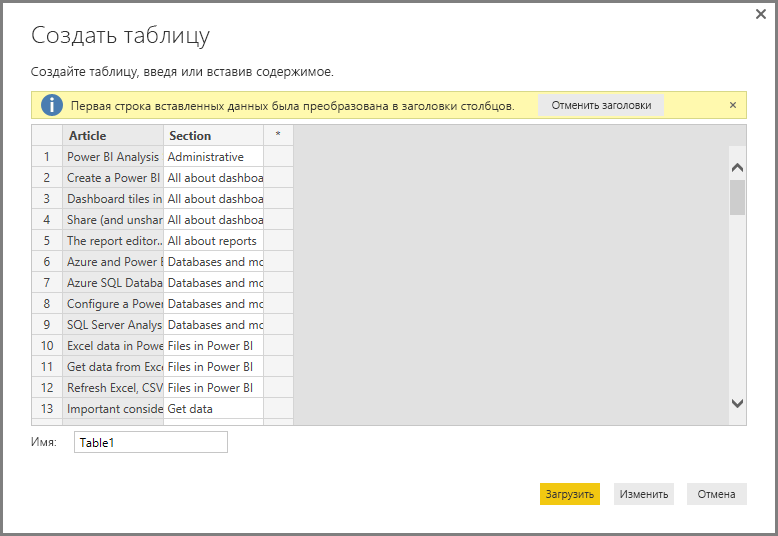

# Ввод данных непосредственно в Power BI Desktop

Вы можете вводить данные непосредственно в Power BI Desktop и использовать их в своих отчетах и визуализациях. Например, можно скопировать часть книги или веб-страницы, а затем вставить ее в Power BI Desktop.

Чтобы ввести данные в виде новой таблицы непосредственно в Power BI Desktop, выберите **Введите данные** на ленте **Главная**.

Power BI Desktop может попытаться применить к значениям несущественные преобразования, если это понадобится, как и при загрузке данных из любого источника. Например, в приведенном ниже примере первая строка преобразуется в заголовки.

Если необходимо преобразовать форму введенных или вставленных данных, выберите **Правка**, чтобы открыть **Редактор запросов**. Вы можете формировать и преобразовывать данные перед их переносом в Power BI Desktop. Выберите **Загрузить**, чтобы импортировать данные по мере их появления.

При нажатии кнопки **Загрузить** Power BI Desktop создает на основе данных новую таблицу, которая появляется в области **Поля**. На изображении ниже Power BI Desktop демонстрирует новую таблицу (ей присвоено название *Таблица1*), а также два поля в ней.

Вот и все. Таким образом, вводить данные в Power BI Desktop очень просто.

Теперь все готово к использованию данных в Power BI Desktop. Вы можете создавать визуальные элементы и отчеты, а также подключать и импортировать прочие сведения, например книги Excel, базы данных и любые другие источники данных.

## Дальнейшие действия

В Power BI Desktop можно подключаться к данным самых разных видов. Дополнительные сведения об источниках данных см. в перечисленных ниже статьях.

* [Что такое Power BI Desktop?](../fundamentals/desktop-what-is-desktop.md)
* [Источники данных в Power BI Desktop](desktop-data-sources.md)
* [Формирование и объединение данных в Power BI Desktop](desktop-shape-and-combine-data.md)
* [Подключение к данным Excel в Power BI Desktop](desktop-connect-excel.md)
* [Подключение к CSV-файлам в Power BI Desktop](desktop-connect-csv.md)
