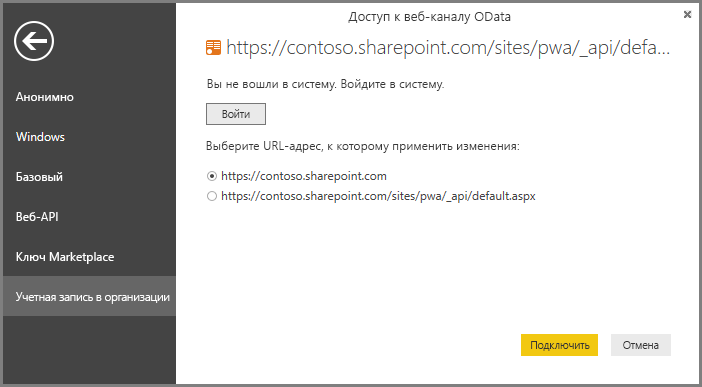

# Подключение к данным Project Online через Power BI Desktop
К данным в Project Online можно подключиться с помощью Power BI Desktop.

## Шаг 1. Скачивание Power BI Desktop
1. [Скачайте Power BI Desktop](https://go.microsoft.com/fwlink/?LinkID=521662) и запустите программу установки, чтобы установить **Power BI Desktop** на свой компьютер.

## Шаг 2. Подключение к Project Online с помощью OData
1. Откройте **Power BI Desktop**.
2. На *экране приветствия* выберите **Получить данные**.
3. Выберите **канал OData** и щелкните **Подключить**.
4. Введите адрес для канала OData в поле URL-адреса и нажмите кнопку ОК.
   
   Если адрес сайта вашего веб-приложения Project имеет формат *https://\<tenantname\>.sharepoint.com/sites/pwa*, адрес канала OData должен быть в формате *https://\<tenantname\>.sharepoint.com/sites/pwa/\_api/Projectdata*.
   
   В нашем примере используется

    `https://contoso.sharepoint.com/sites/pwa/default.aspx`

5. Power BI Desktop предложит вам пройти проверку подлинности рабочей или учебной учетной записи. Выберите учетную запись организации и введите свои учетные данные.
   
   

Учетная запись, используемая для подключения к каналу OData, должна иметь на сайте Project Web App уровень доступа не ниже Portfolio Viewer (Просмотр портфеля проектов). 

Здесь можно выбрать таблицы, к которым нужно подключиться, и создать запрос.  Хотите узнать, как приступить к работе?  В следующей записи блога показано, как создавать диаграммы сгорания задач на основе данных Project Online.  В записи блога для подключения к Project Online используется Power Query, но то же самое относится и к Power BI Desktop.

[Создание диаграмм сгорания задач для Project с помощью Power Pivot и Power Query](https://blogs.office.com/2014/03/24/creating-burndown-charts-for-project-using-power-pivot-and-power-query/)

