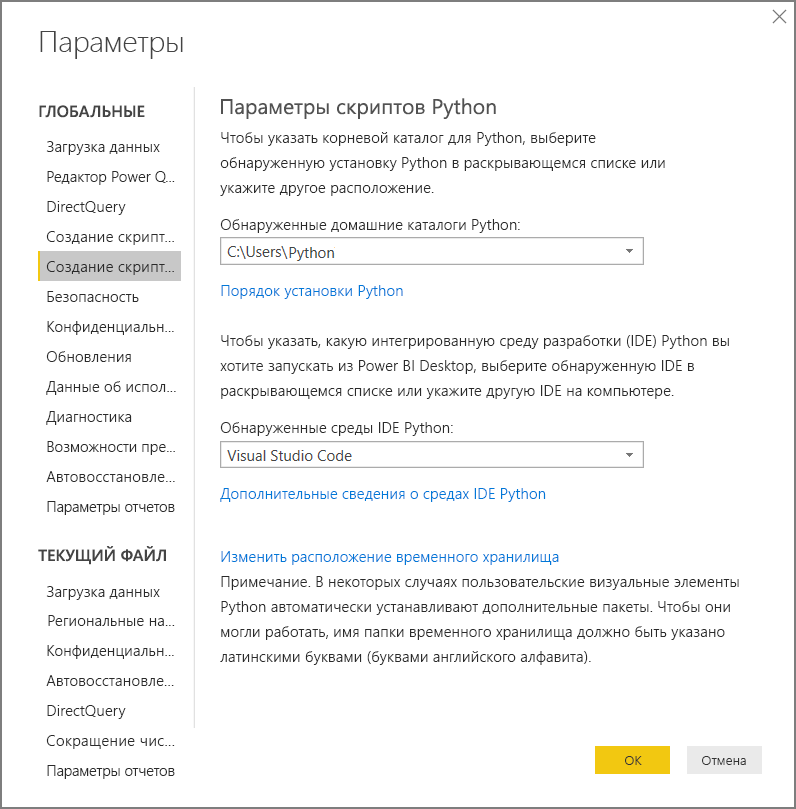
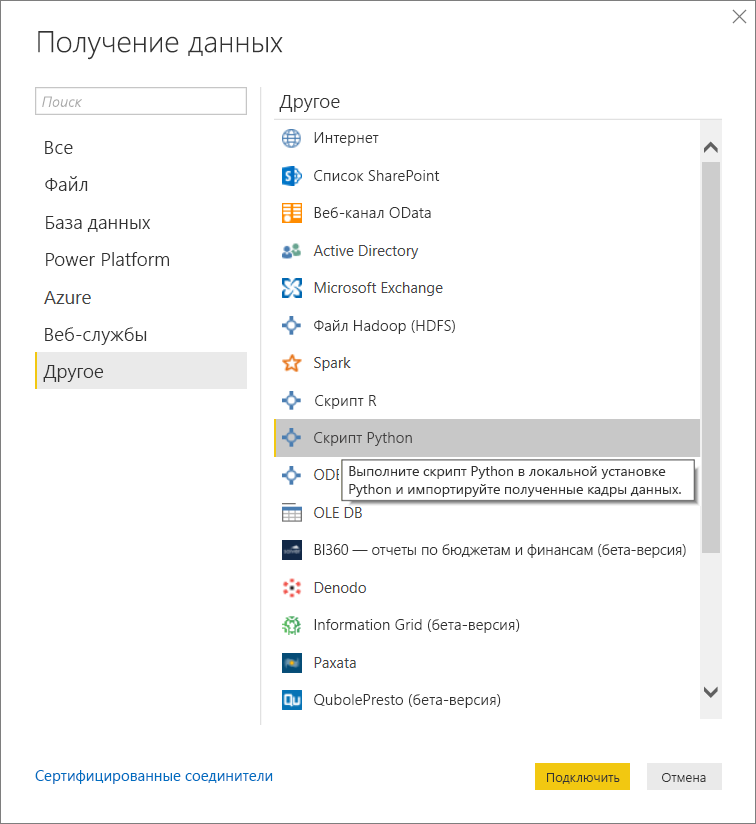
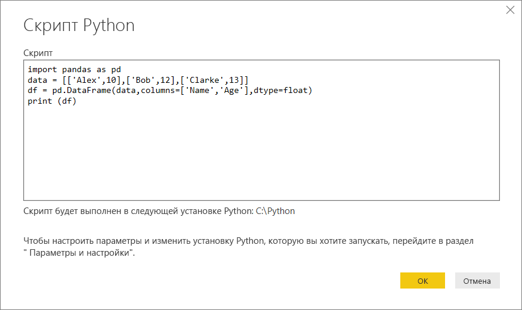
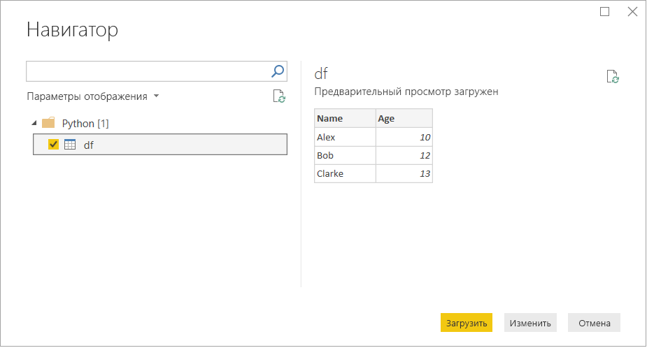
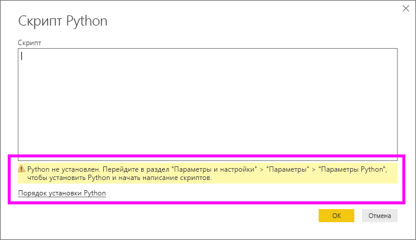

# <a name="run-python-scripts-in-power-bi-desktop"></a>Запустить сценарий Python в Power BI Desktop

Вы можете выполнять скрипты Python непосредственно в Power BI Desktop и импортировать полученные наборы данных в модель данных Power BI Desktop.

## <a name="install-python"></a>Установка Python

Для запуска сценариев Python в Power BI Desktop необходимо установить Python на локальном компьютере. Скачать Python можно с [веб-сайта Python](https://www.python.org/). В текущем выпуске скриптов Python поддерживаются символы Юникода и пробелы в пути установки.

### <a name="install-required-python-packages"></a>Установка необходимых пакетов Python

Для интеграции Power BI с Python требуется установить два пакета Python:

* [Pandas](https://pandas.pydata.org/). Библиотека программного обеспечения для обработки и анализа данных. В ней предоставляются структуры данных и операции для управления числовыми таблицами и временными рядами. Импортированные данные должны находиться в [кадре данных pandas](https://www.tutorialspoint.com/python_pandas/python_pandas_dataframe.htm). Кадр данных представляет собой двухмерную структуру данных. Например, данные могут быть организованы в табличном виде в строках и столбцах.
* [Matplotlib](https://matplotlib.org/). Библиотека построения для Python и его числового математического расширения [NumPy](https://www.numpy.org/). В ней предоставляется объектно-ориентированный API для внедрения графиков в приложения с использованием универсальных наборов средств графического пользовательского интерфейса, таких как Tkinter, wxPython, Qt, GTK+ и другие.

В консоли или оболочке используйте для установки этих двух пакетов программу командной строки [pip](https://pip.pypa.io/en/stable/). Средство pip входит в состав последних версий Python.

```CMD
pip install pandas
pip install matplotlib
```

## <a name="enable-python-scripting"></a>Включение скриптов Python

Включение скриптов Python:

1. В Power BI Desktop последовательно выберите **Файл** > **Параметры и настройки** > **Параметры** > **Создание скриптов Python**. Откроется страница **Параметры скриптов Python**.

   

1. При необходимости укажите локальный путь установки Python в разделе **Обнаруженные домашние каталоги Python**.

   На приведенном выше рисунке используется следующий локальный путь установки Python: *C:\Python*. Путь должен соответствовать расположению каталога с локальной установленной версией Python, которая будет использоваться службой Power BI Desktop.

1. Нажмите кнопку **ОК**.

После указания установленной версии Python все готово к выполнению скриптов Python в Power BI Desktop.

## <a name="run-python-scripts"></a>Запустить сценарии Python

Для запуска скриптов Python и создания модели данных достаточно выполнить несколько шагов. На основе этой модели можно создавать отчеты и передавать их в службу Power BI для общего доступа.

### <a name="prepare-a-python-script"></a>Подготовка сценария Python

Создайте скрипт в локальной среде разработки Python и убедитесь, что он выполняется успешно. Ниже приводится пример простого скрипта Python, который импортирует pandas и использует кадр данных:

```python
import pandas as pd
data = [['Alex',10],['Bob',12],['Clarke',13]]
df = pd.DataFrame(data,columns=['Name','Age'],dtype=float)
print (df)
```

При запуске этот скрипт возвращает:

```python
     Name   Age
0    Alex  10.0
1     Bob  12.0
2  Clarke  13.0
```

При подготовке и выполнении сценариев Python в Power BI Desktop действуют некоторые ограничения.

* Импортируются только кадры данных pandas, поэтому убедитесь, что импортируемые в Power BI данные представлены в кадре.
* Любой сценарий Python, который выполняется дольше 30 минут, завершается по истечении времени ожидания.
* Интерактивные вызовы в сценарии Python, например ожидание ввода данных пользователем, прерывают выполнение сценария.
* При настройке рабочего каталога в сценарии Python *необходимо* задать полный, а не относительный путь каталога.
* Вложенные таблицы на данный момент не поддерживаются.

### <a name="run-your-python-script-and-import-data"></a>Выполнение сценария Python и импорт данных

Выполнение скрипта Python в Power BI Desktop:

1. На вкладке ленты "Главная" выберите **Получить данные** > **Другое**.

1. Выберите **Другое** > **Скрипт Python**, как показано на следующем рисунке:

   

1. Выберите команду **Создать**. В качестве подсистемы Python выбирается локальная самая новая установленная версия Python. Скопируйте скрипт в появляющееся диалоговое окно **Скрипт Python**. Здесь мы вводим простой скрипт Python, показанный ранее.

   

1. Нажмите кнопку **ОК**. Если скрипт успешно выполняется, появляется окно **Навигатор**, в котором вы можете загрузить и использовать данные. Например, установите флажок **df**, как показано на следующем рисунке, после чего выберите **Загрузить**.

    

### <a name="troubleshooting"></a>Устранение неполадок

Если средство Python не установлено или не определено, отображается предупреждение. Кроме того, может отображаться предупреждение о наличии нескольких установленных версий на локальном компьютере. Снова ознакомьтесь с ранее приведенными разделами "Установка Python" и "Включение скриптов Python".



#### <a name="using-custom-python-distributions"></a>Использование пользовательских дистрибутивов Python

Power BI выполняет скрипты напрямую с помощью исполняемого файла python.exe из каталога, указанного пользователем на странице параметров. Выполнение дистрибутивов, требующих дополнительного шага для подготовки среды (например, Conda), может завершаться сбоем.

Во избежание таких проблем мы рекомендуем использовать официальный дистрибутив Python с сайта https://www.python.org/.

В качестве возможного решения вы можете запустить Power BI Desktop из командной строки пользовательской среды Python.

### <a name="refresh"></a>Обновить

Вы можете обновить сценарий Python в Power BI Desktop. Чтобы выполнить обновление, перейдите на вкладку ленты **Главная** и выберите **Обновить**. При обновлении скрипта Python служба Power BI Desktop запускает его повторно.

## <a name="next-steps"></a>Дальнейшие действия

Ознакомьтесь с дополнительными материалами по Python в Power BI.

* [Создание визуальных элементов Python в приложении Power BI Desktop](desktop-python-visuals.md)
* [Использование внешней среды Python IDE с Power BI](desktop-python-ide.md)
