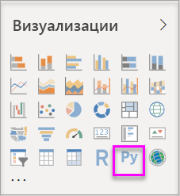
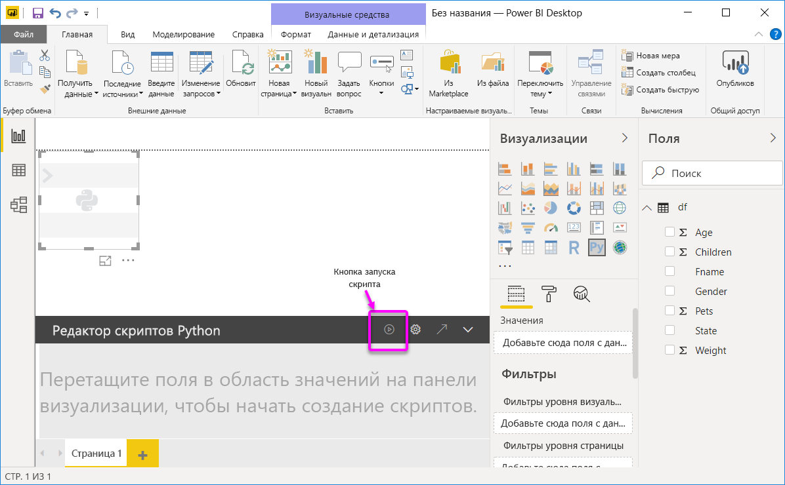
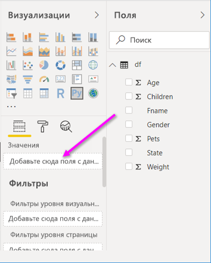
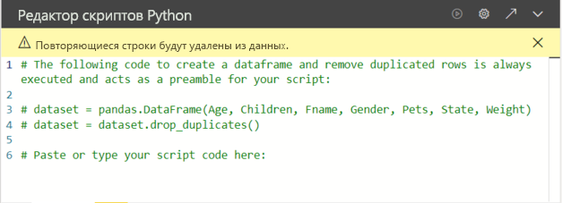
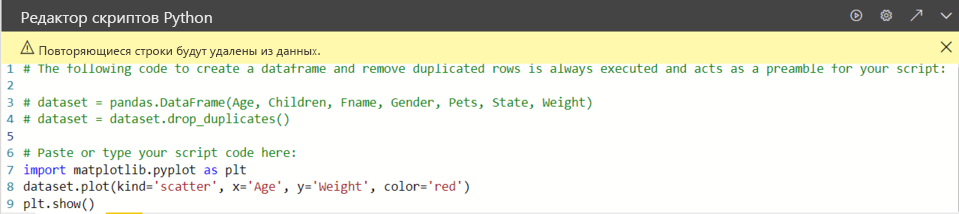
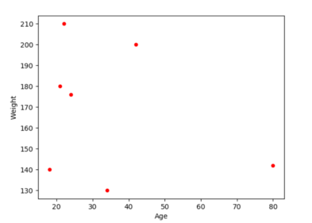

# <a name="create-power-bi-visuals-by-using-python"></a>Создание визуальных элементов Power BI с помощью Python

В приложении *Power BI Desktop* для визуализации данных можно использовать Python.

## <a name="prerequisites"></a>Предварительные требования

Выполните пошаговое руководство [Выполнение скриптов Python в Power BI Desktop](desktop-python-scripts.md) с использованием следующего скрипта Python:

```python
import pandas as pd 
df = pd.DataFrame({ 
    'Fname':['Harry','Sally','Paul','Abe','June','Mike','Tom'], 
    'Age':[21,34,42,18,24,80,22], 
    'Weight': [180, 130, 200, 140, 176, 142, 210], 
    'Gender':['M','F','M','M','F','M','M'], 
    'State':['Washington','Oregon','California','Washington','Nevada','Texas','Nevada'],
    'Children':[4,1,2,3,0,2,0],
    'Pets':[3,2,2,5,0,1,5] 
}) 
print (df) 
```

В статье [Выполнение скриптов Python в Power BI Desktop](desktop-python-scripts.md) демонстрируется установка Python на локальном компьютере и включение этого средства для работы со скриптами Python в Power BI Desktop. В этом руководстве используются данные из приведенного выше скрипта для демонстрации создания визуальных элементов Python.

## <a name="create-python-visuals-in-power-bi-desktop"></a>Создание визуальных элементов Python в приложении Power BI Desktop

1. Щелкните значок **визуального элемента Python** на панели **Визуализации**.

   

1. В появляющемся диалоговом окне **Включить визуальные элементы сценария** выберите **Включить**.

    При добавлении визуального элемента Python в отчет служба Power BI Desktop выполняет приведенные ниже действия.

    - На холсте отчета появляется изображение заполнителя для визуального элемента Python.

    - В нижней части центральной области открывается **редактор скриптов Python**.

    

1. Затем перетащите поля **Возраст**, **Дочерние**, **Fname**, **Пол**, **Домашние питомцы**, **Состояние** и **Вес** в раздел **Значения**, где приводится надпись **Добавьте сюда поля с данными**.

    

   Скрипт Python может использовать только поля, добавленные в раздел **Values**. Вы можете добавлять или удалять поля из раздела **Values** при работе со скриптом Python. Служба Power BI Desktop автоматически обнаруживает изменения полей.

   > [!NOTE]
   > По умолчанию для визуальных элементов Python используется тип агрегирования *не суммировать*.
   > 
   > 

1. Теперь выбранные данные можно использовать для создания визуализации.

    При выборе и удалении полей соответствующим образом автоматически создается и удаляется связующий код в редакторе скриптов Python. 

    Основываясь на выборе редактор скриптов Python создает следующий код привязки.

    - Редактор создает кадр данных *dataset*, содержащий добавленные вами поля.
    - По умолчанию используется тип агрегирования *Не суммировать*.
    - Аналогично визуальным элементам таблиц поля сгруппированы, а одинаковые строки отображаются только один раз.

    

     > [!TIP]
     > В определенных случаях автоматическая группировка не нужна либо нужно, чтобы отображались все строки, в том числе одинаковые. В такой ситуации в набор данных можно добавить индексное поле, в результате чего все строки будут считаться уникальными и не будут объединяться в группы.

   Доступ к столбцам в наборе данных можно получить с помощью соответствующих им имен. Например, вы можете использовать в скрипте Python код `dataset["Age"]` для доступа к полю возраста.

1. После автоматического создания кадра данных с выбранными полями можно написать сценарий Python, который строит визуализацию на устройстве Python по умолчанию. После завершения скрипта нажмите кнопку **Выполнить** в строке заголовка **Редактор скриптов Python**.

   Служба Power BI Desktop выполняет повторное построение визуального элемента каждый раз, когда:

   - вы нажимаете кнопку **Выполнить** в строке заголовка **Редактор скриптов Python**;
   - происходит изменение данных (в результате обновления, применения фильтра или выделения).

   Если при выполнении скрипта Python возникает ошибка, то построение визуального элемента Python не выполняется, а на холсте появится сообщение об ошибке. Чтобы просмотреть сведения об ошибке, щелкните **Подробнее** в сообщении об ошибке.

   Чтобы увеличить область визуализации, **редактор скриптов Python** можно свернуть.

Далее создадим несколько визуальных элементов.

## <a name="create-a-scatter-plot"></a>Создание точечной диаграммы

Создадим точечную диаграмму, которая будет отображать корреляцию между возрастом и весом.

1. В разделе **Вставьте или введите здесь код скрипта** введите следующий код:

   ```python
   import matplotlib.pyplot as plt 
   dataset.plot(kind='scatter', x='Age', y='Weight', color='red')
   plt.show() 
   ```  

   Панель редактора скриптов Python должна выглядеть следующим образом:

   

   Библиотека **matplotlib** импортируется на диаграмму и используется для создания визуальных элементов.

1. При нажатии кнопки **Выполнить** для скрипта в местозаполнителе изображения Python создается следующая точечная диаграмма.

   

## <a name="create-a-line-plot-with-multiple-columns"></a>Создание графика с несколькими столбцами

 Далее создадим для каждого участника график, на котором отображается количество детей и домашних животных. Удалите или закомментируйте код в разделе **Вставьте или введите здесь код скрипта** и введите следующий код Python:

 ```python
 import matplotlib.pyplot as plt 
ax = plt.gca() 
dataset.plot(kind='line',x='Fname',y='Children',ax=ax) 
dataset.plot(kind='line',x='Fname',y='Pets', color='red', ax=ax) 
plt.show() 
```

При нажатии кнопки **Выполнить** для скрипта создается следующий график с несколькими столбцами.


## <a name="create-a-bar-plot"></a>Создание линейчатой диаграммы

Теперь создадим линейчатую диаграмму, на которой будет отображаться возраст каждого участника. Удалите или закомментируйте код в разделе **Вставьте или введите здесь код скрипта** и введите следующий код Python:

```python
import matplotlib.pyplot as plt 
dataset.plot(kind='bar',x='Fname',y='Age') 
plt.show() 
```

При нажатии кнопки **Выполнить** для скрипта создается следующая линейчатая диаграмма:

 

## <a name="security"></a>Безопасность

> [!IMPORTANT] 
> **Безопасность скриптов Python**. Визуальные элементы Python создаются на основе скриптов Python, которые могут содержать код, не обеспечивающий достаточный уровень безопасности или конфиденциальности. При первой попытке просмотра визуальных элементов Python или взаимодействии с ними пользователь видит предупреждение системы безопасности. Включайте визуальные элементы Python, только если доверяете автору и источнику либо после проверки и ознакомления со сценариями Python.
>  

## <a name="more-information-about-plotting-with-matplotlib-pandas-and-python"></a>Дополнительные сведения о построении с использованием Matplotlib, Pandas и Python

В этом руководстве приводятся сведения, позволяющие приступить к созданию визуальных элементов с использованием Python в службе Power BI Desktop. В нем рассматривается лишь малая часть параметров и возможностей для создания визуальных отчетов с использованием Python, Pandas и библиотеки Matplotlib. Если вы хотите узнать больше, воспользуйтесь следующими ссылками.

- Документация на веб-сайте [Matplotlib](https://matplotlib.org/). 
- [Руководство по Matplotlib. Основные рекомендации по использованию Matplotlib с Python](https://www.datasciencelearner.com/matplotlib-tutorial-complete-guide-to-use-matplotlib-with-python/) 
- [Руководство по Matplotlib. Библиотека Python Matplotlib с примерами](https://www.edureka.co/blog/python-matplotlib-tutorial/) 
- [Справочник по API Pandas](https://pandas.pydata.org/pandas-docs/stable/reference/index.html) 
- [Визуализации Python в службе Power BI](https://powerbi.microsoft.com/blog/python-visualizations-in-power-bi-service/) 
- [Использование визуальных элементов Python в Power BI](https://www.absentdata.com/how-to-user-python-and-power-bi/)

## <a name="known-limitations"></a>Известные ограничения

У визуальных элементов Python в Power BI Desktop есть несколько ограничений:

- ограничения размера данных. Для нанесения на холст визуальный элемент Python может использовать до 150 000 строк. Если выбрано больше строк, используются только первые 150 000 из них; при этом на изображении появляется соответствующее сообщение. Кроме того, входные данные имеют ограничение в 250 МБ. 
- Решение. Все визуальные элементы Python отображаются с разрешением 72 DPI.
- Ограничение на время вычисления. Если время вычисления для визуального элемента Python превышает пять минут, истекает время ожидания выполнения, что приводит к ошибке.
- Связи. как и при работе с другими визуальными элементами Power BI Desktop, при выборе полей данных из разных таблиц, между которыми не определены связи, возникает ошибка.
- Визуальные элементы Python обновляются при обновлении данных, применении фильтрации и выделения. Однако само изображение не является интерактивным и не может служить источником для перекрестной фильтрации.
- Визуальные элементы Python реагируют на выделение других визуальных элементов, однако выполнять перекрестную фильтрацию, выбирая объекты на визуальном элементе Python, нельзя.
- На холсте правильно отображаются только визуализации, построение которых выполняется на устройстве отображения Python по умолчанию. Не рекомендуется указывать явным образом другое устройство отображения Python.
- Визуальные элементы Python не поддерживают переименование столбцов входных данных. Во время выполнения скрипта обращение к столбцам происходит по их исходным именам.

## <a name="next-steps"></a>Дальнейшие действия

Ознакомьтесь с дополнительными материалами по Python в Power BI.

- [Выполнение скриптов Python в Power BI Desktop](desktop-python-scripts.md)
- [Использование внешней среды Python IDE с Power BI](desktop-python-ide.md)

