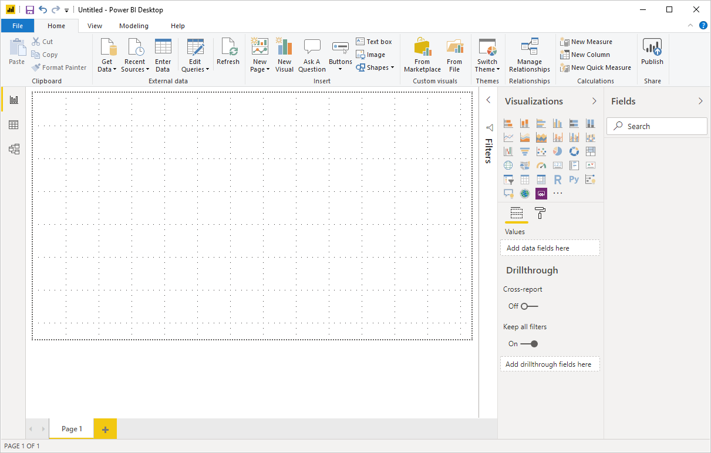
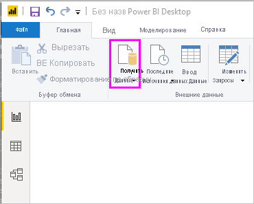
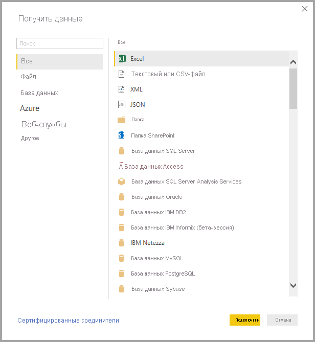
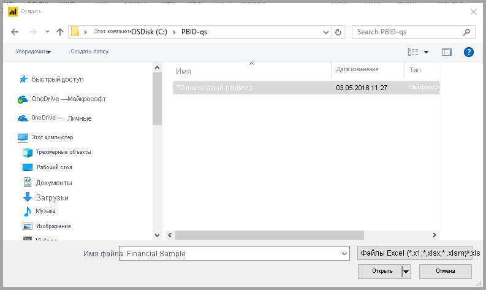

# Краткое руководство. Подключение к данным в Power BI Desktop

В этом кратком руководстве описано, как подключиться к данным с помощью Power BI Desktop, что является первым шагом в создании моделей данных и отчетов.

Если вы не зарегистрированы в Power BI, перед началом работы [пройдите бесплатную регистрацию](https://app.powerbi.com/signupredirect?pbi_source=web).

## Технические условия

Чтобы выполнить действия, описанные в этой статье, необходимы следующие ресурсы.

* Скачать и установить Power BI Desktop — бесплатное приложение, которое выполняется на локальном компьютере. Вы можете [скачать Power BI Desktop](https://powerbi.microsoft.com/desktop) напрямую или в [магазине Microsoft Store](https://aka.ms/pbidesktopstore).
* [Скачайте этот пример книги Excel](https://go.microsoft.com/fwlink/?LinkID=521962) и сохраните его в папку с именем *C:\PBID-qs*, которую нужно создать дополнительно. Для всех последующих этапов краткого руководства предполагается, что вы поместили эту книгу Excel в указанное расположение.
* Для многих соединителей данных для Power BI Desktop для проверки подлинности требуется Internet Explorer 10 (или более поздняя версия).

## Запуск Power BI Desktop

После установки Power BI Desktop запустите это приложение, чтобы оно выполнялось на локальном компьютере. Вам предлагается учебник по Power BI. Следуйте указаниям учебника или закройте диалоговое окно, чтобы начать с чистого холста. Холст позволяет создавать визуальные элементы и отчеты на основе данных.

## Подключение к данным

Power BI Desktop позволяет подключаться к данным разных типов. Эти источники содержат базовые источники данных, такие как файл Microsoft Excel. Например, вы можете подключиться к веб-службам с данными любых типов, например Salesforce, Microsoft Dynamics, хранилищу BLOB-объектов Azure и многим другим.

Для подключения к данным на ленте **Главная** выберите **Получить данные**.

Появится окно **Получение данных**. Вы можете выбрать любой из множества разных источников данных, поддерживаемых в Power BI Desktop. В этом кратком руководстве используйте книгу Excel, скачанную в [Необходимые компоненты](#prerequisites).

Так как источник данных — это файл Excel, нужно выбрать вариант **Excel** в окне **Получение данных**, а затем нажать кнопку **Подключиться**.

Power BI предложит вам указать расположение файла Excel, к которому мы хотим подключиться. Скачанный файл называется *финансовый пример*. Выберите этот файл, а затем выберите **Открыть**.

Power BI Desktop загрузит книгу и считает ее содержимое, а затем отобразит доступные в файле данные в окне **Навигатор**. В этом окне вы можете выбрать нужные данные для загрузки в Power BI Desktop. Чтобы выбрать таблицы для импорта, отметьте их флажками. Импортируйте обе доступные таблицы.

Выбрав все нужные данные, щелкните **Загрузить** для импорта данных в Power BI Desktop.

## Просмотр данных в области "Поля"

Когда загрузка таблиц завершится, панель **Поля** отобразит полученные данные. Вы можете развернуть здесь каждую таблицу, выбрав стрелку рядом с ее именем. На следующем рисунке показана развернутая таблица *finanсials* и все поля в ней.

Вот и все! Вы подключились к данным в Power BI Desktop, загрузили эти данные, и теперь вы можете видеть все доступные поля в этих таблицах.

## Дальнейшие действия

Power BI Desktop позволяет выполнять много разных операций с подключенными данными. Вы можете создавать визуальные элементы и отчеты. См. дополнительные сведения:

* [Начало работы с Power BI Desktop](../fundamentals/desktop-getting-started.md)
