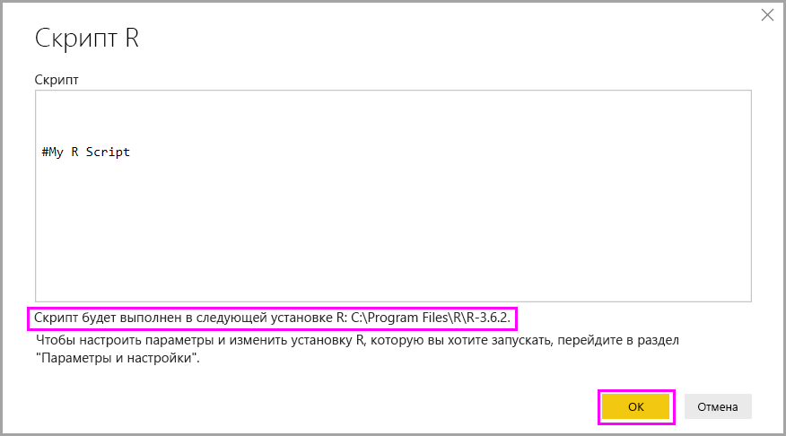

# Выполнение скриптов R в Power BI Desktop

Вы можете выполнять сценарии R непосредственно в Power BI Desktop и импортировать полученные наборы данных в модели данных Power BI Desktop.

## Установка скрипта R

Для запуска сценариев R в Power BI Desktop необходимо установить R на локальном компьютере. Вы можете скачать и установить R бесплатно из различных расположений, включая [Сеть приложений Microsoft R](https://mran.revolutionanalytics.com/download/) и [репозиторий CRAN](https://cran.r-project.org/bin/windows/base/). В текущем выпуске поддерживаются символы Юникода и пробелы (пустые символы) в пути установки.

## Выполнение скрипта R

Используя всего несколько шагов в Power BI Desktop, вы можете запустить сценарии R и создать модель данных. На основе этой модели можно создавать отчеты и передавать их в службу Power BI для общего доступа. Теперь R-скрипты в Power BI Desktop поддерживают числовые форматы, которые содержат десятичные знаки (.) и запятые (,).

### Подготовка скрипта R

Чтобы запустить сценарий R в Power BI Desktop, создайте этот сценарий в локальной среде разработки R и убедитесь, что он выполняется успешно.

Чтобы запустить сценарий в Power BI Desktop, убедитесь, что этот сценарий успешно выполняется в новой и неизмененной рабочей области. Это предварительное требование означает, что все пакеты и зависимости должны загружаться и выполняться явным образом. Для запуска зависимых сценариев можно использовать `source()`.

При подготовке и выполнении сценария R в Power BI Desktop действуют некоторые ограничения.

* Поскольку импортируются только кадры данных, убедитесь, что импортируемые в Power BI данные представлены в кадре.
* Комплексные и векторные столбцы не импортируются, а заменяются в созданной таблице значениями ошибки.
* Значения `N/A` преобразуются в Power BI Desktop в значения `NULL`.
* Сценарий R, который выполняется дольше 30 минут, завершается по истечении времени ожидания.
* Интерактивные вызовы в сценарии R, например ожидание ввода данных пользователем, прерывают выполнение сценария.
* При настройке рабочего каталога в сценарии R *необходимо* задать полный, а не относительный путь каталога.

### Выполнение скрипта R и импорт данных

Теперь вы можете выполнить скрипт R, чтобы импортировать данные в Power BI Desktop.

1. В Power BI Desktop поочередно выберите **Получить данные**, **Прочее** > **Сценарий R**, а затем **Подключить**.

    

2. Если R установлен на локальном компьютере, просто скопируйте сценарий в окно скрипта и выберите **ОК**. В качестве обработчика R отображается последняя установленная версия.

    

3. Нажмите кнопку **ОК** для выполнения сценария R. Если сценарий выполняется успешно, можно выбрать полученные кадры данных для добавления в модель Power BI.

Вы можете указать, какую установку R следует использовать для выполнения скрипта. Чтобы указать параметры установки R, выберите **Файл** > **Параметры и настройки** > **Параметры**, а затем **Создание R-скриптов**. В разделе **Параметры R-скрипта**, в раскрывающемся списке **Обнаружены домашние каталоги R** показаны текущие варианты установки R. Если требуемая установка R отсутствует в списке, выберите **Прочее**, а затем перейдите к нужной папке установки R в **Задайте корневой каталог R**.

### Обновить

Вы можете обновить сценарий R в Power BI Desktop. При обновлении сценария R Power BI Desktop запускает его повторно в среде Power BI Desktop.

## Дальнейшие действия

Ознакомьтесь с дополнительными материалами по R в Power BI.

* [Создание визуальных элементов Power BI с помощью R](../create-reports/desktop-r-visuals.md)
* [Использование внешней среды R IDE с Power BI](desktop-r-ide.md)
