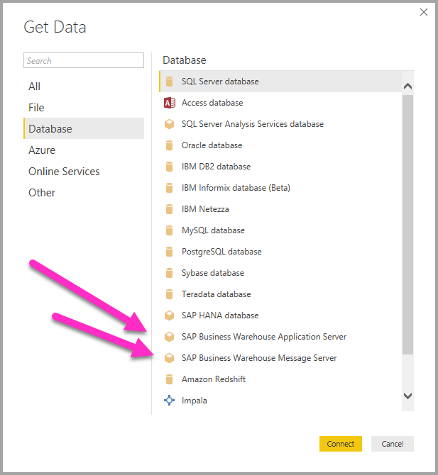
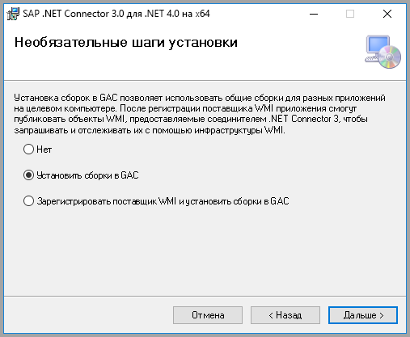
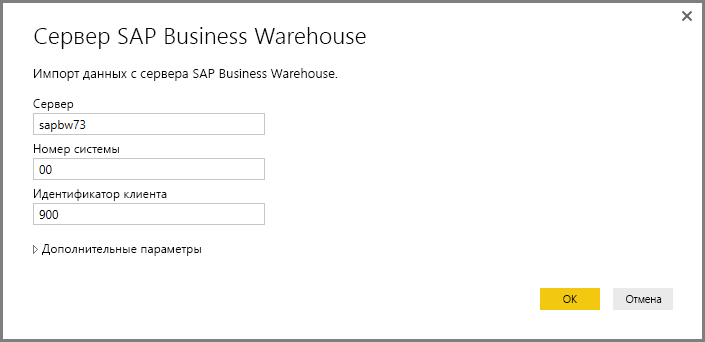
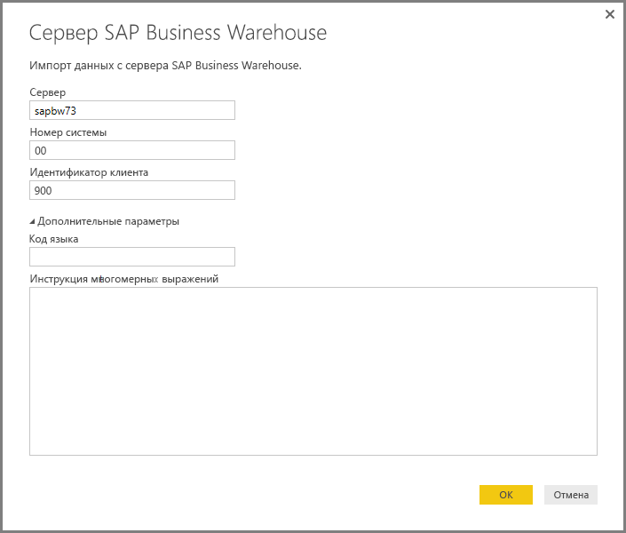
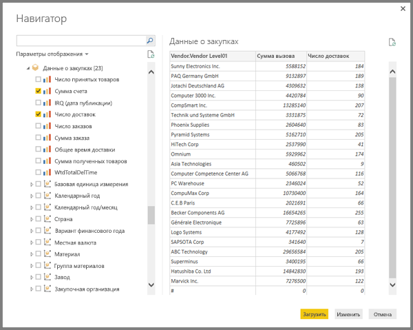
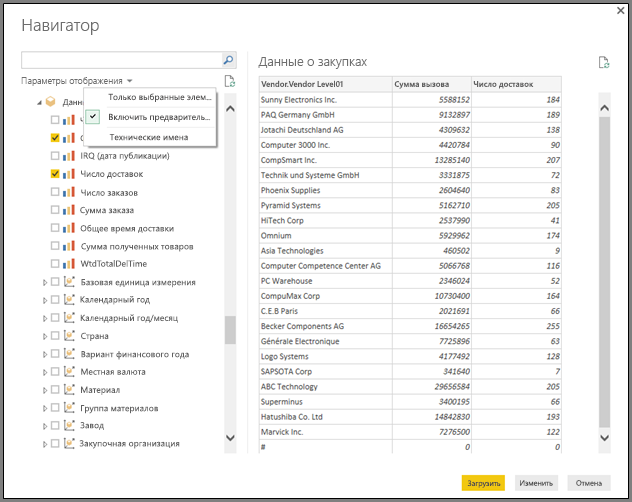
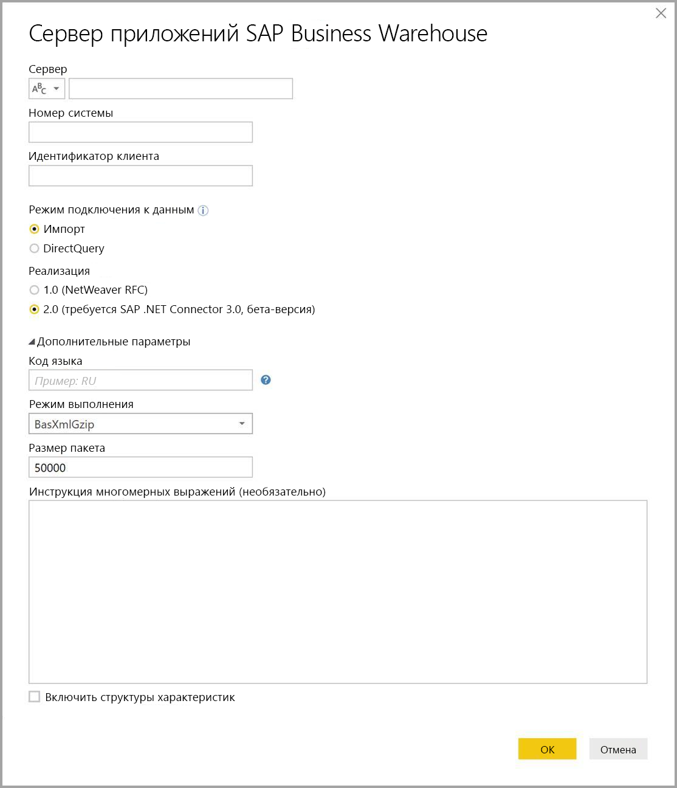
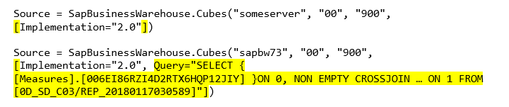
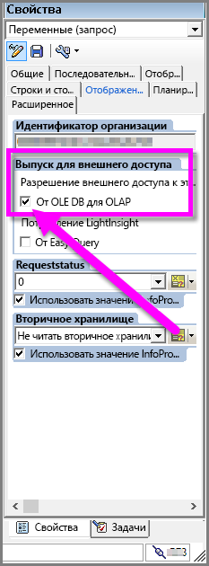

# <a name="use-the-sap-business-warehouse-connector-in-power-bi-desktop"></a>Использование соединителя SAP Business Warehouse в Power BI Desktop

С помощью Power BI Desktop вы можете получить доступ к данным *SAP Business Warehouse (BW)* .

Сведения о том, какие преимущества могут получить клиенты SAP, подключив Power BI к своим системам SAP BW, см. в [этом документе](https://aka.ms/powerbiandsapbw). Сведения об использовании DirectQuery с SAP BW см. в статье [Подключение к SAP Business Warehouse с помощью DirectQuery в Power BI](desktop-directquery-sap-bw.md).

Начиная с выпуска Power BI Desktop за июнь 2018 года (и с выхода его общедоступной версии в октябре 2018 года) вы можете использовать *соединитель SAP BW*, в котором реализованы значительные улучшения в плане производительности и возможностей. Корпорация Майкрософт разработала *реализацию соединителя SAP BW версии 2.0*. Выберите соединитель SAP BW версии 1 или реализацию соединителя SAP версии 2.0. В следующих разделах по очереди описывается установка каждой версии. При подключении к SAP BW из Power BI Desktop можно выбрать один из соединителей.

Мы рекомендуем по возможности использовать реализацию 2.0 соединителя SAP.

## <a name="installation-of-version-1-of-the-sap-bw-connector"></a>Установка соединителя SAP BW версии 1

Мы рекомендуем по возможности использовать реализацию 2.0 соединителя SAP. В разделе описывается установка соединителя SAP BW версии 1.

1. Установите библиотеку *SAP NetWeaver* на локальном компьютере. Библиотеку SAP NetWeaver можно получить у администратора SAP или непосредственно в [Центре скачивания программного обеспечения SAP](https://support.sap.com/swdc). В связи с частым изменением структуры Центра скачивания программного обеспечения SAP более конкретные рекомендации по навигации по этому сайту недоступны. Кроме того, библиотека SAP NetWeaver обычно входит в пакет установки клиентских средств SAP Client Tools.

   Чтобы получить ссылку на скачивание последней версии, введите в строку поиска запрос *SAP Note #1025361*. Убедитесь, что архитектура для библиотеки SAP NetWeaver (32-разрядной или 64-разрядной версии) соответствует установленной версии Power BI Desktop. Установите все файлы, включенные в *состав пакета SDK RFC* для SAP NetWeaver, согласно примечанию к SAP.
2. В Power BI Desktop выберите **Получение данных**. В перечень **баз данных** входит *сервер приложений SAP Business Warehouse* и *сервер сообщений SAP Business Warehouse*.

   

## <a name="installation-of-implementation-20-sap-connector"></a>Установка реализации 2.0 соединителя SAP

Для реализации 2.0 соединителя SAP требуется SAP .NET Connector 3.0. Для скачивания требуются действительные учетные данные S-пользователя. Обратитесь в отдел SAP Basis, чтобы получить соединитель SAP .NET 3.0.

Вы можете скачать [SAP .NET Connector 3.0](https://support.sap.com/en/product/connectors/msnet.html) с сайта SAP.

Соединитель поставляется в 32- и 64-разрядной версиях. Выберите версию, соответствующую установке Power BI Desktop. В настоящее время на веб-сайте указаны две версии для платформы .NET 4.0:

* соединитель SAP для Microsoft .NET 3.0.22.0 для 32-разрядных (x86) версий Windows в виде ZIP-файла (6896 КБ), 1 июня 2019 г.;
* соединитель SAP для Microsoft .NET 3.0.22.0 для 64-разрядных (x64) версий Windows в виде ZIP-файла (7180 КБ), 1 июня 2019 г.

При установке в разделе **Optional setup steps** (Дополнительные этапы установки) обязательно установите флажок *Install assemblies to GAC* (Установить сборки в глобальном кэше сборок).



> [!NOTE]
> Первая версия реализации SAP BW требует библиотек DLL NetWeaver. Если вы используете реализацию 2.0 соединителя SAP и не используете первую версию, библиотеки DLL NetWeaver не нужны.

## <a name="version-1-sap-bw-connector-features"></a>Возможности соединителя SAP BW версии 1

Соединитель с SAP BW версии 1 в Power BI Desktop позволяет импортировать данные из кубов *сервера SAP Business Warehouse* или использовать DirectQuery.

Дополнительные сведения о соединителе SAP BW и его использовании с DirectQuery см. в статье[ Подключение к SAP Business Warehouse с помощью DirectQuery в Power BI](desktop-directquery-sap-bw.md).

Чтобы установить подключение, укажите **сервер**, **номер системы** и **идентификатор клиента**.



Можно указать еще два **дополнительных параметра**: **код языка** и пользовательскую **инструкцию многомерных выражений** для выполнения на указанном сервере.



Если инструкция многомерных выражений не указана, то параметр подключения отображает список кубов, доступных на сервере. Вы можете выполнить детализацию и выбрать элементы из доступных кубов, включая измерения и меры. Power BI предоставляет запросы и кубы, предоставляемые [интерфейсами открытого анализа](https://help.sap.com/saphelp_nw70/helpdata/en/d9/ed8c3c59021315e10000000a114084/content.htm).

После выбора одного или нескольких элементов на сервере диалоговое окно "Навигатор" создает выходную таблицу для предварительного просмотра.



Диалоговое окно **Навигатор** также предоставляет параметры отображения:

* **Display Only selected items** (Отображать только выбранные элементы). По умолчанию **Навигатор** отображает все элементы.  эти параметры полезны для проверки окончательного набора выбранных элементов. В качестве альтернативы для просмотра выбранных элементов можно выбрать имена столбцов в области предварительного просмотра.
* **Включить предварительный просмотр данных**. Это значение по умолчанию. Данные отображаются в режиме предварительного просмотра. Отключение предварительного просмотра данных уменьшает количество вызовов к серверу, так как он больше не запрашивает данные для предварительного просмотра.
* **Технические имена**. SAP BW поддерживает наличие *технических имен* для объектов в кубе. Использование технических имен позволяет владельцу куба отображать *понятные* имена объектов куба, а не *физические имена* этих объектов в кубе.



После выбора всех необходимых объектов можно решить, что делать дальше, выбрав один из следующих вариантов:

* Выберите **Загрузить**, чтобы загрузить весь набор строк для выходной таблицы в модель данных Power BI Desktop. Откроется представление **отчетов**. Вы можете начать визуализацию данных или внести дальнейшие изменения с помощью представлений **Данные** или **Связи**.
* Выберите **Правка**, чтобы открыть **Редактор запросов**. Укажите дополнительное преобразование данных и фильтрацию, прежде чем весь набор строк будет передан в модель данных Power BI Desktop.

Кроме импорта данных из кубов SAP BW, вы также можете импортировать в Power BI Desktop данные из широкого диапазона других источников данных, а затем объединить их в один отчет. Это делает возможными самые разнообразные сценарии составления отчетов и аналитики на основе данных SAP BW.

## <a name="using-implementation-20-sap-bw-connector"></a>Использование реализации 2.0 соединителя с SAP BW

Для использования реализации 2.0 соединителя с SAP BW создайте новое подключение. Чтобы создать подключение, выполните указанные ниже действия.

1. Выберите **Получить данные**. Выберите **сервер приложений SAP Business Warehouse Application Server** или **сервер сообщений SAP Business Warehouse**, а затем подключитесь.

2. В диалоговом окне "Создать соединение" выберите реализацию. При выборе **2.0** в качестве версии **реализации** становятся доступны **параметры режима выполнения**, **размера пакета** и **включения структур характеристик**, как показано на рисунке ниже.

    

3. Выберите **ОК**. После этого процесс работы будет таким же, как описано в разделе [Возможности соединителя SAP BW версии 1](#version-1-sap-bw-connector-features).

### <a name="new-options-for-implementation-20"></a>Новые параметры для реализации 2.0

Реализация 2.0 поддерживает следующие параметры:

* *ExecutionMode* — определяет интерфейс многомерных выражений, используемый для выполнения запросов на сервере. Доступны следующие параметры:

  * `SapBusinessWarehouseExecutionMode.BasXml`
  * `SapBusinessWarehouseExecutionMode.BasXmlGzip`
  * `SapBusinessWarehouseExecutionMode.DataStream`

    По умолчанию используется значение `SapBusinessWarehouseExecutionMode.BasXmlGzip`.

    Использование `SapBusinessWarehouseExecutionMode.BasXmlGzip` может повысить производительность, если при обработке больших наборов данных возникают длительные задержки.

* *BatchSize* — задает максимальное число строк, возвращаемое при выполнении инструкции многомерного выражения. При извлечении большого набора данных небольшое число будет означать больше обращений к серверу. Увеличение числа строк может повысить производительность, но привести к проблемам с памятью на сервере SAP BW. Значение по умолчанию — 50 000 строк.

* *EnableStructures* — указывает, распознаются ли структуры характеристик. По умолчанию этот параметр имеет значение False. Влияет на список объектов, доступных для выбора. Не поддерживается в режиме собственного запроса.

Параметр *ScaleMeasures* в этой реализации является нерекомендуемым. Теперь поведение такое же, как если задать для параметра *ScaleMeasures* значение false, то есть всегда отображаются немасштабированные значения.

### <a name="additional-improvements-for-implementation-20"></a>Дополнительные улучшения в реализации 2.0

В приведенном ниже списке описываются некоторые дополнительные улучшения, появившиеся в новой реализации:

* Повышенная производительность.
* Возможность извлечения нескольких миллионов строк данных и точной настройки с помощью параметра размера пакета.
* Возможность переключения режимов выполнения.
* Поддержка режима сжатия. Он особенно полезен в случае с длительными задержками или большими наборами данных.
* Улучшено обнаружение переменных типа `Date`.
* (Экспериментальная возможность.) Предоставление измерений `Date` (тип ABAP DATS) и `Time` (тип ABAP TIMS) в виде значений даты и времени соответственно, а не текстовых значений.
* Улучшенная обработка исключений. Ошибки, происходящие в вызовах BAPI, теперь отображаются.
* Свертывание столбцов в режимах BasXml и BasXmlGzip. Например, если созданный запрос многомерного выражения извлекает 40 столбцов, но в соответствии с текущим выбором требуется только 10, запрос будет передан на сервер для извлечения меньшего набора данных.

### <a name="changing-existing-reports-to-use-implementation-20"></a>Изменение существующих отчетов для использования реализации 2.0

Изменение существующих отчетов для использования реализации 2.0 возможно только в режиме импорта. Выполните следующие действия.

1. Откройте существующий отчет, на ленте выберите команду **Изменить запросы**, а затем запрос SAP Business Warehouse, который нужно изменить.

1. Щелкните запрос правой кнопкой мыши и выберите пункт **Расширенный редактор**.

1. В **Расширенном редакторе** измените вызов `SapBusinessWarehouse.Cubes` следующим образом:

    Определите, содержит ли уже запрос запись параметра, например, как в следующем примере:

    

    Если это так, добавьте параметр `Implementation` 2.0 и удалите параметр `ScaleMeasures`, если он есть, как показано ниже:

    

    Если запрос еще не содержит запись параметров, просто добавьте ее. Для следующего параметра:

    

    Измените его на:

    

Мы приложили все усилия, чтобы сделать реализацию 2.0 соединителя SAP BW совместимой с версией 1. Однако могут быть некоторые различия из-за использования разных режимов выполнения многомерных выражений SAP BW. Чтобы устранить несоответствия, попробуйте сменить режим выполнения.

## <a name="troubleshooting"></a>Устранение неполадок

В этом разделе приведены случаи устранения неполадок при работе с соединителем SAP BW.

1. Числовые данные из SAP BW возвращают точки в качестве десятичных разделителей вместо запятых. Например, 1,000,000 возвращается как 1.000.000.

   SAP BW возвращает десятичные данные с `,` (запятая) или `.` (точка) в качестве десятичного разделителя. Чтобы указать, какие SAP BW следует использовать для десятичного разделителя, драйвер, используемый Power BI Desktop, вызывает `BAPI_USER_GET_DETAIL` Этот вызов возвращает структуру, называемую `DEFAULTS`, которая содержит поле с именем `DCPFM`, в котором хранится *нотация десятичного формата*. В поле доступны следующие значения:

   * " " (пробел) = десятичный разделитель — запятая: N.NNN,NN.
   * "X" = десятичный разделитель — точка: N,NNN.NN.
   * "Y" = десятичный разделитель: N NNN NNN,NN.

   Клиенты, сообщавшие об этой проблеме, обнаружили, что вызов `BAPI_USER_GET_DETAIL` завершается сбоем для определенного пользователя (для которого отображаются неверные данные) и сообщением об ошибке следующего вида:

   ```xml
    You are not authorized to display users in group TI:
        <item>
            <TYPE>E</TYPE>
            <ID>01</ID>
            <NUMBER>512</NUMBER>
            <MESSAGE>You are not authorized to display users in group TI</MESSAGE>
            <LOG_NO/>
            <LOG_MSG_NO>000000</LOG_MSG_NO>
            <MESSAGE_V1>TI</MESSAGE_V1>
            <MESSAGE_V2/>
            <MESSAGE_V3/>
            <MESSAGE_V4/>
            <PARAMETER/>
            <ROW>0</ROW>
            <FIELD>BNAME</FIELD>
            <SYSTEM>CLNTPW1400</SYSTEM>
        </item>
   ```

   Чтобы исправить эту ошибку, пользователи должны запросить у своего администратора SAP предоставить пользователю SAP BW, который используется в Power BI, право на выполнение `BAPI_USER_GET_DETAIL`. Стоит также убедиться, что пользователь задал необходимое значение `DCPFM`, описанное выше в этом решении для устранения неполадок.

2. Возможность использования запросов SAP BEx
   
   В Power BI Desktop можно выполнять запросы BEx, включив определенное свойство, как показано на следующем изображении:
   
   
   
3. В окне **Навигатор** предварительный просмотр данных недоступен — отображается сообщение об ошибке следующего содержания: *Ссылка на объект не указывает на экземпляр объекта*.
   
   Пользователям SAP нужно получить доступ к определенным модулям функции BAPI для получения метаданных и извлечения данных из SAP BW InfoProvider. К этим модулям относятся:

   * BAPI_MDPROVIDER_GET_CATALOGS
   * BAPI_MDPROVIDER_GET_CUBES
   * BAPI_MDPROVIDER_GET_DIMENSIONS
   * BAPI_MDPROVIDER_GET_HIERARCHYS
   * BAPI_MDPROVIDER_GET_LEVELS
   * BAPI_MDPROVIDER_GET_MEASURES
   * BAPI_MDPROVIDER_GET_MEMBERS
   * BAPI_MDPROVIDER_GET_VARIABLES
   * BAPI_IOBJ_GETDETAIL

   Чтобы решить эту проблему, убедитесь, что у пользователя есть доступ к разным модулям MDPROVIDER и `BAPI_IOBJ_GETDETAIL`. Чтобы устранить эту или аналогичные неполадки, можно включить трассировку. Выберите **Файл** > **Параметры и настройки** > **Параметры**. В разделе **Параметры**выберите **Диагностика**, а затем выберите **Включить трассировку**. Включив трассировку, попытайтесь получить данные из SAP BW, и просмотрите файл трассировки для получения дополнительных сведений.

## <a name="sap-bw-connection-support"></a>Поддержка соединений SAP BW

В следующей таблице приводятся сведения о текущей поддержке SAP BW.

|Продукт  |Режим  |Authentication  |Соединитель  |Библиотека SNC  |Поддерживается  |
|---------|---------|---------|---------|---------|---------|
|Power BI Desktop     |Любой         | Пользователь и пароль  | Сервер приложений | Н/Д  | Да  |
|Power BI Desktop     |Любой         | Windows          | Сервер приложений | sapcrypto + gsskrb5/gx64krb5  | Да  |
|Power BI Desktop     |Любой         | Windows через олицетворение | Сервер приложений | sapcrypto + gsskrb5/gx64krb5  | Да  |
|Power BI Desktop     |Любой         | Пользователь и пароль        | Сервер сообщений | Н/Д  | Да  |
|Power BI Desktop     |Любой         | Windows        | Сервер сообщений | sapcrypto + gsskrb5/gx64krb5  | Да  |
|Power BI Desktop     |Любой         | Windows через олицетворение | Сервер сообщений | sapcrypto + gsskrb5/gx64krb5  | Да  |
|Power BI Gateway     |Импорт      | Та же, что и в Power BI Desktop |         |   |   |
|Power BI Gateway     |DirectQuery | Пользователь и пароль        | Сервер приложений | Н/Д  | Да  |
|Power BI Gateway     |DirectQuery | Windows через олицетворение (постоянный пользователь, без единого входа) | Сервер приложений | sapcrypto + gsskrb5/gx64krb5  | Да  |
|Power BI Gateway     |DirectQuery | Параметр "Использовать единый вход (SSO) через Kerberos для запросов DirectQuery" | Сервер приложений | sapcrypto + gsskrb5/gx64krb5   | Да  |
|Power BI Gateway     |DirectQuery | Пользователь и пароль        | Сервер сообщений | Н/Д  | Да  |
|Power BI Gateway     |DirectQuery | Windows через олицетворение (постоянный пользователь, без единого входа) | Сервер сообщений | sapcrypto + gsskrb5/gx64krb5  | Да  |
|Power BI Gateway     |DirectQuery | Параметр "Использовать единый вход (SSO) через Kerberos для запросов DirectQuery" | Сервер сообщений | gsskrb5/gx64krb5  | Нет  |
|Power BI Gateway     |DirectQuery | Параметр "Использовать единый вход (SSO) через Kerberos для запросов DirectQuery" | Сервер сообщений | sapcrypto  | Да  |

## <a name="next-steps"></a>Дальнейшие действия

Дополнительные сведения о SAP и DirectQuery см. в следующих статьях:

* [DirectQuery и SAP HANA](desktop-directquery-sap-hana.md)
* [Использование DirectQuery и SAP Business Warehouse (BW)](desktop-directquery-sap-bw.md)
* [Использование DirectQuery в Power BI](desktop-directquery-about.md)
* [Источники данных Power BI](power-bi-data-sources.md)
* [Технический документ о Power BI и SAP BW](https://aka.ms/powerbiandsapbw)
