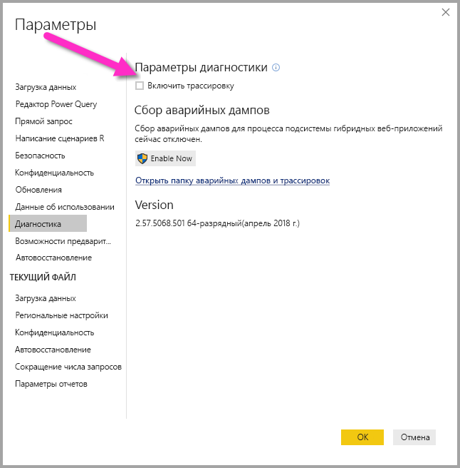
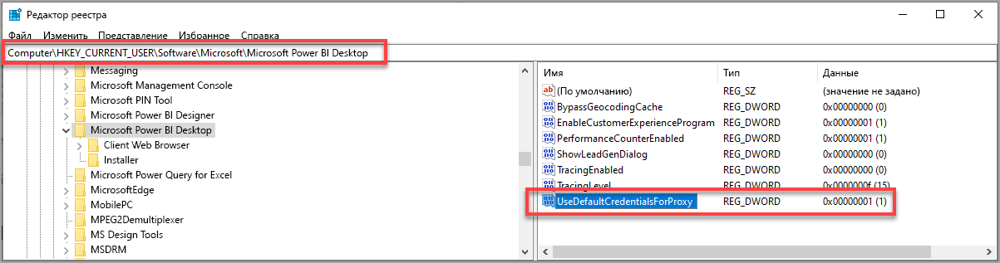

# Устранение неполадок со входом в Power BI Desktop
Иногда при попытках входа в **Power BI Desktop** вы можете столкнуться с ошибками. Подобные проблемы при входе могут возникнуть по двум основным причинам: **ошибки аутентификации прокси-сервера** и **ошибки перенаправления URL-адресов без HTTPS**. 

Чтобы определить причину проблем в конкретном случае, первым шагом следует обратиться к администратору и предоставить ему диагностические сведения. Администратор может выполнить трассировку проблем, связанных со входом, чтобы выяснить, какие из описанных далее ошибок имеют к вам отношение. 

Давайте поочередно рассмотрим каждую из возможных проблем. В конце этой статьи описывается процесс создания *трассировки* в Power BI Desktop, которая поможет в устранении неполадок.

## Ошибка "Требуется проверка подлинности прокси-сервера"

На следующем снимке экрана вы видите пример ошибки *Требуется проверка подлинности прокси-сервера*.

С этой ошибкой связаны следующие исключения в файлах трассировки *Power BI Desktop*:

* *Microsoft.PowerBI.Client.Windows.Services.PowerBIWebException*;
* *HttpStatusCode: ProxyAuthenticationRequired*.

Самой распространенной причиной такой ошибки является прокси-сервер аутентификации, который блокирует веб-запросы **Power BI Desktop** в локальной сети. 

Если в сети работает прокси-сервер аутентификации, администратору для решения проблемы следует включить в список разрешенных на этом прокси-сервере следующие домены:

* app.powerbi.com
* api.powerbi.com;
* домены в пространстве имен *.analysis.windows.net.

Клиентам, работающим с облаком для государственных организаций, для устранения этой проблемы следует добавить в список разрешенных на прокси-сервере аутентификации следующие домены:

* app.powerbigov.us;
* api.powerbigov.us;
* домены в пространстве имен *.analysis.usgovcloudapi.net.

## Ошибка "Non-HTTPS URL redirect not supported" (Не поддерживается перенаправление URL-адресов без HTTP)

Текущие версии **Power BI Desktop** используют текущую версию библиотеки аутентификации Active Directory (ADAL), в которой не допускается перенаправление на URL-адреса, не защищенные протоколом HTTPS. 

С этой ошибкой связаны следующие исключения в файлах трассировки *Power BI Desktop*:

* *Microsoft.IdentityModel.Clients.ActiveDirectory.AdalServiceException: Non-HTTPS url redirect is not supported in webview* (Перенаправления для URL-адресов без HTTP в веб-представлении не поддерживаются);
* *ErrorCode: non_https_redirect_failed*.

Если происходит ошибка с кодом *non_https_redirect_failed*, значит одна или несколько страниц либо поставщиков в цепочке перенаправления используют конечную точку без защиты протоколом HTTPS или издатель сертификата на одном или нескольких шагах перенаправления не входит на устройстве в число доверенных корневых центров сертификации. Все поставщики в цепочке перенаправления входа обязаны использовать URL-адрес с HTTPS. Чтобы устранить такую проблему, обратитесь к администратору и попросите обеспечить применение защищенных URL-адресов для сайтов аутентификации. 

## Сведения о сборе трассировок в Power BI Desktop

Чтобы собрать трассировку в **Power BI Desktop**, выполните следующие действия:

1. Включите трассировку в **Power BI Desktop**, последовательно выбрав пункты **Файл > Параметры и настройки > Параметры**, а затем выберите **Диагностика** из элементов на панели слева. Откроется панель, представленная на изображении ниже, где вам нужно установить флажок рядом с пунктом **Включить трассировку**. Возможно, придется перезапустить **Power BI Desktop**.
   
   

2. После этого выполните действия, приводящие к ошибке. Теперь **Power BI Desktop** добавит все события в журнал трассировки, который хранится на локальном компьютере.

3. Перейдите к папке Traces на локальном компьютере. Чтобы найти эту папку, выберите ссылку **Открыть папку аварийных дампов и трассировок** в разделе *Диагностика*, где вы ранее включали трассировку, как показано на предыдущем изображении. Обычно она находится в следующем расположении на локальном компьютере:

    `C:\Users/<user name>/AppData/Local/Microsoft/Power BI Desktop/Traces`

В этой папке может скопиться много файлов трассировки. Передавайте администратору только последние из них, чтобы ему было проще найти ошибку. 

## Использование системных учетных данных по умолчанию для веб-прокси

В веб-запросах, выданных Power BI Desktop, не используются учетные данные веб-прокси. В сетях, где используется прокси-сервер, Power BI Desktop может быть не в состоянии успешно выполнять веб-запросы. 

Начиная с мартовского выпуска 2020 года Power BI Desktop, администраторы системы или сети могут разрешить использование системных учетных данных по умолчанию для проверки подлинности веб-прокси. Администраторы могут создать в реестре запись **UseDefaultCredentialsForProxy** и задать значение "1", чтобы включить использование системных учетных данных по умолчанию для проверки подлинности веб-прокси.

Запись реестра можно разместить в одном из следующих расположений:

`[HKEY_LOCAL_MACHINE\SOFTWARE\WOW6432Node\Microsoft\Microsoft Power BI Desktop]`
`[HKEY_LOCAL_MACHINE\SOFTWARE\Microsoft\Microsoft Power BI Desktop]`

Нет необходимости добавлять запись реестра в оба расположения.

После создания записи реестра (может потребоваться перезагрузка) при выполнении Power BI Desktop веб-запросов используются параметры прокси-сервера, которые заданы в Internet Explorer. 

Как и при любом изменении параметров прокси-сервера или учетных данных, создание этой записи реестра влечет за собой последствия для безопасности, поэтому перед включением этой функции администраторам необходимо убедиться, что они правильно настроили прокси-серверы в Internet Explorer.         

### Ограничения и рекомендации по использованию системных учетных данных по умолчанию

Существует ряд последствий для безопасности, которые следует учитывать администраторам, прежде чем активировать эту возможность. 

При включении этой функции для клиентов следуйте приведенным ниже рекомендациям.

* В качестве схемы проверки подлинности для прокси-сервера следует использовать только **Согласование**, чтобы обеспечить использование клиентом только прокси-серверов, присоединенных к сети Active Directory. 
* Не используйте схему **Откат NTLM** на клиентах, использующих эту функцию.
* Если в сети, в которой находятся пользователи, нет прокси-сервера, когда эта функция включена и настроена согласно рекомендациям в этом разделе, то процесс попытки обращения к прокси-серверу и использования системных учетных данных по умолчанию не используется.

[Использование системных учетных данных по умолчанию для веб-прокси](#using-default-system-credentials-for-web-proxy)

