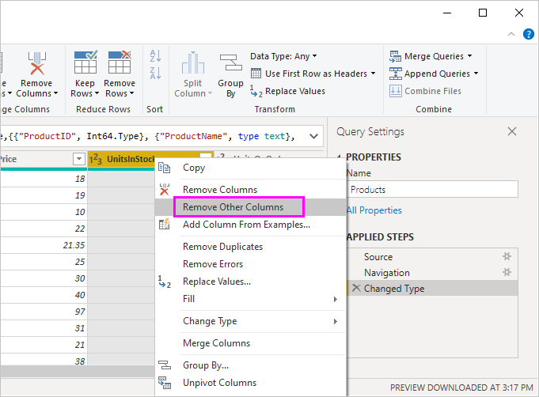
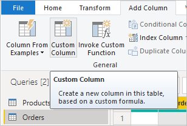
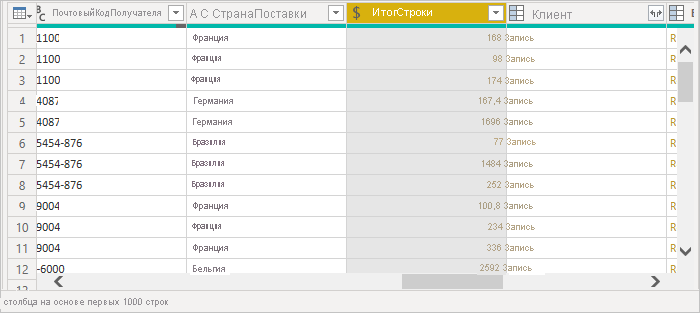

# Руководство. Анализ данных о продажах из Excel и канала OData

Часто данные распределены по нескольким источникам. Например, сведения о товарах находятся в одной базе данных, а данные о продажах — в другой. Используя *Power BI Desktop*, вы можете объединить данные из нескольких источников и создать интересные аналитические данные и яркие визуализации.

В этом учебнике вы объедините данные из двух источников данных:

* Книга Excel с данными о товарах
* Веб-канал OData, содержащий данные о заказах

Вам предстоит импортировать каждый набор данных и выполнить операции преобразования и статистической обработки. Затем вы используете данные из обоих источников, чтобы создать отчет с анализом продаж и интерактивными визуализациями. Позднее эти же методы можно применить к запросам SQL Server, файлам CSV и другим источникам данных в Power BI Desktop.

>[!NOTE]
>В Power BI Desktop одну и ту же задачу можно выполнить разными способами. Например, можно щелкнуть правой кнопкой мыши или использовать меню **Дополнительные параметры** для столбца или ячейки, чтобы просмотреть дополнительные элементы ленты. В процедурах ниже описаны несколько разных способов.

## Импорт данных о товарах Excel

Сначала импортируйте данные из книги Excel *Products.xlsx* в Power BI Desktop.

1. [Скачайте книгу Excel Products.xlsx](https://download.microsoft.com/download/1/4/E/14EDED28-6C58-4055-A65C-23B4DA81C4DE/Products.xlsx) и сохраните ее с именем *Products.xlsx*.

1. Щелкните стрелку рядом с элементом **Получить данные** на вкладке **Главная** ленты Power BI Desktop, а затем выберите **Excel** в меню **Самые распространенные**.

   

   >[!NOTE]
   >Можно также выбрать сам элемент **Получить данные** или элемент **Получить данные** в диалоговом окне Power BI **Начало работы**. После этого выберите **Excel** или **Файл** > **Excel** в диалоговом окне **Получение данных** и щелкните **Подключить**.

1. В диалоговом окне **Открыть** найдите и выберите файл **Products.xlsx**, а затем нажмите кнопку **Открыть**.

1. В области **Навигатор** выберите таблицу **Products**, а затем нажмите **Преобразовать данные**.

   

В редакторе Power Query откроется окно предварительного просмотра таблицы, где вы можете применить преобразования для очистки данных.

>[!NOTE]
>Также редактор Power Query можно открыть, выбрав **Изменить запросы** > **Изменить запросы** на ленте **Главная** в Power BI Desktop. Еще вы можете щелкнуть правой кнопкой мыши или выбрать **Дополнительные параметры** рядом с любым запросом в представлении **Отчет**, а затем выбрать **Изменить запрос**.

## Очистка столбцов в таблице товаров

Объединенный отчет будет использовать столбцы **ProductID**, **ProductName**, **QuantityPerUnit** и **UnitsInStock** из этой книги Excel. Остальные столбцы можно удалить.

1. В редакторе Power Query выберите столбцы **ProductID**, **ProductName**, **QuantityPerUnit** и **UnitsInStock**. Вы можете использовать CTRL, чтобы выбрать несколько столбцов, или SHIFT, чтобы выбрать несколько расположенных рядом столбцов.

1. Щелкните любой из выбранных заголовков правой кнопкой мыши. Выберите **Удалить другие столбцы** в раскрывающемся меню.
   Можно также выбрать **Удалить столбцы** > **Удалить другие столбцы** в группе **Управление столбцами** на вкладке ленты **Главная**.

   

## Импорт данных о заказах из веб-канала OData

Теперь следует импортировать данные о заказах из тестового веб-канала OData для торговой системы Northwind.

1. В редакторе Power Query выберите **Создать источник**, а затем **Веб-канал OData** в меню **Самые распространенные**.

   

1. В диалоговом окне **Веб-канал OData** вставьте URL-адрес для веб-канала OData Northwind `https://services.odata.org/V3/Northwind/Northwind.svc/`. Выберите **ОК**.

   

1. На панели **Навигатор** выберите таблицу **Orders**, а затем нажмите **Преобразовать данные**, чтобы загрузить данные в редактор Power Query.

   

   >[!NOTE]
   >В области **Навигатор** вы можете открыть предварительный просмотр таблицы, щелкнув ее имя в любом месте, кроме флажка.

## Развертывание данных о заказах

При подключении к источникам данных с несколькими таблицами, например к реляционным базам данных или к веб-каналу OData Northwind, вы можете использовать ссылки на таблицы для создания запросов. Таблица **Orders** содержит связи с несколькими таблицами. С помощью операции "Развернуть" вы можете добавить столбцы **ProductID**, **UnitPrice** и **Quantity** из связанной таблицы **Order_Details** в основную таблицу (**Orders**).

1. Прокрутите вправо таблицу **Orders** до столбца **Order_Details**. Вместо данных он содержит ссылки на другую таблицу.

   

1. Выберите значок **Развернуть** () в заголовке столбца **Order_Details**.

1. В раскрывающемся меню

   1. Щелкните **(Выбрать все столбцы)** , чтобы отменить выбор всех столбцов.

   1. Выберите **ProductID**, **UnitPrice** и **Quantity**, в затем щелкните **ОК**.

      

После развертывания таблицы **Order_Details** столбец **Order_Details** в ней заменяется тремя новыми столбцами из вложенной таблицы. В таблице присутствуют новые строки для добавленных данных по каждому заказу.

## Создание пользовательского вычисляемого столбца

Редактор Power Query позволяет создавать вычисления и настраиваемые поля для обогащения данных. Вы создадите настраиваемый столбец, который вычисляет общую стоимость каждого элемента в заказе, умножая цену товара на количество единиц.

1. На вкладке ленты **Добавление столбца** в редакторе Power Query выберите **Настраиваемый столбец**.

   

1. В диалоговом окне **Настраиваемый столбец** введите значение **LineTotal** для поля **Имя нового столбца**.

1. В поле **Пользовательская формула столбца** после **=** введите **[Order_Details.UnitPrice]** \* **[Order_Details.Quantity]** . Можно не вводить имена полей, а выбрать их в области **Доступные столбцы** с ползунком полосы прокрутки и нажать кнопку **<< Вставить**.

1. Выберите **ОК**.

   

   Новое поле с именем **LineTotal** появится в виде последнего столбца в таблице **Orders**.

## Задание типа данных для нового поля

Когда редактор Power Query подключается к данным, он определяет наиболее подходящий тип данных для каждого поля, чтобы отобразить данные соответствующим образом. Значок верхнего колонтитула указывает тип данных, назначенный каждому полю. Можно также взглянуть на **Тип данных** в группе **Transform** вкладки **Главная** на ленте.

Новый столбец **LineTotal** имеет тип данных **Любой**, но фактически содержит значения валюты. Чтобы назначить ему тип данных, щелкните правой кнопкой мыши заголовок столбца **LineTotal** и выберите в раскрывающемся меню действие **Изменить тип**, а затем щелкните **Десятичное число с фиксированной запятой**.

>[!NOTE]
>Вы также можете сначала выбрать столбец **LineTotal**, а затем щелкнуть стрелку меню рядом с элементом **Тип данных** в области **Преобразование** на вкладке ленты **Главная**, чтобы выбрать тип **Десятичное число с фиксированной запятой**.

## Очистка столбцов с данными о заказах

Чтобы модель было проще применять в отчетах, есть возможность удалить, переименовать и поменять местами некоторые столбцы.

Ваш отчет будет использовать следующие столбцы:

* **OrderDate**
* **ShipCity**
* **ShipCountry**
* **Order_Details.ProductID**
* **Order_Details.UnitPrice**
* **Order_Details.Quantity**
* **LineTotal**

Выберите эти столбцы и используйте функцию **Удалить другие столбцы**, как мы это уже сделали с данными Excel. Или можно выбрать столбцы, отличные от перечисленных, щелкнуть один из них правой кнопкой мыши и выбрать пункт **Удалить столбцы**.

Можно переименовать столбцы с префиксом "**Order_Details.** ", чтобы сделать их более удобными для чтения:

1. Дважды щелкните, коснитесь и удерживайте или щелкните правой кнопкой мыши заголовок каждого столбца и выберите в раскрывающемся меню действие **Переименовать**.

1. Удалите префикс **Order_Details.** из каждого имени.

И наконец, чтобы упростить доступ к столбцу **LineTotal**, перетащите его влево и отпустите сразу за столбцом **ShipCountry**.

## Просмотр шагов запроса

Ваши действия в редакторе Power Query для формирования и преобразования данных записываются. Каждое действие отображается справа в области **Параметры запроса** в разделе **Примененные действия**. Вы можете вернуться к разделу **Примененные шаги**, чтобы просмотреть ваши действия и при необходимости изменить, удалить или переупорядочить их. Но это может быть небезопасно, так как изменение предыдущих шагов может испортить последующие действия.

Поочередно выберите каждый из запросов в списке **Запросы** в левой части редактора Power Query и просмотрите область **Примененные действия** в разделе **Параметры запроса**. После применения предыдущих преобразований данных раздел **Примененные шаги** для двух запросов должен выглядеть примерно так:

 &nbsp;&nbsp; 

>[!TIP]
>В основе примененных действий — формулы, написанные на *языке Power Query*, который также известен как [язык M](/powerquery-m/power-query-m-reference). Чтобы просмотреть и изменить формулы, выберите **Расширенный редактор** в группе **Запрос** на вкладке **Главная** на ленте.

## Импорт преобразованных запросов

Когда вы будете удовлетворены преобразованными данными и готовы импортировать их в представление **Отчет** Power BI Desktop, выберите **Закрыть и применить** > **Закрыть и применить** в группе **Закрыть** на вкладке **Главная** ленты.

После загрузки данных запросы появятся в списке **Поля** в представлении **Отчет** Power BI Desktop.

## Управление связями между наборами данных

Power BI Desktop не требует объединения запросов для формирования отчетов по ним. Но вы можете применить связи между наборами данных, основанные на общих полях, для расширения и обогащения возможностей по созданию отчетов. Вы можете позволить Power BI Desktop автоматически обнаружить связи, или можно создать нужные связи с помощью диалогового окна **Управление связями** в Power BI Desktop. Дополнительные сведения см. в разделе [Создание связей и управление ими в Power BI Desktop](../transform-model/desktop-create-and-manage-relationships.md).

Общее поле `ProductID` создает связь между наборами данных `Orders` и `Products` в этом учебнике.

1. В представлении **Отчет** Power BI Desktop выберите **Управление связями** в области **Связи** на вкладке ленты **Главная**.

   

1. В диалоговом окне **Управление связями** можно заметить, что приложение Power BI Desktop уже обнаружило связь между таблицами **Products** и **Orders** и отобразило ее в списке. Чтобы просмотреть эту связь, выберите действие **Изменить**.

   

   Откроется окно **Изменение связи** с информацией об этой связи.  

   

1. В Power BI Desktop правильно обнаружена связь, а значит, вы можете выбрать **Отменить** и **Закрыть**.

В левой части окна Power BI Desktop выберите **Модель** для просмотра связей запросов и управления ими. Дважды щелкните стрелку на линии, соединяющей два запроса, чтобы открыть диалоговое окно **Изменение связи**, где вы можете просмотреть или изменить эту связь.

Чтобы вернуться в представление **Отчет** из представления **Модель**, щелкните значок **Отчет**.

## Создание визуализаций на основе данных

Вы можете создать различные визуализации в представлении отчета Power BI Desktop для получения полезных сведений. Отчеты могут иметь нескольких страниц, каждая из которых может иметь несколько визуальных элементов. Вы и другие пользователи можете взаимодействовать с этими визуализациями, чтобы оценивать и анализировать данные. Дополнительные сведения см. в разделе [Взаимодействие с отчетом в режиме правки в службе Power BI](../create-reports/service-interact-with-a-report-in-editing-view.md).

Вы можете использовать свои наборы данных и связь между ними, чтобы визуализировать и анализировать данные о продажах.

Сначала создайте гистограмму с накоплением, в которой отображаются сведения о количестве заказов по каждому товару на основе данных из обоих запросов.

1. Выберите поле **Quantity** из таблицы **Orders** на панели **Поля** справа или перетащите его на пустое место на холсте. Создается гистограмма с накоплением, на которой отображается общее количество заказанных товаров.

1. Чтобы разбить данные по количеству отдельных заказанных товаров, выберите **ProductName** из таблицы **Products** в области **Поля** или перетащите его на диаграмму.

1. Теперь отсортируйте товары по объему заказов от большего к меньшему, нажав кнопку **Дополнительные параметры** с многоточием ( **...** ) в верхнем правом углу визуализации, а затем выбрав действие **Сортировка по количеству**.

1. С помощью маркеров в углах диаграммы увеличьте ее размер, чтобы на ней отобразилось больше названий товаров.

   

Теперь создайте диаграмму, отображающую объем заказов в валюте (**LineTotal**) с распределением по времени (**OrderDate**).

1. Убедитесь, что на холсте не выбраны элементы, и выберите **LineTotal** из таблицы **Orders** в области **Поля** или перетащите его на любое пустое место на холсте. Отобразится гистограмма с накоплением, на которой показан общий объем всех заказов в валютном выражении.

1. Выберите диаграмму с накоплением и затем поле **OrderDate** из таблицы **Orders** или перетащите его на диаграмму. Теперь на диаграмме отображаются итоговые суммы по каждой дате, на которую существуют заказы.

1. Чтобы изменить размер визуализации, перетащите ее углы.

   

   >[!TIP]
   >Если на диаграмме будут видны только **годы** и всего три точки данных, нажмите на стрелку рядом с элементом **OrderDate** в поле **Ось** на панели **Визуализация** и выберите **OrderDate** вместо **Иерархия дат**.

Наконец, создайте визуализацию карты с отображением сумм по каждой стране.

1. Убедитесь, что на холсте не выбраны элементы, и выберите **ShipCountry** из таблицы **Orders** в области **Поля** или перетащите его на любое пустое место на холсте. Power BI Desktop обнаруживает, что данные являются названиями стран. Он автоматически создает визуализацию карты, обозначив точками данных все страны с заказами.

1. Чтобы размеры точек данных отражали суммы заказов для каждой страны, перетащите поле **LineTotal** на карту. Вы также можете перетащить его в область **Перетащите сюда поля данных** в разделе **Размер** панели **Визуализации**. Теперь размеры кругов на карте будут отражать суммы заказов по соответствующим странам.

   

## Взаимодействие с визуальными элементами отчета для дальнейшего анализа

В Power BI Desktop можно взаимодействовать с визуальными элементами, которые перекрестно выделяют и фильтруют друг друга, для поиска тенденций. Дополнительные сведения см. в статье [Фильтрация и выделение в отчетах Power BI](../create-reports/power-bi-reports-filters-and-highlighting.md).

Связь между запросами позволяет изменять все визуализации на странице при взаимодействии с любой из них.

Выберите на визуализации карты круг, расположенный в **Канаде**. На двух других визуализациях данные о количестве строк и сумме заказов сразу отфильтровались по Канаде.

Выберите товар диаграммы **Quantity по ProductName**, чтобы просмотреть карту и фильтр диаграмм с датами в соответствии с данными о товаре. Выберите дату диаграммы **LineTotal по ProductName**, чтобы просмотреть карту и фильтр диаграмм с товарами для отображения данных на эту дату.

>[!TIP]
>Чтобы отменить выделение, щелкните выделенный элемент еще раз или выберите любую другую визуализацию.

## Завершение отчета об анализе продаж

В готовом отчете объединяются данные из файла Excel *Products.xlsx* и веб-канала OData Northwind в визуальных элементах, которые позволяют анализировать сведения о заказах для разных стран, периодов и товаров. Готовый отчет можно [отправить в службу Power BI](../create-reports/desktop-upload-desktop-files.md), чтобы другие пользователи Power BI также могли его использовать.

## Дальнейшие действия

* [Microsoft Learn для Power BI](/learn/powerplatform/power-bi?WT.mc_id=powerbi_landingpage-docs-link)
* [Посмотрите видеоматериалы по Power BI Desktop.](../fundamentals/desktop-videos.md)
* [Посетите форум Power BI.](https://go.microsoft.com/fwlink/?LinkID=519326)
* [Прочитайте блог, посвященный Power BI.](https://go.microsoft.com/fwlink/?LinkID=519327)