# Руководство. Анализ данных веб-страницы с помощью Power BI Desktop

Предположим, что вы уже долгое время являетесь футбольным болельщиком и хотите получить сведения о победителях Чемпионата Европы по футболу за разные годы. Power BI Desktop поможет вам импортировать в отчет нужные данные с веб-страницы и создать на их основе визуализации. Из этого руководства вы узнаете, как с помощью Power BI Desktop выполнить следующие действия:

- подключение к источнику данных в Интернете и переход по доступным в нем таблицам;
- сбор и преобразование данных в редакторе Power Query;
- присвоение запросу имени и импорт этого запроса в отчет Power BI Desktop;
- создание и настройка визуализаций карты и круговой диаграммы.

## Подключение к веб-источнику данных

Данные о победителях Чемпионата Европы по футболу УЕФА можно найти в таблице результатов на странице Википедии по адресу https://en.wikipedia.org/wiki/UEFA_European_Football_Championship. 

Веб-подключения устанавливаются только с помощью обычной проверки подлинности. Веб-сайты, требующие проверки подлинности, могут работать неправильно с веб-соединителем.

Чтобы импортировать данные, выполните следующие действия:

1. В Power BI Desktop на вкладке ленты **Главная** щелкните стрелку рядом с элементом **Получить данные** и в раскрывающемся списке выберите вариант **Интернет**.

   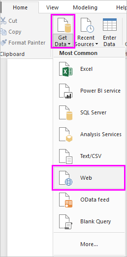 

   >[!NOTE]
   >Можно также выбрать сам элемент **Получить данные** или элемент **Получить данные** в диалоговом окне Power BI Desktop "Начало работы". После этого выберите **Интернет** из раздела **Все** или **Другое** в диалоговом окне **Получение данных** и щелкните **Подключить**.

1. В диалоговом окне **Из Интернета** вставьте URL-адрес `https://en.wikipedia.org/wiki/UEFA_European_Football_Championship` в текстовое поле **URL-адрес** и нажмите кнопку **ОК**.

    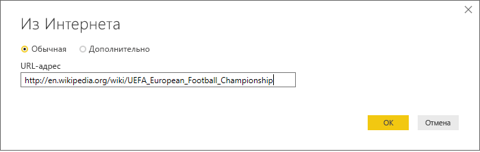

   Когда вы установите подключение к веб-странице Википедии, откроется диалоговое окно **Навигатор** со списком доступных на этой странице таблиц. Вы можете выбрать имя любой таблицы, чтобы просмотреть содержащиеся в ней данные. Нужная нам информация содержится в таблице **Results[edit]** , но сейчас у нее не совсем удобный формат. Вам нужно обработать и очистить эти данные, прежде чем загружать их в отчет.

   

   >[!NOTE]
   >На панели **Предварительный просмотр** отображается только одна таблица, которую вы выбрали последней, но при выборе действия **Преобразовать данные** или **Загрузить** все выбранные таблицы будут загружены в редактор Power Query.

1. Выберите таблицу **Results[edit]** в списке **Навигатор** и щелкните **Преобразовать данные**.

   В **редакторе Power Query** откроется окно предварительного просмотра таблицы, где вы можете применить преобразования для очистки данных.

   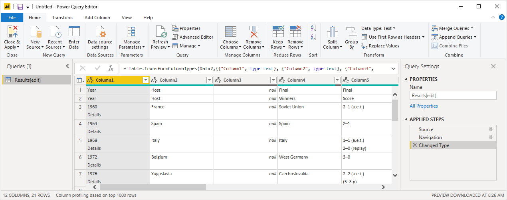

## Формирование данных в редакторе Power Query

Чтобы данные было удобнее просматривать, сохраните в списке для отображения только годы и страны-победительницы. Для этого в редакторе Power Query можно применить процессы обработки и очистки.

Сначала удалите из таблицы все столбцы, кроме двух. Далее переименуйте эти столбцы как *Год* и *Страна*.

1. В сетке **редактора Power Query** выберите столбцы. Чтобы выбрать несколько элементов, зажмите клавишу CTRL.

1. Щелкните выбранные элементы правой кнопкой мыши и выберите действие **Удалить другие столбцы** или последовательно выберите **Удалить столбцы** > **Удалить другие столбцы** в группе **Управление столбцами** на вкладке ленты **Главная**. После этого все столбцы будут удалены из таблицы.

   

   или

   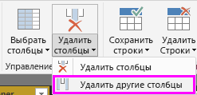

Теперь удалите лишнее слово *Details* (Сведения) из ячеек первого столбца.

1. Выберите первый столбец.

1. Щелкните правой кнопкой мыши и выберите команду **Заменить значения** или выберите команду **Заменить значения** в группе **Преобразование** на вкладке ленты **Главная**. Этот параметр также находится в группе **Любой столбец** на вкладке **Преобразование**.

    

   или

   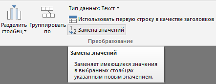

1. В диалоговом окне **Замена значений** введите строку **Сведения** в текстовом поле **Значение для поиска**, а текстовое поле **Заменить на** оставьте пустым. Затем нажмите кнопку **ОК**, чтобы удалить слово *Сведения* из этого столбца.

   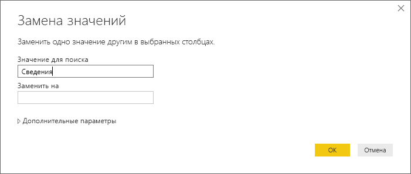

Некоторые ячейки содержат только слово "Год", а не значения года. Установите фильтр по столбцу, чтобы отображались только строки без слова "Год".

1. Выберите стрелку раскрывающегося списка фильтра в столбце.

1. В раскрывающемся меню прокрутите список вниз и снимите флажок рядом с параметром **Год**, а затем нажмите кнопку **ОК**.

   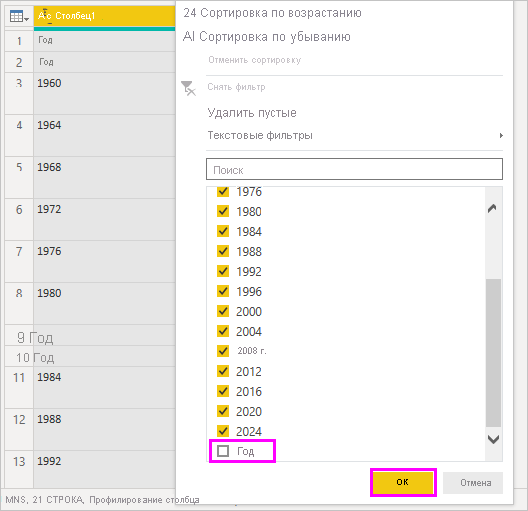

Так как в этом списке и так остались только победители финалов, вы можете смело присвоить второму столбцу имя **Страна**. Чтобы переименовать столбец, сделайте следующее:

1. Дважды щелкните или нажмите и удерживайте заголовок второго столбца или
   - щелкните правой кнопкой мыши заголовок столбца и выберите команду **Удалить столбец**, или
   - выберите столбец и выберите команду **Переименовать** в группе **Любой столбец** на вкладке **Преобразование** ленты.

   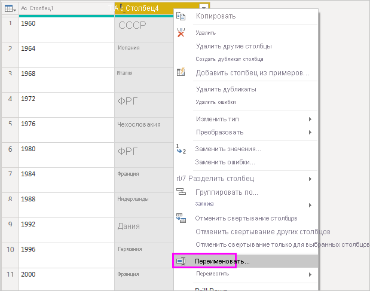 
  
   или

   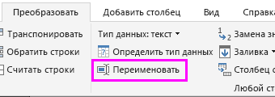

1. Введите в заголовок текст **Country** (Страна) и нажмите клавишу **ВВОД**, чтобы переименовать столбец.

Также есть смысл отфильтровать некоторые строки, например за 2020-й год, чтобы в столбце **Country** (Страна) не осталось пустых значений. Для этого примените меню фильтра, как вы уже делали со значениями столбца **Year** (Год), или сделайте следующее:

1. Щелкните правой кнопкой мыши ячейку **Country** (Страна) в строке **2020**, которая содержит значение *NULL*.

1. Последовательно выберите в контекстном меню **Текстовые фильтры** > **Не равно**, чтобы удалить все строки с таким же значением этой ячейки.

   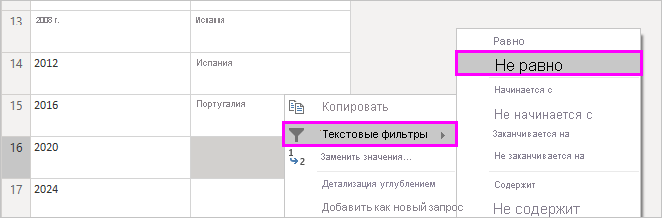

## Импорт запроса в представление отчета

Теперь вы подготовили данные в нужном формате, и этот запрос можно импортировать в отчет, присвоив ему имя "Euro Cup Winners" (Победители Чемпионата Европы).

1. В области **Параметры запроса** в текстовом поле **Имя** введите **Euro Cup Winners**(Победители Еврокубка).

   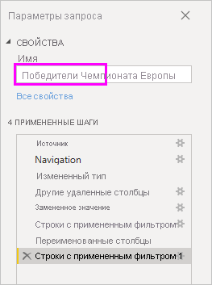

1. Последовательно выберите **Close & Apply (Закрыть и применить)**  > **Close & Apply (Закрыть и применить)** на вкладке ленты **Главная**.

   

Созданный запрос будет загружен в представление *Отчет* Power BI Desktop, где вы увидите его на панели **Поля**.

   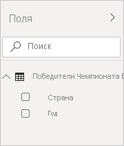

>[!TIP]
>Вы можете в любой момент снова открыть редактор Power Query, чтобы изменить и (или) уточнить запрос, выполнив одну из описанных ниже последовательностей действий:
>- выберите кнопку **Дополнительные параметры** с символом многоточия ( **...** ) рядом с отчетом **Euro Cup Winners** (Победители Чемпионата Европы) на панели **Поля** и выберите действие **Изменить запрос** или
>- выберите **Изменить запросы** > **Изменить запросы** в группе **Внешние данные** на вкладке ленты **Главная** в представлении отчета. 

## Создание визуализации

Чтобы создать визуализацию на основе данных, сделайте следующее:

1. Выберите поле **Country** (Страна) на панели **Поля** или перетащите это поле на холст отчета. Power BI Desktop автоматически распознает, что эти данные содержат названия стран, и создает визуализацию **карты**.

   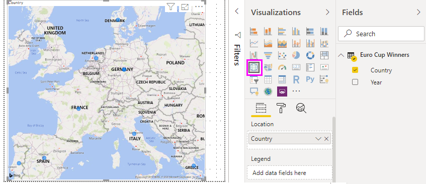

1. Увеличьте эту карту, перетаскивая маркеры в ее углах, чтобы были видны имена всех победителей.  

   

1. На этой карте все точки, обозначающие страны-победительницы Чемпионата Европы по футболу, обозначены одинаковыми маркерами. Чтобы размер маркера отображал количество побед для каждой страны, перетащите поле **Year** (Год) в область **Drag data fields here** (Перетащите сюда поля данных) под элементом **Размер** в нижней части области **Визуализации**. Это поле автоматически преобразуется в меру **Count of Year** (Число значений Year), и на визуализации карты увеличится размер точек данных для тех стран, которые выиграли турнир несколько раз.

   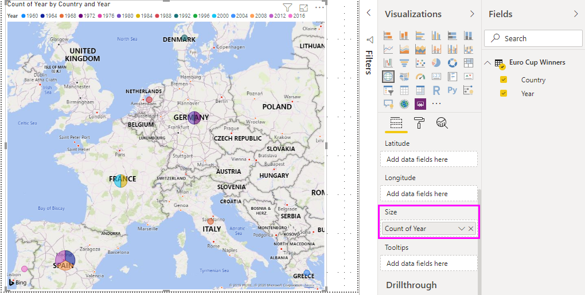

## Настройка визуализации

Вы убедились, что можно очень легко создать визуализации на основе данных. Ничуть не сложнее будет настроить эти визуализации, чтобы данные было удобно просматривать.

### Форматирование карты

Чтобы изменить внешний вид визуализации, выберите ее, а затем выберите значок **Формат** (с изображением валика) на панели **Визуализации**. Например, точка данных "Germany" (Германия) на этой визуализации вводит пользователя в заблуждение: дважды турнир выигрывала ФРГ и один раз объединенная Германия. Эти две точки накладываются друг на друга, но не объединяются и не разделяются. Чтобы прояснить этот факт, раскрасьте точки разными цветами. Также вы можете присвоить диаграмме более подробный и привлекательный заголовок.

1. Выберите визуализацию и щелкните значок **Формат**, а затем выберите **Цвета данных**, чтобы развернуть параметры цветов данных.

   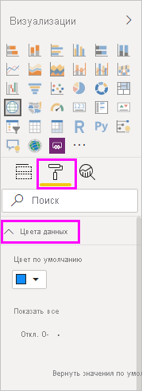

1. Для параметра **Показать все** выберите значение **Включено**, а затем выберите значок раскрывающегося списка рядом с элементом **Западная Германия** и выберите для него желтый цвет.

   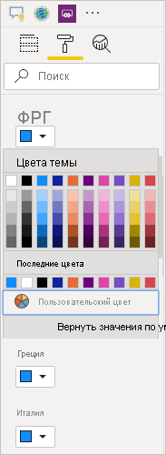

1. Выберите **Заголовок**, чтобы развернуть параметры заголовка, и замените текущее значение поля **Текст заголовка** текстовой строкой **Euro Cup Winners** (Победители Чемпионата Европы).

1. Укажите для параметра **Цвет шрифта** значение "Красный", затем установите для параметра **Размер текста** значение **12** и измените **семейство шрифтов** на **Segoe (Bold)** (Segoe (полужирный)).

   

Теперь визуализация карты выглядит примерно так:

### Изменение типа визуализации

Вы можете изменить тип визуализации, выбрав нужную визуализацию и значок другого типа в верхней части панели **Визуализация**. Например, на нашей визуализации карты отсутствуют данные для СССР и Чехословакии, поскольку их больше нет на карте мира. Другой тип визуализации, например диаграмма дерева или круговая диаграмма могут оказаться более точными, так как на них отображаются все значения.

Чтобы заменить карту на круговую диаграмму, выберите карту и щелкните значок **круговой диаграммы** на панели **Визуализация**.

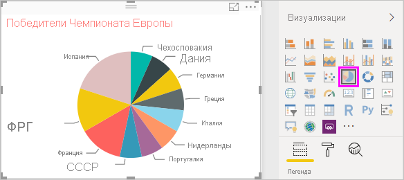

>[!TIP]
>- После этого можно изменить **цвета данных**, чтобы ФРГ и объединенная Германия отображались одним и тем же цветом. 
>- Чтобы страны с наибольшим количеством побед отображались на круговой диаграмме рядом, выберите кнопку с многоточием ( **...** ) в верхнем правом углу визуализации и щелкните **Sort by Count of Year** (Сортировать по числу значений Year).

Power BI Desktop предоставляет удобные возможности для получения данных из разнообразных источников и их обработки для анализа и визуализации в интерактивном режиме. Готовый отчет можно [отправить в Power BI](../create-reports/desktop-upload-desktop-files.md) и создать на его основе панели мониторинга, к которым можно предоставить общий доступ для других пользователей Power BI.

## См. также:

* [Microsoft Learn для Power BI](https://docs.microsoft.com/learn/powerplatform/power-bi?WT.mc_id=powerbi_landingpage-docs-link)
* [Посмотрите видеоматериалы по Power BI Desktop.](../fundamentals/desktop-videos.md)
* [Посетите форум Power BI.](https://go.microsoft.com/fwlink/?LinkID=519326)
* [Прочитайте блог, посвященный Power BI.](https://go.microsoft.com/fwlink/?LinkID=519327)
