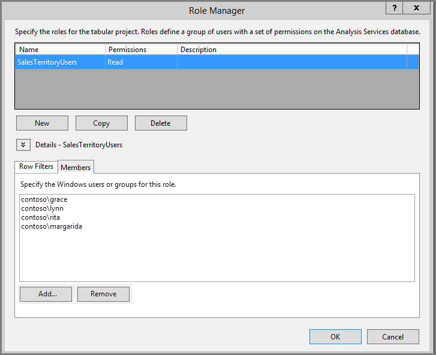

# <a name="implement-row-level-security-in-an-analysis-services-tabular-model"></a>Безопасность на уровне строк в табличной модели Analysis Services

На примере набора данных, используемого для выполнения описанных ниже действий, это руководство показывает, как реализовать [**безопасность на уровне строк**](../admin/service-admin-rls.md) в *табличной модели Analysis Services* и использовать ее в отчете Power BI.

* Создание таблицы безопасности в [базе данных AdventureworksDW2012](https://github.com/Microsoft/sql-server-samples/releases/tag/adventureworks)
* Создание табличной модели с необходимыми таблицами фактов и измерений
* Определение ролей и разрешений пользователей
* Развертывание модели в *табличном экземпляре Analysis Services*
* Создание в Power BI Desktop отчета, отображающего для пользователей данные с учетом их прав доступа
* Развертывание отчета в *службе Power BI*
* Создание панели мониторинга на основе отчета
* Предоставление доступа к панели мониторинга коллегам.

Для прохождения этого руководства нужна [база данных AdventureworksDW2012](https://github.com/Microsoft/sql-server-samples/releases/tag/adventureworks).

## <a name="task-1-create-the-user-security-table-and-define-data-relationship"></a>Задача 1. Создание таблицы безопасности пользователей и определение связей между данными

Существует множество статей, описывающих, как настроить динамическую безопасность на уровне строк в *табличной модели SQL Server Analysis Services (SSAS)* . В этом примере воспользуемся статьей [Реализация динамической безопасности с помощью фильтров строк](/analysis-services/tutorial-tabular-1200/supplemental-lesson-implement-dynamic-security-by-using-row-filters).

Для выполнения описанных действий нужна реляционная база данных AdventureworksDW2012.

1. Создайте в AdventureworksDW2012 таблицу `DimUserSecurity`, как показано ниже. Для создания таблицы можно использовать [SQL Server Management Studio (SSMS)](/sql/ssms/download-sql-server-management-studio-ssms).

   

1. После создания и сохранения таблицы необходимо установить связь между столбцом `SalesTerritoryID` таблицы `DimUserSecurity` и столбцом `SalesTerritoryKey` таблицы `DimSalesTerritory`, как показано ниже.

   В SSMS щелкните таблицу **DimUserSecurity** правой кнопкой мыши и выберите пункт **Конструктор**. Выберите **Конструктор таблиц** > **Связи...** . После этого сохраните таблицу.

   

1. Добавьте пользователей в таблицу. Щелкните таблицу **DimUserSecurity** правой кнопкой мыши и выберите пункт **Изменить 200 верхних строк**. После добавления пользователей таблица `DimUserSecurity` должна выглядеть так, как показано в следующем примере.

   

   Вы вернетесь к этим пользователям при выполнении дальнейших задач.

1. Теперь нужно создать *внутреннее соединение* с таблицей `DimSalesTerritory`, которое отражает связанные с пользователем сведения о регионе. Этот код SQL выполняет внутреннее соединение, а на рисунке показано, как таблица выглядит после этой операции.

    ```sql
    select b.SalesTerritoryCountry, b.SalesTerritoryRegion, a.EmployeeID, a.FirstName, a.LastName, a.UserName from [dbo].[DimUserSecurity] as a join [dbo].[DimSalesTerritory] as b on a.[SalesTerritoryID] = b.[SalesTerritoryKey]
    ```

   В объединенной таблице показано, кто отвечает за каждый регион продаж, в соответствии со связью, созданной в шаге 2. Например, можно видеть, что *Рита Сантос* отвечает за *Австралию*.

## <a name="task-2-create-the-tabular-model-with-facts-and-dimension-tables"></a>Задача 2. Создание табличной модели с таблицами фактов и измерений

Создав реляционное хранилище данных, нужно определить табличную модель. Для создания модели можно использовать инструментарий [SQL Server Data Tools](/sql/ssdt/sql-server-data-tools) (SSDT). Дополнительные сведения см. в статье [Создание проекта табличной модели](/sql/analysis-services/lesson-1-create-a-new-tabular-model-project).

1. Импортируем в модель все необходимые таблицы, как показано ниже.

    

1. После импорта таблиц нужно определить роль под названием *SalesTerritoryUsers* с разрешениями на чтение. Откройте меню **Модель** в инструментарии SQL Server Data Tools и выберите пункт **Роли**. В **диспетчере ролей** нажмите кнопку **Создать**.

1. На вкладке **Участники** в **диспетчере ролей** добавьте пользователей, определенных в таблице `DimUserSecurity` при выполнении [задачи 1](#task-1-create-the-user-security-table-and-define-data-relationship).

    

1. Теперь добавим необходимые функции для таблиц `DimSalesTerritory` и `DimUserSecurity`, как показано ниже на вкладке **Фильтры строк**.

    

1. Функция `LOOKUPVALUE` возвращает значения для столбца, в котором имя пользователя Windows совпадает с именем, возвращаемым функцией `USERNAME`. Для запросов можно настроить ограничение, благодаря которому значения, возвращаемые функцией `LOOKUPVALUE`, будут совпадать со значениями в той же или связанной таблице. В столбце **Фильтр DAX** введем следующую формулу:

    ```dax
        =DimSalesTerritory[SalesTerritoryKey]=LOOKUPVALUE(DimUserSecurity[SalesTerritoryID], DimUserSecurity[UserName], USERNAME(), DimUserSecurity[SalesTerritoryID], DimSalesTerritory[SalesTerritoryKey])
    ```

    В этой формуле функция `LOOKUPVALUE` возвращает все значения для столбца `DimUserSecurity[SalesTerritoryID]`, где `DimUserSecurity[UserName]` совпадает с текущим именем пользователя в системе Windows, а `DimUserSecurity[SalesTerritoryID]` совпадает с `DimSalesTerritory[SalesTerritoryKey]`.

    > [!IMPORTANT]
    > При использовании безопасности на уровне строк функция DAX [USERELATIONSHIP](/dax/userelationship-function-dax) не поддерживается.

   Для ограничения количества строк, отображаемых в `DimSalesTerritory`, используются значения, возвращенные функцией `LOOKUPVALUE` `SalesTerritoryKey` продаж. В ней показаны только строки, в которых значение `SalesTerritoryKey` входит в число идентификаторов, возвращаемых функцией `LOOKUPVALUE`.

1. Для таблицы `DimUserSecurity` в столбце **Фильтр DAX** добавьте следующую формулу:

    ```dax
        =FALSE()
    ```

    Она указывает, что все столбцы разрешаются в `false`, поэтому столбцы таблицы `DimUserSecurity` не используются в запросе.

Теперь нужно обработать и развернуть модель. Для получения дополнительных сведений см. раздел [Развертывание](/sql/analysis-services/lesson-13-deploy).

## <a name="task-3-add-data-sources-within-your-on-premises-data-gateway"></a>Задача 3. Добавление источников данных в локальном шлюзе данных

После того как табличная модель развернута и готова к работе, нужно добавить подключение к источнику данных на сервер табличного экземпляра Analysis Services.

1. Чтобы служба Power BI могла обращаться к локальной службе аналитики, в вашей среде должен быть установлен и настроен [локальный шлюз данных](service-gateway-onprem.md).

1. Настроив шлюз должным образом, необходимо создать подключение к источнику данных для экземпляра табличной модели *Analysis Services*. Дополнительные сведения см. в статье [Управление своим источником данных — службы Analysis Services](service-gateway-enterprise-manage-ssas.md).

   

После выполнения этой процедуры шлюз настроен и готов к взаимодействию с локальным источником данных Analysis Services.

## <a name="task-4-create-report-based-on-analysis-services-tabular-model-using-power-bi-desktop"></a>Задача 4. Создание отчета на основе табличной модели Analysis Services с помощью Power BI Desktop

1. Запустите Power BI Desktop и выберите **Получение данных** > **База данных**.

1. В списке источников данных выберите пункт **База данных SQL Server Analysis Services** и щелкните **Подключиться**.

   

1. Введите данные своего экземпляра табличной модели Analysis Services и щелкните **Подключение в реальном времени**. Нажмите кнопку **ОК**.
  
   

   В Power BI динамическая безопасность работает только при динамических подключениях.

1. Вы увидите, что развернутая модель находится в экземпляре Analysis Services. Выберите нужную модель и нажмите кнопку **ОК**.

   Power BI Desktop выведет все доступные поля справа от холста в области **Поля**.

1. В области **Поля** выберите меру **SalesAmount** в таблице **FactInternetSales** и измерение **SalesTerritoryRegion** в таблице **SalesTerritory**.

1. Чтобы не усложнять этот отчет, мы не станем добавлять в него другие столбцы. Чтобы сделать данные более осмысленными, выберите режим визуализации **Кольцевой график**.

   

1. Создав отчет, мы можем опубликовать его непосредственно на портале Power BI. На ленте **Главная** в Power BI Desktop выберите **Опубликовать**.

## <a name="task-5-create-and-share-a-dashboard"></a>Задача 5. Создание и совместное использование панели мониторинга

Вы создали отчет и опубликовали его в службе **Power BI**. Теперь вы можете использовать пример, созданный на предыдущих этапах, для демонстрации сценария безопасности модели.

Как *руководитель продаж* пользователь Грейс видит данные из всех регионов продаж. Грейс создает отчет и публикует его в службе Power BI. Этот отчет был создан в предыдущих задачах.

После публикации Грейс создает на основе отчета панель мониторинга в службе Power BI и называет ее *TabularDynamicSec*. На изображении ниже показано, что Грейс видит все данные для всех регионов продаж.

   

Теперь Грейс предоставляет доступ к панели мониторинга своей коллеге Рите, которая отвечает за продажи в Австралии.

   

Когда Рита входит в службу Power BI и открывает общую панель мониторинга, созданную Грейс, должны отображаться только показатели продаж в Австралии.

Поздравляем! Параметры динамической безопасности на уровне строк, настроенные в локальной табличной модели Analysis Services, отображаются в службе Power BI. Служба Power BI использует свойство `EffectiveUserName` для передачи учетных данных текущего пользователя Power BI в локальный источник данных при выполнении запросов.

## <a name="task-6-understand-what-happens-behind-the-scenes"></a>Задача 6. Понимание происходящего

При выполнении этой задачи предполагается, что вы знакомы с приложением [SQL Server Profiler](/sql/tools/sql-server-profiler/sql-server-profiler), так как вам нужно выполнить трассировку обмена данными с SQL Server в локальном табличном экземпляре SSAS.

Сеанс создается в момент, когда пользователь (Рита) обращается к панели мониторинга в службе Power BI. Мы видим, что роль **salesterritoryusers** сразу же применяется для действующего имени пользователя **<EffectiveUserName>rita@contoso.com</EffectiveUserName>** .

       <PropertyList><Catalog>DefinedSalesTabular</Catalog><Timeout>600</Timeout><Content>SchemaData</Content><Format>Tabular</Format><AxisFormat>TupleFormat</AxisFormat><BeginRange>-1</BeginRange><EndRange>-1</EndRange><ShowHiddenCubes>false</ShowHiddenCubes><VisualMode>0</VisualMode><DbpropMsmdFlattened2>true</DbpropMsmdFlattened2><SspropInitAppName>PowerBI</SspropInitAppName><SecuredCellValue>0</SecuredCellValue><ImpactAnalysis>false</ImpactAnalysis><SQLQueryMode>Calculated</SQLQueryMode><ClientProcessID>6408</ClientProcessID><Cube>Model</Cube><ReturnCellProperties>true</ReturnCellProperties><CommitTimeout>0</CommitTimeout><ForceCommitTimeout>0</ForceCommitTimeout><ExecutionMode>Execute</ExecutionMode><RealTimeOlap>false</RealTimeOlap><MdxMissingMemberMode>Default</MdxMissingMemberMode><DisablePrefetchFacts>false</DisablePrefetchFacts><UpdateIsolationLevel>2</UpdateIsolationLevel><DbpropMsmdOptimizeResponse>0</DbpropMsmdOptimizeResponse><ResponseEncoding>Default</ResponseEncoding><DirectQueryMode>Default</DirectQueryMode><DbpropMsmdActivityID>4ea2a372-dd2f-4edd-a8ca-1b909b4165b5</DbpropMsmdActivityID><DbpropMsmdRequestID>2313cf77-b881-015d-e6da-eda9846d42db</DbpropMsmdRequestID><LocaleIdentifier>1033</LocaleIdentifier><EffectiveUserName>rita@contoso.com</EffectiveUserName></PropertyList>

Используя запрос действующего имени пользователя, службы Analysis Services преобразуют его в учетные данные `contoso\rita` после отправки запроса в каталог Active Directory. После того как службы Analysis Services получают реальные учетные данные, они возвращают те данные, на работу с которыми у пользователя есть разрешение.

Если на панели мониторинга будет выполнено еще какое-то действие, в SQL Profiler отразится соответствующий запрос, который направляется в табличную модель Analysis Services в виде запроса DAX. Например, если Рита переходит из панели мониторинга в базовый отчет, происходит следующий запрос.

   

Ниже также показан запрос DAX, который выполняется для заполнения отчета данными.
   
   ```dax
   EVALUATE
     ROW(
       "SumEmployeeKey", CALCULATE(SUM(Employee[EmployeeKey]))
     )
   
   <PropertyList xmlns="urn:schemas-microsoft-com:xml-analysis">``
             <Catalog>DefinedSalesTabular</Catalog>
             <Cube>Model</Cube>
             <SspropInitAppName>PowerBI</SspropInitAppName>
             <EffectiveUserName>rita@contoso.com</EffectiveUserName>
             <LocaleIdentifier>1033</LocaleIdentifier>
             <ClientProcessID>6408</ClientProcessID>
             <Format>Tabular</Format>
             <Content>SchemaData</Content>
             <Timeout>600</Timeout>
             <DbpropMsmdRequestID>8510d758-f07b-a025-8fb3-a0540189ff79</DbpropMsmdRequestID>
             <DbPropMsmdActivityID>f2dbe8a3-ef51-4d70-a879-5f02a502b2c3</DbPropMsmdActivityID>
             <ReturnCellProperties>true</ReturnCellProperties>
             <DbpropMsmdFlattened2>true</DbpropMsmdFlattened2>
             <DbpropMsmdActivityID>f2dbe8a3-ef51-4d70-a879-5f02a502b2c3</DbpropMsmdActivityID>
           </PropertyList>
   ```

## <a name="considerations"></a>Ограничения

* Локальная безопасность на уровне строк при работе с Power BI действует только при динамических подключениях.

* Все изменения, вносимые в данные после обработки модели, становятся сразу же доступны пользователям, которые работают с отчетом через динамические подключения из службы Power BI.
