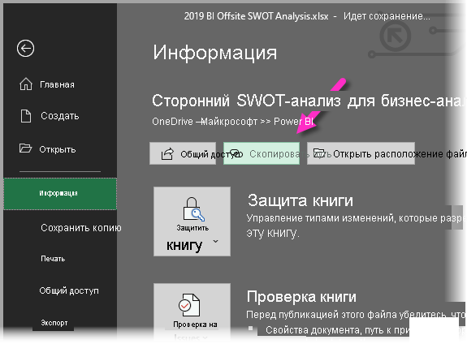
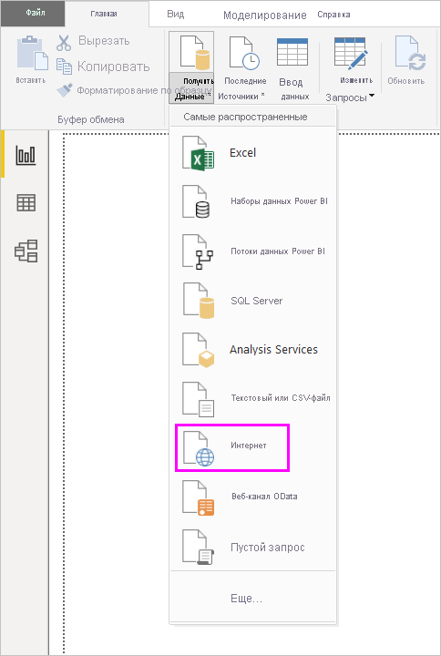
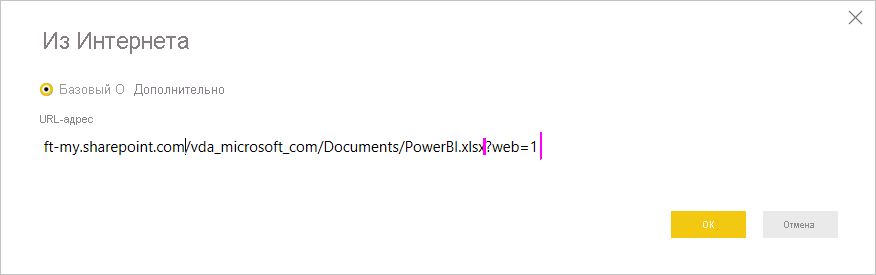
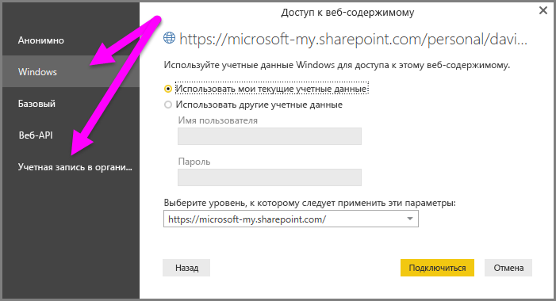

# Использование ссылок OneDrive для бизнеса в Power BI Desktop
Многие пользователи хранят книги Excel на диске OneDrive для бизнеса, который отлично подходит для использования с Power BI Desktop. Благодаря Power BI Desktop вы можете использовать веб-ссылки на файлы Excel, хранящиеся в OneDrive для бизнеса, для создания отчетов и визуальных элементов. Можно использовать учетную запись группы OneDrive для бизнеса или индивидуальную учетную запись OneDrive для бизнеса.

Для получения веб-ссылки из OneDrive для бизнеса требуется выполнить определенные действия. В следующих разделах демонстрируются процедуры, которые позволяют предоставить общий доступ к ссылке на файл для групп, разных компьютеров, а также пользователей.

## Получить ссылку из Excel
1. Перейдите к расположению OneDrive для бизнеса с помощью браузера. Щелкните правой кнопкой мыши нужный файл и выберите **Открыть в Excel**.
   
   > [!NOTE]
   > Интерфейс браузера может отличаться от представленного на рисунке. Существует несколько способов выбора команды **Открыть в Excel** для файлов в интерфейсе браузера OneDrive для бизнеса. Можно использовать любой вариант, позволяющий открыть файл в Excel.
   > 
   > 
   
   
2. В Excel выберите **Файл** > **Сведения**, а затем выберите **Путь копирования** над пунктом **Защитить книгу**.
   
   

## Использование ссылки в Power BI Desktop
В Power BI Desktop можно использовать только что скопированную ссылку. Выполните следующие действия.

1. В Power BI Desktop выберите **Получить данные** > **Интернет**.
   
   
2. Выбрав параметр **Базовый**, вставьте ссылку в диалоговом окне **Из Интернета**.
3. Удалите строку *?web=1* в конце ссылки, чтобы Power BI Desktop мог корректно перейти к файлу, а затем нажмите **ОК**.
   
     
4. Если Power BI Desktop запрашивает учетные данные, выберите **Windows** (для локальных сайтов SharePoint) или **Учетная запись организации** (для сайтов Microsoft 365 или OneDrive для бизнеса).
   
   

   Откроется диалоговое окно **Навигатор**, где в списке таблиц, листов и диапазонов, обнаруженных в книге Excel, можно выбрать нужные данные. Отсюда можно использовать файл OneDrive для бизнеса так же, как и любой другой файл Excel. Вы можете создавать отчеты и использовать их в наборах данных, как и в случае с любым другим источником данных.

> [!NOTE]
> Вы можете использовать файл OneDrive для бизнеса в качестве источника данных в службе Power BI с включенным для этого файла параметром **Обновление службы**. Для этого нужно выбрать **OAuth2** в качестве **метода аутентификации** при настройке параметров обновления. В противном случае при попытке подключения или обновления может возникнуть ошибка (например, *ошибка обновления учетных данных источника данных*). Выбрав **OAuth2** как метод аутентификации, вы устраните эту проблему с учетными данными.
> 
> 

