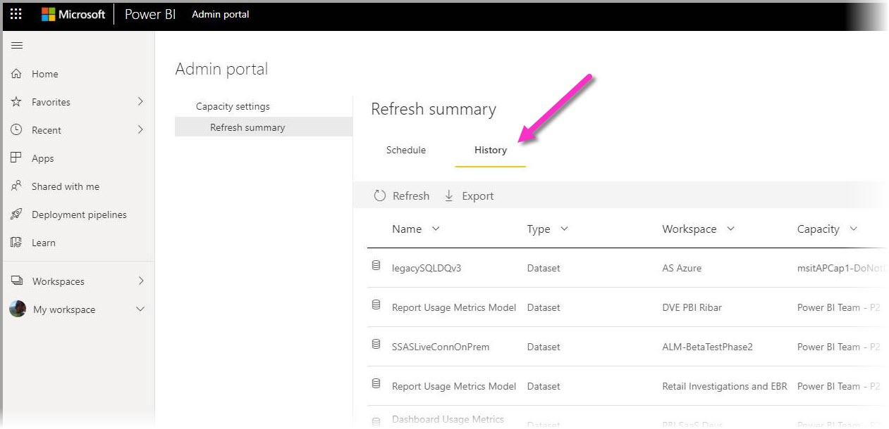
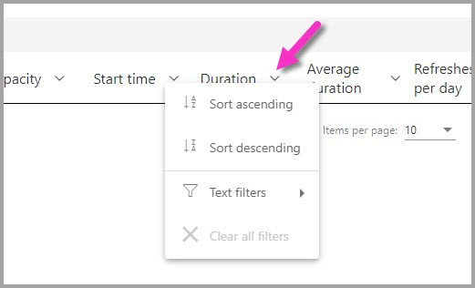

# Сводки обновления в Power BI

На странице **сводок обновления** в Power BI, которая находится на портале администрирования Power BI, можно управлять расписаниями обновления, емкостями и возможными наложениями расписаний обновления. Страницу сводок обновления можно использовать для определения того, следует ли настраивать расписания обновления, просматривать коды ошибок, связанные с проблемами обновления, и надлежащим образом управлять планированием обновления данных. 

На странице сводок обновления имеется два представления.

* **Журнал** — в этом представлении отображается журнал сводки обновления для емкостей Power BI Premium, администратором которых вы являетесь.

* **Расписание** — представление расписания запланированного обновления, в котором также можно выявить проблемы с интервалами времени, превышающими ограничения подписки.

Также можно экспортировать сведения о событии обновления в CSV-файл, в котором может содержаться важная информация, а также сведения о событиях или ошибках обновления, которые могут повлиять на производительность или выполнение запланированных событий обновления.

В следующих разделах рассматривается каждое из этих представлений. 

## Журнал обновлений

Можно выбрать представление **Журнал**, нажав **Журнал** на странице сводок обновления.

В журнале содержатся общие сведения о результатах недавно запланированных обновлений емкостей, администратором которых вы являетесь. Представление можно отсортировать по любому столбцу, щелкнув его заголовок. Можно выбрать сортировку представления по столбцу, выбранному в порядке возрастания, в порядке убывания или с помощью текстовых фильтров.

В представлении журнала данные, связанные с указанным обновлением, основаны на 60 последних записях для каждого запланированного обновления.

Можно также экспортировать данные для любого запланированного обновления в CSV-файл, который содержит подробные сведения, включая сообщения об ошибках для каждого события обновления. Экспорт в CSV-файл позволяет сортировать файл по любому из столбцов, искать слова, сортировать по кодам ошибок или владельцам и т. д. На следующем рисунке показан пример такого CSV-файла. 

С помощью сведений в экспортированном файле можно просматривать емкость, длительность и любые сообщения об ошибках, зафиксированные для экземпляра обновления. 

## Расписание обновления

Можно выбрать представление **Расписание**, щелкнув **Расписание** в сводках обновления. В представлении "Расписание" указаны сведения о расписании на неделю с разбивкой на 30-минутные интервалы времени. 

Представление расписания очень полезно для определения того, правильно ли запланированы события обновления, что позволяет выполнять все обновления без наложения друг на друга, а также того, выполняются ли запланированные события обновления слишком долго, состязаясь за ресурсы. Если вы обнаружите такое состязание за ресурсы, следует настроить расписания обновления, чтобы избежать конфликтов или наложений для успешного выполнения запланированных обновлений. 

В столбце *Зарезервированное время обновления (в минутах)* указывается расчетное среднее время для записей (не более 60) для каждого связанного набора данных. Числовое значение для каждого 30-минутного интервала времени — это сумма минут, рассчитанная для всех запланированных обновлений, которые запланированы на начало интервала времени, **и** всех запланированных обновлений, которые начинаются с *предыдущего* интервала времени, но средняя продолжительность которых перетекает в выбранный интервал времени.

В столбце *Доступное время обновления (в минутах)* указывается расчетное количество минут, доступных для обновления в каждом интервале времени, с вычитанием запланированного обновления для этого интервала. Например, если ваша подписка P2 поддерживает 12 параллельно выполняемых обновлений, значит вам доступно 12 интервалов по 30 минут. То есть у вас есть 360 минут (12 обновлений x 30 минут) для обновления в этом интервале времени. Если в этом интервале есть одно запланированное обновление, которое занимает 20 минут, значение в столбце *Доступное время обновления (в минутах)* будет составлять 340 минут (всего доступно 360 минут, с них вычитаются 20 зарезервированных минут, значит доступно 340 минут). 

Можно выбрать интервал времени, а затем нажать соответствующую кнопку **Сведения**, чтобы узнать, какие запланированные события обновления влияют на зарезервированное время обновления, их владельцев и длительность их выполнения.

Рассмотрим на примере, как это работает. При выборе интервала времени 20:30 в воскресенье отображается следующее диалоговое окно. Нажмите в нем кнопку **Сведения**.

В этом интервале времени происходят три запланированных события обновления. 

Обновления 1 и 3 запланированы на этот интервал времени 20:30, что можно определить, обратившись к значению в столбце **Запланированный период времени**. Средняя продолжительность обновлений составляет 4:39 и 6 секунд (0:06) соответственно. Здесь все в порядке.

Обновление 2 запланировано на интервал времени 20:00, однако, поскольку оно занимает в среднем более 48 минут (как видно из столбца **Средняя длительность**), это событие обновления перетекает в следующий 30-минутный интервал времени. 

Это плохо. В этом случае администратору следует обратиться к владельцам этого экземпляра запланированного обновления и предложить им указать другой интервал времени для запланированного обновления или изменить расписание других обновлений так, чтобы они не накладывались, или найти другое решение, чтобы предотвратить такое наложение. 

## Дальнейшие действия

- [Обновление данных в Power BI](refresh-data.md)  
- [Шлюз Power BI Gateway — Personal](service-gateway-personal-mode.md)  
- [Локальный шлюз данных (персональный режим)](service-gateway-onprem.md)  
- [Устранение неполадок локального шлюза данных](service-gateway-onprem-tshoot.md)  
- [Устранение неполадок с Power BI Gateway — Personal](service-admin-troubleshooting-power-bi-personal-gateway.md)  

Появились дополнительные вопросы? [Попробуйте задать вопрос в сообществе Power BI.](https://community.powerbi.com/)