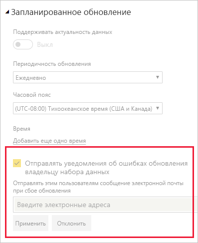

# Устранение неполадок в сценариях обновления 

Здесь можно найти сведения о различных сценариях, с которыми вы можете столкнуться при обновлении данных в службе Power BI.

> [!NOTE]
> Если возникла проблемная ситуация, не указанная ниже, вы можете запросить дополнительную помощь на [сайте сообщества](https://community.powerbi.com/) или отправить [запрос в службу поддержки](https://powerbi.microsoft.com/support/).
>
>

## Уведомления по электронной почте

Если вы открыли эту статью из уведомления по электронной почте и больше не хотите получать сообщения о проблемах обновления, обратитесь к администратору Power BI. Попросите их удалить свою электронную почту или список рассылки, на который вы подписаны, из соответствующих наборов данных в Power BI. Они могут это сделать в следующей области на портале администрирования Power BI.

## Обновление с использованием веб-соединителя не работает надлежащим образом

Если у вас есть сценарий веб-соединителя, использующий функцию [**Web.Page**](/powerquery-m/web-page), и вы обновили набор данных или отчет после 18 ноября 2016 г., для надлежащей работы функции обновления нужно использовать шлюз.

## Неподдерживаемый источник данных для обновления

При настройке набора данных может возникнуть ошибка, указывающая на то, что набор данных использует источник данных, не поддерживающий обновление. Дополнительные сведения см. в разделе [Устранение неполадок с источником данных, не поддерживающим обновление](service-admin-troubleshoot-unsupported-data-source-for-refresh.md).

## Панель мониторинга не отражает изменений после обновления

Подождите 10–15 минут для обновления информации на плитках панели мониторинга. Если данные все равно не отображаются, повторно закрепите визуализацию на панели мониторинга.

## GatewayNotReachable при задании учетных данных

При попытке установки учетных данных для источника данных может возникнуть `GatewayNotReachable`. Причиной этого может быть устаревший шлюз. Установите последнюю версию шлюза и повторите попытку.

## Ошибка при обработке. Произошла следующая системная ошибка: несоответствие типов

Возможно, эта проблема связана со сценарием M в файле Power BI Desktop или книге Excel. Кроме того, причиной этого может быть устаревшая версия Power BI Desktop.

## Ошибки обновления плитки

Список ошибок, которые могут возникнуть в работе плиток информационной панели, а также их описание, см. в разделе [Устранение неполадок с плитками](refresh-troubleshooting-tile-errors.md).

## Обновление данных из источников, использующих AAD OAuth, завершается сбоем

Срок действия токена OAuth Azure Active Directory (**AAD**), используемого большинством источников данных, истекает примерно через один час. Иногда загрузка данных выполняется дольше срока жизни токена (больше часа), так как при выполнении этого процесса служба Power BI ожидает около двух часов. В этом случае процесс загрузки данных может завершиться сбоем c ошибкой в учетных данных.

К источникам данных, использующим AAD OAuth, относятся **Microsoft Dynamics CRM Online**, **SharePoint Online** (SPO) и т. д. Если вы подключаетесь к таким источникам данных и возникает ошибка в учетных данных, когда отправка занимает более часа, это может быть причиной сбоя.

Корпорация Майкрософт работает над решением, которое позволит обновить токен в процессе загрузки данных. Но если экземпляр Dynamics CRM Online или SharePoint Online (или другой источник данных, использующий AAD OAuth) такой большой, что может достигнуть двухчасового порогового значения загрузки данных, может также истечь время ожидания загрузки данных из службы Power BI.

Чтобы обеспечить надлежащую работу, следует выполнять обновление. Для этого при подключении к источнику данных **SharePoint Online** с помощью AAD OAuth необходимо использовать ту же учетную запись, что и при входе в **службы Power BI**.

## Ограничения при обновлении несжатых данных

Максимальный размер наборов данных, импортируемых в **службы Power BI**, составляет 1 ГБ. Эти наборы данных сильно сжимаются для обеспечения высокой производительности. Кроме того, в общей емкости служба устанавливает ограничение в 10 ГБ на объем несжатых данных, обрабатываемых во время обновления. Это ограничение учитывается при сжатии и поэтому значительно превышает 1 ГБ. Это ограничение не распространяется на наборы данных в Power BI Premium. Если по этой причине в службе Power BI происходит сбой обновления, уменьшите объем данных, импортируемых в Power BI, и повторите попытку.

## Время ожидания запланированного обновления

Время ожидания запланированного обновления импортированных наборов данных составляет два часа. Это время ожидания увеличивается до пяти часов для наборов данных в рабочих областях **Premium**. Если вы сталкиваетесь с этим ограничением, рекомендуется уменьшить размер или сложность набора данных либо разбить набор данных на более мелкие части.

## Сбои запланированного обновления

Если запланированное обновление завершается сбоем четыре раза подряд, Power BI отключает его. Устраните первопричину, а затем снова включите запланированное обновление.

## Доступ к ресурсу запрещен  

Эта ошибка может возникать из-за кэшированных учетных данных с истекшим сроком действия. Очистите кэш веб-браузера, выполнив вход в Power BI и перейдя на страницу `https://app.powerbi.com?alwaysPromptForContentProviderCreds=true`. Учетные данные будут принудительно обновлены.

## Сбой обновления данных из-за смены пароля или учетных данных с истекшим сроком действия

Обновление данных может также завершиться сбоем из-за кэшированных учетных данных с истекшим сроком действия. Очистите кэш веб-браузера, выполнив вход в Power BI и перейдя на страницу `https://app.powerbi.com?alwaysPromptForContentProviderCreds=true`. Учетные данные будут принудительно обновлены.

## Дальнейшие действия

- [Обновление данных в Power BI](refresh-data.md)  
- [Устранение неполадок локального шлюза данных](service-gateway-onprem-tshoot.md)  
- [Устранение неполадок с Power BI Gateway — Personal](service-admin-troubleshooting-power-bi-personal-gateway.md)  

Появились дополнительные вопросы? [Попробуйте задать вопрос в Сообществе Microsoft Power BI](https://community.powerbi.com/)
