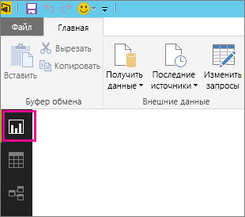
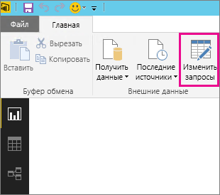
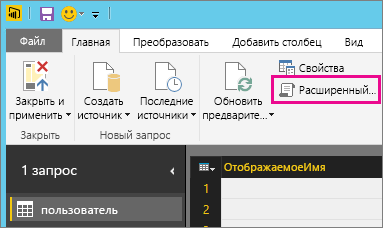
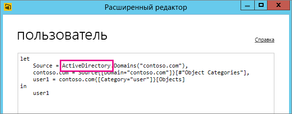

# Устранение неполадок с источником данных, не поддерживающим обновление
При попытке настроить запланированное обновление набора данных может появиться сообщение об ошибке.

        You cannot schedule refresh for this dataset because it gets data from sources that currently don’t support refresh.

Это происходит, когда обновление источника данных, используемого в Power BI Desktop, не поддерживается. Необходимо найти используемый источник данных и сравнить его со списком поддерживаемых источников данных в разделе [Обновление данных в Power BI](refresh-data.md). 

## Поиск источника данных
Если неизвестно, какой источник данных был использован, его можно найти, выполнив следующие действия в Power BI Desktop.  

1. В Power BI Desktop перейдите в область **Отчет** .  
   
2. Щелкните **Изменить запросы** на ленте.  
   
3. Щелкните **Расширенный редактор**.  
   
4. Запишите название поставщика, указанного для источника.  В этом примере поставщиком является ActiveDirectory.  
   
5. Сравните поставщик со списком поддерживаемых источников данных, приведенным в разделе [Источники данных Power BI](power-bi-data-sources.md).

> [!NOTE]
> Сведения о проблемах обновления у динамических источников данных, включая источники данных, которые поддерживают запросы вручную, см. в [этом разделе](refresh-data.md#refresh-and-dynamic-data-sources).

## Дальнейшие действия
[Обновление данных](refresh-data.md)  
[Шлюз Power BI Gateway — Personal](service-gateway-personal-mode.md)  
[On-premises data gateway (Локальный шлюз данных)](service-gateway-onprem.md)  
[Устранение неполадок локального шлюза данных](service-gateway-onprem-tshoot.md)  
[Устранение неполадок с Power BI Gateway — Personal](service-admin-troubleshooting-power-bi-personal-gateway.md)  

Появились дополнительные вопросы? [Попробуйте задать вопрос в сообществе Power BI.](https://community.powerbi.com/)
