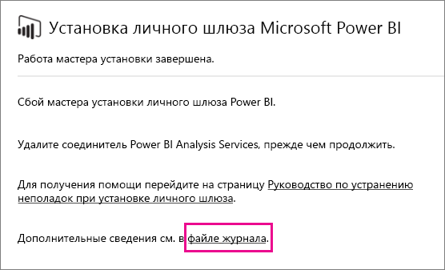

# Устранение неполадок со шлюзом Power BI (персональный режим)

[!INCLUDE [gateway-rewrite](../includes/gateway-rewrite.md)]

В следующих разделах рассмотрено несколько распространенных проблем, которые могут возникнуть при использовании локального шлюза данных Power BI (персональный режим).

## Обновление до последней версии

Текущая версия шлюза для личного использования — локальный шлюз данных (персональный режим). Обновите установку, чтобы использовать эту версию.

При использовании устаревшей версии шлюза могут возникать разные проблемы. Рекомендуется всегда следить за тем, чтобы использовалась самая новая версия. Если шлюз не обновлялся в течение месяца или более, рекомендуется установить последнюю версию шлюза. После этого проверьте, удается ли воспроизвести ошибку.

## Установка
**Шлюз (персональный режим) работает в 64-разрядных версиях:** Если компьютер имеет 32-разрядную версию, вы не сможете установить шлюз (персональный режим). Ваша операционная система должна быть 64-разрядной. Установите 64-разрядную версию ОС Windows или установите шлюз (персональный режим) на 64-разрядном компьютере.

**Шлюз (персональный режим) не удается установить в качестве службы, даже если вы являетесь локальным администратором компьютера:** Установка может завершиться неудачей, если пользователь входит в локальную группу администраторов компьютера, но групповая политика не разрешает этому имени пользователя входить в качестве службы. Убедитесь, что групповая политика позволяет пользователю выполнять вход в качестве службы. Мы работаем над исправлением этой проблемы. Дополнительные сведения см. в разделе [Добавление к учетной записи права входа в качестве службы](/previous-versions/windows/it-pro/windows-server-2003/cc739424(v=ws.10)).

**Время ожидания операции истекло:** Это часто происходит, если на компьютере (физическом компьютере или виртуальной машине), где устанавливается шлюз (персональный режим), установлен одноядерный процессор. Закройте все приложения, отключите все необязательные процессы и попытайтесь повторить установку.

**Шлюз управления данными или соединитель Analysis Services нельзя установить на одном компьютере как шлюз (персональный режим):** Если у вас уже установлен соединитель Analysis Services или шлюз управления данными, сначала необходимо удалить соединитель или шлюз. После этого попытайтесь установить шлюз (персональный режим).

> [!NOTE]
> При возникновении проблем во время установки журналы установки могут предоставить сведения, которые помогут устранить проблему. Дополнительные сведения см. в разделе [Журналы установки](#SetupLogs).
> 
> 

 **Настройка прокси-сервера:** При настройке шлюза (персональный режим) могут возникнуть проблемы, если в среде требуется использование прокси-сервера. Дополнительные сведения о настройке прокси-сервера см. в разделе [Настройка параметров прокси-сервера для локального шлюза данных](/data-integration/gateway/service-gateway-proxy).

## Расписание обновления
**Ошибка. Отсутствуют учетные данные, хранящиеся в облаке.**

Подобное сообщение об ошибке может отобразиться в разделе "Параметры" для \<dataset\>, если вы запланировали обновление, а затем удалили и повторно установили шлюз (персональный режим). При удалении шлюза (персональный режим) учетные данные источника данных для набора данных, который был настроен для обновления, удаляются из службы Power BI.

**Решение**. В Power BI перейдите к параметрам обновления для набора данных. В разделе **Управление источниками данных** для любого источника данных с ошибкой щелкните **Изменить учетные данные**. Затем снова войдите в источник данных.

**Ошибка. Недопустимые учетные данные для набора данных. Чтобы продолжить работу, обновите учетные данные, используя функцию обновления или диалоговое окно "Параметры источника данных".**

**Решение**. Если вы получите сообщение об учетных данных, это может означать следующее:

* Имена пользователей и пароли, используемые для входа в источники данных, неактуальны. В Power BI перейдите к параметрам обновления для набора данных. В разделе **Управление источниками данных** щелкните **Изменить учетные данные**, чтобы обновить учетные данные для источника данных.
* Гибридные веб-приложения с использованием облачных и локальных источников в одном запросе не обновляются в шлюзе (персональный режим), если в одном из источников для проверки подлинности используется OAuth. В качестве примера можно привести гибридное веб-приложение между CRM Online и локальным экземпляром SQL Server. Оно не будет работать, так как CRM Online требует OAuth.
  
  Это известная проблема, над решением которой ведется работа. Чтобы обойти проблему, создайте отдельные запросы для облачного и локального источников. Затем объедините или соедините эти запросы.

**Ошибка. Неподдерживаемый источник данных.**

**Решение**. Сообщение о неподдерживаемом источнике данных в параметрах **расписания обновления** может означать следующее: 

* обновление источника данных в Power BI сейчас не поддерживается; 
* книга Excel не содержит модель данных, а только данные листа. Power BI в настоящее время поддерживает обновление, только если переданная книга Excel содержит модель данных. При импорте данных с помощью Power Query в Excel обязательно выберите вариант **Загрузка**, чтобы загрузить данные в модель данных. Это гарантирует, что данные будут импортированы в модель данных. 

**Ошибка. [Не удается объединить данные] &lt;часть запроса&gt;/&lt;…&gt;/&lt;…&gt; обращается к источникам данных с уровнями конфиденциальности, которые не предусматривают совместное использование. Повторите сборку этого объединения данных.**

**Решение**. Эта ошибка связана с ограничениями уровня конфиденциальности и используемыми типами источников данных.

**Ошибка. Ошибка в источнике данных: не удается преобразовать значение \[таблица\] в тип таблицы.**

**Решение**. Эта ошибка связана с ограничениями уровня конфиденциальности и используемыми типами источников данных.

**Ошибка. Недостаточно места для этой строки.**

**Решение**. Эта ошибка происходит, если размер одной строки превышает 4 МБ. Найдите строку в источнике данных и попытайтесь отфильтровать ее или уменьшить ее размер.

## Источники данных
**Отсутствующий поставщик данных:** Шлюз (персональный режим) работает только в 64-разрядных версиях. На компьютере, где установлен шлюз (персональный режим), должны быть установлены 64-разрядные версии поставщиков данных. Например, если в качестве источника данных в наборе данных используется Microsoft Access, необходимо установить 64-разрядный поставщик ACE на том же компьютере, на котором установлен шлюз (персональный режим). 

>[!NOTE]
>При использовании 32-разрядной версии Excel невозможно установить 64-разрядный поставщик ACE на том же компьютере.

**Проверка подлинности Windows не поддерживается базой данных Access:** Power BI в настоящее время поддерживает только анонимную проверку подлинности для базы данных Access.

**Ошибка. Ошибка входа при вводе учетных данных для источника данных:** Если при вводе учетных данных Windows для источника данных появляется сообщение об ошибке следующего вида: 

  

Возможно, вы по-прежнему используете более старую версию шлюза (персональный режим). 

**Решение**. Дополнительные сведения: см. раздел [Установка последней версии шлюза Power BI (персональный режим)](https://powerbi.microsoft.com/gateway/).

**Ошибка. Ошибка входа при выборе проверки подлинности Windows для источника данных с помощью OLEDB ACE:** Если при вводе учетных данных источника данных с помощью поставщика OLEDB ACE появляется следующее сообщение об ошибке:

Сейчас Power BI не поддерживает проверку подлинности Windows для источника данных с помощью поставщика OLEDB ACE.

**Решение**. Чтобы обойти эту ошибку, можно выбрать **анонимную проверку подлинности**. Для устаревших поставщиков OLEDB ACE анонимные учетные данные соответствуют учетным данным Windows.

## Обновление плитки
Если при обновлении плиток панели мониторинга появляется сообщение об ошибке, см. раздел [Устранение неполадок с плитками](refresh-troubleshooting-tile-errors.md).

## Средства для устранения неполадок
### Журнал обновлений
**Журнал обновлений** может помочь выявить возникшие ошибки и найти полезные данные в случае, если требуется создать запрос на поддержку. Можно просматривать как запланированные обновления, так и обновления по запросу. Ниже описано, как можно открыть **журнал обновлений**.

1. В области навигации Power BI в разделе **Наборы данных** выберите набор данных. Откройте меню и выберите пункт **Запланировать обновление**.

   
1. В области **Параметры для...** выберите **Журнал обновлений**. 

   
   
   

### Журналы событий
Нужные сведения могут предоставить несколько журналов событий. Первые два — **шлюза управления данными** и **PowerBIGateway** — доступны, если вы обладаете правами администратора на данном компьютере. Если вы не являетесь администратором и используете шлюз данных (персональный режим), вы увидите записи из журнала **приложения**.

Журналы **шлюза управления данными** и **PowerBIGateway** расположены в разделе **Журналы приложения и служб**.

### Трассировка Fiddler
[Fiddler](https://www.telerik.com/fiddler) — это бесплатный инструмент от компании Telerik, который отслеживает трафик HTTP. Вы можете просматривать все взаимодействие со службой Power BI с клиентского компьютера. Это позволяет найти ошибки и другие связанные сведения.

### Журналы установки
Если шлюз (персональный режим) не удается установить, вы увидите ссылку для отображения журнала установки. Он позволяет получить сведения о сбое. Это журналы установки Windows, также известные как журналы MSI. Они могут быть довольно сложными и неудобными для чтения. Как правило, само описание ошибки приведено внизу, но определение причины ошибки является непростой задачей. Это может быть результатом ошибок в другом журнале. Это также может быть результатом ошибки, расположенной выше в журнале.

Либо можно перейти к временной папке (%temp%) и найти файлы, которые начинаются с *Power\_BI\_* .

> [!NOTE]
> При переходе в %temp% вы можете попасть во вложенную папку временной папки. Файлы *Power\_BI\_* находятся в корне временной папки. Вам может потребоваться перейти вверх на один или два уровня.
> 
> 

## Дальнейшие действия
- [Настройка параметров прокси-сервера для локального шлюза данных](/data-integration/gateway/service-gateway-proxy)- [Обновление данных](refresh-data.md)  
- [Шлюз Power BI — персональный](service-gateway-personal-mode.md)  
- [Troubleshooting tile errors](refresh-troubleshooting-tile-errors.md) (Устранение ошибок в плитках)  
- [Устранение неполадок локального шлюза данных](service-gateway-onprem-tshoot.md) 
 
Остались вопросы? Попробуйте задать вопрос в [сообществе Power BI](https://community.powerbi.com/).