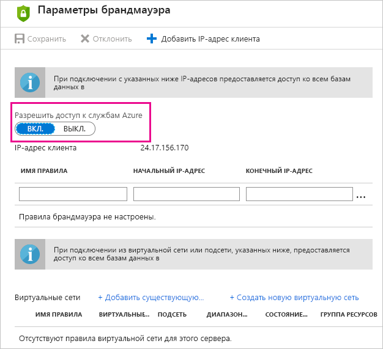

# Устранение неполадок с запланированным обновлением для баз данных SQL Azure в Power BI

Дополнительные сведения об обновлении см. в статьях [Обновление данных в Power BI](refresh-data.md) и [Настройка запланированного обновления](refresh-scheduled-refresh.md).

Если при настройке запланированного обновления базы данных SQL Azure во время редактирования учетных данных возникает ошибка с кодом 400, попробуйте выполнить следующие действия, чтобы настроить соответствующее правило брандмауэра:

1. Войдите на [портал Azure](https://portal.azure.com).

1. Перейдите в базу данных SQL Azure, для которой выполняется настройка обновления.

1. В верхней части колонки **Обзор** выберите **Настройка брандмауэра для сервера**.

1. Убедитесь, что в колонке **Параметры брандмауэра** для параметра **Разрешить доступ к службам Azure** задано значение **ВКЛ**.

      

У вас имеются и другие вопросы? [Ответы на них см. в сообществе Power BI.](https://community.powerbi.com/)
