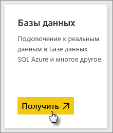
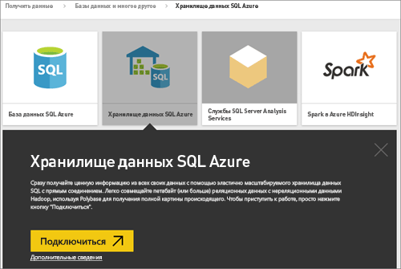
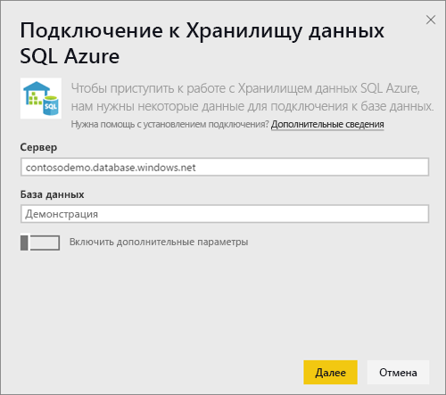
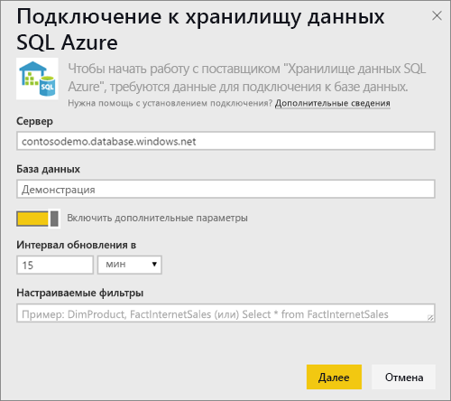
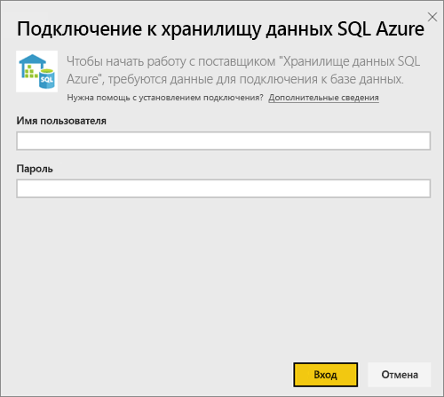
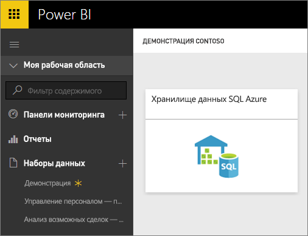
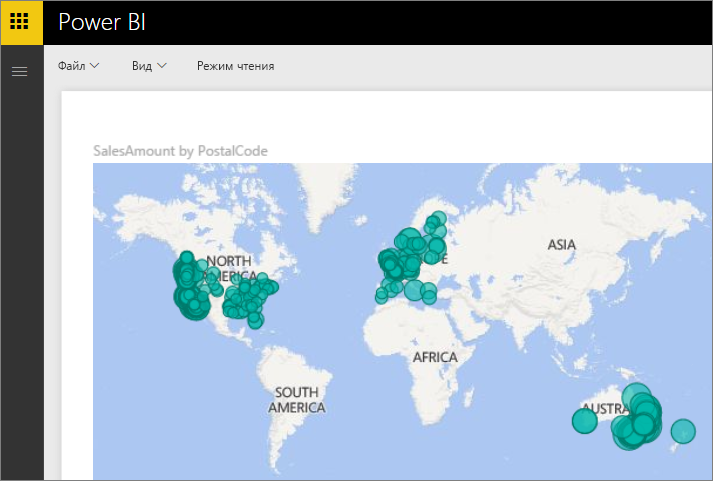
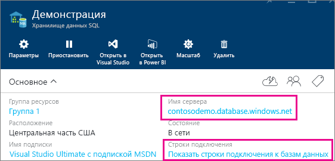

# Хранилище данных SQL Azure с DirectQuery

Хранилище данных SQL Azure с DirectQuery позволяет создавать динамические отчеты на основе данных и метрик, которые уже присутствуют в хранилище данных SQL Azure. Если используется DirectQuery, при просмотре данных запросы отправляются обратно в хранилище данных SQL Azure в режиме реального времени. Запросы в реальном времени в сочетании с масштабированием хранилища данных SQL позволяют пользователям за считанные минуты создавать динамические отчеты по данным объемом в несколько терабайтов. Кроме того, добавление кнопки **Открыть в Power BI** позволяет пользователям напрямую подключать Power BI к хранилищу данных SQL без необходимости задавать информацию вручную.

При использовании соединителя с хранилищем данных SQL:

* укажите при подключении полное имя сервера (см. дополнительные сведения ниже);
* убедитесь, что настроены правила брандмауэра "Разрешить доступ к службам Azure";
* каждое действие, например выбор столбца или добавление фильтра, отправляет запрос непосредственно в хранилище данных;
* плитки обновляются примерно раз в 15 минут (обновление не требуется планировать),  и обновления можно настроить в разделе дополнительных параметров при подключении;
* функция вопросов и ответов для наборов данных DirectQuery недоступна;
* изменения схемы не применяются автоматически.

Эти ограничения и примечания могут быть изменены по мере улучшения службы. Ниже описаны инструкции по подключению.

## Использование кнопки "Открыть в Power BI"

> [!Important]
> Мы улучшили параметры подключения к хранилищу данных SQL Azure.  Для наиболее эффективного подключения к источнику данных хранилища данных SQL Azure используйте Power BI Desktop.  После создания модели и отчета их можно опубликовать в службе Power BI.  Прямое подключение к хранилищу данных SQL Azure в службе Power BI теперь признано нерекомендуемым.

Самый простой способ перемещаться между хранилищем данных SQL и Power BI — с помощью кнопки **Открыть в Power BI** на портале Azure. Эта кнопка позволяет легко начать создание новых панелей мониторинга в Power BI.

1. Чтобы приступить к работе, перейдите в экземпляр хранилища данных SQL на портале Azure. Обратите внимание, что сейчас Хранилище данных SQL присутствует только на портале Azure.

2. Нажмите кнопку **Открыть в Power BI** .

    

3. Если не удается выполнить вход напрямую или у вас нет учетной записи Power BI, необходимо зарегистрироваться.

4. Вы будете перенаправлены на страницу подключения к хранилищу данных SQL, где уже будут введены регистрационные данные из вашего Хранилища данных SQL. Введите свои учетные данные и нажмите кнопку "Подключить" для создания подключения.

## Подключение через Power BI

Хранилище данных SQL также указано на странице получения данных Power BI. 

1. В нижней части области навигации выберите **Получить данные**.  

    

2. В области **Базы данных**выберите **Получить**.

    

3. Выберите **Хранилище данных SQL** \> **Подключить**.

    

4. Введите данные, необходимые для подключения. На рисунке ниже в разделе **Поиск параметров** показано расположение этих данных на портале Azure.

    

    

    

   > [!NOTE]
   > Имя пользователя соответствует пользователю, определенному в вашем экземпляре хранилища данных Azure SQL.

5. Перейдите к набору данных, щелкнув новую плитку или только что созданный набор данных, указанный звездочкой. Этот набор данных будет иметь имя, совпадающее с именем вашей базы данных.

    

6. Вы можете просматривать все таблицы и столбцы. При выборе столбца источнику отправляется запрос, при этом динамически создается визуальный элемент. Фильтры также будут переводиться в запросы к хранилищу данных. Эти визуальные элементы можно сохранить в новом отчете и закрепить на панели мониторинга.

    

## Поиск значений параметров

Полное имя сервера и имя базы данных можно найти на портале Azure. Обратите внимание, что сейчас Хранилище данных SQL присутствует только на портале Azure.

> [!NOTE]
> Если клиент Power BI находится в том же регионе, что и хранилище данных SQL Azure, то плата за исходящий трафик взиматься не будет. Определить расположение клиента Power BI можно с помощью [этой инструкции](https://docs.microsoft.com/power-bi/service-admin-where-is-my-tenant-located).

[!INCLUDE [direct-query-sso](../includes/direct-query-sso.md)]

## Дальнейшие действия

* [Что такое Power BI?](../fundamentals/power-bi-overview.md)  
* [Получение данных для Power BI](service-get-data.md)  
* [Хранилище данных SQL Azure](/azure/sql-data-warehouse/sql-data-warehouse-overview-what-is/)

Появились дополнительные вопросы? [Ответы на них см. в сообществе Power BI.](https://community.powerbi.com/)
