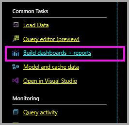
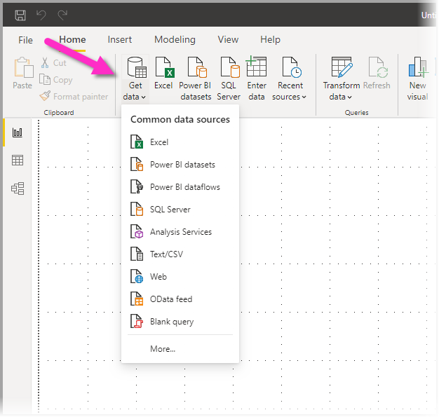
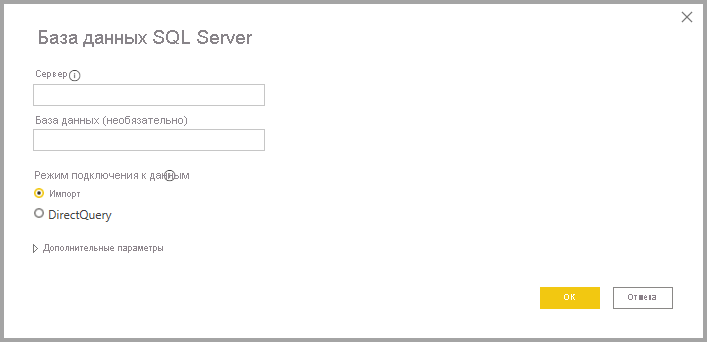

# Хранилище данных SQL Azure с DirectQuery

Хранилище данных SQL Azure с DirectQuery позволяет создавать динамические отчеты на основе данных и метрик, которые уже присутствуют в хранилище данных SQL Azure. Если используется DirectQuery, при просмотре данных запросы отправляются обратно в хранилище данных SQL Azure в режиме реального времени. Запросы в реальном времени в сочетании с масштабированием хранилища данных SQL позволяют пользователям за считанные минуты создавать динамические отчеты по данным объемом в несколько терабайтов. Кроме того, перейдя по ссылке **Создание панелей мониторинга и отчетов** пользователи могут создавать отчеты Power BI с помощью Хранилища данных SQL.

При использовании соединителя с хранилищем данных SQL:

* укажите при подключении полное имя сервера (см. дополнительные сведения ниже);
* убедитесь, что настроены правила брандмауэра "Разрешить доступ к службам Azure";
* каждое действие, например выбор столбца или добавление фильтра, отправляет запрос непосредственно в хранилище данных;
* плитки обновляются примерно раз в 15 минут (обновление не требуется планировать),  и обновления можно настроить в разделе дополнительных параметров при подключении;
* функция вопросов и ответов для наборов данных DirectQuery недоступна;
* изменения схемы не применяются автоматически.

Эти ограничения и заметки могут быть изменены по мере улучшения службы. Ниже описаны инструкции по подключению.

## Создание панелей мониторинга и отчетов в Power BI

> [!Important]
> Мы улучшили параметры подключения к хранилищу данных SQL Azure. Для наиболее эффективного подключения к источнику данных хранилища данных SQL Azure используйте Power BI Desktop. После создания модели и отчета их можно опубликовать в службе Power BI. Прямое подключение к Хранилищу данных SQL Azure в службе Power BI больше недоступно.

Самый простой способ перемещения между Хранилищем данных SQL и Power BI — создать отчеты в Power BI Desktop. Вы можете использовать кнопку **Создание панелей мониторинга и отчетов** на портале Azure.

1. Чтобы начать, скачайте и установите Power BI Desktop. Сведения о скачивании и установке см. в статье [Получение Power BI Desktop](../fundamentals/desktop-get-the-desktop.md). Вы также можете перейти сразу к следующему шагу.

2. Кроме того, вы можете щелкнуть ссылку **Создание панелей мониторинга и отчетов**, чтобы скачать Power BI Desktop.

    

## Подключение через Power BI Desktop

Вы можете подключиться к Хранилищу данных SQL с помощью кнопки **Получить данные** в Power BI Desktop. 

1. Нажмите кнопку **Получить данные** в меню **Главное**.  

    

2. Выберите **Дополнительно**, чтобы посмотреть все доступные источники данных. В открывшемся окне щелкните **Azure** в области слева и выберите **Хранилище данных SQL Azure** в списке доступных соединителей в области справа.

    

3. В открывшемся окне введите нужный сервер и при необходимости укажите базу данных, к которой хотите подключиться. Вы также можете выбрать режим подключения к данным: импорт или DirectQuery. Для получения доступа к данным в Хранилище данных SQL Azure в реальном времени используйте DirectQuery.

    

4. Чтобы открыть дополнительные параметры подключения Хранилища данных SQL Azure, щелкните стрелку вниз рядом с кнопкой **Расширенные параметры**.

    

В следующем разделе описывается, как найти значения параметров для подключения. 

## Поиск значений параметров

Полное имя сервера и имя базы данных можно найти на портале Azure. Обратите внимание, что сейчас Хранилище данных SQL доступно только на портале Azure.

> [!NOTE]
> Если клиент Power BI находится в том же регионе, что и хранилище данных SQL Azure, то плата за исходящий трафик взиматься не будет. Определить расположение клиента Power BI можно с помощью [этой инструкции](https://docs.microsoft.com/power-bi/service-admin-where-is-my-tenant-located).

[!INCLUDE [direct-query-sso](../includes/direct-query-sso.md)]

## Дальнейшие действия

* [Использование DirectQuery в Power BI](desktop-directquery-about.md)
* [Что такое Power BI?](../fundamentals/power-bi-overview.md)  
* [Получение данных для Power BI](service-get-data.md)  
* [Хранилище данных SQL Azure](/azure/sql-data-warehouse/sql-data-warehouse-overview-what-is/)

Появились дополнительные вопросы? [Ответы на них см. в сообществе Power BI.](https://community.powerbi.com/)
