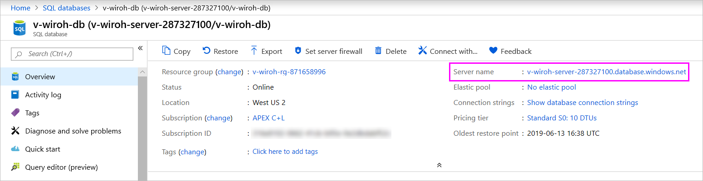

# База данных SQL Azure с DirectQuery

Узнайте, как можно подключиться непосредственно к базе данных SQL Azure и создавать отчеты, в которых используются реальные данные. Можно хранить данные в источнике, а не в Power BI.

При использовании DirectQuery запросы отправляются обратно в Базу данных SQL Azure при просмотре данных в представлении отчетов. Этот процесс рекомендуется пользователям, знакомым с базами данных и сущностями, к которым они подключаются.

**Примечания.**

* Укажите полное имя сервера при подключении (см. дополнительные сведения ниже).
* Убедитесь, что в правилах брандмауэра [разрешен доступ к службам Azure](https://docs.microsoft.com/azure/sql-database/sql-database-networkaccess-overview#allow-azure-services).
* Каждое действие, например выбор столбца или добавление фильтра, отправляет запрос в базу данных.
* Плитки обновляются каждый час (обновление не требуется планировать). Можно указать частоту обновления в разделе дополнительных параметров при подключении.
* Функция вопросов и ответов для наборов данных DirectQuery недоступна.
* Изменения схемы не извлекаются автоматически.

Эти ограничения и примечания могут быть изменены по мере улучшения службы. Ниже описаны инструкции по подключению.

> [!Important]
> Мы улучшили параметры подключения к базе данных SQL Azure.  Для наиболее эффективного подключения к источнику данных базы данных SQL Azure используйте Power BI Desktop.  После создания модели и отчета их можно опубликовать в службе Power BI.  Прямое подключение к базе данных SQL Azure в службе Power BI теперь признано нерекомендуемым.

## Power BI Desktop и DirectQuery

Чтобы подключиться к базе данных SQL Azure с помощью DirectQuery, необходимо использовать Power BI Desktop. Такой подход обеспечивает дополнительные возможности и гибкость работы. Отчеты, созданные с помощью Power BI Desktop, затем можно опубликовать в службе Power BI. См. дополнительные сведения о подключении к [базе данных SQL Azure с помощью DirectQuery](desktop-use-directquery.md) в Power BI Desktop.

## Поиск значений параметров

Полное имя сервера и имя базы данных можно найти на портале Azure.

[!INCLUDE [direct-query-sso](../includes/direct-query-sso.md)]

## Дальнейшие действия

* [Использование DirectQuery в Power BI Desktop](desktop-use-directquery.md)  
* [Что такое Power BI?](../fundamentals/power-bi-overview.md)  
* [Получение данных для Power BI](service-get-data.md)  

У вас имеются и другие вопросы? [Ответы на них см. в сообществе Power BI.](https://community.powerbi.com/)
