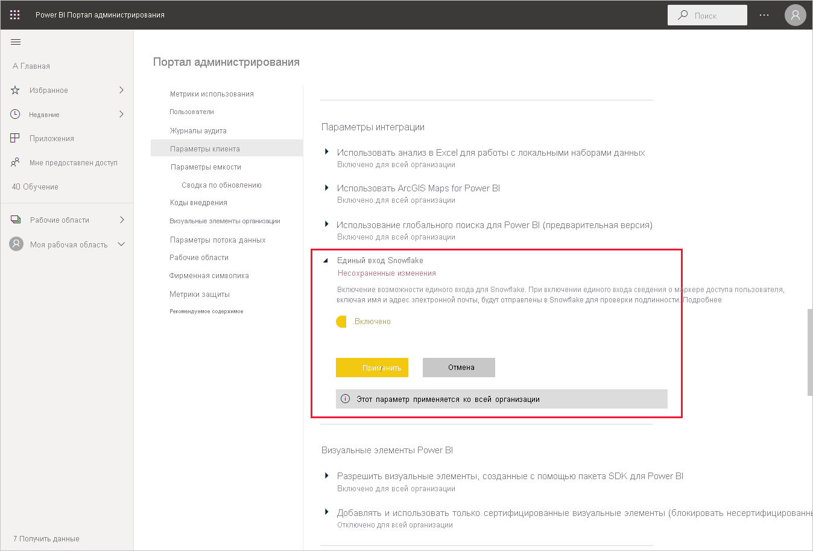

# Подключение к Snowflake в службе Power BI

## Введение

Подключение к Snowflake в службе Power BI отличается от других соединителей только одним способом. В Snowflake есть дополнительная возможность для Azure Active Directory (AAD) с единым входом. В разных компонентах интеграции требуются разные административные роли в Snowflake, Power BI и Azure. Вы также можете включить проверку подлинности посредством AAD без использования единого входа. Обычная проверка подлинности работает так же, как и с другими соединителями службы.

Чтобы настроить интеграцию AAD и при необходимости включить единый вход, выполните действия, описанные в этой статье:

* Если вы являетесь администратором Snowflake, ознакомьтесь со статьей [Начало работы с единым входом из Power BI в Snowflake](https://docs.snowflake.com/en/user-guide/oauth-powerbi.html) в документации по Snowflake.
* Если вы администратор Power BI, ознакомьтесь со справочными сведениями [Настройка службы Power BI. Администрирование портала](service-connect-snowflake.md#admin-portal), чтобы узнать, как включить единый вход.
* Если вы создатель набора данных Power BI, ознакомьтесь со справочными сведениями [Настройка службы Power BI. Настройка набора данных AAD](service-connect-snowflake.md#configuring-a-dataset-with-aad), чтобы узнать, как включить единый вход.

## Настройка службы Power BI

### Портал администрирования

Чтобы включить единый вход, глобальный администратор должен включить параметр на портале администрирования Power BI. Этот параметр утверждает отправку учетных данных AAD в Snowflake для всей организации. Чтобы включить единый вход, выполните следующие действия.

1. [Войдите в Power BI](https://app.powerbi.com) с помощью учетных данных глобального администратора.
1. В меню заголовка страницы выберите **Параметры**, а затем выберите **Портал администрирования**.
1. Выберите **Параметры клиента**, а затем прокрутите экран, чтобы перейти к группе **Параметры интеграции**.

   

4. Разверните **Единый вход в Snowflake**, переключите параметр в положение **Включено**, а затем нажмите кнопку **Применить**.

Этот шаг необходим, чтобы предоставить согласие на отправку токена AAD в Snowflake. После включения параметра для его вступления в силу может потребоваться до часа.

После включения единого входа можно использовать отчеты с единым входом.

### Настройка набора данных с AAD

После публикации отчета на основе соединителя Snowflake в службе Power BI создателю набора данных необходимо обновить параметры соответствующей рабочей области, чтобы она использовала единый вход.

Из-за особенностей работы Power BI единый вход возможен только для источников данных, подключение к которым выполняется не через локальный шлюз данных. Ограничения перечислены ниже.

* Если в модели данных используется только источник Snowflake, то можно использовать единый вход при условии, что локальный шлюз данных не применяется.
* Если источник Snowflake используется вместе с другим источником, то единый вход возможен при условии, что локальный шлюз данных не применяется ни для одного из источников.
* Если вы обращаетесь к источнику Snowflake через локальный шлюз данных, вы не можете использовать учетные данные AAD. Этот момент может быть важен в случае, если обращение к виртуальной сети происходит с одного IP-адреса с установленным шлюзом, а не из всего диапазона IP-адресов Power BI.
* Если вы используете источник Snowflake и другой источник, для которого требуется шлюз, необходимо также использовать Snowflake через локальный шлюз данных. В этом случае вы не сможете использовать единый вход.

Дополнительные сведения об использовании локального шлюза данных см. в статье [Что такое локальный шлюз данных?](service-gateway-onprem.md)

Если шлюз не используется, то настройка завершена. Если в локальном шлюзе данных настроены учетные данные Snowflake, но источник данных используется только в модели, можно щелкнуть переключатель на странице "Параметры набора данных", чтобы отключить шлюз для этой модели данных.

Чтобы включить единый вход для набора данных, выполните следующие действия.

1. [Войдите в Power BI](https://app.powerbi.com), используя учетные данные создателя набора данных.
1. Выберите соответствующую рабочую область, а затем в меню "Дополнительные параметры", расположенном рядом с именем набора данных, выберите **Параметры**.
  
1. Выберите **Учетные данные источника данных** и выполните вход. Выполнить вход в Snowflake можно либо с помощью обычных учетных данных, либо с помощью учетных данных OAuth2 (AAD). Если вы используете AAD, вы можете включить единый вход на следующем шаге.
1. Выберите параметр **Конечные пользователи используют свои учетные данные OAuth2 при доступе к этому источнику данных через DirectQuery**. Этот параметр включит единый вход AAD. Независимо от того, как входит первый пользователь в систему, с помощью обычной проверки подлинности или OAuth2 (AAD), для единого входа будут передаваться учетные данные AAD.

    

После этого все пользователи должны автоматически подключаться к этому набору данных Snowflake с помощью своих учетных данных AAD.

Если вы решили не включать единый вход, то при обновлении отчета пользователи будут использовать учетные данные пользователя, выполнившего вход, как и в случае с большинством других отчетов Power BI.

### Устранение неполадок

При возникновении проблем с интеграцией обратитесь к [руководству по устранению неполадок](https://docs.snowflake.com/en/user-guide/oauth-powerbi.html#troubleshooting) Snowflake.

## Дальнейшие действия

* [Data sources for the Power BI service](service-get-data.md) (Источники данных для службы Power BI)
* [Подключение к наборам данных в службе Power BI из приложения Power BI Desktop](desktop-report-lifecycle-datasets.md)
* [Подключение к хранилищу вычислительных ресурсов Snowflake](desktop-connect-snowflake.md)