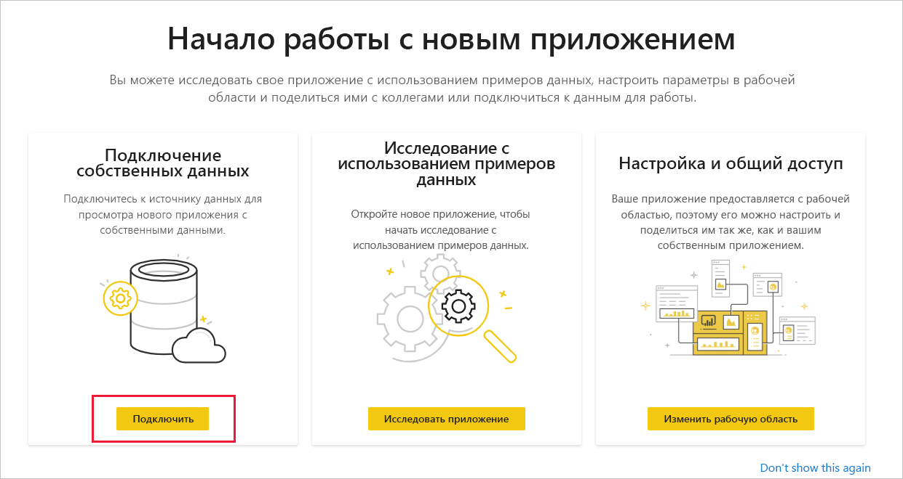

# Подключение к отчету по отслеживанию COVID-19 в США
В этой статье рассказывается, как установить шаблон приложение для отчета по отслеживанию COVID-19 и как подключиться к источникам данных.

Подробные сведения о самом отчете, включая заявления об отказе от ответственности и описание данных, см. в статье [Пример отслеживания ситуации с COVID-19 для федеральных и местных органов власти США](../create-reports/sample-covid-19-us.md).

После установки шаблона приложения и подключения к источникам данных можно настроить отчет в соответствии с вашими потребностями. Затем его можно распространить в виде приложения среди коллег в организации.

## Установка приложения

1. Щелкните следующую ссылку, чтобы перейти к приложению: [шаблон приложения "Отчет по отслеживанию COVID-19 в США"](https://appsource.microsoft.com/en-us/product/power-bi/pbi-contentpacks.covid19ms)

1. На странице приложения в AppSource нажмите кнопку [**Получить**](https://appsource.microsoft.com/en-us/product/power-bi/pbi-contentpacks.covid19ms).

    

1. При появлении запроса нажмите кнопку **Установить**. После установки приложения оно появится на странице "Приложения".

   

## подключение к источникам данных.

1. Чтобы открыть приложение, щелкните его значок на странице "Приложения".

1. На экране-заставке нажмите **Подключить**.

   

1. По очереди появятся два диалоговых окна входа. В обоих окнах установите уровень конфиденциальности "Общедоступный".

   

   Отчет подключится к источникам данных и заполнится актуальными данными. В течение этого времени вращается индикатор активности.

   

## Планирование обновления отчета

Когда обновление данных завершится, вы окажетесь в рабочей области, связанной с приложением. [Настройте расписание обновления](../refresh-scheduled-refresh.md), чтобы поддерживать данные отчета в актуальном состоянии.

## Настройка и общий доступ

Подробные сведения см. в статье [Настройка приложения и общий доступ к нему](../service-template-apps-install-distribute.md#customize-and-share-the-app). Перед публикацией или распространением приложения обязательно ознакомьтесь с [предостережениями](../create-reports/sample-covid-19-us.md#disclaimers).

## Дальнейшие действия
* [Пример отслеживания ситуации с COVID-19 для федеральных и местных органов власти США](../create-reports/sample-covid-19-us.md)
* У вас появились вопросы? [Попробуйте задать вопрос в сообществе Power BI.](https://community.powerbi.com/)
* [Что такое приложения-шаблоны Power BI?](../service-template-apps-overview.md)
* [Установка и распространение приложений-шаблонов в организации](../service-template-apps-install-distribute.md)
