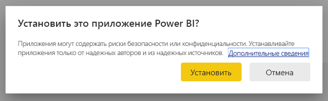

# Подключение к отчету о присутствии для антикризисных коммуникаций

Это приложение Power BI представляет собой артефакт отчета или панели мониторинга в решении Microsoft Power Platform для антикризисных коммуникаций. Оно позволяет пользователям приложения для антикризисных коммуникаций отслеживать местонахождение сотрудников. В решении сочетаются возможности Power Apps, Power Automate, Teams, SharePoint и Power BI. Его можно использовать в браузере, на мобильном устройстве или в Teams.

На панели мониторинга приводятся сводные данные по системе здравоохранения, которые помогают специалистам по управлению в чрезвычайных ситуациях своевременно принимать правильные решения.

В этой статье рассказывается, как установить приложение и как подключиться к источникам данных. Дополнительные сведения о приложении для коммуникации в кризисных ситуациях см. в разделе [Настройка и изучение примера шаблона "Антикризисные коммуникации" в Power Apps](https://docs.microsoft.com/powerapps/maker/canvas-apps/sample-crisis-communication-app).

После установки шаблона приложения и подключения к источникам данных можно настроить отчет в соответствии с вашими потребностями. Затем его можно распространить в виде приложения среди коллег в организации.

## Предварительные требования

Перед установкой этого шаблона приложения необходимо установить и настроить [образец "Антикризисные коммуникации"](https://docs.microsoft.com/powerapps/maker/canvas-apps/sample-crisis-communication-app). При установке этого решения создаются ссылки на источники данных, необходимые для заполнения приложения данными.

При установке образца "Антикризисные коммуникации" запишите [путь к папке со списком SharePoint "CI_Employee Status" и идентификатор этого списка](https://docs.microsoft.com/powerapps/maker/canvas-apps/sample-crisis-communication-app#monitor-office-absences-with-power-bi).

## Установка приложения

1. Щелкните следующую ссылку, чтобы перейти к приложению: [шаблон приложения "Отчет о присутствии для антикризисных коммуникаций"](https://appsource.microsoft.com/en-us/product/power-bi/pbi-contentpacks.crisiscomms)

1. На странице приложения в AppSource нажмите кнопку [**Получить**](https://appsource.microsoft.com/en-us/product/power-bi/pbi-contentpacks.crisiscomms).

    

1. Ознакомьтесь с информацией в окне **Дополнительно** и нажмите кнопку **Продолжить**.

    

1. Нажмите кнопку **Установить**. 

    

    После установки приложения оно появится на странице "Приложения".

   

## подключение к источникам данных.

1. Чтобы открыть приложение, щелкните его значок на странице "Приложения".

1. На экране-заставке нажмите кнопку **Исследовать**.

   

   Приложение откроется с образцом данных.

1. Щелкните ссылку **Подключите свои данные** в баннере в верхней части страницы.

   

1. В диалоговом окне выполните указанные ниже действия.
   1. В поле SharePoint_Folder введите [путь к списку SharePoint "CI_Employee Status"](https://docs.microsoft.com/powerapps/maker/canvas-apps/sample-crisis-communication-app#monitor-office-absences-with-power-bi).
   1. В поле List_ID введите идентификатор списка, полученный в параметрах списка. По завершении нажмите кнопку **Далее**.

   

1. В следующем диалоговом окне выберите метод проверки подлинности **OAuth2**. Уровень конфиденциальности менять не нужно.

   Выберите **Войти**.

   

1. На экране входа Майкрософт войдите в Power BI.

   

   После входа отчет подключится к источникам данных и заполнится актуальными данными. В течение этого времени вращается индикатор активности.

   

## Планирование обновления отчета

Когда обновление данных завершится, [настройте расписание обновления](../connect-data/refresh-scheduled-refresh.md), чтобы поддерживать данные отчета в актуальном состоянии.

1. В верхней строке заголовка выберите **Power BI**.

   

1. В области навигации слева найдите рабочую область "Панель поддержки принятия решений по неотложной медицинской помощи" в разделе **Рабочие области** и следуйте инструкциям, приведенным в статье [Настройка запланированного обновления](../connect-data/refresh-scheduled-refresh.md).

## Настройка и общий доступ

Подробные сведения см. в статье [Настройка приложения и общий доступ к нему](../connect-data/service-template-apps-install-distribute.md#customize-and-share-the-app). Перед публикацией или распространением приложения обязательно ознакомьтесь с [предостережениями](../create-reports/sample-covid-19-us.md#disclaimers).

## Дальнейшие действия
* [Настройка и дополнительные сведения о шаблоне "Антикризисные коммуникации" в Power Apps](https://docs.microsoft.com/powerapps/maker/canvas-apps/sample-crisis-communication-app)
* У вас появились вопросы? [Попробуйте задать вопрос в сообществе Power BI.](https://community.powerbi.com/)
* [Что такое приложения-шаблоны Power BI?](../connect-data/service-template-apps-overview.md)
* [Установка и распространение приложений-шаблонов в организации](../connect-data/service-template-apps-install-distribute.md)
